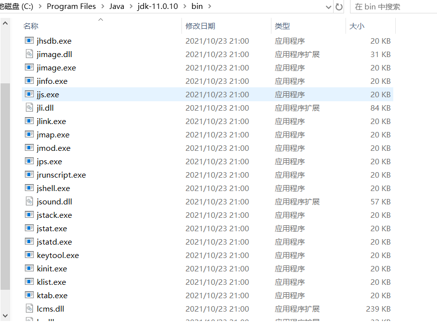

## JDK命令行

进入到安装jdk的bin目录，有一系列辅助工具。这些辅助工具用来获取目标 JVM 不同方面、不同层次的信息，帮助开发人员很好地解决Java应用程序的一些疑难杂症。



> 官方源码地址：http://hg.openjdk.java.net/jdk/jdk11/file/1ddf9a99e4ad/src/jdk.jcmd/share/classes/sun/tools


### :mushroom:1. jps：查看正在运行的Java进程

jps(Java Process Status)：显示指定系统内所有的HotSpot虚拟机进程（查看虚拟机进程信息），可用于查询正在运行的虚拟机进程。

说明：对于本地虚拟机进程来说，进程的本地虚拟机ID与操作系统的进程ID是一致的，是唯一的。

基本使用语法为：

~~~sh
jps [options] [hostid]
~~~

直接使用jps查看进程，也可以通过追加参数，来打印额外的信息。

~~~sh
C:\Users\xxl>jps
16528
29216 Jps
10632 RemoteMavenServer
14168
15592 Launcher
24600 SpringbootRedisActionApplication
~~~

#### **options参数**

- -q：仅仅显示LVMID（local virtual machine id），即本地虚拟机唯一id。不显示主类的名称等。
- -l：输出应用程序主类的全类名 或 如果进程执行的是jar包，则输出jar完整路径。
- -m：输出虚拟机进程启动时传递给主类main()的参数。
- -v：列出虚拟机进程启动时的JVM参数。比如：-Xms20m -Xmx50m是启动程序指定的jvm参数。

说明：以上参数可以综合使用。

补充：如果某 Java 进程关闭了默认开启的UsePerfData参数（即使用参数-XX：-UsePerfData），那么jps命令（以及下面介绍的jstat）将无法探知该Java 进程。

#### **hostid参数**

RMI注册表中注册的主机名。如果想要远程监控主机上的 java 程序，需要安装 jstatd。

对于具有更严格的安全实践的网络场所而言，可能使用一个自定义的策略文件来显示对特定的可信主机或网络的访问，尽管这种技术容易受到IP地址欺诈攻击。

如果安全问题无法使用一个定制的策略文件来处理，那么最安全的操作是不运行jstatd服务器，而是在本地使用jstat和jps工具。


### :mushroom:2. jstat：查看JVM统计信息

jstat（JVM Statistics Monitoring Tool）：用于监视虚拟机各种运行状态信息的命令行工具。它可以显示本地或者远程虚拟机进程中的类装载、内存、垃圾收集、JIT编译等运行数据。在没有GUI图形界面，只提供了纯文本控制台环境的服务器上，它将是运行期定位虚拟机性能问题的首选工具。常用于检测垃圾回收问题以及内存泄漏问题。

官方文档：https://docs.oracle.com/javase/8/docs/technotes/tools/unix/jstat.html

基本使用语法为：

~~~sh
jstat -<option> [-t] [-h<lines>] <vmid> [<interval> [<count>]]
~~~

查看命令相关参数：jstat -h 或 jstat -help

其中vmid是进程id号，也就是jps之后看到的前面的号码。

#### option参数

选项option可以由以下值构成。

类装载相关的：

- -class：显示ClassLoader的相关信息：类的装载、卸载数量、总空间、类装载所消耗的时间等

垃圾回收相关的：

- -gc：显示与GC相关的堆信息。包括Eden区、两个Survivor区、老年代、永久代等的容量、已用空间、GC时间合计等信息。
- -gccapacity：显示内容与-gc基本相同，但输出主要关注Java堆各个区域使用到的最大、最小空间。
- -gcutil：显示内容与-gc基本相同，但输出主要关注已使用空间占总空间的百分比。
- -gccause：与-gcutil功能一样，但是会额外输出导致最后一次或当前正在发生的GC产生的原因。
- -gcnew：显示新生代GC状况
- -gcnewcapacity：显示内容与-gcnew基本相同，输出主要关注使用到的最大、最小空间
- -geold：显示老年代GC状况
- -gcoldcapacity：显示内容与-gcold基本相同，输出主要关注使用到的最大、最小空间
- -gcpermcapacity：显示永久代使用到的最大、最小空间。

JIT相关的：

- -compiler：显示JIT编译器编译过的方法、耗时等信息
- -printcompilation：输出已经被JIT编译的方法

interval参数： 用于指定输出统计数据的周期，单位为毫秒。即：查询间隔。

count参数： 用于指定查询的总次数。

-t参数： 可以在输出信息前加上一个Timestamp列，显示程序的运行时间。（单位：秒）

-h参数： 可以在周期性数据输出时，输出多少行数据后输出一个表头信息。


jstat还可以用来判断是否出现内存泄漏。

1. 第1步：在长时间运行的 Java 程序中，我们可以运行jstat命令连续获取多行性能数据，并取这几行数据中 OU 列（即已占用的老年代内存）的最小值。
2. 第2步：然后，我们每隔一段较长的时间重复一次上述操作，来获得多组 OU 最小值。如果这些值呈上涨趋势，则说明该 Java 程序的老年代内存已使用量在不断上涨，这意味着无法回收的对象在不断增加，因此很有可能存在内存泄漏。

#### 示例

jstat -class：显示ClassLoader的相关信息

~~~sh
C:\Users\xxl>jstat -class 24600
Loaded  Bytes  Unloaded  Bytes     Time
  7704 14369.9        0     0.0       7.25
~~~

jstat -compiler

~~~sh
C:\Users\xxl>jstat -compiler 24600
Compiled Failed Invalid   Time   FailedType FailedMethod
    3951      0       0     1.14          0
~~~

jstat -printcompilation

~~~sh
C:\Users\xxl>jstat -printcompilation 24600
Compiled  Size  Type Method
    3953      5    1 org/apache/catalina/core/ContainerBase getBackgroundProcessorDelay
~~~

jstat -gc：显示与GC相关的堆信息

~~~sh
C:\Users\xxl>jstat -gc 24600 1000 10
 S0C    S1C    S0U    S1U      EC       EU        OC         OU       MC     MU    CCSC   CCSU   YGC     YGCT    FGC    FGCT    CGC    CGCT     GCT
 0.0   14336.0  0.0   14336.0 130048.0 112640.0  117760.0    3820.6   36176.0 35009.9 4608.0 4194.0      6    0.035   0      0.000   4      0.005    0.040
 0.0   14336.0  0.0   14336.0 130048.0 112640.0  117760.0    3820.6   36176.0 35009.9 4608.0 4194.0      6    0.035   0      0.000   4      0.005    0.040
 0.0   14336.0  0.0   14336.0 130048.0 112640.0  117760.0    3820.6   36176.0 35009.9 4608.0 4194.0      6    0.035   0      0.000   4      0.005    0.040
~~~

jstat -t：增加-t参数，在输出信息前加上一个Timestamp列，显示程序的运行时间

~~~sh
C:\Users\xxl>jstat -gc -t 24600 1000 10
Timestamp        S0C    S1C    S0U    S1U      EC       EU        OC         OU       MC     MU    CCSC   CCSU   YGC     YGCT    FGC    FGCT    CGC    CGCT     GCT
          726.1  0.0   14336.0  0.0   14336.0 130048.0 112640.0  117760.0    3820.6   36176.0 35009.9 4608.0 4194.0      6    0.035   0      0.000   4      0.005    0.040
          727.2  0.0   14336.0  0.0   14336.0 130048.0 112640.0  117760.0    3820.6   36176.0 35009.9 4608.0 4194.0      6    0.035   0      0.000   4      0.005    0.040
          728.1  0.0   14336.0  0.0   14336.0 130048.0 112640.0  117760.0    3820.6   36176.0 35009.9 4608.0 4194.0      6    0.035   0      0.000   4      0.005    0.040
          729.2  0.0   14336.0  0.0   14336.0 130048.0 112640.0  117760.0    3820.6   36176.0 35009.9 4608.0 4194.0      6    0.035   0      0.000   4      0.005    0.040
~~~

jstat -t -h：增加-h参数，输出多少行数据后输出一个表头信息

~~~sh
C:\Users\xxl>jstat -gc -t -h3 24600 1000 10
Timestamp        S0C    S1C    S0U    S1U      EC       EU        OC         OU       MC     MU    CCSC   CCSU   YGC     YGCT    FGC    FGCT    CGC    CGCT     GCT
          780.2  0.0   14336.0  0.0   14336.0 130048.0 112640.0  117760.0    3820.6   36176.0 35009.9 4608.0 4194.0      6    0.035   0      0.000   4      0.005    0.040
          781.3  0.0   14336.0  0.0   14336.0 130048.0 112640.0  117760.0    3820.6   36176.0 35009.9 4608.0 4194.0      6    0.035   0      0.000   4      0.005    0.040
          782.3  0.0   14336.0  0.0   14336.0 130048.0 112640.0  117760.0    3820.6   36176.0 35009.9 4608.0 4194.0      6    0.035   0      0.000   4      0.005    0.040
Timestamp        S0C    S1C    S0U    S1U      EC       EU        OC         OU       MC     MU    CCSC   CCSU   YGC     YGCT    FGC    FGCT    CGC    CGCT     GCT
          783.3  0.0   14336.0  0.0   14336.0 130048.0 112640.0  117760.0    3820.6   36176.0 35009.9 4608.0 4194.0      6    0.035   0      0.000   4      0.005    0.040
          784.3  0.0   14336.0  0.0   14336.0 130048.0 112640.0  117760.0    3820.6   36176.0 35009.9 4608.0 4194.0      6    0.035   0      0.000   4      0.005    0.040
          785.3  0.0   14336.0  0.0   14336.0 130048.0 112640.0  117760.0    3820.6   36176.0 35009.9 4608.0 4194.0      6    0.035   0      0.000   4      0.005    0.040
~~~

gc参数表头释义


| 表头 | 含义（字节）                                    |
| ---- | ----------------------------------------------- |
| EC   | Eden区的大小                                    |
| EU   | Eden区已使用的大小                              |
| S0C  | 幸存者0区的大小                                 |
| S1C  | 幸存者1区的大小                                 |
| S0U  | 幸存者0区已使用的大小                           |
| S1U  | 幸存者1区已使用的大小                           |
| MC   | 元空间的大小                                    |
| MU   | 元空间已使用的大小                              |
| OC   | 老年代的大小                                    |
| OU   | 老年代已使用的大小                              |
| CCSC | 压缩类空间的大小                                |
| CCSU | 压缩类空间已使用的大小                          |
| YGC  | 从应用程序启动到采样时young gc的次数            |
| YGCT | 从应用程序启动到采样时young gc消耗时间（秒）    |
| FGC  | 从应用程序启动到采样时full gc的次数             |
| FGCT | 从应用程序启动到采样时的full gc的消耗时间（秒） |
| GCT  | 从应用程序启动到采样时gc的总时间                |


### :mushroom:3. jinfo：实时查看和修改JVM配置参数

jinfo(Configuration Info for Java)：查看虚拟机配置参数信息，也可用于调整虚拟机的配置参数。在很多情况卡，Java应用程序不会指定所有的Java虚拟机参数。而此时，开发人员可能不知道某一个具体的Java虚拟机参数的默认值。在这种情况下，可能需要通过查找文档获取某个参数的默认值。这个查找过程可能是非常艰难的。但有了jinfo工具，开发人员可以很方便地找到Java虚拟机参数的当前值。

基本使用语法为：

~~~sh
jinfo [options] pid
~~~

说明：java 进程ID必须要加上

#### option参数

| 选项             | 选项说明                                                     |
| ---------------- | ------------------------------------------------------------ |
| no option        | 输出全部的参数和系统属性                                     |
| -flag name       | 输出对应名称的参数                                           |
| -flag [+-]name   | 开启或者关闭对应名称的参数 只有被标记为manageable的参数才可以被动态修改 |
| -flag name=value | 设定对应名称的参数                                           |
| -flags           | 输出全部的参数                                               |
| -sysprops        | 输出系统属性                                                 |

#### 示例

jinfo -sysprops

~~~sh
C:\Users\xxl>jinfo -sysprops 24600
Java System Properties:
#Sat Jun 08 00:26:36 CST 2024
sun.desktop=windows
awt.toolkit=sun.awt.windows.WToolkit
java.specification.version=11
sun.cpu.isalist=amd64
sun.jnu.encoding=GBK
...
~~~

jinfo -flag name

~~~sh
C:\Users\xxl>jinfo -flag UseParallelGC 24600
-XX:-UseParallelGC

C:\Users\xxl>jinfo -flag UseG1GC 24600
-XX:+UseG1GC
~~~

jinfo -flag [+-]name

~~~sh
C:\Users\xxl>jinfo -flag +PrintGCDetails 24600
C:\Users\xxl>jinfo -flag PrintGCDetails 24600
-XX:+PrintGCDetails

C:\Users\xxl>jinfo -flag -PrintGCDetails 24600
C:\Users\xxl>jinfo -flag PrintGCDetails 24600
-XX:-PrintGCDetails
~~~

jinfo动态修改VM参数，但并非所有参数都支持动态修改，如果操作了不支持的修改的参数，将会报类似如下的异常：

~~~sh
Exception in thread "main" com.sun.tools.attach.AttachOperationFailedException: flag 'PrintGCDetails' cannot be changed
~~~

使用如下命令显示出来的参数，基本上都是支持动态修改的：

```sh
java -XX:+PrintFlagsInitial
```

拓展：

~~~sh
java -XX:+PrintFlagsInitial # 查看所有JVM参数启动的初始值

java -XX:+PrintFlagsFinal # 查看所有JVM参数的最终值

java -XX:+PrintCommandLineFlags # 查看哪些已经被用户或者JVM设置过的详细的XX参数的名称和值
~~~


### :mushroom:4. jmap：导出内存映像文件&内存使用情况

jmap（JVM Memory Map）：作用一方面是获取dump文件（堆转储快照文件，二进制文件），它还可以获取目标Java进程的内存相关信息，包括Java堆各区域的使用情况、堆中对象的统计信息、类加载信息等。开发人员可以在控制台中输入命令“jmap -help”查阅jmap工具的具体使用方式和一些标准选项配置。

官方帮助文档：https://docs.oracle.com/en/java/javase/11/tools/jmap.html

基本使用语法为：

~~~sh
jmap [option] <pid>
jmap [option] <executable <core>
jmap [option] [server_id@] <remote server IP or hostname>
~~~

#### option参数

| 选项           | 作用                                                         |
| -------------- | ------------------------------------------------------------ |
| -dump          | 生成dump文件（Java堆转储快照），-dump:live只保存堆中的存活对象 |
| -heap          | 输出整个堆空间的详细信息，包括GC的使用、堆配置信息，以及内存的使用信息等 |
| -histo         | 输出堆空间中对象的统计信息，包括类、实例数量和合计容量，-histo:live只统计堆中的存活对象 |
| -J <flag>      | 传递参数给jmap启动的jvm                                      |
| -finalizerinfo | 显示在F-Queue中等待Finalizer线程执行finalize方法的对象，仅linux/solaris平台有效 |
| -permstat      | 以ClassLoader为统计口径输出永久代的内存状态信息，仅linux/solaris平台有效 |
| -F             | 当虚拟机进程对-dump选项没有任何响应时，强制执行生成dump文件，仅linux/solaris平台有效 |


#### 示例

-dump

dump 堆到文件，format 指定输出格式，live 指明是活着的对象，file 指定文件名

~~~sh
C:\Users\xxl>jmap -dump:live,format=b,file=java.hprof 12946
~~~

-heap

~~~sh
C:\Users\xxl>jmap -heap 12946 # JDK8之后已不能使用
Error: -heap option used
Cannot connect to core dump or remote debug server. Use jhsdb jmap instead
C:\Users\xxl>jhsdb jmap --heap --pid 12946
~~~

-histo

~~~sh
# 查看实例信息，输出到本地log.txt文件
C:\Users\xxl>jmap -histo 12964 > ./log.txt
~~~

由于jmap将访问堆中的所有对象，为了保证在此过程中不被应用线程干扰，jmap需要借助安全点机制，让所有线程停留在不改变堆中数据的状态。也就是说，由jmap导出的堆快照必定是安全点位置的。这可能导致基于该堆快照的分析结果存在偏差。

举个例子，假设在编译生成的机器码中，某些对象的生命周期在两个安全点之间，那么:live选项将无法探知到这些对象。

另外，如果某个线程长时间无法跑到安全点，jmap将一直等下去。与前面讲的jstat则不同，垃圾回收器会主动将jstat所需要的摘要数据保存至固定位置之中，而jstat只需直接读取即可。


### :mushroom:5. jhat：JDK自带堆分析工具

jhat(JVM Heap Analysis Tool)：Sun JDK提供的jhat命令与jmap命令搭配使用，用于分析jmap生成的heap dump文件（堆转储快照）。jhat内置了一个微型的HTTP/HTML服务器，生成dump文件的分析结果后，用户可以在浏览器中查看分析结果（分析虚拟机转储快照信息）。

使用了jhat命令，就启动了一个http服务，端口是7000，即http://localhost:7000/，就可以在浏览器里分析。

说明：jhat命令在JDK9、JDK10中已经被删除，官方建议用VisualVM代替。

基本适用语法：

~~~
jhat <option> <dumpfile>
~~~

#### option参数 

| option参数             | 作用                                   |
| ---------------------- | -------------------------------------- |
| -stack false｜true     | 关闭｜打开对象分配调用栈跟踪           |
| -refs false｜true      | 关闭｜打开对象引用跟踪                 |
| -port port-number      | 设置jhat HTTP Server的端口号，默认7000 |
| -exclude exclude-file  | 执行对象查询时需要排除的数据成员       |
| -baseline exclude-file | 指定一个基准堆转储                     |
| -debug int             | 设置debug级别                          |
| -version               | 启动后显示版本信息就退出               |
| -J <flag>              | 传入启动参数，比如-J-Xmx512m           |


### :mushroom:6. jstack：打印JVM中线程快照

jstack（JVM Stack Trace）：用于生成虚拟机指定进程当前时刻的线程快照（虚拟机堆栈跟踪）。线程快照就是当前虚拟机内指定进程的每一条线程正在执行的方法堆栈的集合。

生成线程快照的作用：可用于定位线程出现长时间停顿的原因，如线程间死锁、死循环、请求外部资源导致的长时间等待等问题。这些都是导致线程长时间停顿的常见原因。当线程出现停顿时，就可以用jstack显示各个线程调用的堆栈情况。

官方帮助文档：https://docs.oracle.com/en/java/javase/11/tools/jstack.html

在thread dump中，要留意下面几种状态

- 死锁，Deadlock（重点关注）
- 等待资源，Waiting on condition（重点关注）
- 等待获取监视器，Waiting on monitor entry（重点关注）
- 阻塞，Blocked（重点关注）
- 执行中，Runnable
- 暂停，Suspended
- 对象等待中，Object.wait() 或 TIMED＿WAITING
- 停止，Parked

#### option参数

| option参数 | 作用                                         |
| ---------- | -------------------------------------------- |
| -F         | 当正常输出的请求不被响应时，强制输出线程堆栈 |
| -l         | 除堆栈外，显示关于锁的附加信息               |
| -m         | 如果调用本地方法的话，可以显示C/C++的堆栈    |

### :mushroom:7. jcmd：多功能命令行

在JDK 1.7以后，新增了一个命令行工具jcmd。它是一个多功能的工具，可以用来实现前面除了jstat之外所有命令的功能。比如：用它来导出堆、内存使用、查看Java进程、导出线程信息、执行GC、JVM运行时间等。

官方帮助文档：https://docs.oracle.com/en/java/javase/11/tools/jcmd.html

jcmd拥有jmap的大部分功能，并且在Oracle的官方网站上也推荐使用jcmd命令代jmap命令

jcmd -l：列出所有的JVM进程

jcmd 进程号 help：针对指定的进程，列出支持的所有具体命令

jcmd 进程号 具体命令：显示指定进程的指令命令的数据

- Thread.print 可以替换 jstack指令
- GC.class_histogram 可以替换 jmap中的-histo操作
- GC.heap_dump 可以替换 jmap中的-dump操作
- GC.run 可以查看GC的执行情况
- VM.uptime 可以查看程序的总执行时间，可以替换jstat指令中的-t操作
- VM.system_properties 可以替换 jinfo -sysprops 进程id
- VM.flags 可以获取JVM的配置参数信息

### :mushroom:8. jstatd：远程主机信息收集

之前的指令只涉及到监控本机的Java应用程序，而在这些工具中，一些监控工具也支持对远程计算机的监控（如jps、jstat）。为了启用远程监控，则需要配合使用jstatd 工具。命令jstatd是一个RMI服务端程序，它的作用相当于代理服务器，建立本地计算机与远程监控工具的通信。jstatd服务器将本机的Java应用程序信息传递到远程计算机。

