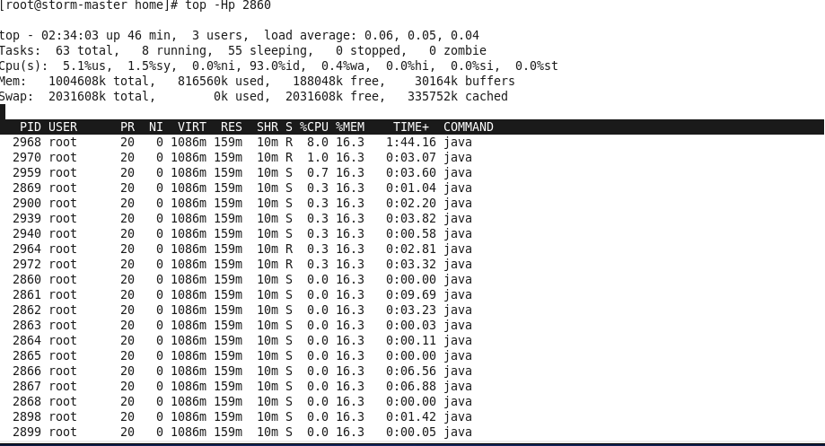
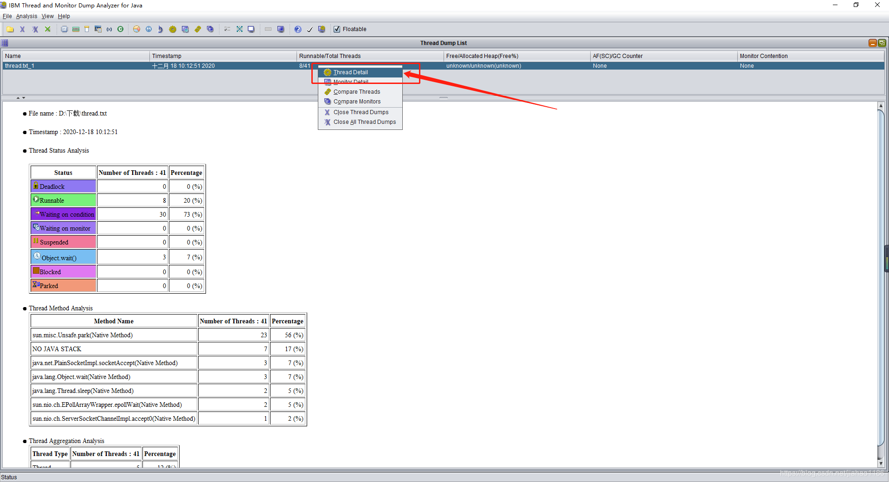
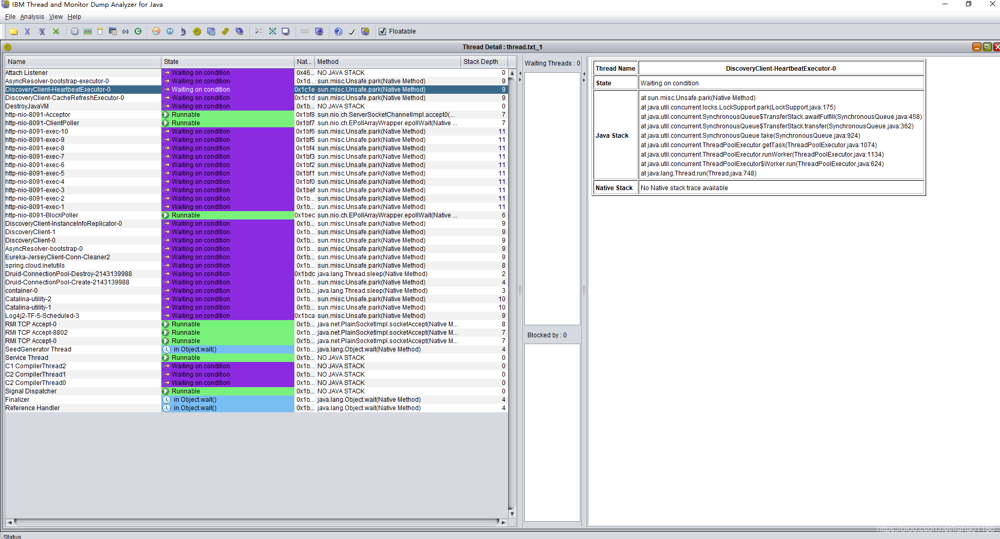

## 一、问题原因

现实企业级Java应用开发、维护中，有时候我们会碰到下面这些问题：

- OutOfMemoryError，内存不足
- 内存泄露
- 线程死锁
- 锁争用（Lock Contention）
- Java进程消耗CPU过高 ......

这些问题在日常开发、维护中可能被很多人忽视（比如有的人遇到上面的问题只是重启服务器或者调大内存，而不会深究问题根源），但能够理解并解决这些问题是Java程序员进阶的必备要求。


## 二、常用命令

找出某个Java进程中最耗费CPU的Java线程并定位堆栈信息，用到的命令有：ps、top、printf、jstack、grep。

### jps

jps主要用来输出JVM中运行的进程状态信息。语法格式如下：

```shell
jps [options] [hostid]
```

如果不指定hostid就默认为当前主机或服务器。

命令行参数选项说明如下：

```shell
-q 不输出类名,Jar名和传入main方法的参数

-m 输出传入main方法的参数

-l 输出main类或Jar的全限名

-v 输出传入JVM的参数
```

比如下面：

```shell
root@ubuntu:/# jps -m -l
2458 org.artifactory.standalone.main.Main /usr/local/artifactory-2.2.5/etc/jetty.xml
29920 com.sun.tools.hat.Main -port 9998 /tmp/dump.dat
3149 org.apache.catalina.startup.Bootstrap start
30972 sun.tools.jps.Jps -m -l
8247 org.apache.catalina.startup.Bootstrap start
25687 com.sun.tools.hat.Main -port 9999 dump.dat
21711 mrf-center.jar
```

### jstack

jstack主要用来查看某个Java进程内的线程堆栈信息。语法格式如下：

```shell
jstack [option] pid
jstack [option] executable core
jstack [option] [server-id@]remote-hostname-or-ip
```

命令行参数选项说明如下：

```shell
# 会打印出额外的锁信息
# 在发生死锁时可以用 jstack -l pid 来观察锁持有情况
# -m mixed mode，不仅会输出Java堆栈信息，还会输出C/C++堆栈信息（比如Native方法）
-l long listings
```

jstack可以定位到线程堆栈，根据堆栈信息我们可以定位到具体代码，所以它在JVM性能调优中使用得非常多。

## 三、排查步骤

Java开发中遇到线上服务器cpu占用过高问题如何解决？

1. top拿到cpu占用高的进程ID
2. 根据进程ID查看cpu占用高的线程ID
3. 将线程ID转换成16进制
4. jstack分析线程栈信息


下面我们来一个实例找出某个Java进程中最耗费CPU的Java线程并定位堆栈信息，用到的命令有ps、top、printf、jstack、grep。

------

**第一步：** 先找出Java进程ID，服务器上的Java应用名称为 wordcount.jar：

```shell
[root@storm-master home] ps -ef | grep wordcount
root    2860  2547 13 02:09 pts/0  00:02:03 java -jar wordcount.jar /home/input 3 
```

得到进程ID为 2860 。

------

**第二步：** 找出该进程内最耗费CPU的线程，可以使用如下3个命令，这里我们使用第3个命令得出如下结果：

1. ps -Lfp pid ： 即 ps -Lfp 2860
2. ps -mp pid -o THREAD, tid, time ：即 ps -mp 2860 -o THREAD,tid,time
3. top -Hp pid： 即 **top -Hp 2860**

这里用第三个命令：`top -Hp 2860`

```shell
top -Hp 2860
```

输出如下：



TIME列就是各个Java线程耗费的CPU时间，显然CPU时间最长的是ID为2968的线程，用

```shell
printf "%x\n" 2968
```

得到2968的十六进制值为b98，下面会用到。

------

**第三步：** 终于轮到jstack上场了，它用来输出进程2860的堆栈信息，然后根据线程ID的十六进制值grep，如下：

```shell
[root@storm-master home] jstack 2860 | grep b98 
"SessionTracker" prio=10 tid=0x00007f55a44e4800 nid=0xb53 in Object.wait() [0x00007f558e06c000 
```

可以看到CPU消耗在SessionTracker这个类的Object.wait()，于是就能很容易的定位到相关的代码了。

当然，可以 `jstack -l pid > /tmp/thread.txt` 在导出的文件中搜索，就可以定位到具体的线程类。

参数：-l long listings，打印出额外的锁信息，在发生死锁时可用jstack -l pid来观察锁持有情况

示例

~~~
jstack -l 7052 >> thread.txt
~~~

-----

**第四步：**分析堆栈信息

将thread.txt下载到本地，使用IBM Thread and Monitor Dump Analyzer for Java打开分析 





------

## 四、其他问题排查思路

**查看某进程及某线程占用 CPU 的例子**

- `jps`: 列出 java 进程,找到 pid.
- `pidstat -p pid -u 1 3 -u -t`: 查看 pid 的进程所有线程的 cpu 使用情况。
- `jstack -l pid > /tmp/thread.txt`: 导出指定 Java 应用的所有线程。

然后查看 `nid=xxx`(即第二步里线程号的线程),即可定位到某段代码。


**查看某进程及某线程占用 IO 的例子**

- `jps`: 列出 java 进程,找到 pid.
- `pidstat -p pid -u 1 3 -d -t`: 查看 pid 的进程所有线程的 IO 使用情况。
- `jstack -l pid > /tmp/thread.txt`: 导出指定 Java 应用的所有线程。

然后查看 `nid=xxx`(即第二步里线程号的线程),即可定位到某段代码。


https://www.cnblogs.com/dennyzhangdd/p/11585971.html