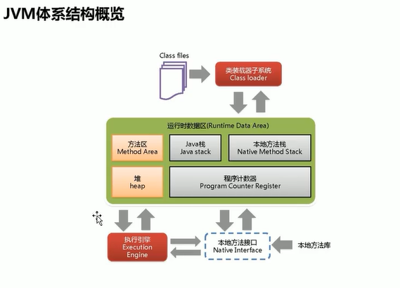
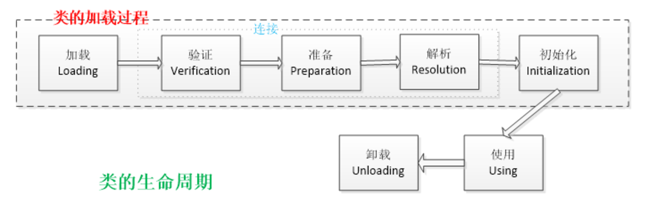
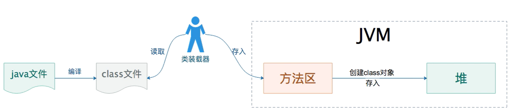

## JVM体系结构

方法区和堆是所有线程共享的内存区域；

而java栈、本地方法栈和程序计数器是运行时数据区线程私有的内存区域。

垃圾回收，指的是堆内存的垃圾回收；方法区是特殊的堆，JVM调优99%是调堆（Heap）。

1. Java堆（Heap）：是Java虚拟机所管理的内存中最大的一块。Java堆是被所有线程共享的一块内
   存区域，在虚拟机启动时创建。此内存区域的唯一目的就是存放对象实例，几乎所有的对象实
   例都在这里分配内存。
2. 方法区（Method Area）：方法区（Method Area）与Java堆一样，是各个线程共享的内存区
   域，它用于存储已被虚拟机加载的类信息、常量、静态变量、即时编译器编译后的代码等数
   据。
3. 程序计数器（Program Counter Register）：程序计数器（Program Counter Register）是一块
   较小的内存空间，它的作用可以看做是当前线程所执行的字节码的行号指示器。
4. JVM栈（JVM Stacks）：与程序计数器一样，Java虚拟机栈（Java Virtual Machine Stacks）也是
   线程私有的，它的生命周期与线程相同。虚拟机栈描述的是Java方法执行的内存模型：每个方
   法被执行的时候都会同时创建一个栈帧（Stack Frame）用于存储局部变量表、操作栈、动态
   链接、方法出口等信息。每一个方法被调用直至执行完成的过程，就对应着一个栈帧在虚拟机
   栈中从入栈到出栈的过程。
5. 本地方法栈（Native Method Stacks）：本地方法栈（Native Method Stacks）与虚拟机栈所发
   挥的作用是非常相似的，其区别不过是虚拟机栈为虚拟机执行Java方法（也就是字节码）服
   务，而本地方法栈则是为虚拟机使用到的Native方法服务。

## 类的生命周期

类从被加载到虚拟机内存中开始，到GC卸载出内存为止，它的整个生命周期包括：

`加载`、`连接`、`初始化`、`使用`和`卸载`，其中**前三部是类的加载的过程**，如下图；

1. 加载：查找并加载类的二进制数据，在Java堆中也创建一个java.lang.Class类的对象。
2. 连接：连接又包含三块内容：验证、准备、初始化。 
   - 1）验证：文件格式、元数据、字节码、符号引用验证；
   - 2）准备：为类的静态变量分配内存，并将其初始化为默认值；
   - 3）解析：把类中的符号引用转换为直接引用。
3. 初始化：为类的静态变量赋予正确的初始值。
4. 使用：new出对象程序中使用。
5. 卸载：执行垃圾回收。

注意，加载、验证、准备、初始化、卸载这五个阶段发生的顺序是确定的，而解析阶段则不一定，它在某些情况下可以在初始化阶段之后开始。另外这7个阶段通常都是互相交叉的混合式进行的，通常会在一个阶段执行的过程中调用或激活另外一个阶段。

## JVM加载类的过程

JVM加载一个类的过程一般分为三个阶段：加载、连接和初始化。

JVM加载一个类时，首先通过类加载器找到类的字节码然后进行验证、准备和解析，最后执行类的静态代码块和静态变量的赋值操作。

### 一个类什么时候进入JVM？

1. 虚拟机启动时，执行main()方法的时候；
2. new对象的时候；
3. 读取静态字段或静态方法的时候。

### 谁来负责将Class文件加载到内存？

1. **类装载器**负责加载Class文件，Class文件在文件开头特定的文件标识（CA FE BA BE）；
2. 类装载器只负责加载，是否可以允许由执行引擎（Execution Engine）决定。

### class文件存在内存哪个位置？

类加载器从class文件抽取类信息放在`方法区`；

类信息包括：方法代码，变量名，方法名，访问权限，返回值等等。

### Class对象存储在哪里？

**堆**。每当加载器从class文件加载一个类时都会加载类信息到方法区，同时生成class对象，Class对象new对象各对象实例。

## 参考资料

[JVM从入门到精通 (yuque.com)](https://www.yuque.com/u21195183/jvm)

[JVM 学习笔记（一）内存结构_codeali csdn jvm内存结构-CSDN博客](https://blog.csdn.net/weixin_50280576/article/details/113742011)