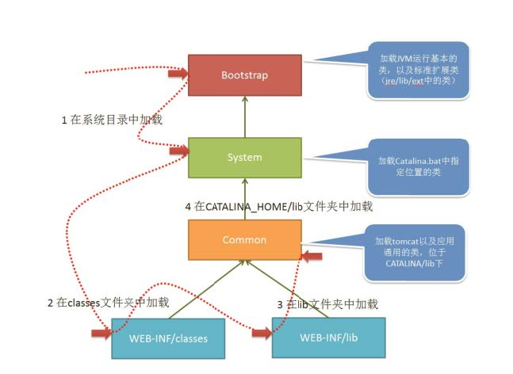

## 什么是类加载器？

类加载器是一个用来加载类文件的类。Java 源代码通过 javac 编译器编译成类 文件。然后 JVM 来执行类文件中的字节码来执行程序。类加载器负责加载文件 系统、网络或其他来源的类文件。

## 类加载器有几种类型？

JVM在运行时会产生三个ClassLoader：Bootstrap (启动类加载器)、ExtensionClassLoader（扩展类装载器）和AppClassLoader（系统类装载器）。

1. 引导类加载器（BootstrapClassloader）：用C++编写，是JVM自带的类加载器；负责加载Java的核心类库。（该加载器无法直接获取）
2. 扩展类加载器（ExtClassloader）：负责加载/jre/lib/ext目录下的jar包。
3. 应用程序类加载器（AppClassloader）：负责加载java -classpath或-D java.class.path所指的目录下的类与jar包。（最常用的加载器）

## 自定义类加载器

上述3个是JVM在运行时会产生三个类加载器，除此之外还有第四种就是自定义类加载器，那么为什么需要自定义类加载器？又在什么情况下用到？

用户在需要的情况下，可以实现自己的自定义类加载器，一般而言，在以下几种情况下需要自定义类加载器：

1. 隔离加载类：某些框架为了实现中间件和应用程序的模块的隔离，就需要中间件和应用程序使用不同的类加载器，例如Tomcat，Tomcat可以运行多个应用程序，每个应用程序之间是相互隔离的。
2. 修改类加载的方式：类加载的双亲委派模型并不是强制的，用户可以根据需要在某个时间点动态加载类；
3. 扩展类加载源：例如从数据库、网络进行类加载；
4. 防止源代码泄露：Java代码很容易被反编译和篡改，为了防止源码泄露，可以对类的字节码文件进行加密，并编写自定义的类加载器来加载自己的应用程序的类。

**实现自定义类加载器**

若要实现自定义类加载器，只需要继承 `java.lang.ClassLoader` 类,并且重写其`findClass()`方法即可。

java.lang.ClassLoader类的基本职责就是根据一个指定的类的名称， 找到或者生成其对应的字节代码，然后从这些字节代码中生成一个`java.lang.Class` 实例。ClassLoader的核心方法如下:

1. getParent()：返回该类加载器的父类加载器。
2. loadClass(String name)：加载名称为二进制名称为name的类，返回的结果是java.lang.Class类的实例。
3. findClass(String name)：查找名称为name的类，返回的结果是java.lang.Class类的实例。
4. findLoadedClass(String name)：查找名称为name的已经被加载过的类，返回的结果是java.lang.Class类的实例。

## 双亲委派机制

1. 类加载器接收到一个加载请求时，他会委派给他的父加载器，实际上是去他父加载器的缓存中去查找是否有该类，如果有就加载返回，如果没有则继续委派给父类加载，直到顶层类加载器。
2. 如果顶层类加载器也没有加载该类，则会依次向下查找子加载器的加载路径，如果有就加载返回，如果都没有，则会抛出异常。

## 沙箱安全机制

了解

## 描述一下JVM加载class文件的原理机制？

JVM中类的装载是由类加载器（ClassLoader）和它的子类来实现的，Java中的类加载器是一个重要的Java运行时系统组件，它负责在运行时查找和装入类文件中的类。 

由于Java的跨平台性，经过编译的Java源程序并不是一个可执行程序，而是一个或多个类文件。当Java程序需要使用某个类时，JVM会确保这个类已经被加载、连接（验证、准备和解析）和初始化。

类的加载是指把类的.class文件中的数据读入到内存中，通常是创建一个字节数组读入.class文件，然后产生与所加载类对应的Class对象。加载完成后，Class对象还不完整，所以此时的类还不可用。当类被加载后就进入连接阶段，这一阶段包括验证、准备（为静态变量分配内存并设置默认的初始值）和解析（将符号引用替换为直接引用）三个步骤。

最后JVM对类进行初始化，包括：1)如果类存在直接的父类并且这个类还没有被初始化，那么就先初始化父类；2)如果类中存在初始化语句，就依次执行这些初始化语句。 类的加载是由类加载器完成的，类加载器包括：根加载器（BootStrap）、扩展加载器（Extension）、系统加载器（System）和用户自定义类加载器（java.lang.ClassLoader的子类）。从Java 2（JDK 1.2）开始，类加载过程采取了父亲委托机制（PDM）。PDM更好的保证了Java平台的安全性，在该机制中，JVM自带的Bootstrap是根加载器，其他的加载器都有且仅有一个父类加载器。类的加载首先请求父类加载器加载，父类加载器无能为力时才由其子类加载器自行加载。

JVM不会向Java程序提供对Bootstrap的引用。

## 什么是 tomcat 类加载机制？

在 tomcat 中类的加载稍有不同，如下图：

当 tomcat启动时，会创建几种类加载器： Bootstrap 引导类加载器 加载 JVM启动所需的类，以及标准扩展类（位于jre/lib/ext 下） System 系统类加载器 加载 tomcat 启动的类，比如bootstrap.jar，通常在 catalina.bat 或者 catalina.sh 中指定。位于CATALINA_HOME/bin 下。