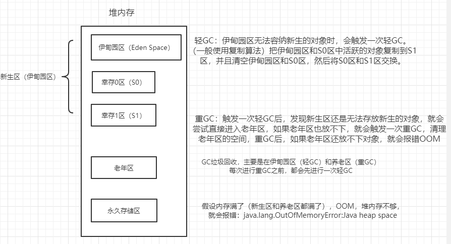

## 三种JVM

1. Sun公司的HotSpot。（java -version查看）
2. BEA的JRockit
3. IBM的J9VM

## 堆

Heap，一个JVM只有一个堆内存，堆内存的大小是可以调节的。

类加载器读取了类文件后，一般会把什么东西放到堆中？
类、方法、常量、变量、保存我们所有引用类型的真实对象。

堆内存中细分为三个区域：

- 新生区（伊甸园区）Young/New
- 养老区 old
- 永久区 Perm

### 新生区

新生区又叫做伊甸园区，包括：伊甸园区、幸存0区、幸存1区。

### 永久区

这个区域是**常驻内存**的。
用来存放JDK自身携带的Class对象、Interface元数据，存储的是Java运行时的一些环境或类信息~。
这个区域**不存在垃圾回收**。
关闭JVM虚拟机就会释放这个区域的内存。

什么情况下，在永久区就崩了？

- 一个启动类，加载了大量的第三方jar包。
- Tomcat部署了太多的应用。
- 大量动态生成的反射类；不断的被加载，直到内存满，就会出现OOM

### 永久代和元空间

什么是永久代和元空间？？
方法区是一种规范，不同的虚拟机厂商可以基于规范做出不同的实现，永久代和元空间就是出于不同jdk版本的实现。
方法区就像是一个接口，永久代与元空间分别是两个不同的实现类。
只不过永久代是这个接口最初的实现类，后来这个接口一直进行变更，直到最后彻底废弃这个实现类，由新实现类—元空间进行替代。

jdk1.8之前：

jdk1.8以及之后：在堆内存中，逻辑上存在，物理上不存在（元空间使用的是本地内存）

### 常量池

1. 在jdk1.7之前，运行时常量池+字符串常量池是存放在方法区中，HotSpot VM对方法区的实现称为永久代。
   
2. 在jdk1.7中，字符串常量池从方法区移到堆中，运行时常量池保留在方法区中。
   
3. jdk1.8之后，HotSpot移除永久代，使用元空间代替；此时字符串常量池保留在堆中，运行时常量池保留在方法区中，只是实现不一样了，JVM内存变成了直接内存。
   