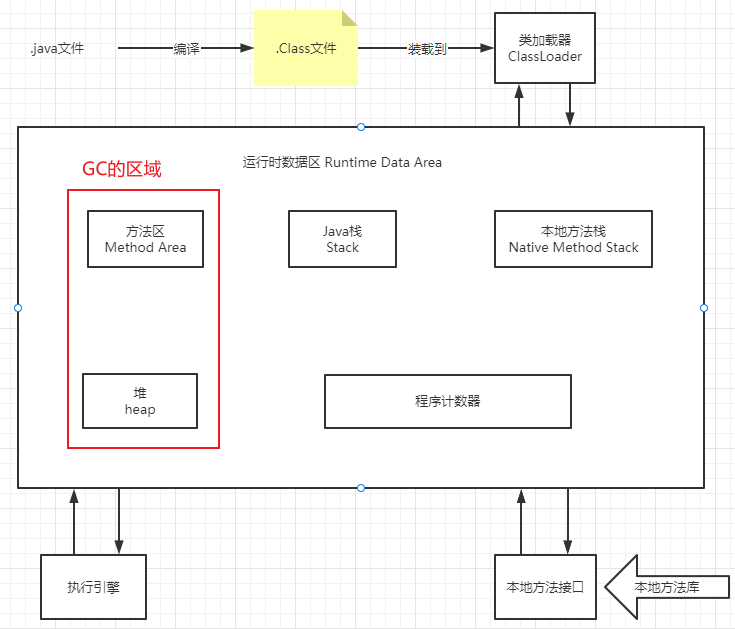
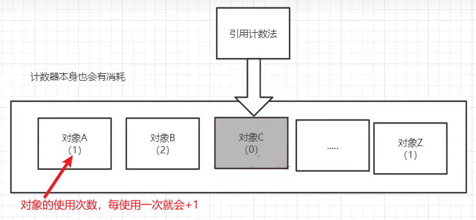
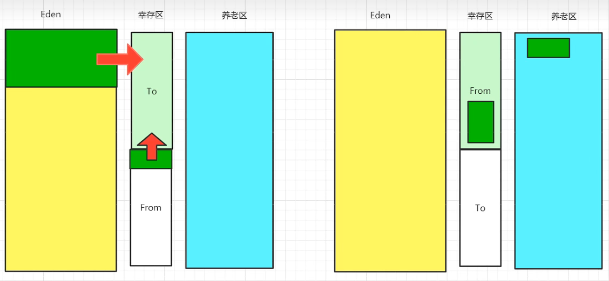
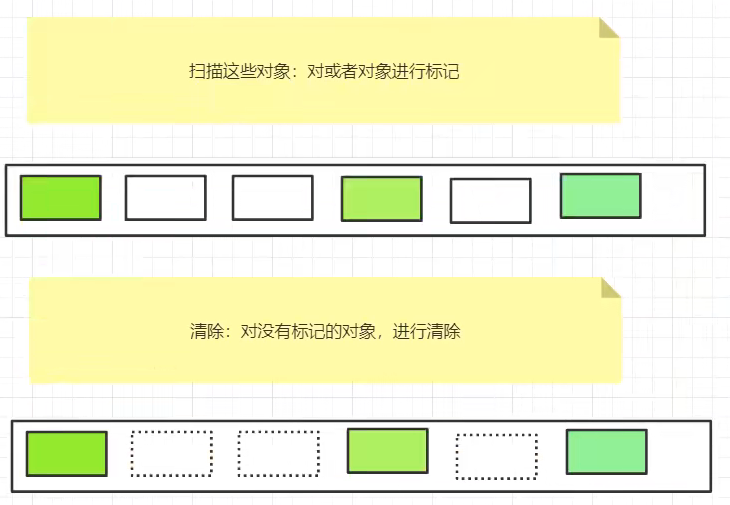
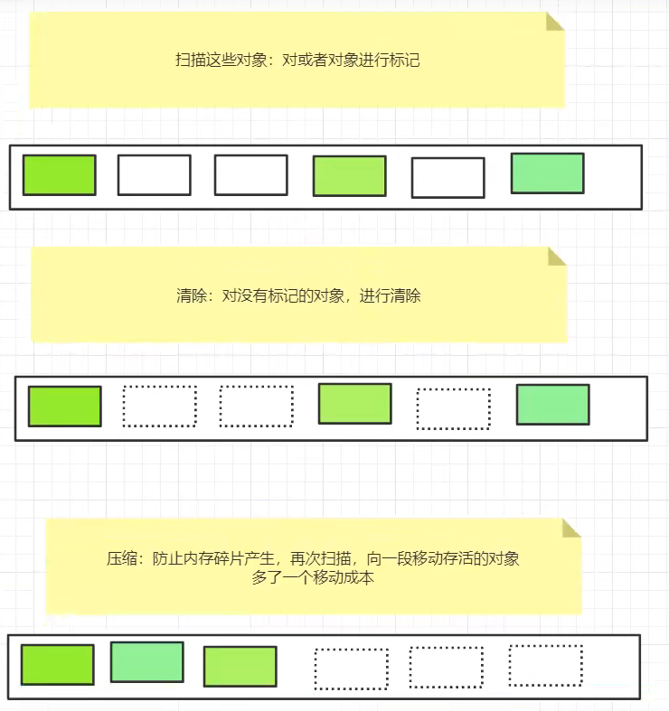

## 垃圾回收的区域

## GC之引用计数法

## GC之复制算法

- 好处：没有内存的碎片。
- 坏处：浪费了内存空间（多了一半空间to永远是空）。假设对象100%存活（极端情况），不适合使用复制算法。

### 使用场景

复制算法最佳使用场景：对象存活度较低的时候（新生区）

## GC之标记清除压缩算法

### 标记清除

- 优点：不需要额外的空间。
- 缺点：两次扫描，严重浪费时间，会产生内存碎片。

### 标记清除压缩

### 标记清除压缩（改进）

可以进行多次标记清除，再进行一次压缩。

## GC算法总结

内存效率：复制算法>标记清除算法>标记压缩算法（时间复杂度）
内存整齐度：复制算法=标记压缩算法>标记清除算法
内存利用率：标记压缩算法=标记清除算法>复制算法

思考一个问题：难道没有最优算法吗？
答案：没有，没有最好的算法，只有最合适的算法——》GC：分代收集算法

年轻代：

- 存活率低
- 复制算法

老年代：

- 区域大：存活率高
- 标记清除（内存碎片不是太多）+标记压缩混合实现