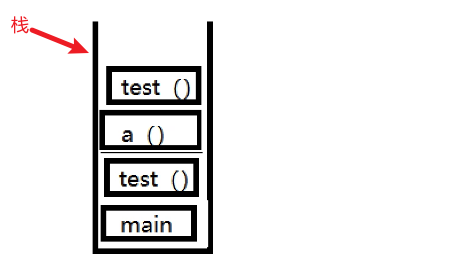
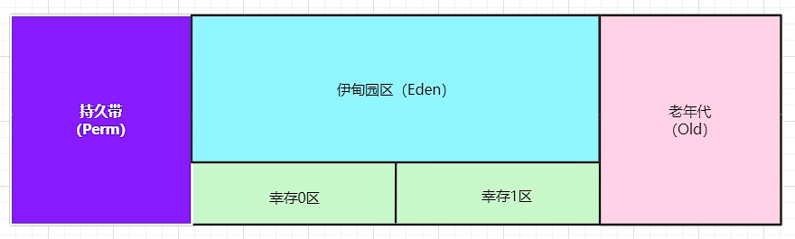
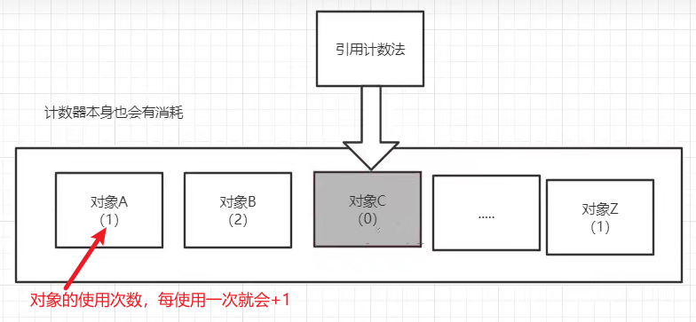
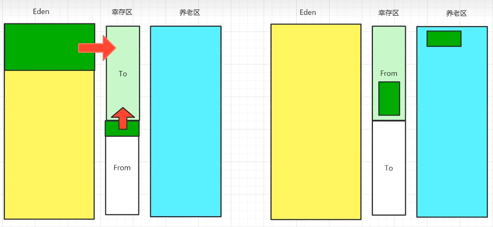

# JVM快速入门篇（狂神）

> 转载于：https://www.kuangstudy.com/bbs/1557549426359590914

## 前言

1. 请你谈谈你对jvm的理解？
2. Java8虚拟机和之前的变化更新？
3. 什么是OOM？什么是栈溢出StackOverFlowError？怎么分析？
4. jvm的常见调优参数有哪些？
5. 内存快照如何抓取？怎么分析Dump文件？
6. 谈谈jvm中，类加载器你的认识？

# 一、JVM

## 1. JVM位置


## 2. JVM体系结构

### 1. jvm结构图


### 2. jvm垃圾回收

垃圾回收，指的的堆内存的垃圾回收


### 3. jvm调优


# 二、类加载器

## 1. 类加载的过程


## 1. 哪些类加载器

1. 引导类加载器（BootstrapClassloader）：用C++编写，是JVM自带的类加载器；负责加载Java的核心类库。（该加载器无法直接获取）
2. 扩展类加载器（ExtClassloader）：负责加载/jre/lib/ext目录下的jar包。
3. 应用程序类加载器（AppClassloader）：负责加载java -classpath或-D java.class.path所指的目录下的类与jar包。（最常用的加载器）

## 2. 双亲委派机制

1. 类加载器接收到一个加载请求时，他会委派给他的父加载器，实际上是去他父加载器的缓存中去查找是否有该类，如果有就加载返回，如果没有则继续委派给父类加载，直到顶层类加载器。
2. 如果顶层类加载器也没有加载该类，则会依次向下查找子加载器的加载路径，如果有就加载返回，如果都没有，则会抛出异常。

## 3. 沙箱安全机制

了解

# 三、native、方法区

## 1. native

凡是使用了native关键字的，说明Java的作用范围已经达不到了，它会去调用底层的C语言的库。

1. 进入本地方法栈。
2. 调用本地方法接口。JNI

JNI的作用：扩展Java的使用，融合不同的语言为Java所用。（最初是为了融合C、C++语言）

因为Java诞生的时候，C和C++非常火，想要立足，就有必要调用C、C++的程序。

所以Java在JVM内存区域专门开辟了一块标记区域Native Method Area Stack，用来登记native方法。
在最终执行（执行引擎执行）的时候，通过JNI来加载本地方法库中的方法。

1. 编写一个多线程启动方法。

   ```
    public class Test {     public static void main(String[] args) {         new Thread(()->{         },"MyThread").start();     } }
   ```

2. 点进去查看start方法。

   ```
    // Thread类中的start方法，底层是把线程加入到线程组，然后去调用本地方法start0 public class Thread implements Runnable {         public synchronized void start() {         if (threadStatus != 0)             throw new IllegalThreadStateException();         group.add(this);         boolean started = false;         try {             start0();             started = true;         } finally {             try {                 if (!started) {                     group.threadStartFailed(this);                 }             } catch (Throwable ignore) {                 /* do nothing. If start0 threw a Throwable then                   it will be passed up the call stack */             }         }     }     private native void start0(); }
   ```

## 2. 方法区

Method Area方法区（此区域属于共享区间，所有定义的方法的信息都保存在该区域）
方法区是被所有线程共享，所有字段、方法字节码、以及一些特殊方法（如构造函数，接口代码）也在此定义。

**静态变量、常量、类信息（构造方法、接口定义）、运行时的常量池存在方法区中，但是实例变量存在堆内存中，和方法区无关。**

https://www.kuangstudy.com/bbs/1356534259912916994#header17

## 3. PC寄存器

程序计数器：Program Counter Register
每个线程都有一个程序计数器，是线程私有的，就是一个指针，指向方法区中的方法字节码（用来存储指向像一条指令的地址，也即将要执行的指令代码），在执行引擎读取下一条指令，是一个非常小的内存空间，几乎可以忽略不计。

# 四、栈（后进先出）

## 1. 栈的作用

栈内存，主管程序的运行，生命周期和线程同步；
线程结束，栈内存也就释放了，对于栈来说，**不存在垃圾回收问题**。

## 2. 栈存储的东西

8大基本类型、对象引用，实例的方法。

## 3. 栈运行原理

### 3.1 简单结构图



### 3.2 详细结构图


## 4. 栈+堆+方法区的交互关系


# 五、堆

## 1. 三种JVM

1. Sun公司的HotSpot。（java -version查看）
2. BEA的JRockit
3. IBM的J9VM

## 2. 堆

Heap，一个JVM只有一个堆内存，堆内存的大小是可以调节的。

类加载器读取了类文件后，一般会把什么东西放到堆中？
类、方法、常量、变量、保存我们所有引用类型的真实对象。

堆内存中细分为三个区域：

- 新生区（伊甸园区）Young/New
- 养老区 old
- 永久区 Perm


### 2.1 新生区

新生区又叫做伊甸园区，包括：伊甸园区、幸存0区、幸存1区。

### 2.2 永久区

这个区域是**常驻内存**的。
用来存放JDK自身携带的Class对象、Interface元数据，存储的是Java运行时的一些环境或类信息~。
这个区域**不存在垃圾回收**。
关闭JVM虚拟机就会释放这个区域的内存。

什么情况下，在永久区就崩了？

- 一个启动类，加载了大量的第三方jar包。
- Tomcat部署了太多的应用。
- 大量动态生成的反射类；不断的被加载，直到内存满，就会出现OOM

### 2.3 永久代和元空间

什么是永久代和元空间？？
方法区是一种规范，不同的虚拟机厂商可以基于规范做出不同的实现，永久代和元空间就是出于不同jdk版本的实现。
方法区就像是一个接口，永久代与元空间分别是两个不同的实现类。
只不过永久代是这个接口最初的实现类，后来这个接口一直进行变更，直到最后彻底废弃这个实现类，由新实现类—元空间进行替代。

jdk1.8之前：


jdk1.8以及之后：在堆内存中，逻辑上存在，物理上不存在（元空间使用的是本地内存）


### 2.4 常量池

1. 在jdk1.7之前，运行时常量池+字符串常量池是存放在方法区中，HotSpot VM对方法区的实现称为永久代。
   
2. 在jdk1.7中，字符串常量池从方法区移到堆中，运行时常量池保留在方法区中。
   
3. jdk1.8之后，HotSpot移除永久代，使用元空间代替；此时字符串常量池保留在堆中，运行时常量池保留在方法区中，只是实现不一样了，JVM内存变成了直接内存。
   

# 六、使用JProfiler工具分析OOM原因

https://www.bilibili.com/video/BV1iJ411d7jS?p=9&vd_source=345a382f2c86d3441cc342a80fc25545

```
public class Test {    public static void main(String[] args) {        // 获取虚拟机试图使用的最大内存        long max = Runtime.getRuntime().maxMemory();        // 获取jvm初始化总内存        long total = Runtime.getRuntime().totalMemory();        System.out.println("max="+max+"字节\t"+(max/(double)1021/1024)+"MB\t"+(max/(double)1021/1024/1024)+"GB");        System.out.println("total="+total+"字节\t"+(total/(double)1024/1024)+"MB\t"+(total/(double)1021/1024/1024)+"GB");        // 默认情况下：分配的最大内存是电脑内存的1/4；初始化的内存是电脑内存的1/64        // 分析OOM：        //          1.尝试扩大堆内存，看结果        //          2.分析内存，看一下哪个地方出现了问题（专业工具）JProfiler        // -Xms1024m -Xmx1024m -XX:+PrintGCDetails        // 305664K+699392K = 1005056K   981.5M    }}
```

# 七、GC垃圾回收

## 1. 垃圾回收的区域


## 2. GC之引用计数法



## 3. GC之复制算法




- 好处：没有内存的碎片。
- 坏处：浪费了内存空间（多了一半空间to永远是空）。假设对象100%存活（极端情况），不适合使用复制算法。

### 3.1 使用场景

复制算法最佳使用场景：对象存活度较低的时候（新生区）

## 4. GC之标记清除压缩算法

### 4.1 标记清除


- 优点：不需要额外的空间。
- 缺点：两次扫描，严重浪费时间，会产生内存碎片。

### 4.2 标记清除压缩


### 4.2 标记清除压缩（改进）

可以进行多次标记清除，再进行一次压缩。

## 5. GC算法总结

内存效率：复制算法>标记清除算法>标记压缩算法（时间复杂度）
内存整齐度：复制算法=标记压缩算法>标记清除算法
内存利用率：标记压缩算法=标记清除算法>复制算法

思考一个问题：难道没有最优算法吗？
答案：没有，没有最好的算法，只有最合适的算法——》GC：分代收集算法

年轻代：

- 存活率低
- 复制算法

老年代：

- 区域大：存活率高
- 标记清除（内存碎片不是太多）+标记压缩混合实现

# 八、JMM内存模型

## 1. JMM是什么

JMM（Java Memory Model），Java的内存模型。

## 2. JMM的作用

缓存一致性的协议，用来定义数据读写的规则。

JMM定义了线程工作内存和主内存的抽象关系：线程的共享变量存储在主内存中，每个线程都有一个私有的本地工作内存。

使用volatile关键字来解决共享变量的可见性的问题。

Java内存模型是围绕着并发编程中**原子性、可见性、有序性**这三个特征来建立的。

## 3. JMM的操作


### JMM定义了8种操作来完成（每一种操作都是原子的、不可再拆分的）。

- lock（锁定）：作用于主内存的变量，它把一个变量标识为一条线程独占的状态。
- unlock（解锁）：作用于主内存的变量，它把一个处于锁定状态的变量释放出来，释放后的变量才可以被其他线程锁定。
- read（读取）：作用于主内存的变量，它把一个变量的值从主内存传输到线程的工作内存中，以便随后的load动作使用。
- load（载入）：作用于工作内存的变量，它把read操作从主内存中得到的变量值放入工作内存的变量副本中。
- use（使用）：作用于工作内存的变量，它把工作内存中一个变量的值传递给执行引擎（每当虚拟机遇到一个需要使用到该变量的值的字节码指令时将会执行这个操作）。
- assign（赋值）：作用于工作内存的变量，它把一个从执行引擎接收到的值赋给工作内存的变量（每当虚拟机遇到一个给该变量赋值的字节码指令时执行这个操作）。
- store（存储）：作用于工作内存的变量，它把工作内存中一个变量的值传送到主内存中，以便随后的write操作使用。
- write（写入）：作用于主内存的变量，它把store操作从工作内存中得到的变量的值放入主内存的变量中。

## 4. JMM定义的规则

### 8种操作必须满足的规则：

- 不允许read和load、store和write操作之一单独出现。（不允许一个变量从主内存读取了但工作内存不接受；或者从工作内存发起回写了但主内存不接受的情况出现）
- 不允许一个线程丢弃它的最近的assign操作。（变量在工作内存中改变了值之后，必须把该变化同步回主内存）
- 不允许一个线程无原因地（没有发生过任何assign操作）把数据从线程的工作内存同步回主内存。
- 一个新的变量只能在主内存中“诞生”，不允许在工作内存中直接使用一个未被初始化（load或assign）的变量。（就是对一个变量实施use、store操作之前，必须先执行过了load和assign操作）
- 一个变量在同一时刻只允许一条线程对其进行lock操作，但lock操作可以被同一条线程重复执行多次，多次执行lock后，只有执行相同次数的unlock操作，变量才会被解锁。
- 如果对一个变量执行lock操作，那将会清空工作内存中此变量的值，在执行引擎使用这个变量前，需要重新执行load或assign操作初始化变量的值。
- 如果一个变量事先没有被lock操作锁定，那就不允许对它执行unlock操作，也不允许去unlock一个被其他线程锁定住的变量。
- 对一个变量执行unlock操作之前，必须先把此变量同步回主内存中（执行store、write操作）。

## 5. 并发编程的三大特性

### 1. 原子性

一个或多个程序指令，要么全部正确执行完毕不能被打断，或者全部不执行

### 2. 可见性

当一个线程修改了某个共享变量的值，其它线程应当能够立即看到修改后的值。

### 3. 有序性

程序执行代码指令的顺序应当保证按照程序指定的顺序执行，即便是编译优化，也应当保证程序源语一致。

# 总结

1. 栈存哪些东西？具体怎么存？
2. 画出一个对象在内存中实例化的过程？
3. JVM的内存模型和分区~详细到每个区放什么？
4. 堆里面的分区有哪些？Eden，form，to，老年区，说说他们的特点！
5. GC的算法有哪些？标记清除法，标记压缩，复制算法，引用计数器，怎么用的？
6. 轻GC和重GC分别在什么时候发生？