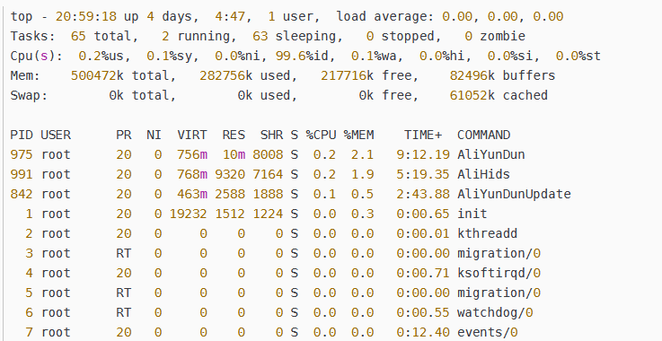

## OOM分类

- java.lang.OutOfMemoryError: Java heap space

  Java 堆溢出原因： 无法在 Java 堆中分配对象 应用程序保存了无法被GC回收的对象。 应用程序过度使用 finalizer。

- java.lang.OutOfMemoryError: unable to create new native thread

  排查代码，确定是否显示使用死循环创建线程，或者隐式调用第三方接口创建线程

- java.lang.OutOfMemoryError: Metaspace

  方法区溢出：检查JVM元空间设置参数是否过小，检查对应代码,是否使用CGLib生成了大量的代理类

- java.lang.OutOfMemoryError: Direct buffer memory

  本机直接内存溢出：检查JVM参数-Xmx，-XX:MaxDirectMemorySize 是否合理。

- java.lang.OutOfMemoryError: GC overhead limit exceeded

  Sun 官方对此的定义：超过98%的时间用来做GC并且回收了不到2%的堆内存时会抛出此异常。

  一般都是堆太小导致的：检查JVM参数-Xmx -Xms是否合理 dump内存，检查是否存在内存泄露，如果没有，加大内存。

## CPU过高排查流程

1. 利用 top 命令可以查出占用 CPU 最高的进程pid，如果pid为 9876
2. 然后查看该进程下占用最高的线程id【top -Hp 9876】
3. 假设占用率最高的线程 ID 为6900，将其转换为 16 进制形式（因为 java native 线程以 16 进制形式输出）【printf '%x\n' 6900】
4. 利用jstack打印出 java 线程调用栈信息 【jstack 9876 | grep '0x1af4' -A 50 --color】，这样就可以更好的定位问题


## 内存占用过高排查流程

1. 查找进程id：【top -d 2 -c】
2. 查看 JVM 堆内存分配情况：jmap -head pid
3. 查看占用内存比较多的对象：jamp -histo pid | head -n 100
4. 查看占用内存比较多的存活对象：jmap -histo:live pid | head -n 100

## 示例

下面是对常见的 `java.lang.OutOfMemoryError: Java heap space` 排查：

### 使用 ps 命令查看进程

ps -aux|grep java命令查看一下你的java进程，就可以找到你的java进程的进程id。

### 使用 top 命令

top命令显示的结果列表中，会看到%MEM这一列，这里可以看到你的进程可能对内存的使用率特别高。以查看正在运行的进程和系统负载信息，包括cpu负载、内存使用、各个进程所占系统资源等。



### 使用 jmap 命令查看

- ./jmap -heap PID 打印堆总结
- ./jmap -dump:file=/data/logs/jmap/auto.dump PID，dump内存分析日志

```shell
[root@test bin]# ./jmap -dump:file=/data/logs/jmap/auto.dump 13
13: Unable to open socket file: target process not responding or HotSpot VM not loaded
The -F option can be used when the target process is not responding
[root@test bin]# ./jmap -F -dump:file=/data/logs/jmap/auto.dump 13
Attaching to process ID 13, please wait...
Error attaching to process: sun.jvm.hotspot.debugger.DebuggerException: cannot open binary file
sun.jvm.hotspot.debugger.DebuggerException: sun.jvm.hotspot.debugger.DebuggerException: cannot open binary file
        at sun.jvm.hotspot.debugger.linux.LinuxDebuggerLocal$LinuxDebuggerLocalWorkerThread.execute(LinuxDebuggerLocal.java:163)
        at sun.jvm.hotspot.debugger.linux.LinuxDebuggerLocal.attach(LinuxDebuggerLocal.java:278)
        at sun.jvm.hotspot.HotSpotAgent.attachDebugger(HotSpotAgent.java:671)
        at sun.jvm.hotspot.HotSpotAgent.setupDebuggerLinux(HotSpotAgent.java:611)
        at sun.jvm.hotspot.HotSpotAgent.setupDebugger(HotSpotAgent.java:337)
        at sun.jvm.hotspot.HotSpotAgent.go(HotSpotAgent.java:304)
        at sun.jvm.hotspot.HotSpotAgent.attach(HotSpotAgent.java:140)
        at sun.jvm.hotspot.tools.Tool.start(Tool.java:185)
        at sun.jvm.hotspot.tools.Tool.execute(Tool.java:118)
        at sun.jvm.hotspot.tools.HeapDumper.main(HeapDumper.java:83)
        at sun.reflect.NativeMethodAccessorImpl.invoke0(Native Method)
        at sun.reflect.NativeMethodAccessorImpl.invoke(NativeMethodAccessorImpl.java:62)
        at sun.reflect.DelegatingMethodAccessorImpl.invoke(DelegatingMethodAccessorImpl.java:43)
        at java.lang.reflect.Method.invoke(Method.java:498)
        at sun.tools.jmap.JMap.runTool(JMap.java:201)
        at sun.tools.jmap.JMap.main(JMap.java:130)
Caused by: sun.jvm.hotspot.debugger.DebuggerException: cannot open binary file
        at sun.jvm.hotspot.debugger.linux.LinuxDebuggerLocal.attach0(Native Method)
        at sun.jvm.hotspot.debugger.linux.LinuxDebuggerLocal.access$100(LinuxDebuggerLocal.java:62)
        at sun.jvm.hotspot.debugger.linux.LinuxDebuggerLocal$1AttachTask.doit(LinuxDebuggerLocal.java:269)
        at sun.jvm.hotspot.debugger.linux.LinuxDebuggerLocal$LinuxDebuggerLocalWorkerThread
```