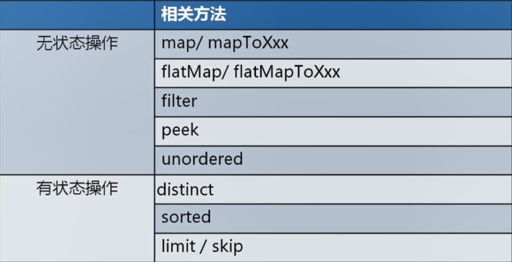
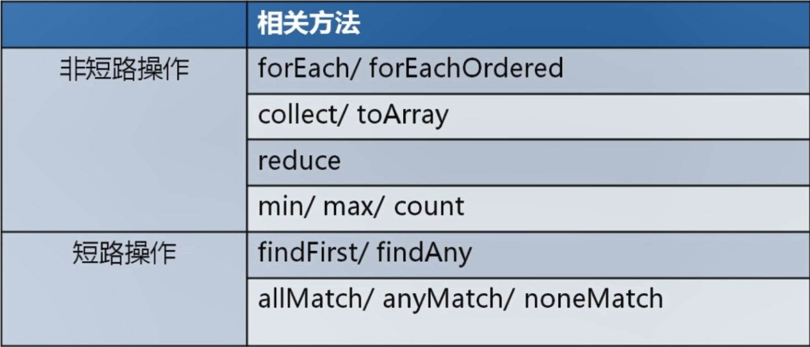
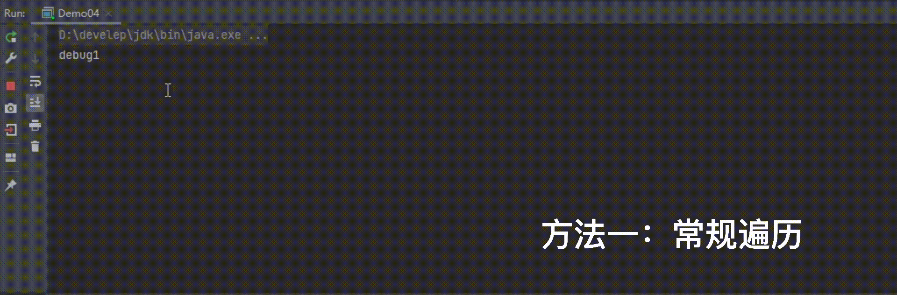

# Stream流

## 一、概述

Java8的Stream使用的是函数式编程模式，如同它的名字一样，它可以被用来对集合或数组进行链状流式的操作。可以更方便的让我们对集合或数组操作。


## 二、案例数据准备

依赖

~~~~xml
<dependencies>
    <dependency>
        <groupId>org.projectlombok</groupId>
        <artifactId>lombok</artifactId>
        <version>1.18.16</version>
    </dependency>
</dependencies>
~~~~


~~~~java
@Data
@NoArgsConstructor
@AllArgsConstructor
@EqualsAndHashCode//用于后期的去重使用
public class Author {
    //id
    private Long id;
    //姓名
    private String name;
    //年龄
    private Integer age;
    //简介
    private String intro;
    //作品
    private List<Book> books;
}
~~~~

~~~~java
@Data
@AllArgsConstructor
@NoArgsConstructor
@EqualsAndHashCode//用于后期的去重使用
public class Book {
    //id
    private Long id;
    //书名
    private String name;

    //分类
    private String category;

    //评分
    private Integer score;

    //简介
    private String intro;

}
~~~~

~~~~java
    private static List<Author> getAuthors() {
        //数据初始化
        Author author = new Author(1L,"蒙多",33,"一个从菜刀中明悟哲理的祖安人",null);
        Author author2 = new Author(2L,"亚拉索",15,"狂风也追逐不上他的思考速度",null);
        Author author3 = new Author(3L,"易",14,"是这个世界在限制他的思维",null);
        Author author4 = new Author(3L,"易",14,"是这个世界在限制他的思维",null);

        //书籍列表
        List<Book> books1 = new ArrayList<>();
        List<Book> books2 = new ArrayList<>();
        List<Book> books3 = new ArrayList<>();

        books1.add(new Book(1L,"刀的两侧是光明与黑暗","哲学,爱情",88,"用一把刀划分了爱恨"));
        books1.add(new Book(2L,"一个人不能死在同一把刀下","个人成长,爱情",99,"讲述如何从失败中明悟真理"));

        books2.add(new Book(3L,"那风吹不到的地方","哲学",85,"带你用思维去领略世界的尽头"));
        books2.add(new Book(3L,"那风吹不到的地方","哲学",85,"带你用思维去领略世界的尽头"));
        books2.add(new Book(4L,"吹或不吹","爱情,个人传记",56,"一个哲学家的恋爱观注定很难把他所在的时代理解"));

        books3.add(new Book(5L,"你的剑就是我的剑","爱情",56,"无法想象一个武者能对他的伴侣这么的宽容"));
        books3.add(new Book(6L,"风与剑","个人传记",100,"两个哲学家灵魂和肉体的碰撞会激起怎么样的火花呢？"));
        books3.add(new Book(6L,"风与剑","个人传记",100,"两个哲学家灵魂和肉体的碰撞会激起怎么样的火花呢？"));

        author.setBooks(books1);
        author2.setBooks(books2);
        author3.setBooks(books3);
        author4.setBooks(books3);

        List<Author> authorList = new ArrayList<>(Arrays.asList(author,author2,author3,author4));
        return authorList;
    }
~~~~


## 三、快速入门

### 3.1、需求

我们可以调用getAuthors方法获取到作家的集合。现在需要打印所有年龄小于18的作家的名字，并且要注意去重。

### 3.2、实现

~~~~java
//打印所有年龄小于18的作家的名字，并且要注意去重
List<Author> authors = getAuthors();
authors.
    stream()//把集合转换成流
    .distinct()//先去除重复的作家
    .filter(author -> author.getAge()<18)//筛选年龄小于18的
    .forEach(author -> System.out.println(author.getName()));//遍历打印名字
~~~~

### 3.3、常用操作

#### 3.3.1、Stream流创建操作

|        | 相关方法                               |
| :----- | :------------------------------------- |
| 集合   | Collection.stream/parallelStream       |
| 数组   | Arrays.stream                          |
| 数字   | lntStream/LongStream.range/rangeClosed |
| 数字   | Random.ints/longs/doubles              |
| 自定义 | Stream.generate/iterate                |


单列集合： `集合对象.stream()`

~~~~java
List<Author> authors = getAuthors();
Stream<Author> stream = authors.stream();
~~~~

双列集合：转换成单列集合后再创建

~~~~java
Map<String,Integer> map = new HashMap<>();
map.put("蜡笔小新",19);
map.put("黑子",17);
map.put("日向翔阳",16);

Stream<Map.Entry<String, Integer>> stream = map.entrySet().stream();
~~~~

数组：`Arrays.stream(数组) `或者使用`Stream.of`来创建

~~~~JAVA
Integer[] arr = {1,2,3,4,5};
Stream<Integer> stream = Arrays.stream(arr);
Stream<Integer> stream2 = Stream.of(arr);
~~~~

数字流

~~~java
// 创建数字流
IntStream.of(1,2,3);
IntStream.range(1,10);

// 创建一个无限流
new Random().ints().limit(10);

// 自定义
Random random = new Random();
Stream.generate(() -> random.nextInt()).limit(20);
~~~


#### 3.3.2、Stream流中间操作



##### filter

可以对流中的元素进行条件过滤，符合过滤条件的才能继续留在流中。

例如：

~~~~java
// 打印所有姓名长度大于1的作家的姓名       
List<Author> authors = getAuthors();
authors.stream()
    .filter(author -> author.getName().length()>1)
    .forEach(author -> System.out.println(author.getName()));
~~~~


##### map

可以把对流中的元素进行计算或转换。

例如：

~~~~java
List<Author> authors = getAuthors();

// 打印所有作家的姓名
// authors.stream()
//     .map(author -> author.getName())
//     .forEach(s -> System.out.println(s));

// 所有作家年龄加10岁
authors.stream()
    .map(author -> author.getAge())
    .map(age -> age + 10)
    .forEach(age -> System.out.println(age));
~~~~


##### distinct

可以去除流中的重复元素。

例如：

~~~~java
// 打印所有作家的姓名，并且要求其中不能有重复元素。
List<Author> authors = getAuthors();
authors.stream()
    .distinct()
    .forEach(author -> System.out.println(author.getName()));
~~~~

**注意：distinct方法是依赖Object的equals方法来判断是否是相同对象的。所以需要注意重写equals方法。**


##### sorted

可以对流中的元素进行排序。

例如：

~~~~java
List<Author> authors = getAuthors();
// 对流中的元素按照年龄进行降序排序，并且要求不能有重复的元素。
authors.stream()
    .distinct()
    .sorted()
    .forEach(author -> System.out.println(author.getAge()));
// 对流中的元素按照年龄进行降序排序，并且要求不能有重复的元素。
authors.stream()
    .distinct()
    .sorted((o1, o2) -> o2.getAge()-o1.getAge())
    .forEach(author -> System.out.println(author.getAge()));
~~~~

**注意：如果调用空参的sorted()方法，需要流中的元素是实现了Comparable。**


##### limit	

可以设置流的最大长度，超出的部分将被抛弃。

例如：

~~~~java
// 对流中的元素按照年龄进行降序排序，并且要求不能有重复的元素,然后打印其中年龄最大的两个作家的姓名。
List<Author> authors = getAuthors();
authors.stream()
    .distinct()
    .sorted()
    .limit(2)
    .forEach(author -> System.out.println(author.getName()));
~~~~


##### skip

跳过流中的前n个元素，返回剩下的元素

例如：

~~~~java
// 打印除了年龄最大的作家外的其他作家，要求不能有重复元素，并且按照年龄降序排序。
List<Author> authors = getAuthors();
authors.stream()
    .distinct()
    .sorted()
    .skip(1)
    .forEach(author -> System.out.println(author.getName()));
~~~~


##### flatMap

map只能把一个对象转换成另一个对象来作为流中的元素。而flatMap可以把一个对象转换成多个对象作为流中的元素。


例一：

~~~~java
// 打印所有书籍的名字。要求对重复的元素进行去重。
List<Author> authors = getAuthors();
authors.stream()
    .flatMap(author -> author.getBooks().stream())
    .distinct()
    .forEach(book -> System.out.println(book.getName()));
~~~~

例二：

~~~~java
// 打印现有数据的所有分类。要求对分类进行去重。不能出现这种格式：哲学,爱情     爱情
List<Author> authors = getAuthors();
authors.stream()
    .flatMap(author -> author.getBooks().stream())
    .distinct()
    .flatMap(book -> Arrays.stream(book.getCategory().split(",")))
    .distinct()
    .forEach(category-> System.out.println(category));
~~~~


#### 3.3.3、Stream终止操作




##### forEach

对流中的元素进行遍历操作，我们通过传入的参数去指定对遍历到的元素进行什么具体操作。

例子：

~~~~java
// 输出所有作家的名字
List<Author> authors = getAuthors();
authors.stream()
    .map(author -> author.getName())
    .distinct()
    .forEach(name-> System.out.println(name));
~~~~


##### count

可以用来获取当前流中元素的个数。

例子：

~~~~java
// 打印这些作家的所出书籍的数目，注意删除重复元素。
List<Author> authors = getAuthors();
long count = authors.stream()
    .flatMap(author -> author.getBooks().stream())
    .distinct()
    .count();
System.out.println(count);
~~~~


##### max&min

可以用来或者流中的最值。

例子：

~~~~java
// 分别获取这些作家的所出书籍的最高分和最低分并打印。
//Stream<Author>  -> Stream<Book> ->Stream<Integer>  ->求值

List<Author> authors = getAuthors();
Optional<Integer> max = authors.stream()
    .flatMap(author -> author.getBooks().stream())
    .map(book -> book.getScore())
    .max((score1, score2) -> score1 - score2);

Optional<Integer> min = authors.stream()
    .flatMap(author -> author.getBooks().stream())
    .map(book -> book.getScore())
    .min((score1, score2) -> score1 - score2);
System.out.println(max.get());
System.out.println(min.get());
~~~~


##### collect

把当前流转换成一个集合。

例子：

~~~~java
// 获取一个存放所有作者名字的List集合。
List<Author> authors = getAuthors();
List<String> nameList = authors.stream()
    .map(author -> author.getName())
    .collect(Collectors.toList());
System.out.println(nameList);
~~~~


~~~~java
// 获取一个所有书名的Set集合。
List<Author> authors = getAuthors();
Set<Book> books = authors.stream()
    .flatMap(author -> author.getBooks().stream())
    .collect(Collectors.toSet());

System.out.println(books);
~~~~


~~~~java
// 获取一个Map集合，map的key为作者名，value为List<Book>
List<Author> authors = getAuthors();

Map<String, List<Book>> map = authors.stream()
    .distinct()
    .collect(Collectors.toMap(author -> author.getName(), author -> author.getBooks()));

System.out.println(map);
~~~~


##### anyMatch（查找与匹配）

可以用来判断是否有任意符合匹配条件的元素，结果为boolean类型。

例子：

~~~~java
// 判断是否有年龄在29以上的作家
List<Author> authors = getAuthors();
boolean flag = authors.stream()
    .anyMatch(author -> author.getAge() > 29);
System.out.println(flag);
~~~~


##### allMatch（查找与匹配）

可以用来判断是否都符合匹配条件，结果为boolean类型。如果都符合结果为true，否则结果为false。

例子：

~~~~java
// 判断是否所有的作家都是成年人
List<Author> authors = getAuthors();
boolean flag = authors.stream()
    .allMatch(author -> author.getAge() >= 18);
System.out.println(flag);
~~~~


##### noneMatch（查找与匹配）

可以判断流中的元素是否都不符合匹配条件。如果都不符合结果为true，否则结果为false

例子：

~~~~java
// 判断作家是否都没有超过100岁的。
List<Author> authors = getAuthors();

boolean b = authors.stream()
    .noneMatch(author -> author.getAge() > 100);

System.out.println(b);
~~~~


##### findAny（查找与匹配）

	获取流中的任意一个元素。该方法没有办法保证获取的一定是流中的第一个元素。

例子：

~~~~java
// 获取任意一个年龄大于18的作家，如果存在就输出他的名字
List<Author> authors = getAuthors();
Optional<Author> optionalAuthor = authors.stream()
    .filter(author -> author.getAge()>18)
    .findAny();

optionalAuthor.ifPresent(author -> System.out.println(author.getName()));
~~~~


##### findFirst（查找与匹配）

获取流中的第一个元素。

例子：

~~~~java
// 获取一个年龄最小的作家，并输出他的姓名。
List<Author> authors = getAuthors();
Optional<Author> first = authors.stream()
    .sorted((o1, o2) -> o1.getAge() - o2.getAge())
    .findFirst();

first.ifPresent(author -> System.out.println(author.getName()));
~~~~


##### reduce归并

对流中的数据按照你指定的计算方式计算出一个结果。（缩减操作）

reduce的作用是把stream中的元素给组合起来，我们可以传入一个初始值，它会按照我们的计算方式依次拿流中的元素和初始化值进行计算，计算结果再和后面的元素计算。

reduce两个参数的重载形式内部的计算方式如下：

~~~~java
T result = identity;
for (T element : this stream)
	result = accumulator.apply(result, element)
return result;
~~~~

其中identity就是我们可以通过方法参数传入的初始值，accumulator的apply具体进行什么计算也是我们通过方法参数来确定的。


例子：

~~~~java
// 使用reduce求所有作者年龄的和
List<Author> authors = getAuthors();
Integer sum = authors.stream()
    .distinct()
    .map(author -> author.getAge())
    .reduce(0, (result, element) -> result + element);
System.out.println(sum);
~~~~


~~~~java
// 使用reduce求所有作者中年龄的最大值
List<Author> authors = getAuthors();
Integer max = authors.stream()
    .map(author -> author.getAge())
    .reduce(Integer.MIN_VALUE, (result, element) -> result < element ? element : result);

System.out.println(max);
~~~~


~~~~java
// 使用reduce求所有作者中年龄的最小值
List<Author> authors = getAuthors();
Integer min = authors.stream()
    .map(author -> author.getAge())
    .reduce(Integer.MAX_VALUE, (result, element) -> result > element ? element : result);
System.out.println(min);
~~~~


	reduce一个参数的重载形式内部的计算

~~~~java
 	 boolean foundAny = false;
     T result = null;
     for (T element : this stream) {
         if (!foundAny) {
             foundAny = true;
             result = element;
         }
         else
             result = accumulator.apply(result, element);
     }
     return foundAny ? Optional.of(result) : Optional.empty();
~~~~

	如果用一个参数的重载方法去求最小值代码如下：

~~~~java
        //        使用reduce求所有作者中年龄的最小值
        List<Author> authors = getAuthors();
        Optional<Integer> minOptional = authors.stream()
                .map(author -> author.getAge())
                .reduce((result, element) -> result > element ? element : result);
        minOptional.ifPresent(age-> System.out.println(age));
~~~~

#### 3.3.4、Steam并行流

`parallel`效果演示

~~~java
public class Test {
    public static void debug(int i){
        System.out.println("debug" + i);
        try {
            // 睡眠3秒，方便查看效果
            TimeUnit.SECONDS.sleep(3);
        } catch (InterruptedException e) {
            e.printStackTrace();
        }
    }
}


public static void main(String[] args) {
    // 每3秒打印一次
    IntStream.range(1,100).forEach(Test::debug);

    // 每3秒打印8次
    IntStream.range(1,100).parallel().forEach(Test::debug);
}
~~~

效果查看



> 问题一：面改成并行流后，我们新的需求出现了，先并行执行，然后串行执行。
>
> ```java
> IntStream.range(1,100).parallel().peek(Test::debug).sequential().peek(Test::debug).count();
> ```
>
> `sequential` 代表串行的意思，最终代码以串行执行。结论：多次调用串行并行，以最后一次调用为准

> 问题二：串行执行的线程数可以改变吗？
>
> ```java
> //使用这个属性可以修改默认的线程数
> System.setProperty("java.util.concurrent.ForkJoinPool.common.parallelism","20");
> ```


#### 3.3.5、Steam流收集器

创建性别枚举类

```java
public enum Gender {

    /**
     * 男
     */
    MALE,

    /**
     * 女
     */
    FEMALE,
}
```

创建班级枚举类

```java
public enum Grade {

    /**
     * 一班
     */
    ONE,

    /**
     * 二班
     */
    TWO,

    /**
     * 三班
     */
    THREE,

    /**
     * 四班
     */
    FOUR
}
```

创建学生类

```java
@Data
@AllArgsConstructor
public class Student {

    /**
     * 姓名
     */
    private String name;

    /**
     * 年龄
     */
    private int age;

    /**
     * 性别
     */
    private Gender gender;

    /**
     * 班级
     */
    private Grade grade;

}
```

初始化数据

```java
public static void main(String[] args) {
    List<Student> students = Arrays.asList(
        new Student("小明", 10, Gender.MALE, Grade.ONE),
        new Student("大明", 9, Gender.MALE, Grade.THREE),
        new Student("小白", 8, Gender.FEMALE, Grade.TWO),
        new Student("小黑", 13, Gender.FEMALE, Grade.FOUR),
        new Student("小红", 7, Gender.FEMALE, Grade.THREE),
        new Student("小黄", 13, Gender.MALE, Grade.ONE),
        new Student("小青", 13, Gender.FEMALE, Grade.THREE),
        new Student("小紫", 9, Gender.FEMALE, Grade.TWO),
        new Student("小王", 6, Gender.MALE, Grade.ONE),
        new Student("小李", 6, Gender.MALE, Grade.ONE),
        new Student("小马", 14, Gender.FEMALE, Grade.FOUR),
        new Student("小刘", 13, Gender.MALE, Grade.FOUR)
    );
}
```

实战演练

```java
public static void main(String[] args) {
    List<Student> students = Arrays.asList(
        new Student("小明", 10, Gender.MALE, Grade.ONE),
        new Student("大明", 9, Gender.MALE, Grade.THREE),
        new Student("小白", 8, Gender.FEMALE, Grade.TWO),
        new Student("小黑", 13, Gender.FEMALE, Grade.FOUR),
        new Student("小红", 7, Gender.FEMALE, Grade.THREE),
        new Student("小黄", 13, Gender.MALE, Grade.ONE),
        new Student("小青", 13, Gender.FEMALE, Grade.THREE),
        new Student("小紫", 9, Gender.FEMALE, Grade.TWO),
        new Student("小王", 6, Gender.MALE, Grade.ONE),
        new Student("小李", 6, Gender.MALE, Grade.ONE),
        new Student("小马", 14, Gender.FEMALE, Grade.FOUR),
        new Student("小刘", 13, Gender.MALE, Grade.FOUR)
    );

    // 获取所有学生的年龄列表
    List<Integer> ages = students.stream().map(Student::getAge).collect(Collectors.toList());

    // 获取所有学生的年龄列表(去重)
    Set<Integer> agesSet = students.stream().map(Student::getAge).collect(Collectors.toSet());

    // 统计汇总信息
    IntSummaryStatistics collect = students.stream()
        .collect(Collectors.summarizingInt(Student::getAge));
    System.out.println(collect); // count=12, sum=121, min=6, average=10.083333, max=14

    // 按性别分块-> 根据boolean分块，true为男生，false为女生
    Map<Boolean, List<Student>> genders = students.stream()
        .collect(Collectors.partitioningBy(student -> student.getGender() == Gender.MALE));

    // 按班级分组
    Map<Grade, List<Student>> grades = students.stream().
        collect(Collectors.groupingBy(Student::getGrade));
    
    // 按班级分组，查询每个班级的人数
    Map<Grade, Long> collect1 = students.stream()
            .collect(Collectors.groupingBy(Student::getGrade, Collectors.counting()));
}
```


### 3.4、注意事项

- 惰性求值（如果没有终结操作，没有中间操作是不会得到执行的）
- 流是一次性的（一旦一个流对象经过一个终结操作后。这个流就不能再被使用）
- 不会影响原数据（我们在流中可以多数据做很多处理。但是正常情况下是不会影响原来集合中的元素的。这往往也是我们期望的）


## 四、使用Optional操作数据

### 4.1、概述

我们在编写代码的时候出现最多的就是空指针异常。所以在很多情况下我们需要做各种非空的判断。

例如：

~~~~java
Author author = getAuthor();
if(author!=null){
    System.out.println(author.getName());
}
~~~~

尤其是对象中的属性还是一个对象的情况下。这种判断会更多。	

而过多的判断语句会让我们的代码显得臃肿不堪。

所以在JDK8中引入了Optional，养成使用Optional的习惯后你可以写出更优雅的代码来避免空指针异常。

并且在很多函数式编程相关的API中也都用到了Optional，如果不会使用Optional也会对函数式编程的学习造成影响。


### 4.2、使用

#### 4.2.1、创建对象

Optional就好像是包装类，可以把我们的具体数据封装Optional对象内部。然后我们去使用Optional中封装好的方法操作封装进去的数据就可以非常优雅的避免空指针异常。

我们一般使用**Optional**的**静态方法ofNullable**来把数据封装成一个Optional对象。无论传入的参数是否为null都不会出现问题。

~~~~java
Author author = getAuthor();
Optional<Author> authorOptional = Optional.ofNullable(author);
~~~~

你可能会觉得还要加一行代码来封装数据比较麻烦。但是如果改造下getAuthor方法，让其的返回值就是封装好的Optional的话，我们在使用时就会方便很多。

而且在实际开发中我们的数据很多是从数据库获取的。Mybatis从3.5版本可以也已经支持Optional了。我们可以直接把dao方法的返回值类型定义成Optional类型，MyBastis会自己把数据封装成Optional对象返回。封装的过程也不需要我们自己操作。


如果你**确定一个对象不是空**的则可以使用**Optional**的**静态方法of**来把数据封装成Optional对象。

~~~~java
Author author = new Author();
Optional<Author> authorOptional = Optional.of(author);
~~~~

但是一定要注意，如果使用of的时候传入的参数必须不为null。（尝试下传入null会出现什么结果）


如果一个方法的返回值类型是Optional类型。而如果我们经判断发现某次计算得到的返回值为null，这个时候就需要把null封装成Optional对象返回。这时则可以使用**Optional**的**静态方法empty**来进行封装。

~~~~java
Optional.empty()
~~~~


#### 4.2.2、安全消费值

我们获取到一个Optional对象后肯定需要对其中的数据进行使用。这时候我们可以使用其**ifPresent**方法对来消费其中的值。

这个方法会判断其内封装的数据是否为空，不为空时才会执行具体的消费代码。这样使用起来就更加安全了。

例如,以下写法就优雅的避免了空指针异常。

~~~~java
Optional<Author> authorOptional = Optional.ofNullable(getAuthor());

authorOptional.ifPresent(author -> System.out.println(author.getName()));
~~~~


#### 4.2.3、获取值

如果我们想获取值自己进行处理可以使用get方法获取，但是不推荐。因为当Optional内部的数据为空的时候会出现异常。


#### 4.2.4、安全获取值

如果我们期望安全的获取值。我们不推荐使用get方法，而是使用Optional提供的以下方法。

* orElseGet

  获取数据并且设置数据为空时的默认值。如果数据不为空就能获取到该数据。如果为空则根据你传入的参数来创建对象作为默认值返回。

  ~~~~java
  Optional<Author> authorOptional = Optional.ofNullable(getAuthor());
  Author author1 = authorOptional.orElseGet(() -> new Author());
  ~~~~

  

* orElseThrow

  获取数据，如果数据不为空就能获取到该数据。如果为空则根据你传入的参数来创建异常抛出。

  ~~~~java
  Optional<Author> authorOptional = Optional.ofNullable(getAuthor());
  try {
      Author author = authorOptional.orElseThrow((Supplier<Throwable>) () -> new RuntimeException("author为空"));
      System.out.println(author.getName());
  } catch (Throwable throwable) {
      throwable.printStackTrace();
  }
  ~~~~

  

#### 4.2.5、过滤

我们可以使用filter方法对数据进行过滤。如果原本是有数据的，但是不符合判断，也会变成一个无数据的Optional对象。

~~~~java
Optional<Author> authorOptional = Optional.ofNullable(getAuthor());
authorOptional.filter(author -> author.getAge()>100).ifPresent(author -> System.out.println(author.getName()));
~~~~


#### 4.2.6、判断

我们可以使用isPresent方法进行是否存在数据的判断。如果为空返回值为false,如果不为空，返回值为true。但是这种方式并不能体现Optional的好处，**更推荐使用ifPresent方法**。

~~~~java
Optional<Author> authorOptional = Optional.ofNullable(getAuthor());

if (authorOptional.isPresent()) {
    System.out.println(authorOptional.get().getName());
}
~~~~


#### 4.2.7、数据转换

Optional还提供了map可以让我们的对数据进行转换，并且转换得到的数据也还是被Optional包装好的，保证了我们的使用安全。

例如我们想获取作家的书籍集合。

~~~~java
private static void testMap() {
    Optional<Author> authorOptional = getAuthorOptional();
    Optional<List<Book>> optionalBooks = authorOptional.map(author -> author.getBooks());
    optionalBooks.ifPresent(books -> System.out.println(books));
}
~~~~

