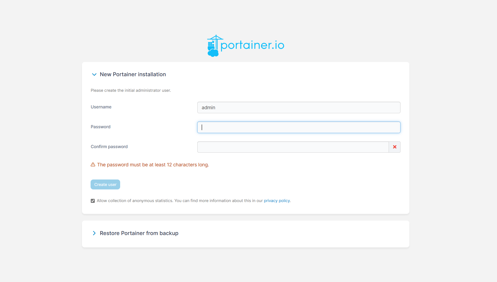
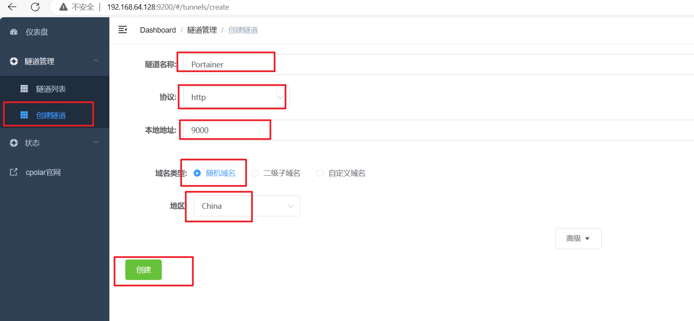
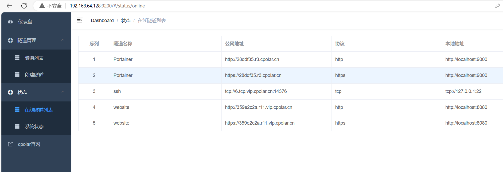
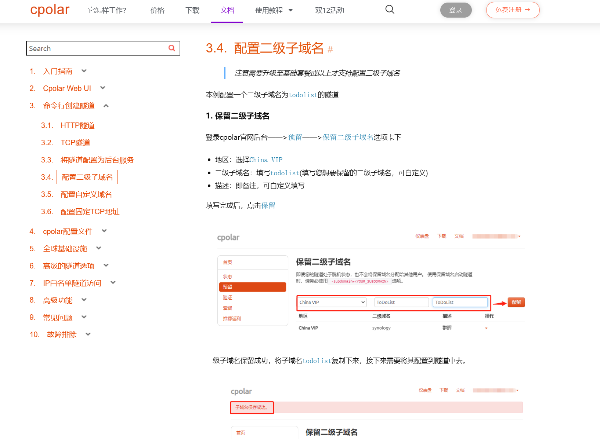

Portainer是一个轻量级的容器管理工具，可以通过Web界面对Docker容器进行管理和监控。它提供了可视化的界面，使得用户可以更加方便地管理Docker容器、镜像、网络和数据卷等资源。

通过Portainer的Web界面，可以直观地查看和管理容器、镜像、网络等资源，还可以进行容器的启动、停止、删除等操作。此外，Portainer还支持多用户管理和RBAC权限控制，可以更好地保障系统的安全性。 

## 部署Portainer

为了方便演示，本例子使用docker部署一个Portainer，首先拉取Portainer镜像。

~~~
docker pull portainer/portainer
~~~

然后运行容器，其中: 9000端口是我们要访问的Portainer Web界面

~~~
docker run -p 9000:9000 -p 8000:8000 --name portainer --restart=always -v /var/run/docker.sock:/var/run/docker.sock -v /mydata/portainer/data:/data -d portainer/portainer
~~~

启动后，我们输入docker ps命令，即可看到运行Portainer的容器,状态Up表示运行正常。

## 本地访问Portainer

容器成功运行后，我们在外部浏览器访问`http://LinuxIP地址:9000端口`，即可看到Portainer管理界面。 

上面首次登录，需要设置新登陆密码，设置完成后，即可登录管理界面，看到容器列表，本地部署访问就成功了。

## 安装cpolar实现远程访问

上面在本地Linux中成功部署了Portainer，并局域网访问成功。下面我们在Linux安装cpolar内网穿透工具，通过cpolar转发本地端口映射的http公网地址，可以很容易实现远程访问，而无需自己注册域名购买云服务器，可节省大量的资金。下面是安装cpolar步骤：

cpolar官网地址: https://www.cpolar.com

使用一键脚本安装命令

~~~
curl -L https://www.cpolar.com/static/downloads/install-release-cpolar.sh | sudo bash
~~~

向系统添加服务

~~~
sudo systemctl enable cpolar
~~~

启动cpolar服务

~~~
sudo systemctl start cpolar
~~~

cpolar安装成功后，在外部浏览器上访问Linux的9200端口即:【http://局域网ip:9200】，使用cpolar账号登录，登录后即可看到cpolar Web配置界面，接下来在Web管理界面配置即可。

## 配置Portainer公网访问地址

点击左侧仪表盘的隧道管理——创建隧道，创建一个Portainer的cpolar公网地址隧道。

- 隧道名称：可自定义命名，注意不要与已有的隧道名称重复

- 协议：选择http

- 本地地址：9000(本地访问时的端口)

- 域名类型：免费选择随机域名

- 地区：选择China

点击创建

隧道创建成功后，点击左侧的状态——在线隧道列表，查看所生成的公网访问地址，有两种访问方式，一种是http和https。

使用上面的cpolar https公网地址，在任意设备的浏览器进行访问，即可成功看到我们Portainer管理界面，这样一个利用公网地址可以进行远程访问的隧道就创建好了，隧道使用了cpolar的公网域名，无需自己购买云服务器，可节省大量资金。

但是上面使用cpolar生成的隧道，其公网地址是随机生成的。这种随机地址的优势在于建立速度快，可以立即使用。然而，它的缺点是网址由随机字符生成，不容易记忆（例如：3ad5da5.r10.cpolar.top）。另外，这个地址会在24小时内发生随机变化，更适合于临时使用。

我们一般会使用固定的二级子域名，它是一个固定的、容易记忆的、更专业的公网地址（例如：wbo.cpolar.cn），这样与（3ad5da5.r10.cpolar.top）相比更显正式，便于交流协作。固定域名属于cpolar收费功能，可参考官方文档操作。

## 补充资料

[1]. 本地Portainer管理界面结合cpolar内网穿透工具实现远程任意浏览器访问：https://www.bilibili.com/video/BV1Nu4y1G725