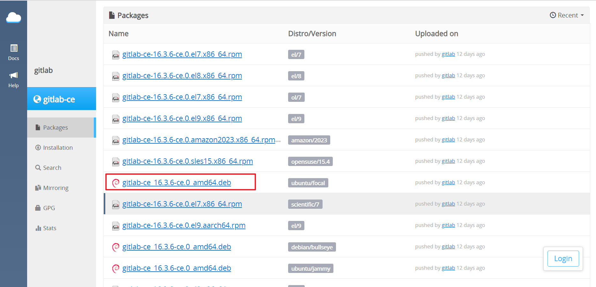
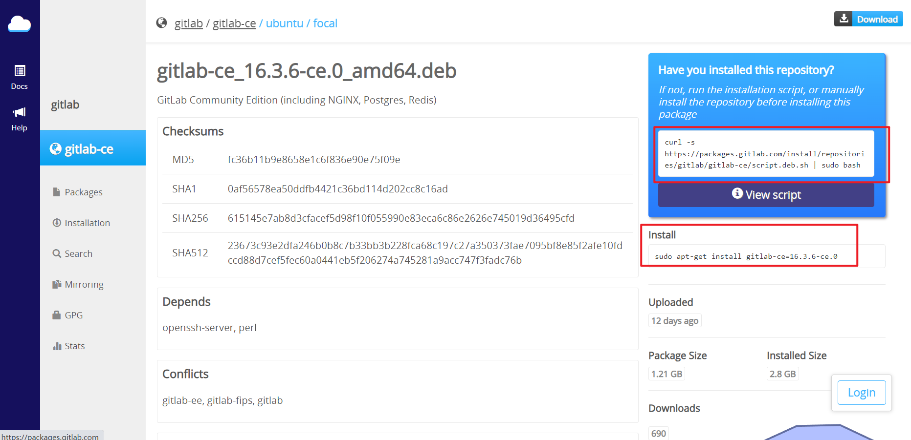
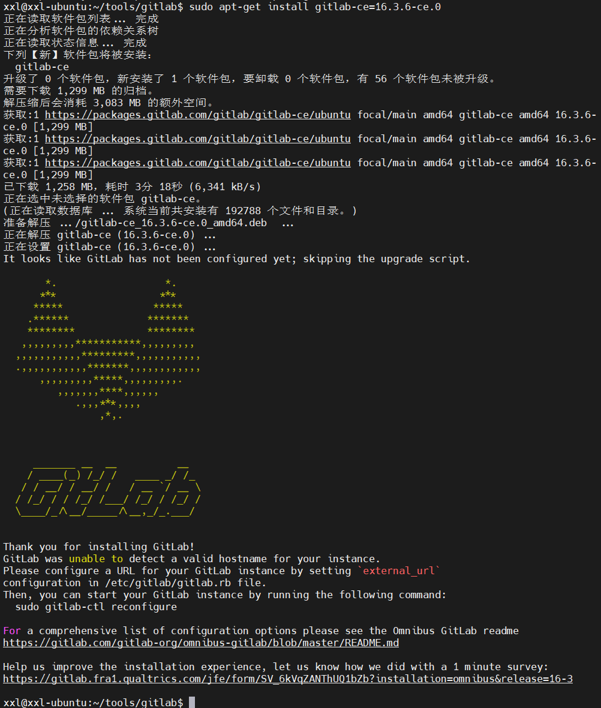

# Gitlab代码托管服务器安装


## Gitlab简介

> 官网： https://about.gitlab.com/
>
> 极狐（GitLab中国发行版）：https://gitlab.cn/install/


GitLab 是一个用于仓库管理系统的开源项目，使用Git作为代码管理工具，并在此基础上搭建起来的
web服务。


GitLab和GitHub一样属于第三方基于Git开发的作品，免费且开源（基于MIT协议），与Github类似，
可以注册用户，任意提交你的代码，添加SSHKey等等。不同的是，GitLab是可以部署到自己的服务器
上，数据库等一切信息都掌握在自己手上，适合团队内部协作开发，你总不可能把团队内部的智慧总放
在别人的服务器上吧？简单来说可把GitLab看作个人版的GitHub。

为什么使用？

企业中为了保护代码的安全性，是不可能将代码放到github等第三方平台的，因此搭建私有git仓库就成了必备技能。目前来说，GitLab是最常用的DevOps工具，是唯一一个以单个应用程序交付的DevOps平台，在全球各类分析报告中赢得关注，广泛覆盖。而极狐GitLab是GitLab中国发行版，一站式交付的开放一体化DevOps平台。极狐GitLab基于GitLab EE版本每月持续同步更新，并针对中国用户需求添加独立研发的功能特性。

## Gitlab安装

### Ubuntu下安装Gitlab

进入官网下载

https://packages.gitlab.com/gitlab/gitlab-ce

选择需要的版本



复制下载链接及安装命令安装



命令如下

~~~bash
# 如下载过程如果很慢，可以浏览器输入链接地址下载，然后通过scp命令传到服务器上，再继续执行下一个命令
curl -s https://packages.gitlab.com/install/repositories/gitlab/gitlab-ce/script.deb.sh | sudo bash

# Install
sudo apt-get install gitlab-ce=16.3.6-ce.0
~~~

安装成功后的页面




安装完成后，修改配置文件

~~~bash
sudo vim /etc/gitlab/gitlab.rb
// ubuntu图形化界面下可以使用 gedit 命令直接打开文件修改
sudo gedit /etc/gitlab/gitlab.rb
~~~

gitlab.rb配置，33行左右修改端口号

~~~bash
##! Note: During installation/upgrades, the value of the environment variable
##! EXTERNAL_URL will be used to populate/replace this value.
##! On AWS EC2 instances, we also attempt to fetch the public hostname/IP
##! address from AWS. For more details, see:
##! https://docs.aws.amazon.com/AWSEC2/latest/UserGuide/instancedata-data-retrieval.html
#external_url 'http://gitlab.example.com'
external_url 'http://127.0.0.1:8081'

## Roles for multi-instance GitLab
~~~

启动

~~~bash
sudo gitlab-ctl reconfigure //启动服务，加载配置
~~~

补充命令

~~~bash
sudo gitlab-ctl start # 启动所有 gitlab 组件；
sudo gitlab-ctl stop # 停止所有 gitlab 组件；
sudo gitlab-ctl restart # 重启所有 gitlab 组件；
sudo gitlab-ctl status # 查看服务状态；
sudo gitlab-ctl reconfigure # 启动服务；
sudo vim /etc/gitlab/gitlab.rb # 修改默认的配置文件；
gitlab-rake gitlab:check SANITIZE=true --trace # 检查gitlab；
sudo gitlab-ctl tail # 查看日志；
~~~


### Centos下安装Gitlab

1. 安装相关依赖

  ~~~bash
  yum -y install policycoreutils openssh-server openssh-clients postfix
  ~~~

2. 启动ssh服务&设置为开机启动

  ~~~bash
  systemctl enable sshd && sudo systemctl start sshd
  ~~~

3. 设置postfix开机自启，并启动，postfix支持gitlab发信功能

  ~~~bash
  systemctl enable postfix && systemctl start postfix
  ~~~

4. 开放ssh以及http服务，然后重新加载防火墙列表

  ~~~bash
  firewall-cmd --add-service=ssh --permanent
  firewall-cmd --add-service=http --permanent
  firewall-cmd --reload
  ~~~

  如果关闭防火墙就不需要做以上配置

5. 下载gitlab包，并且安装

  > 在线下载安装包：
  >
  > wget https://mirrors.tuna.tsinghua.edu.cn/gitlab-ce/yum/el6/gitlab-ce-12.4.2-ce.0.el6.x86_64.rpm
  >
  > 安装：
  >
  > rpm -i gitlab-ce-12.4.2-ce.0.el6.x86_64.rpm

6. 修改gitlab配置

  > vi /etc/gitlab/gitlab.rb
  >
  > 修改gitlab访问地址和端口，默认为80，改为自定义
  >
  > external_url 'http://192.168.64.128:8081'
  >
  > nginx['listen_port'] = 82

7. 重载配置及启动gitlab

  ~~~bash
  gitlab-ctl reconfigure
  gitlab-ctl restart
  ~~~

8. 把端口添加到防火墙

  ~~~bash
  firewall-cmd --zone=public --add-port=82/tcp --permanent
  firewall-cmd --reload
  ~~~

  启动成功后，看到修改管理员root密码的页面，修改密码后，然后登录即可。


### Docker下安装Gitlab

docker下安装Gitlab，docker的安装参考本网站——容器相关——Docker分类下的《Linux安装Docker》

~~~bash
mkdir /etc/gitlab
mkdir /var/log/gitlab
mkdir /var/opt/gitlab

docker run --detach \
  --hostname 服务器公网IP或虚拟机IP地址 \
  --publish 443:443 --publish 80:80 \
  --name gitlab \
  --restart always \
  --volume $GITLAB_HOME/config:/etc/gitlab:Z \
  --volume $GITLAB_HOME/logs:/var/log/gitlab:Z \
  --volume $GITLAB_HOME/data:/var/opt/gitlab:Z \
  --shm-size 256m \
  registry.gitlab.cn/omnibus/gitlab-jh:latest
~~~

进入容器并查看密码

```shell
docker exec -it  gitlab /bin/bash #进入容器
 cat /etc/gitlab/initial_root_password #查看密码
exit #退出容器
```

访问Gitlab：浏览器输入您服务器的**IP地址**，如果出现502错误首先虚拟机/云服务器内存至少需要4g，如果满足条件需要多等一会即可，10分钟内一般能好。账号是root，密码是刚才进入容器查看的密码。


## 参考资料

[1]. [ubuntu安装GitLab笔记]()

[2]. https://www.cnblogs.com/chenjian688/p/16423193.html