需求：项目使用SpringBoot进行开发，我们需要实现当代码提交到git仓库，我们点击Jenkins开始构建按钮，能自动拉取代码并使用maven执行打包操作，上传到指定服务器并运行。

> 版本为：Jenkins 2.414.3

## 安装maven插件

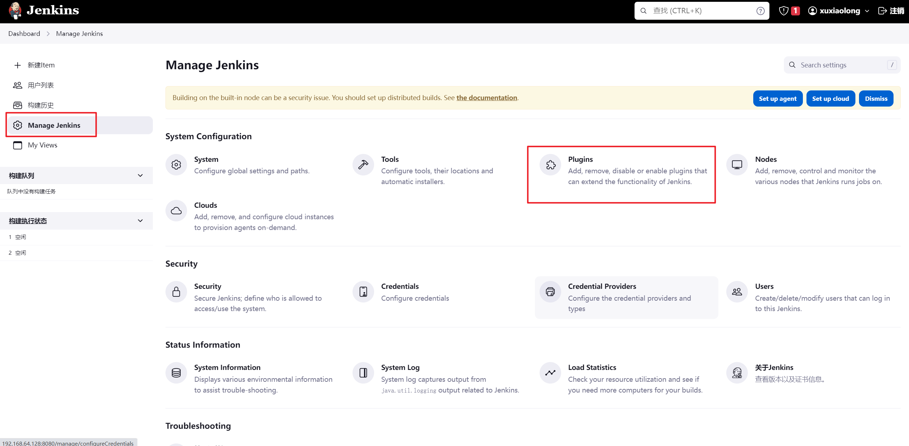

搜索maven找到插件并安装

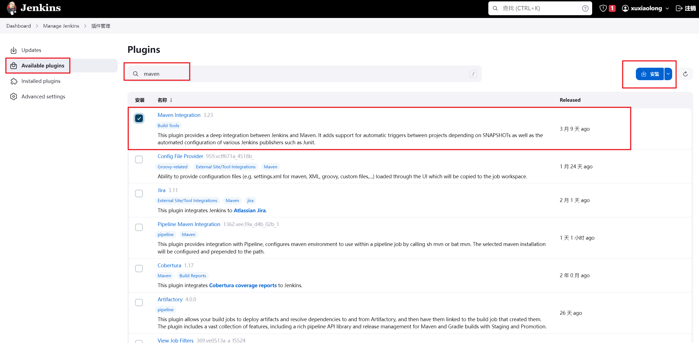

## 配置Maven

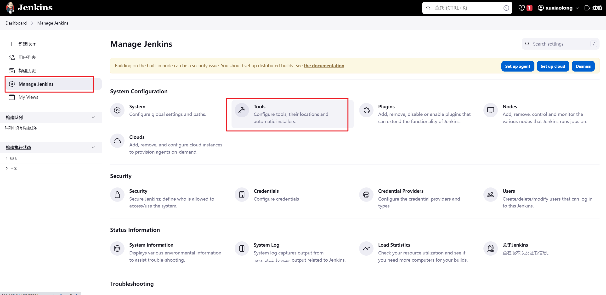

进入全局工具配置后滑动到最底部，找到新增Maven，取消勾选自动安装，手动输入安装maven的地址，然后点击保存即可。

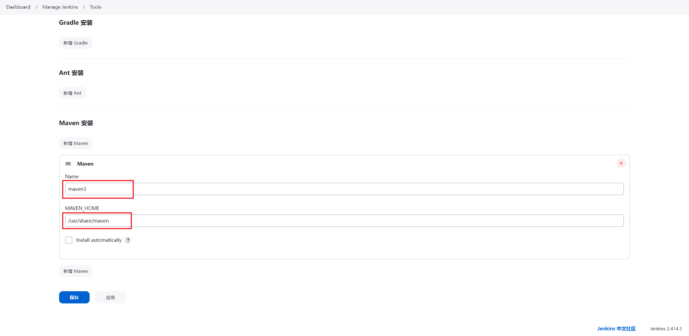

## 新建maven项目

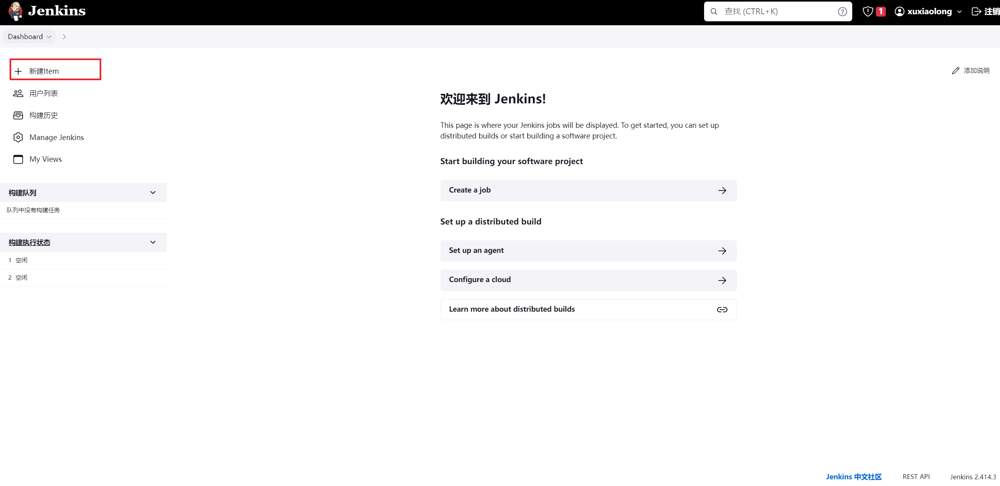

选择构建一个maven项目

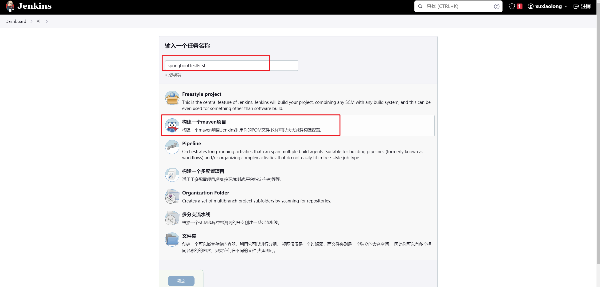

### 配置git地址

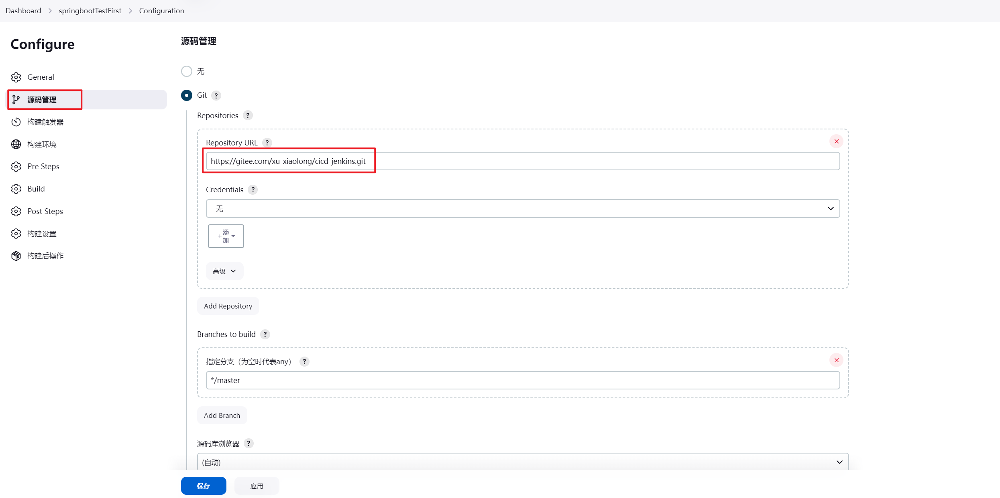

配置Credentials

用户名填写gitlab/gitee账号，这里随便填写的名字，勾选上名字保护（Treat username as secret）,在确定之后名会展示成加密。

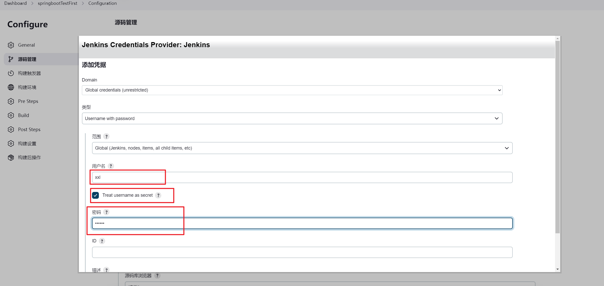

### 设置pom文件地址

如果pom文件不在项目根目录下，比如在project目录下，输入project/pom.xml

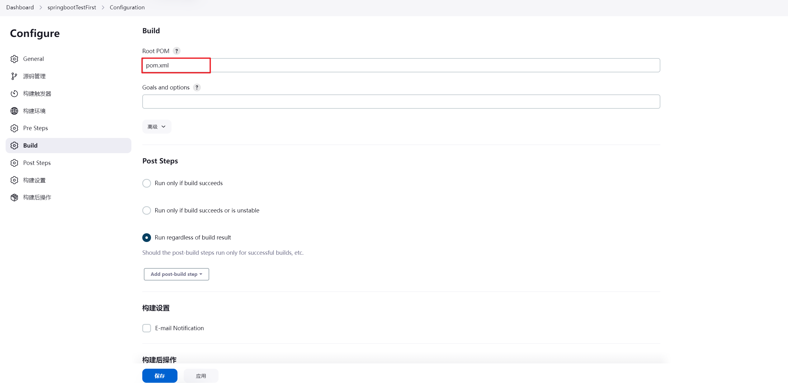

## 开始构建

此时返回主面板点击运行按钮

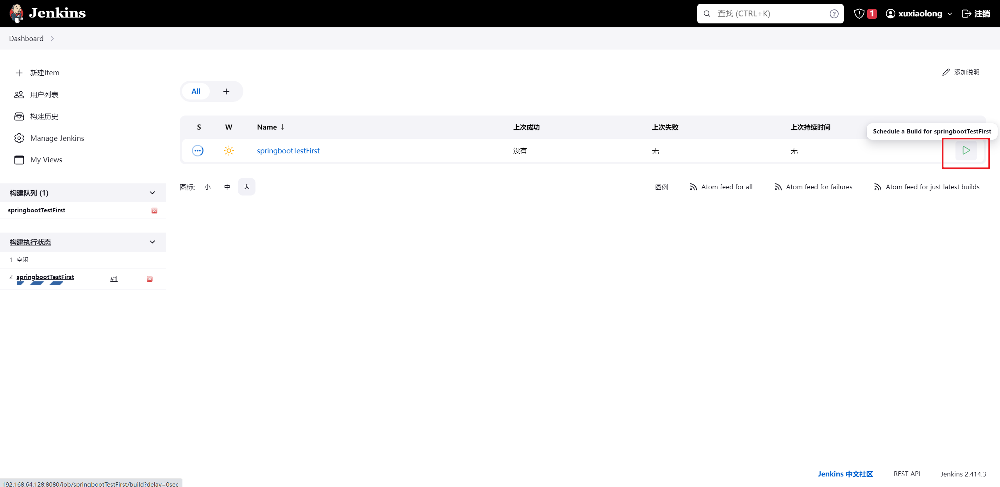

如果构建失败可以查看控制台输出，构建失败的原因可能是jdk版本、maven依赖拉取失败等等。

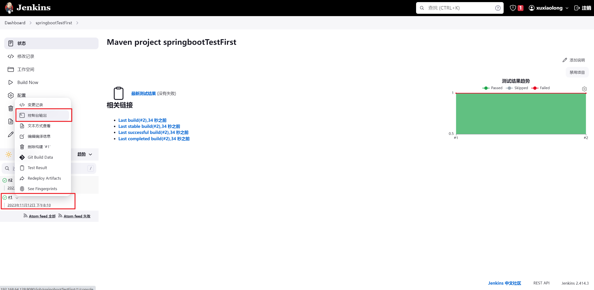

## 安装用于上传jar包的插件

在插件市场搜索 Publish Over 进行安装

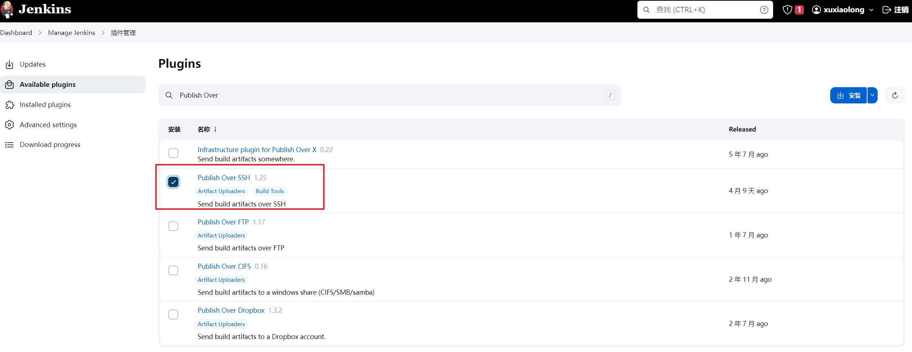

## 配置项目构建完成后上传jar包到指定服务器

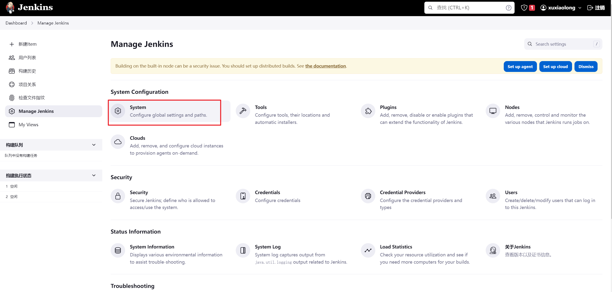

在系统配置中新增SSH连接信息

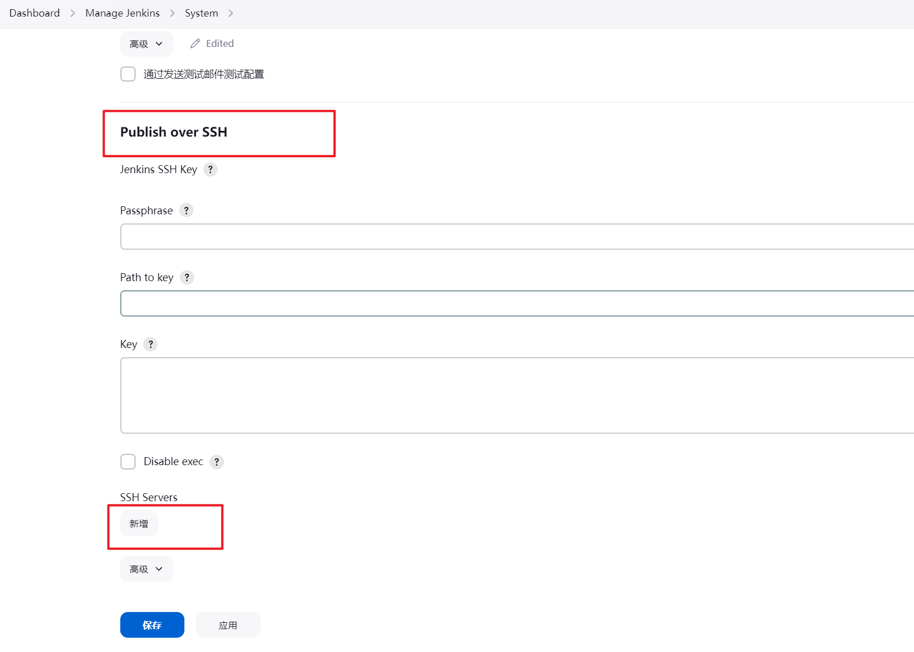

配置ssh服务器，Name：服务器名称、Hostname：服务器地址、Username：登录账户

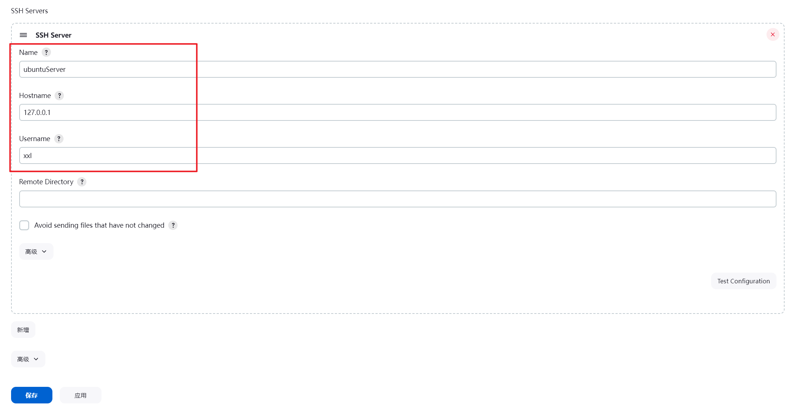

点击高级按钮，然后输入密码

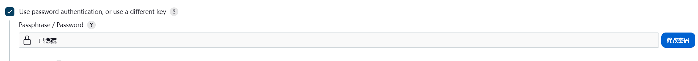

回到项目的插件配置，配置在项目构建后上传jar包到指定服务器

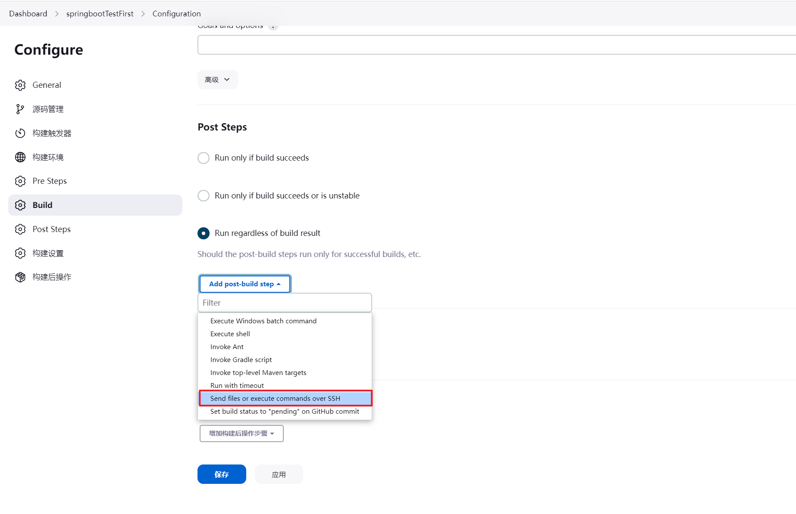

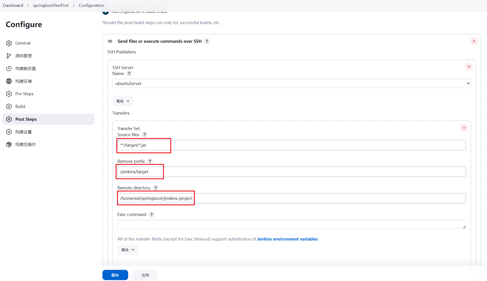

SSH Server——Name：选择创建的SSH连接。

Transfers Set——Source files：利用通配符找到maven打包后生成的jar包，聚合工程可以写`**/system/*.jar`。

Transfers Set——Remove prefix：上传文件后省略的路径，例如路径有/jenkins/target会自动忽略。

Transfers Set——Remove directory：上传文件到指定目录。

Transfers Set——Exec command：运行jar包的路径，如果不确定上传后jar包的位置，可以先省略，运行一次后查看控制台日志中的路径。jar包的名称可以使用匹配符，毕竟版本是变化的。

启动jar包指定日志输出文件

~~~bash
nohup java -jar /var/lib/jenkins/workspace/springbootTestFirst/jenkins/target/jenkins-*.jar >mylog.log 2>&1 &
~~~

## Jenkins配置SSH超时连接时间

点击高级选项，如果超过了这个时间，jenkins会认为上传失败。

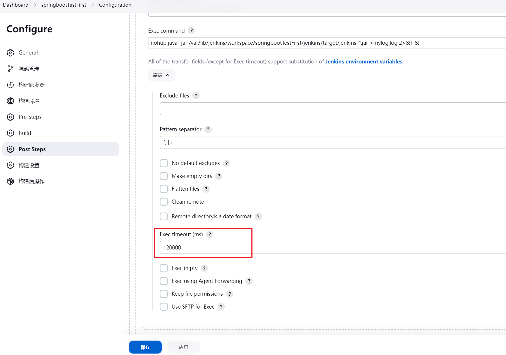

参考资料

[1]. https://blog.gitee.com/2020/12/15/gitee-jenkins/

[2]. https://blog.csdn.net/qq_20957669/article/details/128662560

[3]. https://segmentfault.com/a/1190000020374673

