## 一、RPC分布式开发技术

RPC（Remote Procedure Call，远程过程调用）技术是进行项目业务拆分的重要技术手段，SpringCloud是新一代的RPC技术，其在SpringBoot技术上进行构建，基于Restful架构，采用标准数据结构（JSON）进行数据交互。

目的设计与开发实质上是业务层设计与业务功能的完善，在传统的单主机项目中，业务层的变化一般很少，所以可以直接将业务层定义在Web之中。

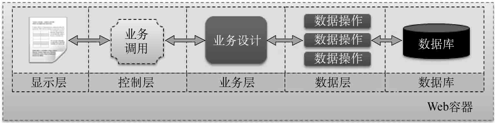

在互联网时代，为了应对业务需求的变更以及用户访问量的迅猛增加，同时也为了程序的可维护性，RPC技术的应用非常广泛。利用RPC技术可以方便地帮助企业搭建业务中心，这样所有的Web端就可以利用远程接口技术实现业务中心方法的调用，从而单独进行业务中心的维护。

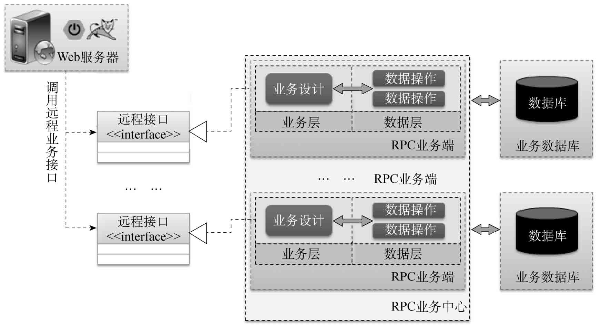

利用RPC技术除了可以实现业务中心的创建之外，最重要的作用是可以为一个业务实现多个RPC服务端的创建。当多个RPC服务端实现同一个业务时，可以利用代理软件实现负载均衡。这样的设计不仅可以提升性能，也方便了高峰时期的业务端扩展，从而实现高并发、高可用、分布式的项目结构设计。

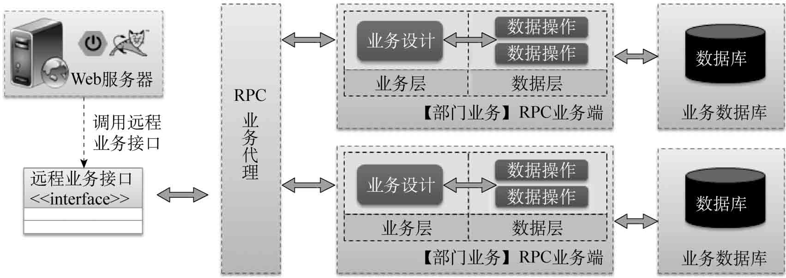

> **提示：关于高并发、高可用和分布式设计。**
>
> 在实际开发中，业务层的调用除了可发生于Web端，还可能存在于移动端。为了满足大量的并发访问，必须尽可能提升业务层的处理能力。由于单主机的性能是有限的，所以往往会建立业务层设计集群，使用多台主机共同实现业务层的高性能处理。这种设计中，即使业务集群中的某一台主机出现问题，也不会影响到整体业务的执行，从而实现高可用的处理机制。同时，分布式的业务中心也更便于维护以及业务设计人员进行业务完善。

## 二、RPC实现技术

RPC技术采用客户端与服务端的处理模式实现分布式开发调用，其本身是一个标准，并没有定义任何传输协议，所以用户可以使用各种技术来实现。但随着技术的发展，目前也出现了一些RPC的实现技术。

### CORBA

CORBA（Common Object Request Broker Architecture，公共对象请求代理架构）是由OMG组织制订的一种标准的面向对象应用程序体系规范。该标准可以使用任何语言实现，同时需要编写IDL接口描述文件。

### RMI

RMI（Remote Method Invocation，远程方法调用）是在JDK 1.1版本中提供的分布式开发技术，在实现过程中需要创建骨架与存根后才可以使用。随着JDK版本的提升，存根也可以自动生成。

RMI的基础架构图

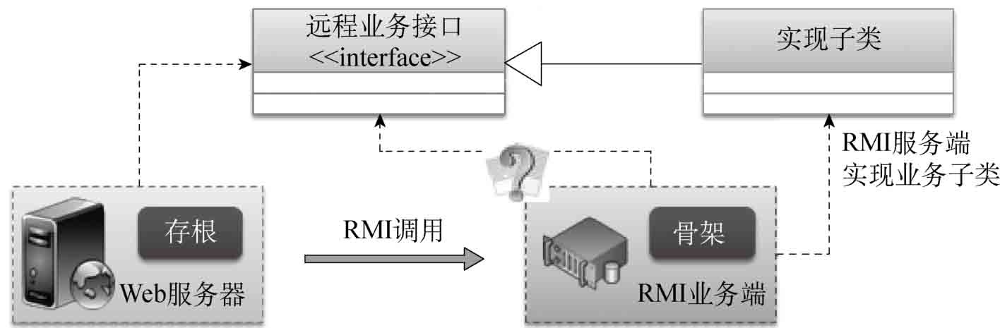

### EJB

EJB（Enterprise JavaBean）是SUN公司（已被Oracle公司收购）推出的基于RMI技术的分布式开发技术，是一个开发基于组件的企业多重应用程序的标准。在EJB技术中主要分为3种Bean：会话Bean（业务层）、实体Bean（数据层）和消息驱动Bean（消息队列中间件）。

3种Bean的对应关系图

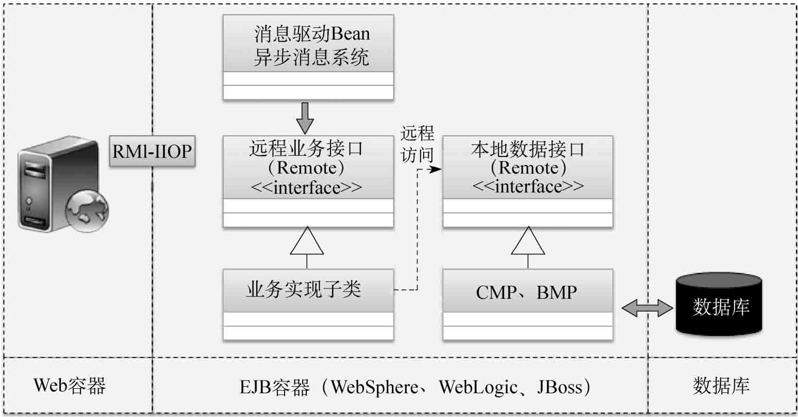

> **提示：EJB最后只剩下了理论价值。**
>
> EJB技术是SUN公司当年的重头戏，它提出了完善的分布式业务中心设计理念，但由于在实现上存在偏差以及EJB容器过于昂贵，EJB技术并没有真正“火”起来。其后来推出的EJB 3.x标准多数情况下还需要与WebService相结合，不得不说这是一个失败的实现。但EJB并非毫无用处，其设计理念造就了今天开源框架的发展，所以它依然是一个里程碑一样的技术。

### WebService

WebService（Web服务）技术使得运行在不同机器上的应用无需借助附加的、专门的第三方软件或硬件，就可相互交换数据或集成。其主要使用XML作为接口描述，同时利用SOAP（Simple Object Access Protocol，简单对象访问协议）进行通信，基本结构如图6-6所示。WebService是一个开发标准，可以直接运行在Web容器中，而后陆续出现了许多开发组件，如Axis、XFire、CXF。除了这些技术之外，还需要使用者利用工具生成一系列的伪代码，而后才可以正常实现远程接口调用。

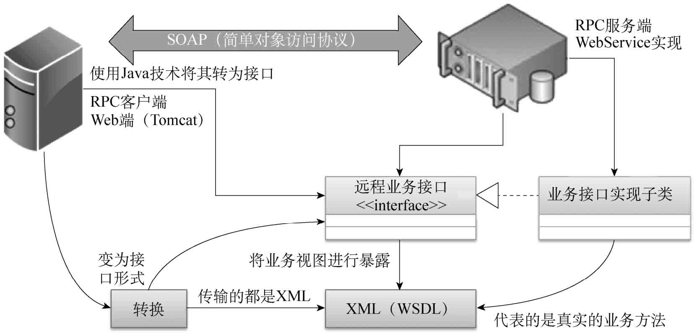

### RPC开发框架

RPC开发框架：WebService是一个大型的重量级标准，可以方便地实现异构系统架构的整合，但是其性能却经常被开发者所诟病。在其之后，许多技术开发公司陆续推出了属于自己的RPC开发框架（如阿里巴巴-Dubbo、阿里巴巴-High Speed Framework、Facebook-thrift、Google-grpc、Twitter-finagle等），这些RPC开发框架在项目中使用得也非常广泛。

### Restful

Restful（也可简称为Rest，指Representational State Transfer，表现层状态转换）是目前最流行的一种互联网软件架构。它结构清晰，符合标准，易于理解，方便扩展，所以逐渐得到越来越多网站的采用。SpringBoot与SpringCloud都可以方便地利用Restful标准进行构建。除了SpringCloud技术外，开发者还可以利用Jersey框架构建基于Restful风格的WebService服务。

> **提示：Rest提出者Roy Thomas Fielding。**
>
> Rest是Roy Thomas Fielding在其2000年的博士论文中提出的。他是HTTP（1.0版和1.1版）的主要设计者，Apache服务器软件的作者之一，Apache基金会的第一任主席。

## 三、SpringCloud技术架构

SpringCloud是一套技术架构（主要使用的是netflix技术产品），其整体的架构核心是围绕Restful展开的，并且以SpringBoot技术为核心基础进行构建的RPC分布式技术。在SpringCloud技术中，对于Restful处理过程中一定要有两个端：服务的提供者（Provider）和服务的消费者（Consumer）。

基本架构图

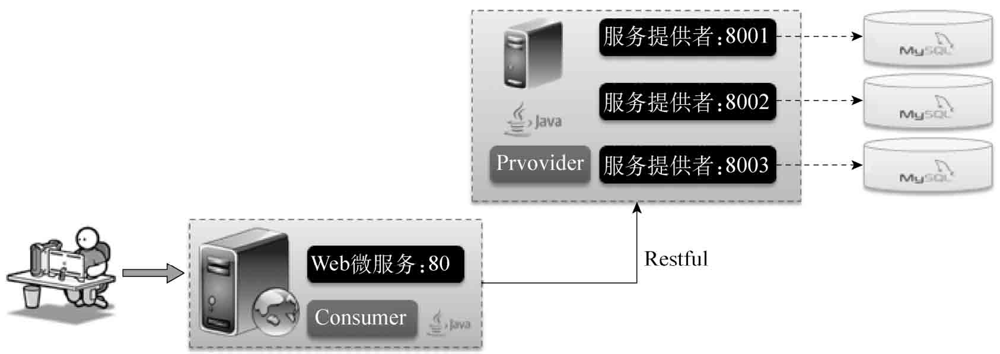

> **提示：SpringCloud以SpringBoot为实现基础。**
>
> 在SpringBoot中如果要将控制层的处理方法以Restful形式返回，那么往往需要使用@Controller + @ResponseBody或者@RestController注解才可以实现。而SpringCloud技术是在SpringBoot的基础上构建的RPC应用，主要以Restful设计架构进行异构系统的数据交互，即SpringCloud中是不存在控制层跳转到显示页面处理操作的。

SpringCloud的本质虽然是基于Restful的一种应用，但它依然属于RPC的一种技术实现。与传统RPC不一样的地方在于，SpringCloud使用了一系列的开源组件进行整合应用，其中包含有如下5个基本组件。

### 微服务注册中心 

微服务的核心意义在于将一个总体的业务端拆分到不同的业务主机上，所有微服务的Restful访问地址非常多。为了统一管理这些地址信息，可以即时地告诉用户哪些服务不可用，应该准备一个分布式的注册中心，并且该注册中心支持HA（High Available，高可用性集群）机制。为了高速并且方便地进行所有服务的注册操作，在SpringCloud里面提供了一个Eureka的注册中心，所有的微服务都可以在此注册中心中进行注册。

> **提示：HA机制。**
>
> HA是保证业务连续性的有效解决方案，一般有两个或两个以上的节点，且分为活动节点及备用节点。可以简单地理解为：如果班长在，则班长负责安排同学；如果班长不在，则副班长顶替班长完成任务。

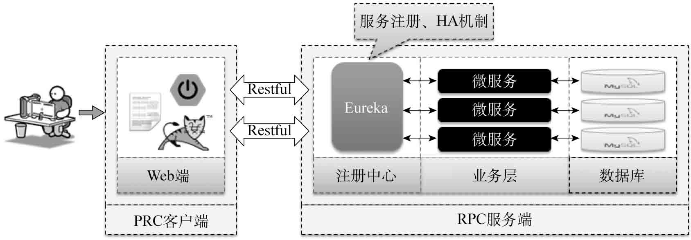

### Ribbon负载均衡 

单台主机的性能是有限的，如果要处理并发访问量高的微服务，就必须创建多个相同的微服务，同时采用负载均衡设计，使每一个微服务都可以为项目提供服务支持。SpringCloud中引入了Ribbon，在客户端实现了负载均衡。

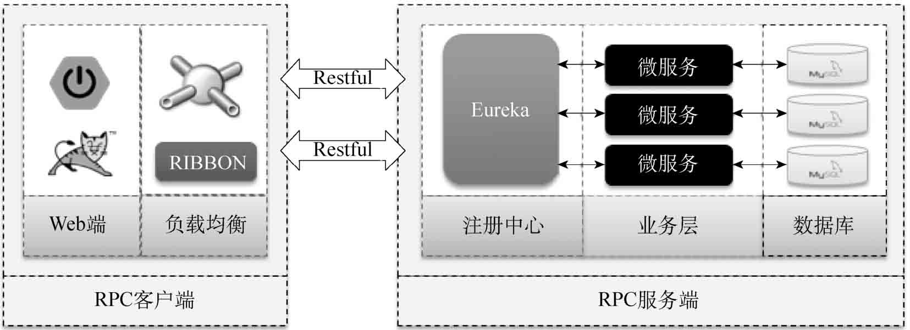

### Feign接口映射

RPC开发技术遵循了客户端与服务端开发模式，且客户端使用远程接口来实现远程业务调用是最为合理的。SpringCloud技术依赖于Restful架构，开发者可以使用Feign技术实现远程接口以及远程Restful服务的映射处理。

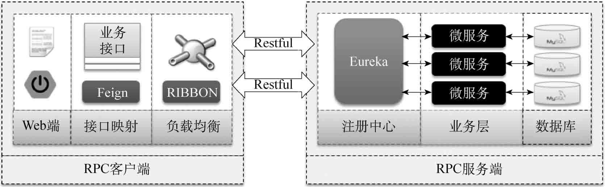

### Zuul网关代理

为了保证微服务调用的安全性以及统一性，所有的微服务都可以采用统一的服务网关技术，通过映射名称访问相应的微服务资源。这样更好地体现了Java中key=value的设计思想。而且所有的微服务通过Zuul进行代理后，也可以更加合理地进行名称的隐藏。

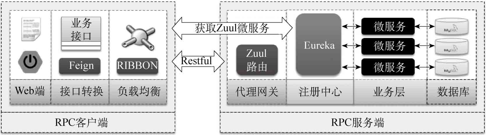

### SpringCloudConfig远程配置

在SpringCloud中通常会存在成百上千个微服务（有些大型项目中微服务甚至更多），为保持高效运转，其配置文件需要进行统一管理。在SpringCloud技术中实现SpringCloudConfig微服务定义，该微服务可以直接注册到Eureka中，以实现HA机制，而所有提供业务支持的微服务都通过SpringCloudConfig从GIT或SVN服务器上抓取用户配置信息，因此可以将配置资源进行统一管理，而后可以利用SpringCloudBus技术实现动态配置更新。

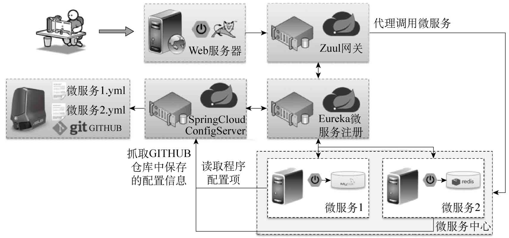

以上几项是SpringCloud构建RPC微服务的重要实现技术。除了这些之外，在SpringCloud中充分考虑到了HA处理机制。同时SpringCloud也可以基于SpringSecurity技术实现安全访问，或者集成OAuth实现统一认证授权管理。

## 四、总结

1．RPC是实现远程过程调用的技术标准，可以使用各种语言实现。SpringCloud是基于Restful架构实现的RPC技术。

2．SpringCloud在实现微服务的定义时，主要使用Netflix公司的产品（如Eureka、Zuul、Feign、Ribbon等）实现架构整合。

3．SpringCloud可以结合SpringSecurity技术进行安全访问。