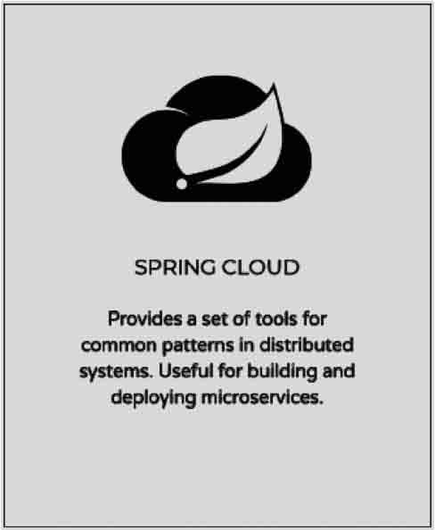
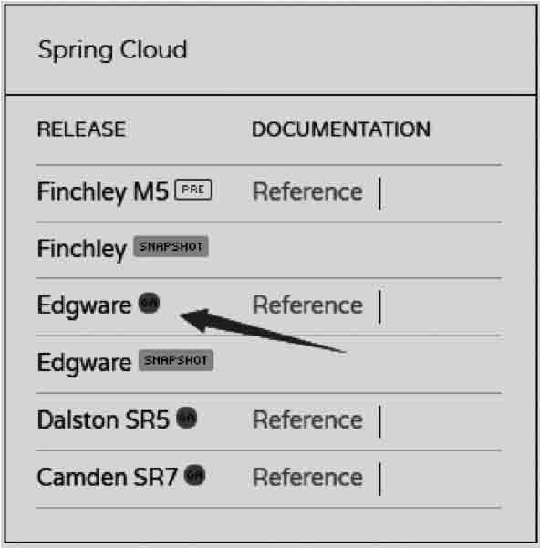
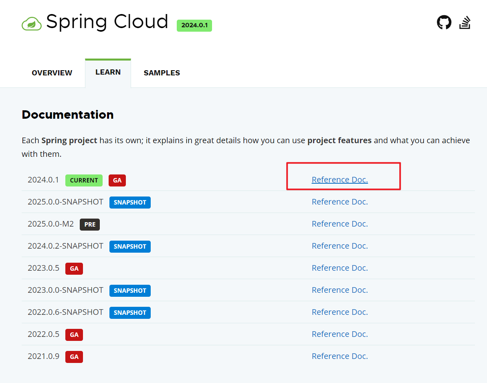
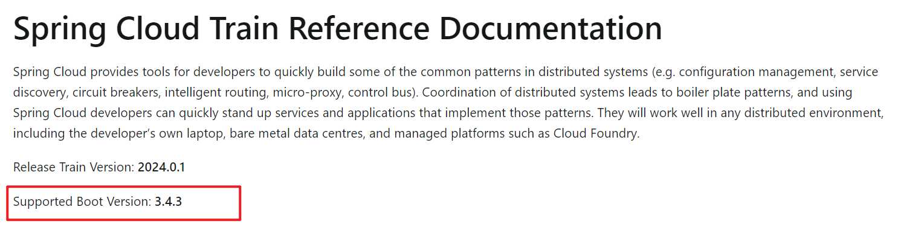
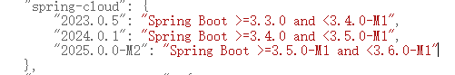

## 一、搭建SpringCloud项目开发环境

SpringCloud是建立在SpringBoot基础上的，所以开发者必须掌握SpringBoot开发框架。由于SpringCloud是基于Restful架构的RPC开发实现，所以微架构设计中往往在客户端利用RestTemplate来实现远程Restful业务调用。为了保证系统安全，也可以使用SpringSecurity进行安全访问控制。

SpringCloud技术与SpringBoot技术一样，都提供了统一的pom.xml配置项，配置好相应的版本之后就可以在各个Maven子模块中进行依赖支持库的简单引用。

SpringCloud技术与传统开发不一样的地方在于，其版本号并未采用数字，而是使用了一系列英国的地名作为标注。

### 1、搭建项目，引入依赖

创建一个新的Springboot项目，修改pom.xml配置文件。如果要开发SpringCloud，则一定要引入SpringBoot依赖支持。

~~~xml
<!-- 属性定义 -->
<spring-boot-dependencies.version>2.0.5.RELEASE</spring-boot-dependencies.version>
<spring-cloud-dependencies.version>Finchley.SR2</spring-cloud-dependencies.version>

<!-- 依赖库配置 -->
<dependency>				<!-- 定义SpringBoot依赖管理 -->
    <groupId>org.springframework.boot</groupId>
    <artifactId>spring-boot-dependencies</artifactId>
    <version>${spring-boot-dependencies.version}</version>
    <type>pom</type>
    <scope>import</scope>
</dependency>
<dependency>				<!-- 进行SpringCloud依赖包的导入处理 -->
    <groupId>org.springframework.cloud</groupId>
    <artifactId>spring-cloud-dependencies</artifactId>
    <version>${spring-cloud-dependencies.version}</version>
    <type>pom</type>
    <scope>import</scope>
</dependency>
~~~

### 2、SpringBoot与SpringCloud对应版本及官方查询方法

SpringCloud 与 SpringBoot各版本的对应关系

| SpringCloud         | SpringBoot                                     |
| ------------------- | ---------------------------------------------- |
| Finchley            | 2.0.x                                          |
| Finchley.SR1        | Spring Boot >=2.0.3.RELEASE and <=2.0.9RELEASE |
| Finchley.SR4        | Spring Boot >=2.0.3.RELEASE and <=2.0.9RELEASE |
| Greenwich           | 2.1.x                                          |
| Hoxton              | 2.2.x，2.3.x (Starting with SR5)               |
| 2020.0.x aka Ilford | 2.4.x                                          |

方式一：通过官网查询

https://spring.io/projects/spring-cloud#learn

对应版本号后，点击 Reference Doc. 。能看到很明显的 Supported Boot Version 字样。

方式二：

https://start.spring.io/actuator/info

可以得到一串json，其中对应关系一目了然，此网站返回内容，除了包含springCloud和springBoot的版本对应关系，还有其他组件和springBoot之间的版本对应关系。

————————————————

                            版权声明：本文为博主原创文章，遵循 CC 4.0 BY-SA 版权协议，转载请附上原文出处链接和本声明。

原文链接：https://blog.csdn.net/xt314159/article/details/123372353

## 二、Restful基础实现

不管使用何种技术实现的RPC项目开发，采用的均为服务端与客户端结构。为了保证服务端定义与客户端访问的标准性，可以单独创建一个远程接口的描述项目。

## 三、Restful接口描述

利用SpringCloud开发技术可以方便地实现Restful技术标准。从另外一个方面来说，这些接口如果要给其他消费端程序使用，就需要有良好的接口说明信息，可以明确地将服务接口以及参数的作用告诉使用者，此时就可以利用Swagger技术实现。

修改pom.xml配置文件，引入Swagger相关依赖库。

建立Swagger配置类，定义接口描述基础信息。

修改DeptRest程序类，使用Swagger进行接口描述。

本程序为Restful控制器中追加了接口的注解描述，当程序启动后可以通过swagger-ui.html地址进行访问，页面运行后的效果如图

## 四、SpringSecurity安全访问