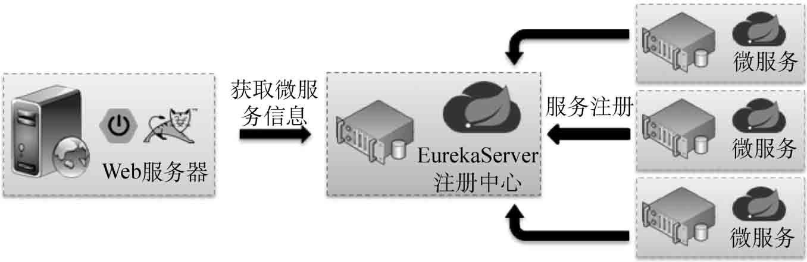
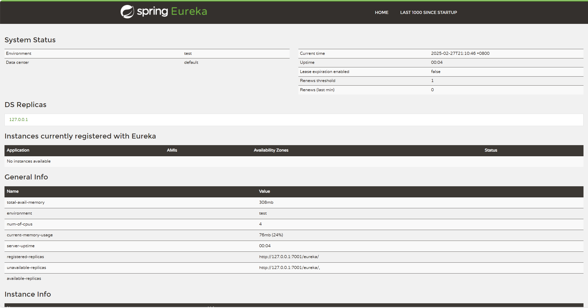
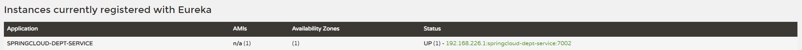
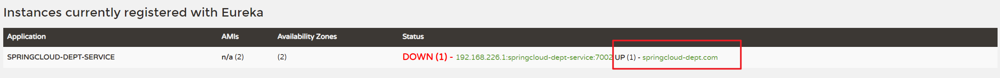
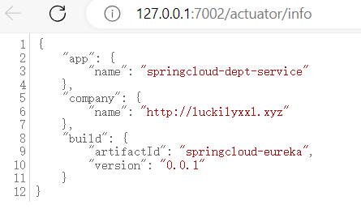
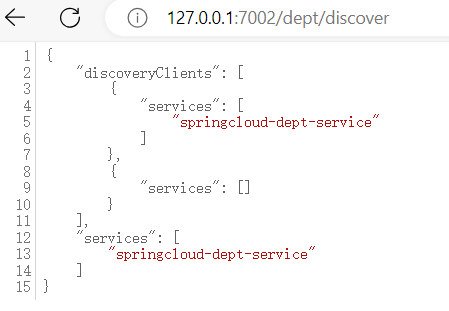
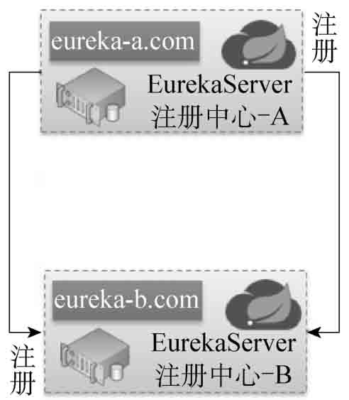
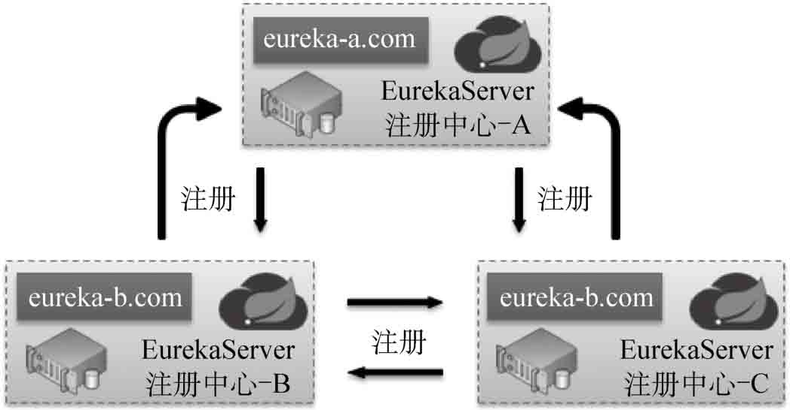

## 一、Eureka简介

RestTemplate在进行微服务访问的时候，需要明确地通过微服务的地址进行调用。这样直接利用地址的调用，一旦出现服务端主机地址变更，则消费端就需要进行大量的修改。同时，微服务的主要目的是提高业务处理能力，因此往往会若干个相同业务的微服务一同参与运算。为了解决这样的问题，在微服务的使用中需要采用Eureka注册中心对所有微服务进行管理。所有的微服务在启动后需要全部向Eureka中进行服务注册，而后客户端直接利用Eureka进行服务信息的获得，以实现微服务调用。



## 二、定义Eureka服务端

在SpringCloud中大量使用了Netflix的开源项目，而其中Eureka就属于Netflix提供的发现服务组件，该应用程序需要由开发者自行定义。

### 1、引入依赖

创建新的子模块springcloud-eureka

修改pom.xml配置文件，除了引入SpringBoot相关依赖库之外，还需要引入Eureka相关依赖库。

~~~xml
<dependency>
    <groupId>org.springframework.cloud</groupId>
    <artifactId>spring-cloud-starter-eureka-server</artifactId>
</dependency>
~~~

### 2、修改配置文件

修改application.yml配置文件，进行Eureka服务器配置。

~~~yaml
eureka: 
  instance:                   # eureak实例定义
    hostname: eureka-7001.com # 定义Eureka实例所在的主机名称
~~~

### 3、修改启动类

定义程序启动主类，添加Eureka相关注解。

~~~java
@SpringBootApplication
@EnableEurekaServer                    // 启用Eureka服务
public class SpringbootEurekaApplication {

    public static void main(String[] args) {
        SpringApplication.run(SpringbootEurekaApplication.class, args);
    }
}
~~~

### 4、修改主机配置

修改hosts配置文件，追加主机配置。

在Windows系统中，Hosts文件的位置是：`C:\Windows\System32\drivers\etc\hosts`

修改hosts后需要刷新DNS缓存使之生效，在cmd命令行中执行命令：`ipconfig/flushdns`

~~~conf
127.0.0.1 eureka-7001.com
~~~

此时配置的主机名称eureka-7001.com与application.yml中配置的Eureka运行主机名称相同。

### 5、访问

启动Eureka服务端，随后输入访问地址http://eureka-7001.com:7001/，可以看见管理界面。



### 异常1

**提示：关于程序运行中的TransportException异常。**

虽然现在已经配置完了Eureka注册中心，但在运行中却会发现控制台上会输出如下错误信息：

~~~
com.netflix.discovery.shared.transport.TransportException: Cannot execute request on any known server
~~~

之所以会有这些错误信息，主要是因为Eureka在默认配置下自己也是一个微服务，并且该微服务应该向Eureka中注册，但却无法找到主机所导致的。要想解决这个问题，需要修改application.yml配置文件，追加配置项。

修改application.yml配置文件，追加如下配置。

~~~yaml
server:
  port: 7001
eureka:
  client:
    # EurekaServer的地址，现在是自己的地址，如果是集群，需要加上其它Server的地址
    service-url:
      defaultZone: http://127.0.0.1:${server.port}/eureka
    # 不把自己注册到eureka服务列表
    register-with-eureka: false
    # 拉取eureka服务信息
    fetch-registry: false # false表示自己就是注册中心，不需要从注册中心获取注册列表信息
  instance: # eureak实例定义
    hostname: eureka-7001.com # 定义Eureka实例所在的主机名称
~~~

此时的程序配置了微服务要注册的Eureka服务地址，但是服务信息注册没有意义，所以配置了register-with-eureka与fetch-registry选项，不再在Eureka注册中心中显示该微服务信息。


### 异常2

~~~
java.lang.TypeNotPresentException: Type javax.xml.bind.JAXBContext not present
~~~

原因：JAXBContext不存在，网上查找的原因说是因为JAXB-API是java ee的一部分，java9引入了模块化的概念，在jdk11中在jdk11中没有在默认的类路径中，使得JAXB默认没有加载。

解决

~~~xml
<!-- jaxb模块引用 - start -->
<dependency>
   <groupId>javax.xml.bind</groupId>
    <artifactId>jaxb-api</artifactId>
</dependency>
<dependency>
    <groupId>com.sun.xml.bind</groupId>
    <artifactId>jaxb-impl</artifactId>
    <version>2.3.0</version>
</dependency>
<dependency>
    <groupId>org.glassfish.jaxb</groupId>
    <artifactId>jaxb-runtime</artifactId>
    <version>2.3.0</version>
</dependency>
<dependency>
    <groupId>javax.activation</groupId>
    <artifactId>activation</artifactId>
    <version>1.1.1</version>
</dependency>
<!-- jaxb模块引用 - end -->
~~~

也可以使用java9模块命令方式引入jaxb-api：

```bash
--add-modles java.xml.bind
```

## 三、向Eureka中注册微服务

Eureka注册中心搭建成功后，所有的微服务都应该向Eureka中进行注册，此时应该进行微服务程序的配置，在微服务中引入Eureka客户端依赖，并且配置Eureka地址。

### 1、引入相关依赖

修改pom.xml配置文件，引入相关依赖库。

~~~xml
<dependency>
    <groupId>org.springframework.cloud</groupId>
    <artifactId>spring-cloud-starter-eureka</artifactId>
</dependency>
~~~

### 2、修改配置文件

修改application.yml配置文件，追加Eureka客户端配置。

~~~yaml
eureka:
  client:                                         # 客户端进行Eureka注册的配置
    service-url:                                  # 定义Eureka服务地址
      defaultZone: http://eureka-7001.com:7001/eureka
~~~

如果要向Eureka中进行微服务注册，还需要为当前微服务定义名称。

~~~yaml
spring:
  application:
    name: springcloud-dept-service                  # 定义微服务名称
~~~

### 3、修改启动类

修改程序启动类

~~~java
@SpringBootApplication
@EnableEurekaClient					// 启用Eureka客户端
public class SpringbootDeptApplication {

    public static void main(String[] args) {
        SpringApplication.run(SpringbootDeptApplication.class, args);
    }

}
~~~

这里定义了@EnableEurekaClient注解信息，微服务启动之后，该服务会自动注册到Eureka服务器之中。分别启动Eureka注册中心微服务与部门微服务之后，就可以通过Eureka注册中心观察到所注册的微服务信息。



## 四、Eureka服务信息

前面实现了微服务向Eureka中的注册处理，但是此时微服务的注册信息并不完整，开发者可以通过微服务的进一步配置，实现更加详细的信息显示。

### 1、修改配置，增加主机名称显示

修改application.yml配置文件，追加微服务所在主机名称的显示。

~~~yaml
server:
  port: 7002
spring:
  application:
    name: springcloud-dept-service                  # 定义微服务名称
eureka:
  client:                                           # 客户端进行Eureka注册的配置
    service-url:                                    # 定义Eureka服务地址
      defaultZone: http://eureka-7001.com:7001/eureka
  instance:
    instance-id: springcloud-dept.com                # 显示主机名称
~~~



### 2、修改配置，增加主机IP地址显示

修改application.yml，修改服务信息的连接主机为IP地址。

~~~yaml
spring:
  application:
    name: springcloud-dept-service                  # 定义微服务名称
eureka:
  client:                                           # 客户端进行Eureka注册的配置
    service-url:                                    # 定义Eureka服务地址
      defaultZone: http://127.0.0.1:7001/eureka
  instance:
    instance-id: springcloud-dept.com                # 显示主机名称
    prefer-ip-address: true                          # 访问的路径变为IP地址
~~~

追加prefer-ip-address配置项之后，会在显示链接信息处显示IP地址。

用户打开微服务的信息之后，可以使用/info路径查看信息。由于默认状态下无法显示，此时可以使用Actuator显示微服务信息（此配置与SpringBoot中的Actuator相同）。

### 3、增加actuator依赖

要查看微服务详细信息，需要修改pom.xml文件，追加actuator依赖。

~~~xml
<dependency>
    <groupId>org.springframework.boot</groupId>
    <artifactId>spring-boot-starter-actuator</artifactId>
</dependency>
~~~

### 4、增加信息处理的插件

修改pom.xml文件，追加信息处理的插件。

~~~xml
<resources>
    <resource>
        <directory>src/main/resources</directory>
        <includes>
            <include>**/*.properties</include>
            <include>**/*.yml</include>
            <include>**/*.xml</include>
            <include>**/*.tld</include>
            <include>**/*.p12</include>
        </includes>
        <filtering>true</filtering>
    </resource>
</resources>
...
<plugin>
    <groupId>org.apache.maven.plugins</groupId>
    <artifactId>maven-resources-plugin</artifactId>
    <configuration>
        <delimiters>
            <delimiter>$</delimiter>
        </delimiters>
    </configuration>
</plugin>
~~~

### 5、修改配置，增加info的信息

修改application.yml配置文件，追加info的相关信息。

~~~
info:
  app.name: springcloud-dept-service
  company.name: http://luckilyxxl.xyz
  build.artifactId: $project.artifactId$
  build.version: $project.version$
~~~

此时，当用户通过Eureka打开微服务时就可以显示微服务的相应信息。

http://127.0.0.1:7002/actuator/info



~~~json
{
    "app": {
        "name": "springcloud-dept-service"
    },
    "company": {
        "name": "http://luckilyxxl.xyz"
    },
    "build": {
        "artifactId": "springcloud-eureka",
        "version": "0.0.1"
    }
}
~~~


## 五、Eureka发现管理

Eureka的主要作用是进行微服务注册。在整个微服务的运行过程中，Eureka也需要对微服务的状态进行监听，对无用的微服务可以进行清除处理，也可以通过发现管理查看Eureka信息。

### 1、设置Eureka清理时间

修改applicaiton.yml配置文件，设置微服务清理间隔。

~~~yaml
eureka:
  server:
    eviction-interval-timer-in-ms: 1000 # 设置清理的间隔时间，而后这个时间使用的是毫秒单位（默认是60秒）
~~~

一旦触发清理操作后，会在控制台显示如下信息：

~~~sh
2025-03-08 22:20:03.433  INFO 20268 --- [nio-7001-exec-8] c.n.e.registry.AbstractInstanceRegistry  : Registered instance SPRINGCLOUD-DEPT-SERVICE/springcloud-dept.com with status DOWN (replication=true)
2025-03-08 22:20:03.445  INFO 20268 --- [a-EvictionTimer] c.n.e.registry.AbstractInstanceRegistry  : Running the evict task with compensationTime 7ms
~~~

### 2、关闭Eureka保护

在Eureka使用过程中经常会看见如下所示的提示文字：

~~~sh
EMERGENCY! EUREKA MAY BE INCORRECTLY CLAIMING INSTANCES ARE UP WHEN THEY’RE NOT. RENEWALS ARE LESSER THAN THRESHOLD AND HENCE THE INSTANCES ARE NOT BEING EXPIRED JUST TO BE SAFE.
~~~

该提示的核心意义在于：当某一个微服务不可用时（可能出现了更名或者是宕机等因素），由于所有的微服务提供有保护模式，所以Eureka是不会对微服务信息进行清理的。如果希望关闭这种保护模式（一般不推荐），则可以通过修改application.yml来实现。在Eureka中增加如下配置：

~~~yaml
eureka: 
  server:
    enable-self-preservation: false     # 设置为false表示关闭保护模式
~~~

### 3、修改微服务默认心跳

所有注册到Eureka中的微服务如果要与Eureka之间保持联系，依靠的是心跳机制。用户可以根据网络环境自行进行心跳机制的配置，只需要修改微服务中的application.yml即可。

~~~yaml
eureka:
  client:                                         # 客户端进行Eureka注册的配置
    service-url:                                  # 定义Eureka服务地址
      defaultZone: http://eureka-7001.com:7001/eureka
  instance:
    lease-renewal-interval-in-seconds: 2          # 设置心跳的时间间隔（默认是30秒）
    lease-expiration-duration-in-seconds: 5       # 如果现在超过了5秒的间隔（默认是90秒）
    instance-id: springcloud-dept.com             # 显示主机名称
    prefer-ip-address: false                      # 访问的路径变为IP地址
~~~

### 4、Eureka发现信息

所有注册到Eureka中的微服务均可以定义Eureka发现信息，只需要在相应的微服务中获取DiscoveryClient对象即可。修改DeptRest程序类，追加新的方法。

~~~java
@Resource
private DiscoveryClient client ;	// 进行Eureka的发现服务

@RequestMapping("/dept/discover")
public Object discover() {	// 直接返回发现服务信息
    return this.client ;
}
~~~

### 5、启动类增加注解

在程序启动类中追加发现服务配置注解。

~~~java
@SpringBootApplication
@EnableEurekaClient                    // 启用Eureka客户端
@EnableDiscoveryClient
@EnableJpaRepositories(basePackages = "com.xxl.springboot.dept.dao")
public class SpringbootDeptApplication {

    public static void main(String[] args) {
        SpringApplication.run(SpringbootDeptApplication.class, args);
    }

}
~~~

程序启动之后通过访问地址`http://127.0.0.1:7002/dept/discover`，可以查询到微服务的相关信息。



~~~json
{
    "discoveryClients": [
        {
            "services": [
                "springcloud-dept-service"
            ]
        },
        {
            "services": []
        }
    ],
    "services": [
        "springcloud-dept-service"
    ]
}
~~~


## 六、Eureka安全配置

在整个SpringCloud微服务架构中，Eureka是一个重要的注册中心，并且只能够注册自己所需要的微服务。为了保证Eureka安全，需要为Eureka引入SpringSecurity实现安全配置。

### 1、【Eureka注册中心】引入Security依赖

修改pom.xml配置文件，引入SpringSecurity的依赖包。

~~~xml
<dependency>
    <groupId>org.springframework.boot</groupId>
    <artifactId>spring-boot-starter-security</artifactId>
</dependency>
~~~

### 2、【Eureka注册中心】增加安全配置

修改application.yml配置文件，追加安全配置。

~~~yaml
server:
  port: 7001                  # 定义运行端口

security:
  basic:
    enabled: true         # 启用安全认证处理
  user:
    name: admin           # 用户名
    password: admin       # 密码

eureka: 
  client:                    # 客户端进行Eureka注册的配置
    service-url:
      defaultZone: http://127.0.0.1:7001/eureka
    register-with-eureka: false    # 当前的微服务不注册到eureka之中
    fetch-registry: false     # 不通过eureka获取注册信息
  instance:                   # eureak实例定义
    hostname: localhost       # 定义Eureka实例所在的主机名称
~~~

在本配置中追加了新的用户名admin/admin，而Eureka微服务本身也需要设置一个Eureka服务器的访问地址，所以要修改defaultZone的访问路径，追加认证信息。

### 3、【业务服务】修改配置文件，增加授权连接

修改application.yml配置文件，进行授权的注册连接。

~~~yaml
eureka:
  client:             # 客户端进行Eureka注册的配置
    service-url:      # 定义Eureka服务地址
      defaultZone: http://127.0.0.1:7001/eureka
~~~

此时，只有认证信息正确的微服务才可以在Eureka中进行注册。

## 七、Eureka-HA机制

Eureka是整个微服务架构中的核心组件，如果Eureka服务器出现问题，则所有的微服务都无法注册，这样整个项目就会彻底瘫痪。为了避免出现这样的问题，可采用Eureka集群的模式来处理，即使用多台主机共同实现Eureka注册服务，这样即使有一台主机出现问题，另外的主机也可以正常提供服务支持。

2台Eureka主机的集群搭建



3台Eureka主机的集群搭建



通过上图可以发现，在实现Eureka集群时最重要的实现形式就是某一台Eureka主机（客户端）需要向其他的Eureka主机进行注册。

1．【操作系统】修改hosts主机文件，追加3个主机名称，与要创建的3个Eureka微服务对应。

2．【mldncloud-eureka-server-a项目】修改application.yml配置文件，追加集群环境配置。

3．【mldncloud-eureka-server-b项目】修改application.yml配置文件，追加集群环境配置。

4．【mldncloud-eureka-server-c项目】修改application.yml配置文件，追加集群环境配置。

5．【mldncloud-dept-service-8001项目】修改application.yml配置文件，向3台主机同时注册微服务。

6．【mldncloud-eureka-server-*项目】启动所有的Eureka服务，登录其中任意一台Eureka控制台，就可以看见Eureka-HA集群主机，同时注册的微服务会在3台主机上同时存在，如图8-10所示。


## 八、Eureka服务发布

Eureka作为独立的微服务存在，也需要进行项目打包与部署。在实际项目环境中，由于Eureka需要HA机制的支撑，所以本节将利用profile实现多个环境的配置。

1．【mldncloud-eureka-profile项目】修改application.yml配置文件，设置多个profile配置。

2．【mldncloud-eureka-profile项目】修改pom.xml配置文件，追加打包插件。

3．【mldncloud-eureka-profile项目】通过Maven打包clean package，如图8-11所示。随后就可以在项目的目录中发现生成的eureka-server.jar文件。

4．【操作系统】使用默认配置启动Eureka服务java -jar eureka-server.jar。

5．【操作系统】使用其他profile启动Eureka。

运行product-7102：java -jar eureka-server.jar --spring.profiles.active=product-7102。

运行product-7103：java -jar eureka-server.jar --spring.profiles.active=product-7103。