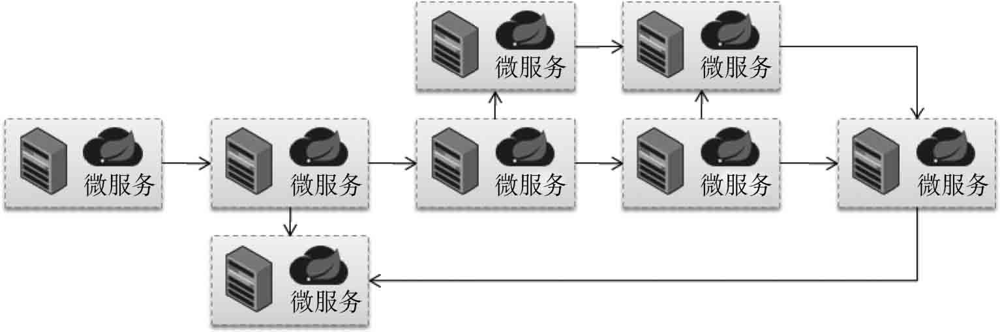
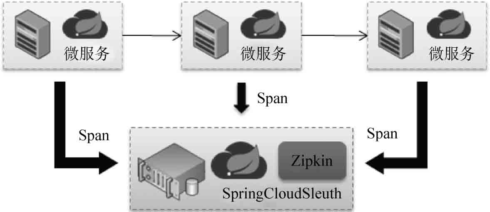
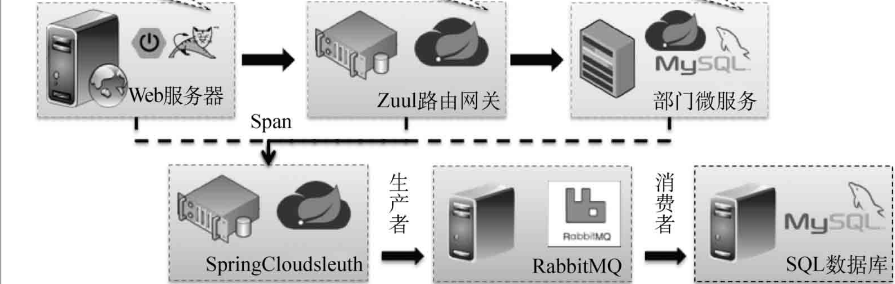

---

\
title: SpringCloudSleuth
tags:
 - SpringCloud
categories: 
 - SpringCloud
---


微服务的开发与调用是一个周期很长并且非常繁杂的处理过程，为了可以监控各个微服务之间的调用情况，在SpringCloud里面提供Sleuth跟踪技术，可以针对微服务的调用实现信息采集处理。

## 一、SpringCloudSleuth简介

微服务是一种子业务的拆分处理机制，在微服务处理架构过程中经常会出现若干个微服务互相调用的情况。


上图给出的是一种实际开发中可能存在的调用过程，有可能是几个微服务之间互相调用，也有可能为完成某一个大型的业务需要几十个微服务之间互相调用。在这样的场景中，就有可能出现如下几个问题：

- 当业务处理执行速度变慢时，有可能是某一个或某几个微服务处理性能不高。该如何去追踪这些处理速度较慢的微服务，从而实现性能的整体提升？

- 如果某一个微服务出现问题，应该如何快速找到出现问题的微服务并且加以修复？
- 如果现在微服务变为环形调用，那么这些关系该如何描述出来？

所以，一个完善的微服务并不只是简单地进行RPC的功能实现，还应该对整体的微服务执行进行监控。SpringCloud中提供的Sleuth技术就可以实现微服务的调用跟踪，它可以自动形成一个调用连接线，通过这个连接线开发者可以轻松找到所有微服务间的关系。所有微服务的调用信息都自动发送到Sleuth中，如图所示。



这样不仅可以采集到微服务调用的关系，也可以获取微服务所耗费的时间，从而进行整体微服务状态的监控以及相应的数据分析。

所有微服务发送到Sleuth采集微服务上的信息都是以Span描述的，每一个Span包含4个组成部分。

1. cs-Client Sent：客户端发出一个请求，描述的是一个Span开始。
2. sr-Server Received：服务端接收请求，sr-cs表示发送的网络延迟。
3. ss-Server Sent：服务端发送请求（回应处理），ss-sr表示服务端的消耗时间。
4. cr-Client Received：客户端接收到服务端数据，cr-ss表示回复所需要的时间。


## 二、搭建SpringCloudSleuth微服务

> 官网：[https://zipkin.io/](https://zipkin.io/)

Zipkin 服务搭建有多种方式：使用官方提供了可直接启动的 Jar 包，通过 Docker 镜像运行，或者自己手动添加依赖创建 Zipkin 服务器应用。 不过到了 spring-boot 2.0 后官方就不推荐自己通过手动添加依赖创建 Zipkin 服务器应用了。

### 1、自建Zipkin Server的方式（< spring-boot 2.0）

SpringCloudSleuth使用的核心组件是Twitter推出的Zipkin监控组件，所以这里配置的模块需要包含Zipkin相关配置依赖。

新建【springcloud-sleuth】服务。

修改pom.xml配置文件，追加如下依赖库。

~~~xml
<dependency>
    <groupId>org.springframework.cloud</groupId>
    <artifactId>spring-cloud-starter-sleuth</artifactId>
</dependency>
<dependency>
    <groupId>org.springframework.cloud</groupId>
    <artifactId>spring-cloud-starter-zipkin</artifactId>
</dependency>
<dependency>
    <groupId>io.zipkin.java</groupId>
    <artifactId>zipkin-server</artifactId>
</dependency>
<dependency>
    <groupId>io.zipkin.java</groupId>
    <artifactId>zipkin-autoconfigure-ui</artifactId>
</dependency>
~~~

修改application.yml配置文件。

~~~yaml
server:
  port: 8601          # 配置监听端口号
spring: 
  application:
    name: springcloud-zipkin-server
~~~

修改程序启动类。

~~~java
@SpringBootApplication
@EnableZipkinServer                    // 启用Zipkin服务
public class StartSleuthApplication8601 {
    public static void main(String[] args) {
        SpringApplication.run(StartSleuthApplication8601.class, args);
    }
} 
~~~


### 2、通过 Jar 包运行（> spring-boot 2.0）

下载：https://repo1.maven.org/maven2/io/zipkin/zipkin-server/

由于我是JDK11，选择 zipkin-server-2.27.0-exec.jar 下载，3.0以上需要JDK11。

在命令行输入 `java -jar zipkin-server-2.27.0-exec.jar` 启动 Zipkin Server。

也可以执行`nohup java -jar zipkin-server-2.27.0-exec.jar &`命令将 Zipkin 服务作为守护进程后台运行。

- 默认Zipkin Server的请求端口为 9411
- Zipkin Server的启动参数可以通过官方提供的yml配置文件查找
- 在浏览器输入http://127.0.0.1:9411即可进入到Zipkin Server的管理后台

### 3、客户端配置

在需要监控的微服务中引入spring-cloud-starter-zipkin依赖库。

~~~xml
<dependency>
    <groupId>org.springframework.cloud</groupId>
    <artifactId>spring-cloud-starter-zipkin</artifactId>
</dependency>
~~~

修改application.yml配置文件，配置Sleuth连接信息。

~~~yaml
spring:
  zipkin:
    base-url: http://127.0.0.1:9411/    #zipkin server的请求地址
    sender:
      type: web                         #请求方式,默认以http的方式向zipkin server发送追踪数据
  sleuth:
    sampler:
      probability: 1.0                  #采样的百分比
~~~

需采样的百分比，默认为0.1，即10%，这里配置1，是记录全部 的sleuth信息，是为了收集到更多的数据（仅供测试用）。在分布式系统中，过于频繁的采样会影响系 统性能，所以这里配置需要采用一个合适的值。

依次启动所有相关的微服务，并且通过消费端进行微服务的调用，随后就可以通过Zipkin地址检测到访问信息。


## 三、Sleuth数据采集

搭建完Sleuth后，此时需要考虑一个实际的问题：当前所有发送到Sleuth服务端的统计汇总操作都是记录在内存中的，也就是说，如果开发者关闭了Zipkin服务端，那么这些统计信息将消失。这样的设计明显是不合理的，应该将这些统计的数据记录保存下来。同时，有可能一个项目中存在许多微服务，这样就需要发送大量的数据信息进入，为了解决这种高并发的问题，可以结合消息组件（Stream）进行缓存处理。




### 1、以MySQL作为数据源

#### 数据库初始化

在 MySQL 中创建一个名为 zipkin 的数据库，编码使用 utf8。

~~~sql
DROP DATABASE IF EXISTS zipkin ;
CREATE DATABASE zipkin CHARACTER SET UTF8 ;
~~~

接着从官方的 GitHub 仓库中下载初始化 sql 语句，然后执行创建表结构（一共三张表）。下载地址如下：

[https://github.com/openzipkin/zipkin/blob/master/zipkin-storage/mysql-v1/src/main/resources/mysql.sql](https://github.com/openzipkin/zipkin/blob/master/zipkin-storage/mysql-v1/src/main/resources/mysql.sql)

~~~sql
--
-- Copyright The OpenZipkin Authors
-- SPDX-License-Identifier: Apache-2.0
--
USE zipkin ;
CREATE TABLE IF NOT EXISTS zipkin_spans (
  `trace_id_high` BIGINT NOT NULL DEFAULT 0 COMMENT 'If non zero, this means the trace uses 128 bit traceIds instead of 64 bit',
  `trace_id` BIGINT NOT NULL,
  `id` BIGINT NOT NULL,
  `name` VARCHAR(255) NOT NULL,
  `remote_service_name` VARCHAR(255),
  `parent_id` BIGINT,
  `debug` BIT(1),
  `start_ts` BIGINT COMMENT 'Span.timestamp(): epoch micros used for endTs query and to implement TTL',
  `duration` BIGINT COMMENT 'Span.duration(): micros used for minDuration and maxDuration query',
  PRIMARY KEY (`trace_id_high`, `trace_id`, `id`)
) ENGINE=InnoDB ROW_FORMAT=COMPRESSED CHARACTER SET=utf8 COLLATE utf8_general_ci;

ALTER TABLE zipkin_spans ADD INDEX(`trace_id_high`, `trace_id`) COMMENT 'for getTracesByIds';
ALTER TABLE zipkin_spans ADD INDEX(`name`) COMMENT 'for getTraces and getSpanNames';
ALTER TABLE zipkin_spans ADD INDEX(`remote_service_name`) COMMENT 'for getTraces and getRemoteServiceNames';
ALTER TABLE zipkin_spans ADD INDEX(`start_ts`) COMMENT 'for getTraces ordering and range';

CREATE TABLE IF NOT EXISTS zipkin_annotations (
  `trace_id_high` BIGINT NOT NULL DEFAULT 0 COMMENT 'If non zero, this means the trace uses 128 bit traceIds instead of 64 bit',
  `trace_id` BIGINT NOT NULL COMMENT 'coincides with zipkin_spans.trace_id',
  `span_id` BIGINT NOT NULL COMMENT 'coincides with zipkin_spans.id',
  `a_key` VARCHAR(255) NOT NULL COMMENT 'BinaryAnnotation.key or Annotation.value if type == -1',
  `a_value` BLOB COMMENT 'BinaryAnnotation.value(), which must be smaller than 64KB',
  `a_type` INT NOT NULL COMMENT 'BinaryAnnotation.type() or -1 if Annotation',
  `a_timestamp` BIGINT COMMENT 'Used to implement TTL; Annotation.timestamp or zipkin_spans.timestamp',
  `endpoint_ipv4` INT COMMENT 'Null when Binary/Annotation.endpoint is null',
  `endpoint_ipv6` BINARY(16) COMMENT 'Null when Binary/Annotation.endpoint is null, or no IPv6 address',
  `endpoint_port` SMALLINT COMMENT 'Null when Binary/Annotation.endpoint is null',
  `endpoint_service_name` VARCHAR(255) COMMENT 'Null when Binary/Annotation.endpoint is null'
) ENGINE=InnoDB ROW_FORMAT=COMPRESSED CHARACTER SET=utf8 COLLATE utf8_general_ci;

ALTER TABLE zipkin_annotations ADD UNIQUE KEY(`trace_id_high`, `trace_id`, `span_id`, `a_key`, `a_timestamp`) COMMENT 'Ignore insert on duplicate';
ALTER TABLE zipkin_annotations ADD INDEX(`trace_id_high`, `trace_id`, `span_id`) COMMENT 'for joining with zipkin_spans';
ALTER TABLE zipkin_annotations ADD INDEX(`trace_id_high`, `trace_id`) COMMENT 'for getTraces/ByIds';
ALTER TABLE zipkin_annotations ADD INDEX(`endpoint_service_name`) COMMENT 'for getTraces and getServiceNames';
ALTER TABLE zipkin_annotations ADD INDEX(`a_type`) COMMENT 'for getTraces and autocomplete values';
ALTER TABLE zipkin_annotations ADD INDEX(`a_key`) COMMENT 'for getTraces and autocomplete values';
ALTER TABLE zipkin_annotations ADD INDEX(`trace_id`, `span_id`, `a_key`) COMMENT 'for dependencies job';

CREATE TABLE IF NOT EXISTS zipkin_dependencies (
  `day` DATE NOT NULL,
  `parent` VARCHAR(255) NOT NULL,
  `child` VARCHAR(255) NOT NULL,
  `call_count` BIGINT,
  `error_count` BIGINT,
  PRIMARY KEY (`day`, `parent`, `child`)
) ENGINE=InnoDB ROW_FORMAT=COMPRESSED CHARACTER SET=utf8 COLLATE utf8_general_ci;
~~~


#### 启动 Zipkin 服务—自建方式

【sleuth服务】修改pom.xml配置文件，追加相关依赖库。

~~~xml
<dependency>
    <groupId>org.springframework.cloud</groupId>
    <artifactId>spring-cloud-sleuth-zipkin-stream</artifactId>
</dependency>
<dependency>
    <groupId>org.springframework.cloud</groupId>
    <artifactId>spring-cloud-starter-stream-rabbit</artifactId>
</dependency>
<dependency>
    <groupId>org.springframework.boot</groupId>
    <artifactId>spring-boot-starter-jdbc</artifactId>
</dependency>
<dependency>
    <groupId>mysql</groupId>
    <artifactId>mysql-connector-java</artifactId>
</dependency>
~~~

需要注意的是，此时需要删除spring-cloud-starter-zipkin依赖库。

【sleuth服务】修改application.yml配置文件，追加MySQL连接与RabbitMQ消息组件配置。

~~~yaml
server:
  port: 8601          # 配置监听端口号
spring:
  rabbitmq:
    host: rabbitmq-single   # 消息主机
    port: 5672      # 连接端口
    username: xxl   # 用户名
    password: 123456  # 密码
    virtual-host: /   # 虚拟主机
  datasource:
    type: com.alibaba.druid.pool.DruidDataSource    # 配置当前要使用的数据源的操作类型
    driver-class-name: com.mysql.cj.jdbc.Driver     # 配置MySQL的驱动程序类
    url: jdbc:mysql://localhost:3306/xxl_springboot_action?serverTimezone=UTC&useSSL=false           # 数据库连接地址
    username: root                                  # 数据库用户名
    password: xxl666                                # 数据库连接密码
  application:
    name: springcloud-zipkin-server
zipkin: 
  storage:  # 设置zipkin收集的信息通过mysql进行存储
    type: mysql # 数据库存储

~~~

【客户端】修改pom.xml配置文件，追加依赖配置。

~~~xml
<dependency>
    <groupId>org.springframework.cloud</groupId>
    <artifactId>spring-cloud-sleuth-zipkin-stream</artifactId>
</dependency>
<dependency>
    <groupId>org.springframework.cloud</groupId>
    <artifactId>spring-cloud-starter-stream-rabbit</artifactId>
</dependency>
~~~

【客户端】修改application.yml配置文件，由于此时是通过消息组件进行采集信息的发送，所以删除zipkin.base-url配置，追加RabbitMQ相关配置，这几个微服务将作为消息生产者存在。

~~~yaml
spring:
  rabbitmq:
    host: rabbitmq-single       # 消息主机
    port: 5672                  # 连接端口
    username: xxl               # 用户名
    password: 123456            # 密码
    virtual-host: /             # 虚拟主机
~~~

【sleuth服务】修改程序，启动注解。

~~~java
@SpringBootApplication
@EnableZipkinStreamServer					// 启用Zipkin服务
public class StartSleuthApplication8601 {
	public static void main(String[] args) {
		SpringApplication.run(StartSleuthApplication8601.class, args);
	}
} 
~~~

此时启动各个微服务，这样所有被监听的微服务都将成为消息的生产者，然后Sleuth将作为消息消费者，将收到的消息保存到数据库中存储。


#### 启动 Zipkin 服务—Jar方式

（1）Zipkin 启动时只需要指定好 MySql 连接信息即可。如果是通过 jar 包运行，则执行如下命令：

~~~sh
java -jar zipkin-server-2.27.0-exec.jar --STORAGE_TYPE=mysql --MYSQL_HOST=192.168.1.1 --MYSQL_TCP_PORT=3306 --MYSQL_USER=xxl --MYSQL_PASS=123456 --MYSQL_DB=zipkin
~~~

（2）如果通过 Docker 镜像运行，则执行如下命令：

~~~sh
docker run --name zipkin -d -p 9411:9411 -e STORAGE_TYPE=mysql -e MYSQL_HOST=192.168.1.1 -e MYSQL_TCP_PORT=3306 -e MYSQL_USER=xxl -e MYSQL_PASS=123456 -e MYSQL_DB=zipkin openzipkin/zipkin`
~~~

（3）如果每次都要使用 docker 命令来分别启动 zipkin 容器还是略显繁琐，我们也可以通过 Docker Compose 进行启动，docker-compose.yml 文件内容如下：

```yaml
version: '2'

services:
  zipkin:
    image: openzipkin/zipkin
    container_name: zipkin
    environment:
      - STORAGE_TYPE=mysql
      - MYSQL_HOST=192.168.1.1
      - MYSQL_TCP_PORT=3306
      - MYSQL_USER=xxl
      - MYSQL_PASS=123456
      - MYSQL_DB=zipkin
      #- RABBIT_ADDRESSES=192.168.1.1:5672
      #- RABBIT_USER=hangge
      #- RABBIT_PASSWORD=123
    ports:
      - 9411:9411
```


### 2、以Elasticsearch作为数据源

#### 启动 Zipkin 服务

（1）Zipkin 启动时只需要指定好 Elasticsearch 连接信息即可。如果是通过 jar 包运行，则执行如下命令：

~~~sh
java -jar zipkin-server-2.27.0-exec.jar --STORAGE_TYPE=elasticsearch --ES_HOSTS=192.168.1.1:9200
~~~

（2）如果通过 Docker 镜像运行，则执行如下命令：

~~~sh
docker run --name zipkin -d -p 9411:9411 -e STORAGE_TYPE=elasticsearch -e ES_HOSTS=192.168.1.1:9200 openzipkin/zipkin
~~~

（3）如果每次都要使用 docker 命令来分别启动 zipkin 容器还是略显繁琐，我们也可以通过 Docker Compose 进行启动，docker-compose.yml 文件内容如下：

```yaml
version: '2'

services:
  zipkin:
    image: openzipkin/zipkin
    container_name: zipkin
    environment:
      - STORAGE_TYPE=elasticsearch
      - ES_HOSTS=192.168.1.1:9200
      #- RABBIT_ADDRESSES=192.168.1.1:5672
      #- RABBIT_USER=hangge
      #- RABBIT_PASSWORD=123
    ports:
      - 9411:9411
```


## 四、API 接口介绍与使用

### 1、文档

Zipkin Server 提供的 API 接口都是以 /api/v2 路径作为前缀，详细的接口请求参数和请求返回格式可以访问 Zipkin 官网的 API 页面来查看：[https://zipkin.io/zipkin-api/](https://zipkin.io/zipkin-api/)

### 2、常用接口说明

常用接口说明如下：

| 接口路径      | 请求方式 | 接口描述                                    |
| ------------- | -------- | ------------------------------------------- |
| /dependencies | GET      | 用来获取通过收集到的 Span 分析出的依赖关系  |
| /services     | GET      | 用来获取服务列表                            |
| /spans        | GET      | 根据服务名来获取所有的 Span 名              |
| /spans        | POST     | 向 Zipkin Server 上传 Span                  |
| /dependencies | GET      | 根据 Trace ID 获取指定跟踪信息的 Span 列表  |
| /dependencies | GET      | 根据指定条件查询并返回符合条件的 trace 清单 |

## 五、参考资料

[https://juejin.cn/post/6997243493458378765](https://juejin.cn/post/6997243493458378765)

[https://blog.csdn.net/kenkao/article/details/127844321](https://blog.csdn.net/kenkao/article/details/127844321)

[https://zhuanlan.zhihu.com/p/457555795](https://zhuanlan.zhihu.com/p/457555795)