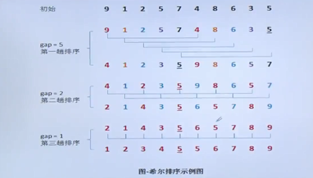

## 简单排序算法

### 直接插入排序

基本思想：在一个已排好序的记录子集的基础上，每一步将下一个待排序的记录有序插入到已排好序的记录子集中，直到将所有待排记录全部插入为止。

具体过程为：将第个记录的关键字Ki顺次与其前面记录的关键字Ki-1,ki-2,...ki进行比较，将所有关键字大于K的记录依次向后移动一个位置，直到遇见一个关键字小于或者等于Ki的记录Kj，此时K后面必为空位置，将第i个记录插入空放置即可。



```c
#include <stdio.h>

void insertion_sort(int arr[], int n) {
    // 遍历数组，从第二个元素开始
    for (int i = 1; i < n; ++i) {
        // 将数组中的元素赋值给key
        int key = arr[i];
        // 将key的前一个元素赋值给j
        int j = i - 1;
        // 当j大于等于0且arr[j]大于key时，从j的前一个元素开始，将arr[j]放到arr[j+1]中
        while (j >= 0 && arr[j] > key) {
            arr[j + 1] = arr[j];
            j = j - 1;
        }
        // 将key放到arr[j+1]中
        arr[j + 1] = key;
    }
}

int main() {
    //定义一个数组，数组长度为8
    int arr[] = {64, 34, 25, 12, 22, 11, 90};
    //获取数组的长度
    int n = sizeof(arr) / sizeof(arr[0]);
    //调用insertion_sort函数，对数组进行插入排序
    insertion_sort(arr, n);
    //打印排序后的数组
    printf("Sorted array is: \n");
    for (int i = 0; i < n; ++i) {
        printf("%d ", arr[i]);
    }
    printf("\n");
    return 0;
}
```

该算法的要点是：

1. 使用监视哨key（即arr[0]）临时保存待插入的记录。
2. 从后往前查找应插入的位置。
3. 查找与移动用同一循环完成。

直接插入排序算法分析：

1. 从空间角度来看，它只需要一个辅助空间key（即arr[0]）。
2. 从时间耗费角度来看，主要时间耗费在关键字比较和移动元素上。

直接插入排序方法是稳定的排序方法。

### 简单选择排序

```c
void simple_selection_sort(int arr[], int n) {
    // 循环遍历数组
    for (int i = 0; i < n - 1; i++) {
        // 记录最小值的索引
        int min_idx = i;
        // 遍历下一个元素
        for (int j = i + 1; j < n; j++) {
            // 如果当前元素小于最小值，则更新最小值索引
            if (arr[j] < arr[min_idx]) {
                min_idx = j;
            }
        }
        // 如果最小值索引不等于当前元素索引，则交换两个元素
        if (min_idx!= i) {
            int temp = arr[i];
            arr[i] = arr[min_idx];
            arr[min_idx] = temp;
        }
    }
}
```

### 起泡排序

```c
void bubble_sort(int arr[], int n) {
    // 定义一个变量i，用于循环
    int i, j, temp;
    // 循环n-1次
    for (i = 0; i < n - 1; i++) {
        // 循环n-i-1次
        for (j = 0; j < n - i - 1; j++) {
            // 如果arr[j]大于arr[j+1]，则交换
            if (arr[j] > arr[j + 1]) {
                temp = arr[j];
                arr[j] = arr[j + 1];
                arr[j + 1] = temp;
            }
        }
    }
}
```


## 复杂排序算法


### 希尔排序

先取一个小于n的整数d1作为第一个增量，把文件的全部记录分组。所有距离为d1的倍数的记录放在同一个组

中。即R[1],R[1+d1],R[1+2d1],..为第一组，R[2],R[2+d1],R[2+2d1]....为第二组，先在各组内进行直接插入排序;

然后，取第二个增量d2<d1重复上述的分组和排序，直至所取的增量dt=1(dt<dt-1<...<d2<d1)，即所有记录放

在同一组中进行直接插入排序为止。

用增量来划分子序列的方法，达到减少关键字移动次数的目的。


```c
void ShellPass(SeqList R, int d)
{//希尔排序中的一趟排序，d为当前增量
    int i, j;
    for (i = d + 1; i <= n; i++) {//将R[d+1．．n]分别插入各组当前的有序区
        if (R[i].key < R[i - d].key) {
            R[0] = R[i];//R[0]只是暂存单元
            j = i - d;
            while (j > 0 && R[0].key < R[j].key) {//查找R的插入位置
                R[j + d] = R[j];//后移记录
                j = j - d;//查找前一记录
            }
            R[j + d] = R[0];//插入R到正确的位置上
        }
    }
}
```


### 堆排序

堆排序是在排序过程中，将数据R[1..n]看成一棵完全二叉树，利用完全二叉树中双亲结点和孩子结点之间的内在关系来选择关键字最小的记录。

 具体做法：

​    把待排序的记录的关键字存放在数组r[1..n]之中将r 看成是一棵完全二叉树的顺序表示，每个结点表示一个记录，第一个记录r[1]作为二叉树的根。以下各记录r[2...n]依次逐层从左到右顺序排列，任意结点r间的左孩子是r[2i]，右孩子是r[2i+1]，双亲是r[Li/2]]。对这棵完全二叉树进行调整，使各结点的关键字值满足下列条件：

​    r[i].keyar[2i].key并且r[i].keyzr[2i+1].key(i=1,2, ... Ln/2]) .

​    满足这个条件的完全二叉树为大根堆。


反之，如果这棵完全二叉树中任意结点的关键字小于或者等于其左孩子和右孩子的关键字（当有左孩子或右孩子时），对应的堆为小根堆。