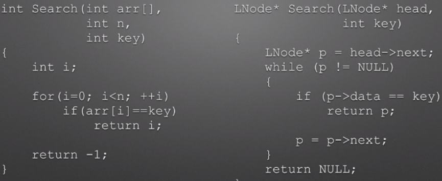

ASL (Aerage Search Length）




### 顺序查找

顶序查找法的特点是：用所给关键字与线性表中各元素的关键字逐个比较，直到成功或失败。

顺序表、链表


### 折半查找（二分查找法）

条件：要求待查找的列表必须是按关健字大小**有序排列的顺序表**。

将n个元素分成个数大致相同的两半，取R[n/2]与k作比较。

(1)如果k=R[n/2]，则找到k;

(2)如果k<R[n/2]，则只在数组R的左半部继续搜索k;

如果k>R[n/2]，则只在数组R的右半部继续搜索k。


```c
int BSearch(int arr[], int low, int high, int key) {
    // low和high分别表示数组的起始位置和结束位置
    while (low <= high) {
        // 当low和high相等时，表示数组中没有找到key
        int wid = (low + high) / 2;
        // 将数组中的索引wid设置为搜索结果
        if (arr[wid] == key)
            return wid;
        // 如果wid大于key，表示搜索结果在数组中的右边
        else if (arr[wid] > key)
            // 将wid减去1，表示搜索结果在数组中的左边
            high = wid - 1;
        // 如果wid小于key，表示搜索结果在数组中的左边
        else
            // 将wid加上1，表示搜索结果在数组中的右边
            low = wid + 1;
    }
    // 如果low和high相等，表示没有找到key
    return -1;
}
```


```c
int Bsearch(int R[], int Rl, int left, int right, int k) {
    if (left > right)
        return -1; // 未找到k
    int mid = (left + right) / 2;
    if (R[mid] == k)
        return mid; // 我到k
    else if (R[mid] > k)
        return Bsearch(R, Rl, left, mid - 1, k); // 搜左半部
    else if (R[mid] < k)
        return Bsearch(R, Rl, mid + 1, right, k); // 搜右半部
}
```


### 分块查找

分块查找法要求将列表组织成以下索引顺序结构：

- 首先将列表分成若干个块 (子表)。一般情况下块的长度均勾，最后一块可以不满。每块中元素任意排列，即块内无序，但块与块之间有序。
- 构造一个索引表。其中每个索引项对应一个块并记录每块的起始位置，和每块中的最大关键字(或最小关键字)。索引表按关键字有序排列。


### 二叉排序树

#### 查找

二叉排序树(二叉查找树)，它是一种特殊结构的二叉树，其定义为：二叉树排序树或者是一棵空树，或者是具有如下性质的二叉树：

(1)若它的左子树非空，则左子树上所有结点的值均小于根结点的值；

(2)若它的右子树非空，则右子树上所有结点的值均大干根结点的值；

(3)它的左右子树也分别为二叉排序树。

由此定义可以得出二叉排序树的一个重要性质：中序遍历一个二叉排序树时可以得到一个递增有序序列。

```c
// 定义BTNode类型
typedef struct BTNode {
    int key;
    struct BTNode *left;
    struct BTNode *right;
} BTNode;

//查找二叉搜索树中是否存在指定的key
BTNode *BSTSearch(BTNode *p, int key) {
    //当p不为空时
    while (p!= NULL) {
        //如果key等于p的key，则返回p
        if (key == p->key) {
            return p;
        //如果key小于p的key，则p的左子树查找
        } else if (key < p->key) {
            p = p->left;
        //如果key大于p的key，则p的右子树查找
        } else {
            p = p->right;
        }
    }
    //如果查找不到，则返回NULL
    return NULL;
}
```


```c
// 定义BTNode类型
struct BTNode {
    int key;
    struct BTNode *lChild;
    struct BTNode *rChild;
};

// 查找给定关键字的节点
struct BTNode *BSTSearch(struct BTNode *p, int key) {
    // 如果没有找到，则返回空
    if (p == NULL) {
        return NULL;
    } else {
        // 如果找到，则返回查找到的节点
        if (p->key == key) {
            return p;
        } else if (key < p->key) {
            // 如果查找到的关键字小于当前节点的关键字，则查找当前节点的左子树
            return BSTSearch(p->lChild, key);
        } else {
            // 如果查找到的关键字大于当前节点的关键字，则查找当前节点的右子树
            return BSTSearch(p->rChild, key);
        }
    }
}
```

#### 插入

已知一个关键字值为Key的结点s，插入的方法：

1. 若二叉排序树是空树，则Key成为二叉排树的根；
2. 若二叉树排序树非空，则将key与二叉树排序树的根进行比较，如果Key的值等于根结点的值，则停止插入，如果Key的值小于根结点的值，则将Key插入左子树，如果Key的值大于根结点的值，则将key插入右子树。

```c
#include <stdio.h>
#include <stdlib.h>

// 定义一个BTNode类型的结构体
typedef struct BTNode {
    int key;
    struct BTNode *lChild;
    struct BTNode *rChild;
} BTNode;

// 定义一个BSTInsert函数，用于插入一个关键字key的节点
int BSTInsert(BTNode *sp, int key) {
    // 如果sp为空，则分配一个新的节点
    if (sp == NULL) {
        sp = (BTNode *) malloc(sizeof(BTNode));
        sp->lChild = sp->rChild = NULL;
        sp->key = key;
        return 1;
    }
    // 如果key和sp的key相等，则返回0
    if (key == sp->key) {
        return 0;
    } else if (key < sp->key) {
        // 如果key小于sp的key，则递归在sp的左子树中插入key
        return BSTInsert(sp->lChild, key);
    } else {
        // 如果key大于sp的key，则递归在sp的右子树中插入key
        return BSTInsert(sp->rChild, key);
    }
}

int main() {
    BTNode *root = NULL;
    BSTInsert(root, 5);
    BSTInsert(root, 3);
    BSTInsert(root, 7);
    BSTInsert(root, 1);
    BSTInsert(root, 4);
    BSTInsert(root, 6);
    BSTInsert(root, 8);

    return 0;
}
```


二叉排序树的生成方法：

假若给定一个元素序列，可以插入算法创建一棵二叉排序树。

将二叉排序树初始化为一棵空树，然后逐个读入元素，每读入一个元素，就建立一个新的结点插入到当前已

生成的二叉排序树中，即调用上述二叉排序树的插入算法将新结点插入。

```c
typedef struct Node {
    int key;
    struct Node *left;
    struct Node *right;
} BSTree;

BSTree CreateBST(BSTree *bst) {
    BSTree *hst = NULL;
    int key;
    scanf("%d", &key);
    while (key != 1000) {
        bst = InsertBST(bst, key);
        scanf("%d", &key);
    }
    return hst;
}
```