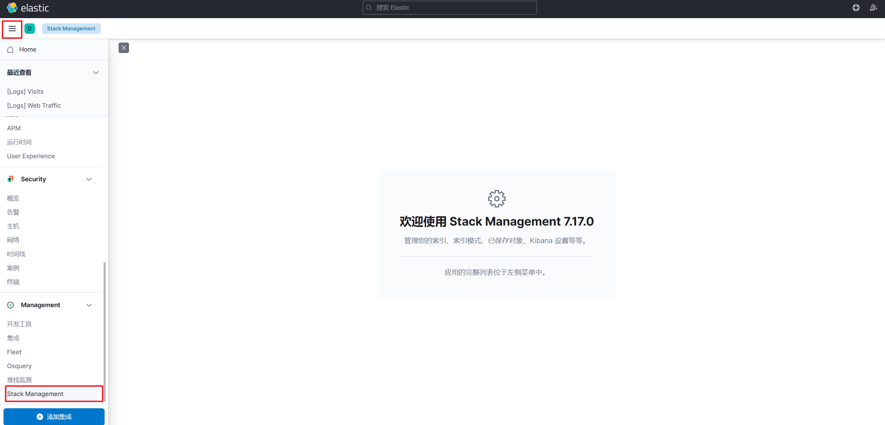
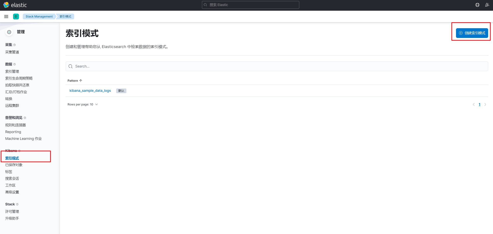
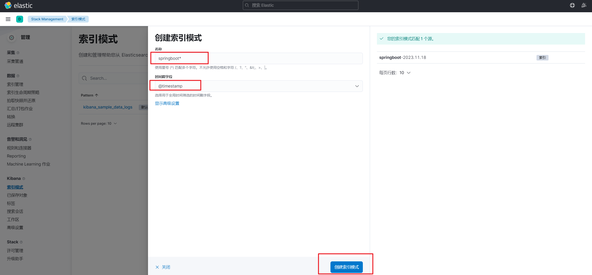
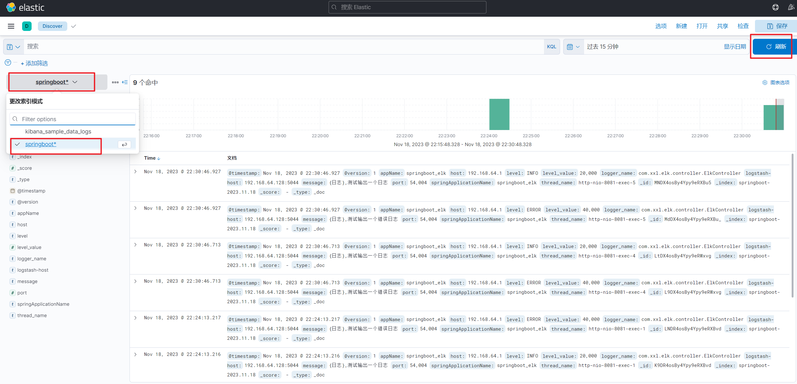
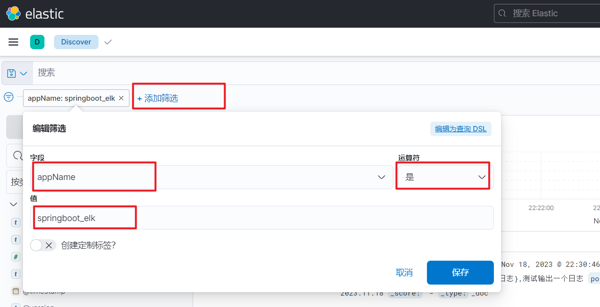

## 项目中集成Logstash

### 增加依赖

`pom.xml`增加`logback` 整合 `logstash` 的依赖

~~~xml
<dependency>
    <groupId>net.logstash.logback</groupId>
    <artifactId>logstash-logback-encoder</artifactId>
    <version>7.3</version>
</dependency>
~~~

### 增加配置

 `application.yaml` 文件中添加`logstash`配置

~~~yml
server:
  port: 8081

spring:
  application:
    name: springboot_elk

log:
  # logstash 地址和端口，注意修改
  logstashhost: 192.168.64.128:5044
~~~

### 增加日志组件

`logback-spring.xm`l增加`logback`组件

配置方式一

~~~xml
<?xml version="1.0" encoding="UTF-8"?>
<configuration debug="false">
    <!--提取配置文件中的服务名-->
    <springProperty scope="context" name="springApplicationName" source="spring.application.name"/>
    <!-- 读取SpringBoot配置文件获取logstash的地址和端口 -->
    <springProperty scope="context" name="logstash-host" source="log.logstash-host"/>
    <property name="LOG_HOME" value="logs/demo.log"/>
    <appender name="STDOUT" class="ch.qos.logback.core.ConsoleAppender">
        <encoder class="ch.qos.logback.classic.encoder.PatternLayoutEncoder">
            <pattern>%d{yyyy-MM-dd HH:mm:ss.SSS} [%thread] %-5level %logger{50} - %msg%n</pattern>
        </encoder>
    </appender>

    <appender name="logstash" class="net.logstash.logback.appender.LogstashTcpSocketAppender">
        <destination>${logstash-host}</destination>
        <encoder class="net.logstash.logback.encoder.LogstashEncoder">
            <!--定义appName的名字是服务名,多服务时,根据这个进行区分日志-->
            <customFields>{"appName": "${springApplicationName}"}</customFields>
        </encoder>
    </appender>

    <root level="INFO">
        <appender-ref ref="STDOUT"/>
        <appender-ref ref="logstash"/>
    </root>
</configuration>
~~~

配置方式二

~~~xml
<?xml version="1.0" encoding="UTF-8"?>
<configuration debug="false">
   <springProperty scope="context" name="springApplicationName" source="spring.application.name" />
   <property name="LOG_HOME" value="logs/demo.log" />
   <appender name="STDOUT" class="ch.qos.logback.core.ConsoleAppender">
       <encoder class="ch.qos.logback.classic.encoder.PatternLayoutEncoder">
           <pattern>%d{yyyy-MM-dd HH:mm:ss.SSS} [%thread] %-5level %logger{50} - %msg%n</pattern>
       </encoder>
   </appender>

   <!--DEBUG日志输出到LogStash-->
   <appender name="LOG_STASH_DEBUG" class="net.logstash.logback.appender.LogstashTcpSocketAppender">
       <filter class="ch.qos.logback.classic.filter.ThresholdFilter">
           <level>DEBUG</level>
       </filter>
       <destination>124.223.119.48:4560</destination>
       <encoder charset="UTF-8" class="net.logstash.logback.encoder.LoggingEventCompositeJsonEncoder">
           <providers>
               <timestamp>
                   <timeZone>Asia/Shanghai</timeZone>
               </timestamp>
               <!--自定义日志输出格式-->
               <pattern>
                   <pattern>
                       {
                       "project": "elk",
                       "level": "%level",
                       "service": "${springApplicationName:-}",
                       "pid": "${PID:-}",
                       "thread": "%thread",
                       "class": "%logger",
                       "message": "%message",
                       "stack_trace": "%exception"
                       }
                   </pattern>
               </pattern>
           </providers>
       </encoder>
   </appender>

   <root >
       <appender-ref ref="STDOUT" />
       <appender-ref ref="LOG_STASH_DEBUG" />
   </root>
</configuration>
~~~

### 业务增加日志

业务代码增加日志输出进行测试

~~~java
@Slf4j
@RequestMapping("/api")
@RestController
public class ElkController {

    /**
     * 测试输出log的访问方法
     */
    @GetMapping("/testLog")
    public String testLog() {
        log.info("{日志},{}", "测试输出一个日志");
        log.error("{日志},{}", "测试输出一个错误日志");
        return "success";
    }

}
~~~

## Kibana看板配置

日志收集文件配置参考上一篇es安装文章

Kibana索引配置

进入索引列表

创建索引

进入Discover中，切换索引就可以看到输出的日志

日志添加筛选条件

## 参考资料

[1]. https://blog.csdn.net/m0_51510236/article/details/130413227

[2]. https://www.zhihu.com/tardis/zm/art/347378314

[3]. https://blog.csdn.net/captain_zkk/article/details/124799087

[4]. [自建elk+filebeat+grafana日志收集平台_51CTO博客_elk filebeat](https://blog.51cto.com/u_12970189/2391070)

[5]. [Elasticsearch：如何在 Elastic Agents 中配置 Beats 来采集定制日志_elastic_agen_Elastic](https://blog.csdn.net/UbuntuTouch/article/details/128213642)

[6]. https://www.bilibili.com/video/BV1sP4y1U7eh