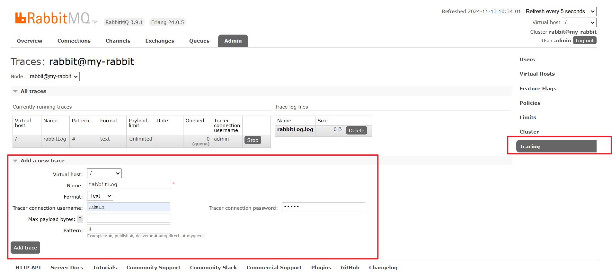

Trace 是Rabbitmq用于记录每一次发送的消息，方便使用Rabbitmq的开发者调试、排错。

## 1、启动Tracing插件

~~~sh
## 进入rabbitMq中
docker exec -it rabbitmq1 bash
## 启动日志插件
rabbitmq-plugins enable rabbitmq_tracing
## 开启rabbitmq的tracing插件
rabbitmqctl trace_on
~~~

开启了插件后，无需重启，rabbitMq管理界面就会出现Tracing项，可新建追踪。

## 2、新建trace

新建trace时，JSON模式的数据会被Base64加密，不好观察，所以选择Text模式，同时可在Pattern中配置过滤条件

## 其他命令

~~~sh
# 查看打开的插件 
rabbitmq-plugins list
# 关闭trace功能
rabbitmqctl trace_off
# 停止tracing
rabbitmq-plugins disable rabbitmq_tracing
~~~

## trace消息跟踪显示乱码（谷歌如何修改字符编码）

从github上下载最新的crx：https://[github](https://so.csdn.net/so/search?q=github&spm=1001.2101.3001.7020).com/jinliming2/Chrome-Charset/releases

选择谷歌设置–扩展程序，将crx拖入谷歌浏览器，确认即可。

选择插件修改编码格式为utf-8,问题解决。

## 参考资料

https://blog.51cto.com/u_15002821/8984730

https://blog.csdn.net/theconqueror/article/details/109177781

https://blog.csdn.net/m0_59281987/article/details/131876259