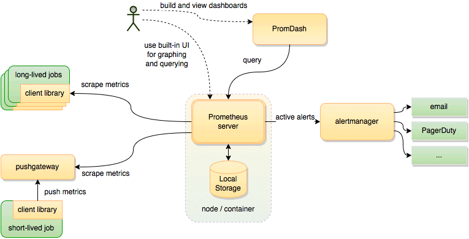
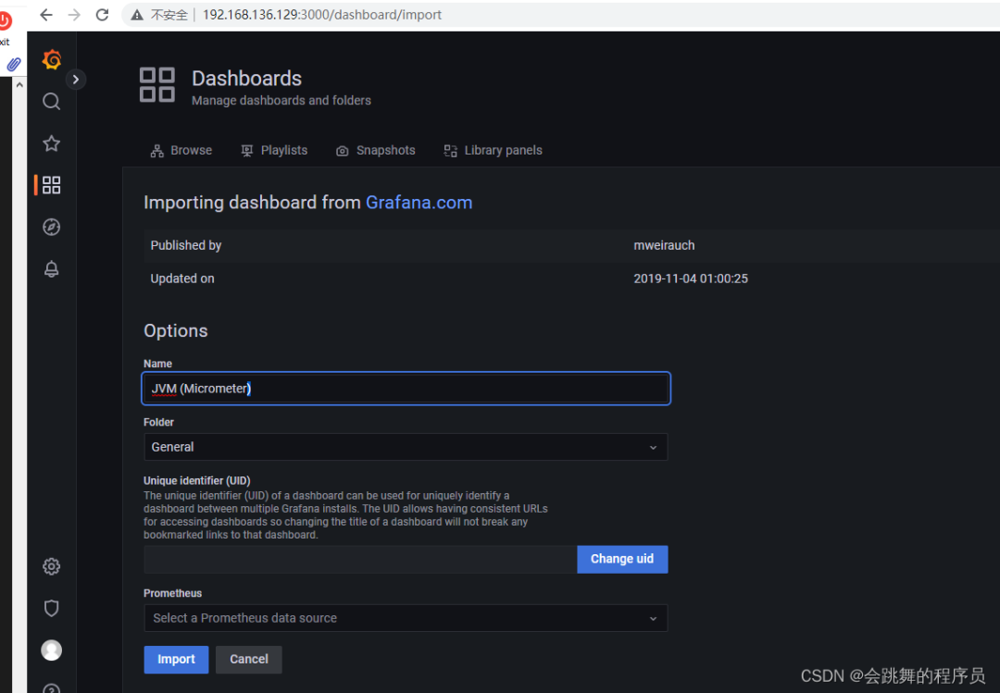
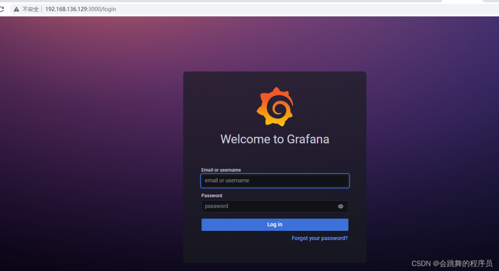

# Prometheus

## 概述

Prometheus 是一个开源的服务监控系统和时间序列数据库。

> 官网：[Prometheus - Monitoring system & time series database](https://prometheus.io/)
>
> 源码：https://github.com/prometheus/prometheus




特性：

- 高维度数据模型
- 自定义查询语言
- 可视化数据展示
- 高效的存储策略
- 易于运维
- 提供各种客户端开发库
- 警告和报警
- 数据导出

## SpringBoot集成使用

### 1.Spring Boot 工程集成 Micrometer

##### 1.1引入依赖

```xml
<dependency>
  <groupId>org.springframework.boot</groupId>
  <artifactId>spring-boot-starter-actuator</artifactId>
</dependency>
<dependency>
  <groupId>io.micrometer</groupId>
  <artifactId>micrometer-registry-prometheus</artifactId>
</dependency>
```

##### 1.2配置

```properties
management.server.port=9003
management.endpoints.web.exposure.include=*
management.endpoint.metrics.enabled=true
management.endpoint.health.show-details=always
management.endpoint.health.probes.enabled=true
management.endpoint.prometheus.enabled=true
management.metrics.export.prometheus.enabled=true
management.metrics.tags.application=voice-qc-backend
```

这里 `management.endpoints.web.exposure.include=*` 配置为开启 Actuator 服务，因为Spring Boot Actuator 会自动配置一个 URL 为 `/actuator/Prometheus` 的 HTTP 服务来供 Prometheus 抓取数据，不过默认该服务是关闭的，该配置将打开所有的 Actuator 服务。

`management.metrics.tags.application` 配置会将该工程应用名称添加到计量器注册表的 tag 中去，方便后边 Prometheus 根据应用名称来区分不同的服务。

##### 1.3监控jvm信息

然后在工程启动主类中添加 Bean 如下来监控 JVM 性能指标信息：

```java
@SpringBootApplication
public class GatewayDatumApplication {

    public static void main(String[] args) {
        SpringApplication.run(GatewayDatumApplication.class, args);
    }

    @Bean
    MeterRegistryCustomizer<MeterRegistry> configurer(
            @Value("${spring.application.name}") String applicationName) {
        return (registry) -> registry.config().commonTags("application", applicationName);
    }

}
```

##### 1.4创建自定义监控

监控请求次数与响应时间

```
package com.lianxin.gobot.api.monitor;

import io.micrometer.core.instrument.Counter;
import io.micrometer.core.instrument.MeterRegistry;
import io.micrometer.core.instrument.Timer;
import lombok.Getter;
import org.springframework.beans.factory.annotation.Autowired;
import org.springframework.beans.factory.annotation.Value;
import org.springframework.stereotype.Component;

import javax.annotation.PostConstruct;

/**
 * @Author: GZ
 * @CreateTime: 2022-08-30  10:50
 * @Description: 自定义监控服务
 * @Version: 1.0
 */
@Component
public class PrometheusCustomMonitor {
    /**
     * 上报拨打请求次数
     */
    @Getter
    private Counter reportDialRequestCount;
    /**
     * 上报拨打URL
     */
    @Value("${lx.call-result-report.url}")
    private String callReportUrl;

    /**
     * 上报拨打响应时间
     */
    @Getter
    private Timer reportDialResponseTime;
    @Getter
    private final MeterRegistry registry;


    @Autowired
    public PrometheusCustomMonitor(MeterRegistry registry) {
        this.registry = registry;
    }

    @PostConstruct
    private void init() {
        reportDialRequestCount = registry.counter("go_api_report_dial_request_count", "url",callReportUrl);
        reportDialResponseTime=  registry.timer("go_api_report_dial_response_time", "url",callReportUrl);
    }
}
```

##### 1.5添加具体业务代码监控

```
//统计请求次数
prometheusCustomMonitor.getReportDialRequestCount().increment();
long startTime = System.currentTimeMillis();
String company = HttpUtils.post(companyUrl,"");
//统计响应时间
long endTime = System.currentTimeMillis();
prometheusCustomMonitor.getReportDialResponseTime().record(endTime-startTime, TimeUnit.MILLISECONDS);
```

在浏览器访问 `http://127.0.0.1:9001/actuator/prometheus` ，就可以看到服务的一系列不同类型 metrics 信息，例如`jvm_memory_used_bytes gauge`、`jvm_gc_memory_promoted_bytes_total counter` ，`go_api_report_dial_request_count`等


到此，Spring Boot 工程集成 Micrometer 就已经完成，接下里就要与 Prometheus 进行集成了。


### 2.集成 Prometheus

##### 2.1安装

```
docker pull prom/prometheus
mdkir /usr/local/prometheus
vi prometheus.yml
# my global config
global:
  scrape_interval: 15s # Set the scrape interval to every 15 seconds. Default is every 1 minute.
  evaluation_interval: 15s # Evaluate rules every 15 seconds. The default is every 1 minute.
  # scrape_timeout is set to the global default (10s).

# Alertmanager configuration
alerting:
  alertmanagers:
  - static_configs:
    - targets:
      # - alertmanager:9093

# Load rules once and periodically evaluate them according to the global 'evaluation_interval'.
rule_files:
  # - "first_rules.yml"
  # - "second_rules.yml"

# A scrape configuration containing exactly one endpoint to scrape:
# Here it's Prometheus itself.
scrape_configs:
  # The job name is added as a label `job=<job_name>` to any timeseries scraped from this config.
  - job_name: 'prometheus'

    # metrics_path defaults to '/metrics'
    # scheme defaults to 'http'.

    static_configs:
    - targets: ['192.168.136.129:9090']
docker run -d --name prometheus -p 9090:9090 -v/usr/local/prometheus/prometheus.yml:/etc/prometheus/prometheus.yml prom/prometheus
```



##### 2.2集成配置

```
global:
  scrape_interval: 15s

scrape_configs:
  - job_name: "prometheus"
    static_configs:
    - targets: ["localhost:9090"]
  - job_name: "metricsLocalTest"
    metrics_path: "/actuator/prometheus"
    static_configs:
    - targets: ["localhost:9003"]
```

这里 `localhost:9001` 就是上边本地启动的服务地址，也就是 Prometheus 要监控的服务地址。同时可以添加一些与应用相关的标签，方便后期执行 PromSQL 查询语句区分。最后重启 Prometheus 服务


### 3.使用 Grafana Dashboard 展示监控项

##### 3.1安装grafana

```
docker pull grafana/grafana
docker run -d --name grafana -p 3000:3000 -v /usr/local/grafana:/var/lib/grafana grafana/grafana
```

默认用户名/密码 admin/admin



##### 3.2配置prometheus数据源


##### 3.3增加jvm面板

模板编号为4701


##### 3.4配置业务接口监控面板


## 参考资料

[1]. [springboot+Prometheus+grafana 实现自定义监控（请求数、响应时间、JVM性能）](https://blog.csdn.net/GZ946/article/details/126619218)