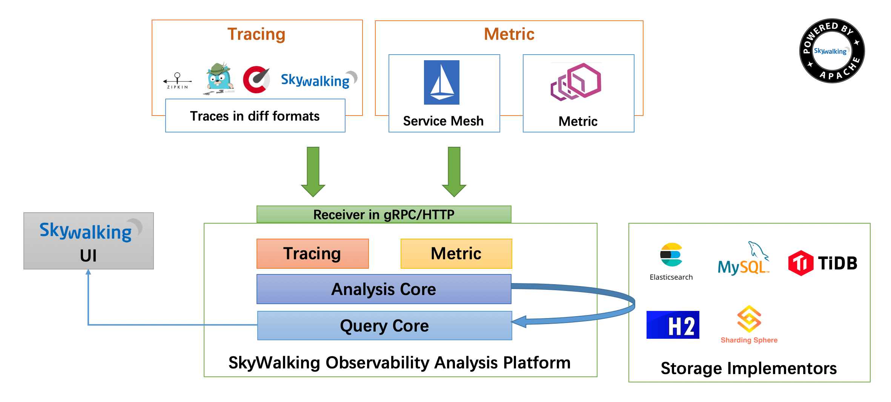

## 基本介绍

- 什么是链路追踪

随着微服务分布式系统变得日趋复杂，越来越多的组件开始走向分布式化，如分布式服务、分布式数据库、分布式缓存等，使得后台服务构成了一种复杂的分布式网络。在服务能力提升的同时，复杂的网络结构也使问题定位更加困难。在一个请求在经过诸多服务过程中，出现了某一个调用失败的情况，查询具体的异常由哪一个服务引起的就变得十分抓狂，问题定位和处理效率是也会非常低。

分布式链路追踪就是将一次分布式请求还原成调用链路，将一次分布式请求的调用情况集中展示，比如各个服务节点上的耗时、请求具体到达哪台机器上、每个服务节点的请求状态等等。

- 为什么要使用链路追踪

链路追踪为分布式应用的开发者提供了完整的调用链路还原、调用请求量统计、链路拓扑、应用依赖分析等工具，可以帮助开发者快速分析和诊断分布式应用架构下的性能瓶颈，提高微服务时代下的开发诊断效率。

- skywalking 链路追踪

`SkyWalking`是一个可观测性分析平台（Observability Analysis Platform 简称OAP）和应用性能管理系统（Application Performance Management 简称 APM）。

提供分布式链路追踪，服务网格（Service Mesh）遥测分析，度量（Metric）聚合和可视化一体化解决方案。

SkyWalking 特点

- 多语言自动探针，java，.Net Code ,Node.Js
- 多监控手段，语言探针和Service Mesh
- 轻量高效，不需要额外搭建大数据平台
- 模块化架构，UI ，存储《集群管理多种机制可选
- 支持警告
- 优秀的可视化效果。

下面是`SkyWalking`的架构图：

## 安装

下载地址：https://archive.apache.org/dist/skywalking/ or http://skywalking.apache.org/downloads

### Windows平台安装

可以从下载地址下载`apache-skywalking-apm-$version.tar.gz`包。

Windows下载解压后（.tar.gz），直接点击`bin/startup.bat`就可以了，这个时候实际上是启动了两个项目，一个收集器，一个web页面。

### Linux平台安装

下载

如果数据是存储在elasticsearch，需要下载对应的版本，否则启动报错

~~~shell
wget https://archive.apache.org/dist/skywalking/8.7.0/apache-skywalking-apm-es7-8.7.0.tar.gz
tar -xzvf apache-skywalking-apm-es7-8.7.0.tar.gz
~~~

修改配置

~~~shell
cd apache-skywalking-apm-bin-es7/config
vi application.yml
~~~

修改存储类型

~~~yaml
storage:
  selector: ${SW_STORAGE:elasticsearch7}
~~~

修改elasticsearch配置

~~~yaml
elasticsearch7:
   clusterNodes: ${SW_STORAGE_ES_CLUSTER_NODES:localhost:9200}  #es7机器地址
   #略，其他配置不用动
   user: ${SW_ES_USER:"es账号"}  #如果es开启认证，需要填账号密码，否则不动即可
   password: ${SW_ES_PASSWORD:"es密码"} #如果es开启认证，需要填账号密码，否则不动不动即可
~~~

`skywalking`提供了一个可视化的监控平台，安装好之后，在浏览器中输入([http://localhost:8080 (opens new window)](http://localhost:8080/))就可以访问了。

## 使用

复制安装包目录中的agent到java程序所在的机器上，启动脚本增加如下配置

~~~
-javaagent:本地目录别配错了/skywalking-agent.jar -Dskywalking.agent.service_name=服务名 -Dskywalking.collector.backend_service=上边安装的服务器ip:11800 
~~~

例如

~~~
java -javaagent:/data/apache-skywalking-apm-bin-es7/agent/skywalking-agent.jar -Dskywalking.agent.namespace=dev -Dskywalking.agent.service_name=service-gateway -Dskywalking.collector.backend_service=127.0.0.1:11800 -Dspring.profiles.active=dev -jar /demo.jar
~~~

参考资料：

[1]. https://blog.csdn.net/chengqwertyuiop/article/details/125065633

[2]. http://doc.ruoyi.vip/ruoyi-cloud/cloud/skywalking.html