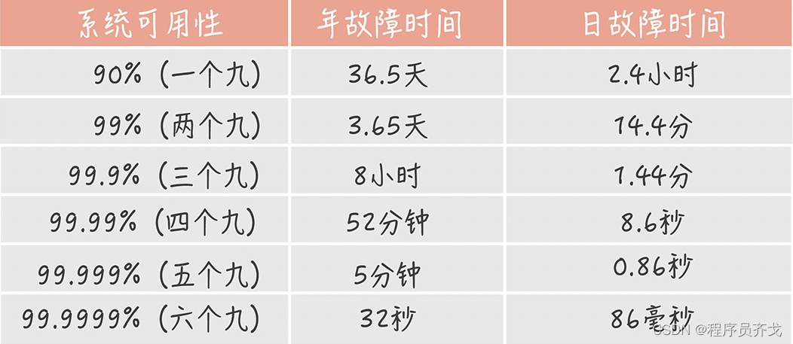
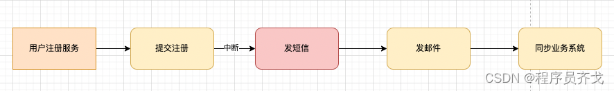
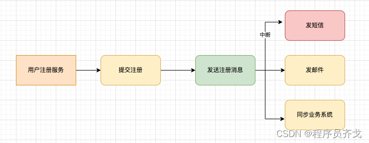
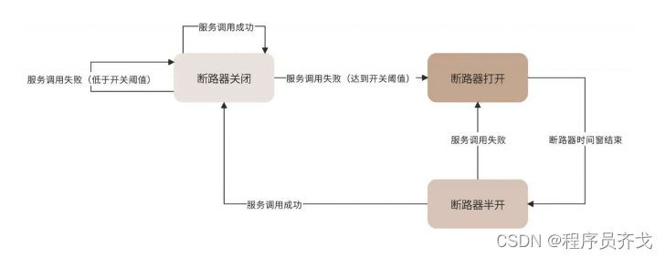

作为软件开发人员，特别是架构师，在系统设计初期，必须考虑如何保证系统的高可用性，高扩展性，高性能。当然最重要的要先保证高可用性，系统不支持高可用，再高的性能和可扩展性都是无源之水，无本之木。

那什么是系统的高可用性？用什么指标来衡量系统可用性？实现系统高可用性的设计原则和方案有哪些？

## 一、系统高可用性

### 1.1、什么是高可用性

高可用性：（High Availability）通常用来描述一个系统经过专门的设计，从而减少停工时间，保证其服务的高度可用性。也就是系统大部分时间都是可用的，可以为用户提供服务的，即使发生了硬件故障或系统在进行升级。

### 1.2、如何衡量系统可用性

系统可用性指标，业界通常用多少个9来描述一个系统的可用性，比如4个9，99.99%就叫系统的可用性指标，表示该系统在所有运行时间中只有0.01%的时间是不可用的。

计算公式：`可用性指标=（1-年度不可用时间/年度总时间）X 100，反映系统的可用程度`。

通过上图可以发现，

1个九和两个九的系统年故障时间是按天算的，日故障时间是按小时算的，也就是每年总有那么几天或每天总有那么几个小时系统不可用，满足该指标的系统只能算基本可用，也是最容易达到的，基本上靠人工运维的方式就能实现。

3个九的系统年故障时间从3天锐减为8小时，系统具有较高可用性。

4个九的系统年故障时间为50多分钟，这种系统不能依靠人工运维方式实现高可用，而是需要系统具有自动恢复能力。

5个9的系统年故障时间为5分钟，满足该指标的系统具有极高的可用性，不过实现的难度和代价也是非常大的，只有公司的核心业务系统或国家级基础设置才会确保满足5个9甚至6个9的指标，比如支付宝，微信支付，电信运营商，国家银行系统，其他非核心系统满足4个9的指标已经够用了。

可用性差异在于面对各种故障时，系统的高可用架构设计方案做的是否足够好。

## 二、高可用架构设计方案

### 2.1、解耦

解耦是用于解决系统耦合度过高的问题，耦合度过高会导致系统维护困难，任何一个小的改动都可能引入意想不到的bug和系统奔溃，导致系统不可用。

软件技术的进化离不开解耦，TCP/IP协议的分层将每层的职责做了明确区分，通过制定不同的协议解耦了标准与实现，软件与硬件的关系。MVC框架进一步将展示逻辑与控制逻辑解耦，方便前后端开发的分离。

两种低耦合设计原则：

组件的低耦合原则：

- 无循环依赖原则，即技术组件之间不能循环依赖，不能查权限的接口依赖于用户接口，用户接口又依赖权限接口；
- 稳定依赖原则，即被依赖的组件尽量稳定，尽量少因为业务变化而变化，不能今天因为某个业务改了接口定义，明天又因为另一个业务调整接口参数；
- 稳定抽象原则，即要想使组件稳定，组件就要更加抽象，组件发布出去之后非万不得已，不改变结构。

面向对象的低耦合原则：

- 开闭原则，即对修改封闭、对扩展开放，对象可以扩展新功能，但是不能修改代码；
- 依赖倒置原则，即高层对象不能依赖低层对象，而是要依赖抽象接口，而抽象接口属于高层；通常逻辑是上游对象直接依赖下游对象的接口或实现，依赖倒置原则是下游对象依赖上游对象的接口，并实现下游对象的接口，这样的好处是上游对象自身是稳定的，不需要关心下游对象接口的改变，下游对象也可以自己去单独演化，只需要保证上游接口的实现。
- 接口隔离原则，不要强迫使用者依赖它们不需要的方法，要用接口对方法进行隔离。

### 2.2、隔离

解耦是逻辑分隔，隔离是物理分隔，即将低耦合的组件进行独立部署，将不同组件在物理上隔离开来。每个组件有自己独立的代码仓库；每个组件可以独立发布，互不影响；每个组件有自己独立的容器进行部署，互不干扰。后端同学是不是很熟悉？这不是微服务架构吗！微服务将一个复杂的单体应用拆解成多个细粒度的微服务，这些微服务之间互相依赖，实现原来单体应用的功能。然后每个微服务可以独立开发和部署，微服务之间通过RPC框架进行调用，这就是微服务架构。

隔离使得系统间关系和边界更加清晰，同时也可以隔离开故障，更加快速的发现问题和解决问题，提高系统的可用性。

当然，**隔离必须在低耦合的基础上进行才有意义**。如果系统耦合度高，隔离只会让系统关系更混乱，更脆弱。

### 2.3、异步

异步是在隔离基础上的进一步解耦，将物理上已经分割的组件之间的依赖关系进一步切断，使故障无法扩散，提高系统可用性。异步在架构上的实现手段主要是使用消息队列。

用户注册同步模式

用户注册异步模式

### 2.4、备份

备份主要解决硬件故障下系统的可用性，即一个服务部署在多个服务器上，当某个服务器故障时，请求切换到其他服务器上继续处理，保证服务是可用的。所以，备份与失败转移（failover）总是成对出现的，共同构成一个高可用解决方案。

最常见的备份就是负载均衡，用户通过负载均衡服务器nginx访问应用服务时，nginx会判断应用服务器集群中每台机器是否可用，如果服务器宕机，则会停止分发请求到该服务器。

数据库或存储服务为了保证高可用，也会采用备份的手段，比如MySQL主备模式。

### 2.5、重试

系统业务多数情况下比较复杂，一般由多个步骤来组成完整的业务逻辑，每个步骤都可能因为某些原因而失败，特别是微服务架构时代，远程服务可能会由于线程阻塞、垃圾回收或者网络抖动，而无法及时返回响应，调用者可以通过重试的方式修复单次调用的故障。

需要注意的是，重试是有风险的。比如一个转账操作，由于网络请求超时，导致第一次请求转账后没有响应，如果这个时候进行重试，那么可能会导致重复转账，反而造成重大问题。所以，支持重试的服务必须是幂等的。所谓幂等，即服务重复调用和调用一次产生的结果是相同的。在做架构设计的时候，一定要注意服务如果要支持重试，必须考虑服务的幂等性。

### 2.6、熔断

重试主要解决偶发的因素导致的单次调用失败，但是如果某个服务器一直不稳定，甚至已经宕机，再请求这个服务器或者进行重试都没有意义了。所以为了保证系统整体的高可用，对于不稳定或宕机的服务器需要进行熔断。

熔断的主要方式是使用断路器阻断对故障服务器的调用，断路器状态图如下：

断路器有三种状态，关闭、打开、半开。断路器正常情况下是关闭状态，每次服务调用后都通知断路器。如果失败了，失败计数器就 +1，如果超过开关阈值，断路器就打开，这个时候就不再请求这个服务了。过一段时间，达到断路器预设的时间窗口后，断路器进入半开状态，发送一个请求到该服务，如果服务调用成功，那么说明服务恢复，断路器进入关闭状态，即正常状态；如果服务调用失败，那么说明服务故障还没修复，断路器继续进入到打开状态，服务不可用。

### 2.7、补偿

前面几种方案都是故障发生时如何处理，而补偿则是故障发生后，如何弥补错误或者避免损失扩大。比如将处理失败的请求放入一个专门的补偿队列，等待失败原因消除后进行补偿，重新处理。

补偿最典型的使用场景是事务补偿。在一个分布式应用中，多个相关事务操作可能分布在不同的服务器上，如果某个服务器处理失败，那么整个事务就是不完整的。按照传统的事务处理思路，需要进行事务回滚，即将已经成功的操作也恢复到事务以前的状态，保证事务的一致性。

传统的事务回滚主要依赖数据库的特性，当事务失败的时候，数据库执行自己的 undo日志，就可以将同一个事务的多条数据记录恢复到事务之初的状态。但是分布式服务没有undo日志，所以需要开发专门的事务补偿代码，当分布式事务失效的时候，调用事务补偿服务，将事务状态恢复如初。

### 2.8、限流

在高并发场景下，如果系统的访问量超过了系统的承受能力，可以通过限流对系统进行保护。限流是指对进入系统的用户请求进行流量限制，如果访问量超过了系统的最大处理能力，就会丢弃一部分用户请求，保证整个系统可用。这样虽然有一部分用户的请求被丢弃，但大部分用户还是可以访问系统的，总比整个系统崩溃，所有的用户都不可用要好。

### 2.9、降级

降级是保护系统高可用的另一种手段。有一些系统功能是非核心的，但是也给系统产生了非常大的压力，比如电商系统中有确认收货这个功能，即便用户不确认收货，系统也会超时自动确认。

但实际上确认收货是一个非常重的操作，因为它会对数据库产生很大的压力：它要进行更改订单状态，完成支付确认，并进行评价等一系列操作。如果在系统高并发的时候去完成这些操作，那么会对系统雪上加霜，使系统的处理能力更加恶化。

解决办法就是在系统高并发的时候（例如京东618，11.11大促），将确认收货、评价等非核心的功能关闭，也就是对系统进行降级，把宝贵的系统资源留下来，给正在购物的人，让他们去完成交易。

熔断和降级有什么区别呢？

熔断是部分服务器不可用，请求转移到其他服务器；降级是部分功能不可用，需要人为关闭这些功能的请求处理开关，降级是功能设计的一部分。

### 2.10、多活

多活，即异地多活，在多个地区建立数据中心，并都可以对用户提供服务，任何地区级的灾难都不会影响系统的可用。比如我们部署应用时，都会要求夸机房部署，这就是一种异地多活的方式。

异地多活的架构需要考虑的重点是，用户请求如何分发到不同的机房去。这个主要可以在域名解析的时候完成，也就是用户进行域名解析的时候，会根据就近原则或者其他一些策略，完成用户请求的分发。另一个至关重要的技术点是，因为是多个机房都可以独立对外提供服务，所以也就意味着每个机房都要有完整的数据记录。用户在任何一个机房完成的数据操作，都必须同步传输给其他的机房，进行数据实时同步。

数据库实时同步最需要关注的就是数据冲突问题。同一条数据，同时在两个数据中心被修改了，该如何解决？某些容易引起数据冲突的服务采用类似MySQL的主主模式，也就是说多个机房在某个时刻是有一个主机房的，某些请求只能到达主机房才能被处理，其他的机房不处理这一类请求，以此来避免关键数据的冲突。

除了以上的高可用架构方案，还有一些高可用的运维方案，比如通过自动化测试减少系统的Bug，通过自动化监控尽早发现系统的故障，通过预发布验证发现测试环境无法发现的Bug，通过灰度发布降低软件错误带来的影响等。

**参考资料**

[1]. [https://blog.csdn.net/ITqige/article/details/134588411](https://blog.csdn.net/ITqige/article/details/134588411)

[2]. [https://www.cnblogs.com/xiekun/p/15867034.html](https://www.cnblogs.com/xiekun/p/15867034.html)