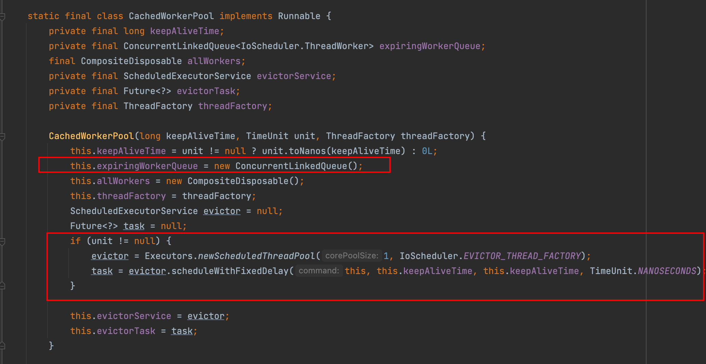

上一期使用 RxJava 实现 AI 题目生成的时候，用到了 `Schedulers.io()` 方法，创建了一个 I/O 密集型线程池来处理智谱 AI 返回的流。

```javascript
modelDataFlowable
    .observeOn(Schedulers.io())
    .map(modelData -> modelData.getChoices().get(0).getDelta().getContent())
    .map(message -> message.replaceAll("\\s", ""))
    .filter(StrUtil::isNotBlank)
    .flatMap(message -> {
        ...
    })
    .doOnNext(c -> {
        ...
    })
    .doOnError((e) -> log.error("sse error", e))
    .doOnComplete(sseEmitter::complete)
    .subscribe();
```

业务量级不大的时候，这么写当然没有问题；但随着业务量级的增长，这里可能会有安全隐患！

不知道大家了不了解 Java8 Stream 的 ForkJoinPool ，Java8 并发流的线程池是 **全局共享** 的，也就是任何的业务操作如果用到并发流，默认都是一个线程池，这会产生什么问题呢？

### 需求分析

如果所有业务操作都使用一个线程池，最大的问题就是 **相互影响**。

比如组内的一个同学上线了一个功能，用到了共享的线程池，但是他写的代码有 bug ，导致的线程池里的所有线程都被阻塞了。

你本来在那边喝着咖啡笑看他在那里手忙脚乱，突然发现报警群里面发出了新的告警通知，一看是你负责的业务。

原因是你的业务跟他共用了一个线程池，他的任务占着线程不放，你的任务当然也会被阻塞住，所以也告警了，你就傻眼了。

因此，对于一些业务共享的资源，使用的时候需要非常谨慎，需要考虑关联性、考虑最坏情况下会怎样，牵一发而动全身。有时候不是你写的代码没问题就稳了，小心“背刺”。

所以，在一些业务敏感的场景，需要隔离线程池，它有以下几点好处：

1. 故障隔离，缩小事故范围。
2. 资源隔离，防止业务之间抢占资源。同时支持更精细化地管理资源，比如不重要的场景给小一点的线程池，核心场景配置大线程池。
3. 性能优化，一些业务场景的任务是 CPU 密集型，一些是 I/O 密集型，不同任务类型需要配置不同的线程池。

本项目目前使用的 `Schedulers.io()` 就是全局共享的，先看下源码。通过静态代码块初始化了一个 IO 线程池：


调用 io 方法时，会将该线程池实例作为默认的返回：


实际的内部实现是 RxJava 自定义的 CachedWorkerPool 线程池，它使用 ConcurrentLinkedQueue 无界队列，并且没有做线程约束，来一个任务就会新建一个线程！然后起了一个定时任务 evictor ，每间隔 60s 清理没有运行的线程。



这会导致什么问题？如果并发任务数特别多的情况下，会导致线程数不断增多，最终导致项目 OOM。

简单进行单测，JVM 设置成 `-Xms64m -Xmx64m`，执行以下代码：

```java
@Test
void test() {
    Scheduler io = Schedulers.io();
    while (true) {
        io.scheduleDirect(() -> {
            System.out.println(Thread.currentThread().getName() + " print hello");
            try {
                Thread.sleep(50000l);
            } catch (InterruptedException e) {
                e.printStackTrace();
            }
        });
    }
}
```

可以看到，产生了 OOM：


所以，这块可以做一定的优化。假设 AI 答题用户分为了两类，一类是普通用户，一类是 VIP 用户。可以给 VIP 用户设置独立的线程池来处理 AI 题目生成功能，普通用户使用 `Schedulers.single()` 单线程，防止普通用户太多占用资源。是不是很真实？

### 方案设计

1）给 VIP 用户定制一个专用的线程池。

2）普通用户使用 Schedulers.single()

3）改造 AI 生成题目接口，根据用户类型选择不同的线程池。

### 开发实现

VIP 专用线程池定义，注册为 SpringBean，且设置线程名，并于调试时测试观察。

**注意**：线程池必须是 newScheduledThreadPool 类型！跟原来方法的返回值类型保持一致。


因为流式处理需要周期性线程池来循环处理数据（可以理解为有记忆性）；如果用普通线程池来处理，那么替换线程后，每个线程都会从流的起始位置开始消费。这段话可以不理解，总之如果用普通线程池程序会有问题就对了。

代码如下：

```java
import io.reactivex.Scheduler;
import io.reactivex.schedulers.Schedulers;

@Configuration
@Data
public class VipSchedulerConfig {

    @Bean
    public Scheduler vipScheduler() {
        ThreadFactory threadFactory = new ThreadFactory() {
            private final AtomicInteger threadNumber = new AtomicInteger(1);

            @Override
            public Thread newThread(Runnable r) {
                Thread t = new Thread(r, "VIPThreadPool-" + threadNumber.getAndIncrement());
                t.setDaemon(false); // 设置为非守护线程
                return t;
            }
        };

        ExecutorService executorService = Executors.newScheduledThreadPool(10, threadFactory);
        return Schedulers.from(executorService);
    }
}
```

改造通过 SSE 方式让 AI 生成题目的接口，补充根据用户身份使用不同的线程池的逻辑。

代码如下：

```java
// 注入 VIP 线程池
@Resource
private Scheduler vipScheduler;

@GetMapping("/ai_generate/sse")
public SseEmitter aiGenerateQuestionSSE(
    AiGenerateQuestionRequest aiGenerateQuestionRequest,
    HttpServletRequest request) {
    ...
    // 默认全局线程池
    Scheduler scheduler = Schedulers.single();
    User loginUser = userService.getLoginUser(request);
    // 如果用户是 VIP，则使用定制线程池
    if ("vip".equals(loginUser.getUserRole())) {
        scheduler = vipScheduler;
    }
    // 订阅流
    modelDataFlowable
        .observeOn(scheduler)
        .subscribe();
    return sseEmitter;
}
```

### 验证测试

在每次拼接出一道完整题目的 JSON 后，输出当前线程名称便于测试。如果是普通用户，使用 `Thread.sleep(10000L)` 模拟线程池被堵住场景。

代码如下：

```java
if (c == '}') {
    counter.addAndGet(-1);
    if (counter.get() == 0) {
        // 输出当前线程名称
        System.out.println(Thread.currentThread().getName());
        // 模拟普通用户阻塞
        if (!isVip) {
            Thread.sleep(10000L);
        }
        // 可以拼接题目，并且通过 SSE 返回给前端
        sseEmitter.send(JSONUtil.toJsonStr(stringBuilder.toString()));
        // 重置，准备拼接下一道题
        stringBuilder.setLength(0);
    }
}
```

可以通过临时修改请求参数，比如增加一个 isVip 字段，临时模拟用户身份进行测试。

```java
public SseEmitter aiGenerateQuestionSSE(
    AiGenerateQuestionRequest aiGenerateQuestionRequest,
    boolean isVip) {
    ...
}
```

执行流程：

1. 模拟普通用户调用
2. 再次进行普通用户调用
3. 进行 VIP 用户调用

期望结果：VIP 用户调用返回的结果不受 sleep 影响，普通用户则阻塞，每 10s 输出一题。

根据流程编写单元测试代码：

```java
@Resource
private QuestionController questionController;

@Test
void aiGenerateQuestionSSEVIPTest() throws InterruptedException {
    AiGenerateQuestionRequest request = new AiGenerateQuestionRequest();
    request.setAppId(3L);
    request.setQuestionNumber(10);
    request.setOptionNumber(2);

    questionController.aiGenerateQuestionSSE(request, false);
    questionController.aiGenerateQuestionSSE(request, false);
    questionController.aiGenerateQuestionSSE(request, true);

    Thread.sleep(1000000L);
}
```

结果：从线程名字来看，VIP 用户 10 道题目执行输出结束后，普通用户才生成 3 道题：


这就是线程池隔离的优势，普通用户完全不会影响到会员用户。这也是企业开发中相对高级的操作，没经历过事故的同学一般情况下想不到，希望能通过这个项目理解吧~