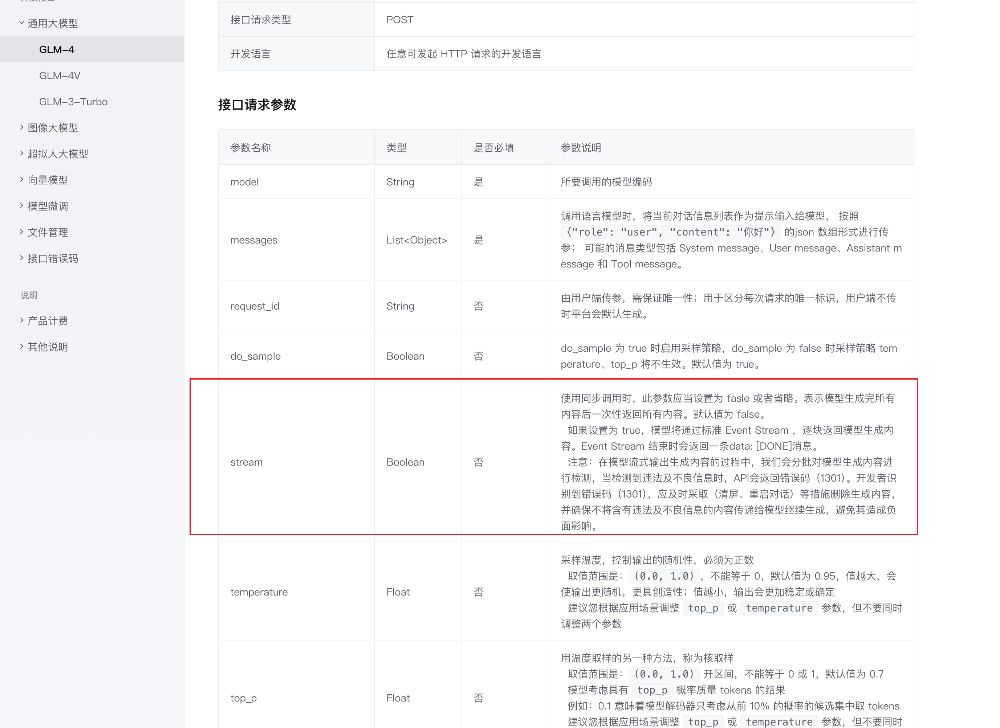
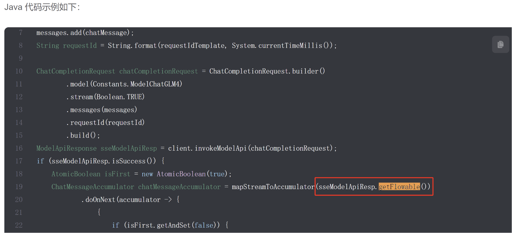

## 背景

之前一些查询功能是等所有内容全部生成后，再返回给前端，用户可能要等待较长的时间。

有没有办法进行优化呢？

仔细阅读智谱 AI 的官方文档，提供了 **流式** 接口调用方式：

- https://open.bigmodel.cn/dev/api#sdk_example
- https://open.bigmodel.cn/dev/api#glm-4

通过设置 stream 为 true 来开启流式：



官方提供了一段示例代码，如果 stream 设置为 true，需要从返回结果中获取到 `flowable` 对象：



映射到代码中来需要这样构造请求参数：

```java
/**
 * 流式请求
 * @param messages
 * @param stream
 * @param temperature
 * @return
 */
public Flowable<ModelData> doRequestFlowable(List<ChatMessage> messages, Boolean stream, Float temperature) {
    // 构造请求
    ChatCompletionRequest chatCompletionRequest = ChatCompletionRequest.builder()
            .model(Constants.ModelChatGLM4)
            .stream(stream)
            .invokeMethod(Constants.invokeMethod)
            .temperature(temperature)
            .messages(messages)
            .build();
    ModelApiResponse invokeModelApiResp = clientV4.invokeModelApi(chatCompletionRequest);
    return invokeModelApiResp.getFlowable();
}
```

这个流式请求是意思？Flowable 又是什么？可以给我们的项目带来哪些优化呢？

实际上 Flowable 是 RxJava 响应式编程库中定义的类，为了更好地进行流式开发，我们要先来了解下响应式编程和 RxJava。

## 什么是响应式编程？

响应式编程（Reactive Programming）是一种编程范式，它专注于 **异步数据流** 和 **变化传播**。

响应式编程的核心思想是“数据流是第一等公民”，程序的逻辑建立在数据流的变化之上。

响应式编程的几个核心概念：

1）数据流：响应式编程中，数据以流（Streams）的形式存在。流就像一条河，源源不断、有一个流向（比如从 A 系统到 B 系统再到 C 系统），它可以被过滤、观测、或者跟另一条河流合并成一个新的流。

比如用户输入、网络请求、文件读取都可以是数据流，可以很轻松地对流进行处理。

比如 Java 8 的 Stream API，下列代码中将数组作为一个流，依次进行过滤、转换、汇聚。

~~~java
list.stream()
    .filter()
    .map()
    .collect()
~~~

2）异步处理：响应式编程是异步的，即操作不会阻塞线程，而是通过回调或其他机制在未来某个时间点处理结果。这提高了应用的响应性和性能。

3）变化传播：当数据源发生变化时，响应式编程模型会自动将变化传播到依赖这些数据源的地方。这种传播是自动的，不需要显式调用。

举个例子，有一只股票涨了，所有 **订阅** 了这只股的人，都会同时收到 APP 的通知，不用你自己盯着看。

注意，响应式编程更倾向于声明式编程风格，通过定义数据流的转换和组合来实现复杂的逻辑。比如，可以利用 map、filter 等函数来实现数据转换，而不是将一大堆复杂的逻辑混杂在一个代码块中。

## 什么是 RxJava？

RxJava 是一个基于事件驱动的、利用可观测序列来实现异步编程的类库，是响应式编程在 Java 语言上的实现。

这个定义中有几个概念，我们分别解释。

### 1、事件驱动

事件可以是任何事情，如用户的点击操作、网络请求的结果、文件的读写等。事件驱动的编程模型是通过事件触发行动。

比如前端开发中，用户点击按钮后会进行弹窗，这就是“点击事件”触发了“弹窗行动”

```javascript
// 前端按钮点击
btn.onClick(()->{
  // 弹窗
  showModal();
})
```

在 RxJava 中，事件可以被看作是数据流中的数据项，称为“事件流”或“数据流”。每当一个事件发生，这个事件就会被推送给那些对它感兴趣的观察者（Observers）。

### 2、可观测序列

可观测序列是指一系列按照时间顺序发出的数据项，可以被观察和处理。可观测序列提供了一种将数据流和异步事件建模为一系列可以订阅和操作的事件的方式。

可以理解为在数据流的基础上封装了一层，多加了一点方法。

## RxJava 应用场景

它的一个核心应用场景就是 UI 场景，像 Android 开发都会用到 RxJava。

UI 场景天然涉及到响应和事件这两点，比如我们在手机 app 上某个按钮，对应 app 就会弹出某个界面，点击按钮其实就是一个事件，那么弹出界面就是对应的响应。

```java
//安卓异步后台执行任务，完成后更新UI
new AsyncTask<Void, Void, ResultType>() {
    protected ResultType doInBackground(Void... params) {
        // 在后台线程中执行的任务
        return result;
    }

    protected void onPostExecute(ResultType result) {
        // doInBackground完成后执行的回调，用于更新UI
    }
}.execute();
```

而 RxJava 给予我们一个统一的异步接口形式，提供链式编程、丰富的操作符让我们在面对复杂的业务场景编写的代码也异常简单。

我在网上找了一个最典型的例子，能直观感受到 RxJava 带来的编码便利性。

```java
Observable.from(folders)
    .flatMap((Func1) (folder) -> { Observable.from(file.listFiles()) })
    .filter((Func1) (file) -> { file.getName().endsWith(".png") })
    .map((Func1) (file) -> { getBitmapFromFile(file) })
    .subscribeOn(Schedulers.io())
    .observeOn(AndroidSchedulers.mainThread())
    .subscribe((Action1) (bitmap) -> { imageCollectorView.addImage(bitmap) });
```

`.subscribeOn(Schedulers.io())` 这行代码设置执行上游 Observable 即 Observable.from(folders)及其后续操作（合并文件夹、查找png图片，转成 bitmap）到这行代码之前的逻辑在一个适用于I/O操作的线程池中执行，即子线程池中。

`.observeOn(AndroidSchedulers.mainThread())` 这行代码指定了下游 Observable（即subscribe方法及其**之前**的操作），在 Android 的主线程上执行更新 UI。

```livescript
subscribe((Action1) (bitmap) -> { imageCollectorView.addImage(bitmap) });` 是绑定观察者的操作，观察者针对被观察者的事件的响应动作是  `imageCollectorView.addImage(bitmap)
```

这是一个在安卓中实现的例子，它在子线程中实现了过滤查找所有文件夹中的 png 图片，转成 bitmap，之后再利用主线程显示图片。

因为安卓的主线程是需要试试响应用户的请求，如果它被利用去执行查找图片和转化 png 的过程，就会让 app 卡顿，影响用户体验，严重可能会导致无响应。

因此耗时的操作需要到子线程中操作，然后最终显示结果才需要利用主线程，上面的演示代码不仅业务逻辑处理便捷，线程的切换也非常简单。

现在我们想象上，上面的这些操作，如果没有 RxJava 要我们来实现的话，需要多少行代码？至少是 7 行代码的几倍吧。

想必我们已经知晓的 RxJava 的便捷之处了，接下来我们再来学学 RxJava 的核心知识点。

## RxJava 的核心知识点

### 观察者模式

RxJava 是基于 **观察者模式** 实现的，分别有观察者和被观察者两个角色，被观察者会实时传输数据流，观察者可以观测到这些数据流。

基于传输和观察的过程，用户可以通过一些操作方法对数据进行转换或其他处理。

在 RxJava 中，观察者就是 Observer，被观察者是 Observable 和 Flowable。

Observable 适合处理相对较小的、可控的、不会迅速产生大量数据的场景。它不具备背压处理能力，也就是说，当数据生产速度超过数据消费速度时，可能会导致内存溢出或其他性能问题。

Flowable 是针对背压（反向压力）问题而设计的可观测类型。背压问题出现于数据生产速度超过数据消费速度的场景。Flowable 提供了多种背压策略来处理这种情况，确保系统在处理大量数据时仍然能够保持稳定。

`被观察者.subscribe(观察者)`，它们之间就建立的订阅关系，被观察者传输的数据或者发出的事件会被观察者观察到。

### 常用操作符

前面提到用户可以通过一些方法对数据进行转换或其他处理，RxJava 提供了很多操作符供我们使用，这块其实和 Java8 的 Stream 类似，概念上都是一样的。

操作符主要可以分为以下几大类：

1）变换类操作符，对数据流进行变换，如 map、flatMap 等。

比如利用 map 将 int 类型转为 string

```java
Flowable<String> flowable = Flowable.range(0, Integer.MAX_VALUE)
        .map(i -> String.valueOf(i))
```

2）聚合类操作符，对数据流进行聚合，如 toList、toMap 等。

将数据转成一个 list

```java
Flowable.range(0, Integer.MAX_VALUE).toList()
```

3）过滤操作符，过滤或者跳过一些数据，如 filter、skip 等。

将大于 10 的数据转成一个 list

```java
Flowable.range(0, Integer.MAX_VALUE).filter(i -> i > 10).toList();
```

4）连接操作符，将多个数据流连接到一起，如 concat、zip 等。

创建两个 Flowable，通过 concat 连接得到一个被观察者，进行统一处理

```java
// 创建两个 Flowable 对象
Flowable<String> flowable1 = Flowable.just("A", "B", "C");
Flowable<String> flowable2 = Flowable.just("D", "E", "F");

// 使用 concat 操作符将两个 Flowable 合并
Flowable<String> flowable = Flowable.concat(flowable1, flowable2);
```

5）排序操作符，对数据流内的数据进行排序，如 sorted

```java
Flowable<String> flowable = Flowable.concat(flowable1, flowable2).sorted();
```

### 事件

RxJava 也是一个基于事件驱动的框架，我们来看看一共有哪些事件，分别在什么时候触发：

1）onNext，被观察者每发送一次数据，就会触发此事件。

2）onError，如果发送数据过程中产生意料之外的错误，那么被观察者可以发送此事件。

3）onComplete，如果没有发生错误，那么被观察者在最后一次调用 onNext 之后发送此事件表示完成数据传输。

对应的观察者得到这些事件后，可以进行一定处理，例如：

```java
flowable.observeOn(Schedulers.io())
    .doOnNext(item -> {
        System.out.println("来数据啦" + item.toString());
    })
    .doOnError(e -> {
        System.out.println("出错啦" + e.getMessage());
    })
    .doOnComplete(() -> {
        System.out.println("数据处理完啦");
    }).subscribe();
```

了解这么多就够用了，更多可以查看官网 https://reactivex.io/，支持多种不同的编程语言。

## DEMO 演示

1）引入依赖

如果要在新项目中使用 RxJava，单独引入 Java 需要的、对应版本的依赖即可：https://github.com/reactive-streams/reactive-streams-jvm

示例代码：

```xml
<dependency>
  <groupId>org.reactivestreams</groupId>
  <artifactId>reactive-streams</artifactId>
  <version>1.0.4</version>
</dependency>
```

2）编写单元测试

```java
@Test
void rxJavaDemo() throws InterruptedException {
    // 创建一个流，每秒发射一个递增的整数（数据流变化）
    Flowable<Long> flowable = Flowable.interval(1, TimeUnit.SECONDS)
            .map(i -> i + 1)
            .subscribeOn(Schedulers.io()); // 指定创建流的线程池

    // 订阅 Flowable 流，并打印每个接受到的数字
    flowable.observeOn(Schedulers.io())
            .doOnNext(item -> System.out.println(item.toString()))
            .subscribe();

    // 让主线程睡眠，以便观察输出
    Thread.sleep(10000L);
}
```

## RxJava 和 WebFlux 的区别

Spring WebFlux 和 RxJava 都是用于构建反应式编程模型的工具和框架，它们有一定的关联，但也有不同的用途和实现方式。以下是两者的关联和区别：

### 关联

1. **反应式编程模型**：

- - **Spring WebFlux** 和 **RxJava** 都支持反应式编程模型，旨在处理异步数据流和事件驱动的编程模式。
  - 反应式编程的核心思想是以非阻塞的方式处理数据流，通过事件驱动的方式响应数据变化。

1. **Reactive Streams 标准**：

- - 两者都遵循 **Reactive Streams** 规范，这是一个旨在提供背压机制的标准，确保在异步处理数据流时不会发生过载。
  - Reactive Streams 规范定义了四个核心接口：`Publisher`、`Subscriber`、`Subscription` 和 `Processor`。这为不同的反应式库和框架提供了互操作的基础。

### Spring WebFlux

- **框架定位**：Spring WebFlux 是 Spring Framework 5 引入的一个反应式 Web 框架，用于构建非阻塞的、事件驱动的 Web 应用。
- **核心依赖**：WebFlux 依赖于 Project Reactor，这是一个用于构建反应式应用的库。
- **编程模型**：使用 Reactor 提供的 `Mono` 和 `Flux` 类型，分别表示 0 或 1 个元素和 0 到 N 个元素的数据流。
- **应用场景**：适用于需要高并发、低延迟的 Web 应用和微服务架构。

### RxJava

- **库定位**：RxJava 是 ReactiveX (Reactive Extensions) 项目的一部分，是一个用于构建基于事件的异步和响应式应用程序的 Java 库。
- **核心概念**：提供 Observable 和 Flowable（以及其他类型）来表示数据流和事件流，支持丰富的操作符来处理和转换数据流。
- **编程模型**：RxJava 提供了大量操作符，如 `map`、`flatMap`、`filter`、`merge` 等，用于流的转换和组合。
- **应用场景**：广泛应用于 Android 开发和服务端应用中，用于处理异步事件和数据流。

### 区别

1. **实现方式**：

- - **WebFlux** 主要基于 Reactor 实现，而不是 RxJava。虽然两者都遵循 Reactive Streams 规范，但它们提供的 API 和操作符有所不同。
  - **RxJava** 独立于 WebFlux，是一个通用的反应式编程库，不仅限于 Web 应用。

1. **核心类型**：

- - **WebFlux** 使用 `Mono` 和 `Flux` 类型。
  - **RxJava** 使用 `Observable`、`Flowable`、`Single`、`Maybe` 和 `Completable` 类型。

1. **适用场景**：

- - **WebFlux** 专注于构建反应式 Web 应用和微服务。
  - **RxJava** 是一个通用的反应式编程库，适用于任何需要处理异步数据流的场景，包括但不限于 Web 应用。

### 结合使用

虽然 WebFlux 主要使用 Reactor，但你也可以在 WebFlux 应用中使用 RxJava。Spring 提供了一些转换工具，可以在 RxJava 和 Reactor 类型之间进行转换。例如，可以使用 `RxJava2Adapter` 将 RxJava 的 `Observable` 转换为 Reactor 的 `Flux`，或者将 RxJava 的 `Single` 转换为 Reactor 的 `Mono`。

### 示例代码

```java
// 使用 RxJava 的 Observable
Observable<String> rxObservable = Observable.just("Hello", "World");
// 转换为 Reactor 的 Flux
Flux<String> reactorFlux = Flux.from(rxObservable.toFlowable(BackpressureStrategy.BUFFER));
// 在 WebFlux 中使用
router.route("/hello")
.get(request -> ServerResponse.ok().body(reactorFlux, String.class));
```

总结来说，Spring WebFlux 和 RxJava 都支持反应式编程，但 WebFlux 是一个框架，主要用于构建反应式 Web 应用，基于 Reactor 实现，而 RxJava 是一个通用的反应式编程库，广泛应用于不同的场景。两者可以结合使用，通过转换工具进行互操作。

