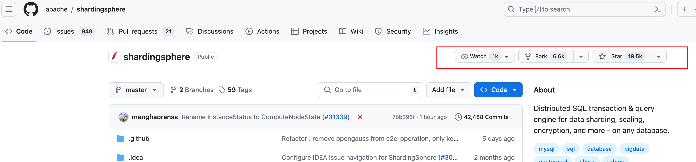
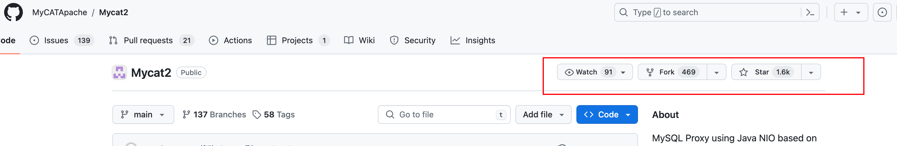
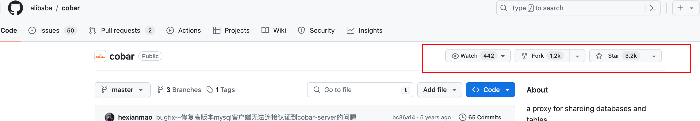
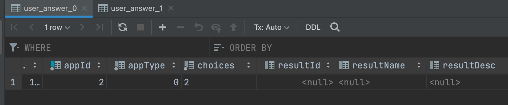
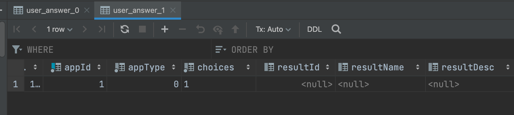

### 一、需求分析

如果平台发展迅速，用户量激增，从数据库层面去思考，以考试作答系统为例，哪个表的数据会最大呢？

数据库设计：


1）app 应用表

显然不会，成百上千的应用已经多，但对数据库而已，这还是小量级

2）question 题目表

不太可能，一个应用一般最多也就几十个题目

3）scoring_result 评分结果表

不太可能，一个应用对应不会有多少结果，比如 MBTI 也就 16 个。

4）user 表

有可能，如果用户达到几千万级，那么确实挺多了

5）user_answer 用户答题记录表

一个用户可以对同个应用多次答题，也可以在多个应用多次答题，理论上如果用户量足够大，那么这个表肯定是最先遇到瓶颈的。

除了清理数据外，常见的一种优化方案是分库分表。

### 二、分库分表概念

先简单了解下分库分表的场景。

随着用户量的激增和时间的堆砌，存在数据库里面的数据越来越多，此时的数据库就会产生瓶颈，出现资源报警、查询慢等场景。

首先单机数据库所能承载的连接数、I/O 及网络的吞吐等都是有限的，所以当并发量上来了之后，数据库就渐渐顶不住了。

而且如果单表的数据量过大，查询的性能也会下降。因为数据越多底层存储的 B+ 树就越高，树越高则查询 I/O 的次数就越多，那么性能也就越差。

分库和分表怎么区分呢？

把以前存在 **一个数据库** 实例里的数据拆分成多个数据库实例，部署在不同的服务器中，这是分库。

把以前存在 **一张表** 里面的数据拆分成多张表，这是分表。

一般而言：

- 分表：是为了解决由于单张表数据量多大，而导致查询慢的问题。大致三、四千万行数据就得拆分，不过具体还是得看每一行的数据量大小，有些字段都很小的可能支持更多行数，有些字段大的可能一千万就顶不住了。
- 分库：是为了解决服务器资源受单机限制，顶不住高并发访问的问题，把请求分配到多台服务器上，降低服务器压力。

比如电商网站的使用人数不断增加， 用户数不断增加，订单数也日益增长，此时就应该把用户库和订单库拆开来，这样就能降低数据库的压力，且对业务而言数据分的也更清晰，并且理论上订单数会远大于用户数，还可以针对订单库单一升配。

由于电商网站品类不断增加，在促销活动的作用下订单取得爆炸式增长，如果所有订单仅存储在一张表中，这张表得有多大？

因此此时就需要根据订单表进行分表，可以按时间维度，比如 order_202401、order_202402 来拆分，如果每天的订单量很大，则可以通过 order_20240101、order_20240102 这样拆分。

### 三、技术选型

#### 1、通用选型思路

在公司内如果进行技术选型，一般有以下几个考察点：

1）场景适配，考察选择的框架或组件所提供的功能是否符合当前的需求。

2）团队能力，考察当前团队是否有能力使用和运维选择的三方框架和组件。比如团队没人会 c++ ，你选个 c++ 开发的组件，这可能不太合适，后续遇到问题一脸懵逼，学习成本大。

3）技术栈匹配度，考察引入的组件是否有很多附带的依赖，比如引入 rpc 框架，可能需要配套引入注册中心、配置中心等等，需要确认目前项目是否已经拥有这部分能力，评估成本。

4）社区与生态，选择的开源组件社区是否活跃，资料是否丰富，不要如果遇到个小众的不活跃的社区，出了 bug 可能都没人修，且需要观察生态，比如我们用spring 生态就很好，基本上 java 需要的能力例如 orm 支持、大数据支持等等都有，如果选择生态不好的，后续要进行一些扩展这部分的成本也很大。

主要是以上四点，最终就是考虑成本和收益再做决定。

#### 2、分库分表开源组件选型

常见的分库分表开源组件有：ShardingSphere、MyCat、Cobar 等。

官方文档：https://github.com/apache/shardingsphere



官方文档：https://github.com/MyCATApache/Mycat21671423090896154626_0.40376985789512365



官方文档：https://github.com/alibaba/cobar



看下 star 数其实就有个选择预期了，Sharding-JDBC 相比而言功能更丰富，还支持读写分离、数据脱敏、分布式事务等等。

并且 ShardingSphere 不仅支持嵌入式的 Sharding-JDBC，还支持 Sharding-Proxy（独立代理服务）和Sharding-Sidecar（服务网格模式）。

再者 ShardingSphere 非常活跃，社区庞大且资料丰富，项目迭代也非常快，毕竟是 apache 项目。

因此本项目选择 ShardingSphere 内的 Sharding-JDBC。

### 四、Sharding-JDBC 原理

Sharding-JDBC 核心原理其实很简单，可以用几个字总结：**改写SQL** 

比如我们想根据 appId 来将对应的用户答题记录表进行分表。

将 appId % 2 等于 0 的应用的所有用户的答题记录都划分到 user_answer_0，等于 1 的应用的所有用户的答题记录都划分到 user_answer_1。

按照我们正常的想法处理逻辑就是：

```java
if（appId % 2 == 0）{
	userAnswer0Service.save(userAnswer);
} else {
	userAnswer1Service.save(userAnswer);
}
```

而用了 Sharding-JDBC 后，我们只要写好配置，Sharding-JDBC 就会根据配置，执行我们上面的逻辑，在业务代码上我们就可以透明化分库分表的存在，减少了很多重复逻辑！

它会解析 SQL ，根据我们指定的 **分片键**，按照我们设置的逻辑来计算得到对应的路由分片（数据库或者表），最终改写 SQL 后进行 SQL 的执行。

### 五、方案设计

分库分表的核心是确定按照什么维度（或者字段）进行拆分，一般会选择唯一的、业务合理的、能够均匀分配的字段。

个人建议：你在哪个字段加索引，就用哪个字段分表，核心在于用户的查询，一定要根据业务的实际情况来。尽量避免出现跨表和跨库查询。

对于本项目，user_answer 有个天然的拆分字段即 appId，不同应用的用户答题记录没有关联，因此我们可以根据 appId 拆解 user_answer 表。

实现流程比较简单：

1. 新建 user_answer_0 和 user_answer_1，作为 user_answer 表的分表
2. 引入 Sharding-JDBC
3. 配置文件中设置分表逻辑

### 六、后端开发

1）新建表，直接复制 user_answer 的 DDL 表结构，改个名称即可。

```sql
create table if not exists user_answer_xxx
(
  id              bigint auto_increment primary key,
  appId           bigint                             not null comment '应用 id',
  appType         tinyint  default 0                 not null comment '应用类型（0-得分类，1-角色测评类）',
  choiceJson      text                               not null comment '用户答案',
  resultId        bigint                             null comment '评分结果 id',
  resultName      varchar(128)                       null comment '结果名称，如物流师',
  resultDesc      text                               null comment '结果描述',
  resultPicture   varchar(1024)                      null comment '结果图标',
  resultScore     int                                null comment '得分',
  scoringStrategy tinyint  default 0                 not null comment '评分策略（0-自定义，1-AI）',
  userId          bigint                             not null comment '用户 id',
  createTime      datetime default CURRENT_TIMESTAMP not null comment '创建时间',
  updateTime      datetime default CURRENT_TIMESTAMP not null on update CURRENT_TIMESTAMP comment '更新时间',
  isDelete        tinyint  default 0                 not null comment '是否删除',
  index idx_appId (appId),
  index idx_userId (userId)
) comment '用户答题记录' collate = utf8mb4_unicode_ci;
```

2）maven 引入 Sharding-JDBC 依赖：

```xml
<dependency>
  <groupId>org.apache.shardingsphere</groupId>
  <artifactId>shardingsphere-jdbc-core-spring-boot-starter</artifactId>
  <version>5.2.0</version>
</dependency>
```

仅需在 application.yml 配置一下参数：

```yaml
spring:
shardingsphere:
#数据源配置
datasource:
# 多数据源以逗号隔开即可
names: yudada
yudada:
type: com.zaxxer.hikari.HikariDataSource
driver-class-name: com.mysql.cj.jdbc.Driver
jdbc-url: jdbc:mysql://localhost:3306/yudada?allowPublicKeyRetrieval=true&useSSL=false&autoReconnect=true&characterEncoding=utf8
username: root
password: 123456
# 规则配置
rules:
sharding:
# 分片算法配置
sharding-algorithms:
# 自定义分片规则名
answer-table-inline:
## inline 类型是简单的配置文件里面就能写的类型，其他还有自定义类等等
type: INLINE
props:
algorithm-expression: user_answer_$->{appId % 2}
tables:
user_answer:
actual-data-nodes: yudada.user_answer_$->{0..1}
# 分表策略
table-strategy:
standard:
sharding-column: appId
sharding-algorithm-name: answer-table-inline
```

配置解析：

1）需要将数据源挪至 shardingsphere 下

2）定于数据源的名字和 url 等配置

3）自定义分片规则，即 answer-table-inline，分片算法为 user_answer_$->{appId % 2} ，这个含义就是根据 appId % 2 的结果拼接表名，改写 SQL

4）设置对应的表使用分片规则，即 tables:user_answer:table-strategy，指定分片键为 appId，分片的规则是 answer-table-inline

### 七、验证测试

新建表和配置后，直接使用单元测试即可测试结果：

```java
@SpringBootTest
public class UserAnswerShardingTest {

    @Resource
    private UserAnswerService userAnswerService;

    @Test
    void test() {

        UserAnswer userAnswer1 = new UserAnswer();

        userAnswer1.setAppId(1L);
        userAnswer1.setUserId(1L);
        userAnswer1.setChoices("1");
        userAnswerService.save(userAnswer1);

        UserAnswer userAnswer2 = new UserAnswer();
        userAnswer2.setAppId(2L);
        userAnswer2.setUserId(1L);
        userAnswer2.setChoices("2");
        userAnswerService.save(userAnswer2);

        UserAnswer userAnswerOne = userAnswerService.getOne(Wrappers.lambdaQuery(UserAnswer.class).eq(UserAnswer::getAppId, 1L));
        System.out.println(JSONUtil.toJsonStr(userAnswerOne));

        UserAnswer userAnswerTwo = userAnswerService.getOne(Wrappers.lambdaQuery(UserAnswer.class).eq(UserAnswer::getAppId, 2L));
        System.out.println(JSONUtil.toJsonStr(userAnswerTwo));
    }
}
```

观察数据库中两张表的数据：



1671423090896154626_0.9453560921366477

注意，分表后，一定不能更新分表字段！

如果有报错，可以把 appId 的更新设置为空来解决：

```java
try {
    UserAnswer userAnswerWithResult = scoringStrategyExecutor.doScore(choices, app);
    userAnswerWithResult.setId(newUserAnswerId);
    userAnswerWithResult.setAppId(null);
    userAnswerService.updateById(userAnswerWithResult);
} catch (Exception e) {
    e.printStackTrace();
    throw new BusinessException(ErrorCode.OPERATION_ERROR, "评分错误");
}
```