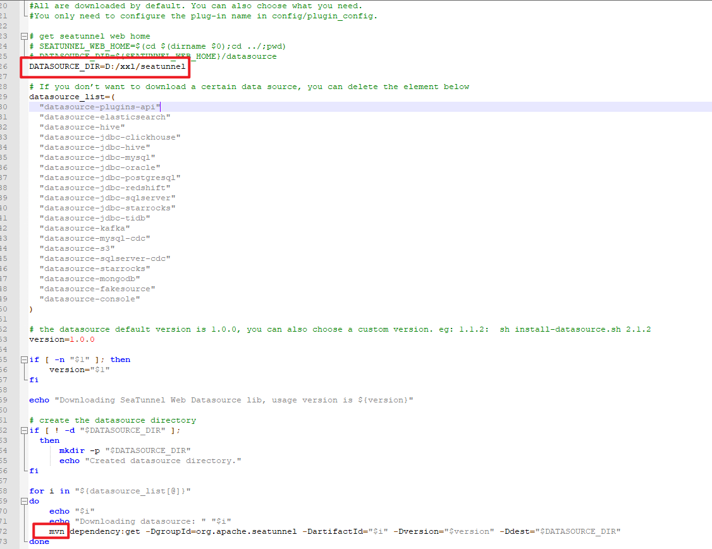

SeaTunnel 与 DataX 、Sqoop、Flume、Flink CDC 对比：https://cloud.tencent.com/developer/article/2401413

https://blog.csdn.net/thc1987/article/details/131240445

https://blog.csdn.net/u013995172/article/details/134422053

https://blog.csdn.net/qq_41865652/article/details/134574104

https://www.cnblogs.com/DolphinScheduler/p/18989962

## 一、安装seatunnel

> 官方文档：[https://seatunnel.incubator.apache.org/docs/2.3.3/about/](https://seatunnel.incubator.apache.org/docs/2.3.3/about/)

### 1、准备工作

所需软件包及版本要求

- JDK >= 1.8.151

- Maven >= 3.6.3
- MySQL >= 5.7.28

下载地址：[https://seatunnel.apache.org/download](https://seatunnel.apache.org/download)

准备安装版本：`apache-seatunnel-2.3.11-bin.tar.gz`

### 2、解压软件

~~~sh
sudo tar -zxvf apache-seatunnel-2.3.11-bin.tar.gz
# 指定目录 -C ./seatunnel
~~~

### 3、配置环境变量

在`/etc/profile.d/seatunnel.sh`中配置环境变量

~~~sh
export SEATUNNEL_HOME=/home/disk2/tools/apache-seatunnel-2.3.11
export PATH=$SEATUNNEL_HOME/bin:$PATH
~~~

让修改配置立即生效

~~~sh
source /etc/profile
~~~

检查生效

~~~sh
echo $SEATUNNEL_HOME
~~~

### 4、下载连接器插件

从2.2.0-beta版本开始，二进制包不再默认提供连接器依赖，因此在第一次使用时，需要执行以下命令来安装连接器：(当然，也可以从 [Apache Maven Repository](https://repo.maven.apache.org/maven2/org/apache/seatunnel/) 手动下载连接器，然后将其移动至`connectors/`目录下，如果是2.3.5之前则需要放入`connectors/seatunnel`目录下)。

~~~sh
./bin/install-plugin.sh
~~~

如果需要指定的连接器版本，以2.3.12为例

~~~sh
./bin/install-plugin.sh 2.3.12
~~~

通常情况下，不需要所有的连接器插件。可以通过配置`config/plugin_config`来指定所需的插件。例如，如果想让示例应用程序正常工作，只需要`connector-console`和`connector-fake`插件。可以修改`plugin_config`配置文件，如下所示：

~~~sh
--seatunnel-connectors--
connector-fake
connector-console
connector-cdc-mysql
connector-cdc-mongodb
--end--
~~~

### 5、测试验证

~~~sh
#进入安装目录
cd /home/disk2/tools/apache-seatunnel-2.3.11/
#启动服务
./bin/seatunnel.sh --config ./config/v2.batch.config.template -e local
~~~

**查看输出**：当您运行该命令时，可以在控制台中看到它的输出。

SeaTunnel控制台将会打印一些如下日志信息：观察到日志有如下信息表示运行测试成功。

~~~sh
***********************************************
     CoordinatorService Thread Pool Status
***********************************************
activeCount               :                   1
corePoolSize              :                  10
maximumPoolSize           :          2147483647
poolSize                  :                   1
completedTaskCount        :                   0
taskCount                 :                   1
***********************************************
~~~

### 6、启动服务

~~~sh
#进入安装目录
cd /home/disk2/tools/apache-seatunnel-2.3.11/
#启动服务
nohup sh bin/seatunnel-cluster.sh 2>&1 &
~~~

在seatunnel的安装目录下查看日志

~~~sh
tail -f logs/seatunnel-engine-server.log
~~~

有以下类似信息打印出，说明启动成功。

~~~sh
[] 2025-07-30 17:20:14,956 INFO  [o.a.s.e.s.CoordinatorService  ] [pool-7-thread-1] - [localhost]:5801 [seatunnel] [5.1] 
***********************************************
     CoordinatorService Thread Pool Status
***********************************************
activeCount               :                   1
corePoolSize              :                  10
maximumPoolSize           :          2147483647
poolSize                  :                   2
completedTaskCount        :                   1
taskCount                 :                   2
***********************************************

[] 2025-07-30 17:20:14,957 INFO  [o.a.s.e.s.CoordinatorService  ] [pool-7-thread-1] - [localhost]:5801 [seatunnel] [5.1] 
***********************************************
                Job info detail
***********************************************
createdJobCount           :                   0
scheduledJobCount         :                   0
runningJobCount           :                   0
failingJobCount           :                   0
failedJobCount            :                   0
cancellingJobCount        :                   0
canceledJobCount          :                   0
finishedJobCount          :                   0
~~~

必须保证Apache SeaTunnel的Server正常运行，Web端服务才能正常运行。

## 二、安装seatunnel-web

> 官方文档：https://seatunnel.apache.org/zh-CN/seatunnel_web/1.0.0/about

### 1、准备工作

下载地址：[https://seatunnel.apache.org/download](https://seatunnel.apache.org/download)

准备安装版本：`apache-seatunnel-web-1.0.2-bin.tar.gz`

注意：在seatunnel的web端机器上需要先部署seatunnel客户端。

### 2、解压软件

~~~sh
sudo tar -zxvf apache-seatunnel-web-1.0.2-bin.tar.gz
# 指定目录 -C ./seatunnel-web
~~~

### 3、初始化数据库

#### 修改配置

将`script/seatunnel_server_env.sh`相关配置改为你的对应的数据库信息

~~~sh
export HOSTNAME="127.0.0.1"
export PORT="3306"
export USERNAME="root"
export PASSWORD="123456"
~~~

此处`HOSTNAME,PORT`等名称容易与系统其他名称冲突，加上前缀`STWEB_`

~~~sh
export STWEB_HOSTNAME="127.0.0.1"
export STWEB_PORT="3306"
export STWEB_USERNAME="root"
export STWEB_PASSWORD="123456"
~~~

给`script/init_sql.sh`相关变量加上前缀`STWEB_`

~~~sh
workDir=`dirname $0`
workDir=`cd ${workDir};pwd`

source ${workDir}/seatunnel_server_env.sh

usage="Usage: seatunnel_server_env.sh must contain hostname/port/username/password."

if [[ ! -n "${STWEB_HOSTNAME}" ]]  || [[ ! -n "${STWEB_PORT}" ]] || [[ ! -n "${STWEB_USERNAME}" ]] || [[ ! -n "${STWEB_PASSWORD}" ]]; then
    echo $usage
    exit 1
fi

mysql -h${HOSTNAME} -P${PORT} -u${USERNAME} -p${PASSWORD} < ${workDir}/seatunnel_server_mysql.sql
~~~

#### 执行初始化数据库命令

执行命令`sh init_sql.sh`，无异常则执行成功。注意需要输入一遍确认密码。

~~~sh
root@ekroot-b760mds3hddr4:/home/disk2/tools/apache-seatunnel-web-1.0.2/script# ./init_sql.sh
mysql: [Warning] option 'port': value -u adjusted to 0.
Enter password:
~~~

### 4、配置后端服务

#### 修改端口与数据源

web后端服务的配置文件都在`${web安装目录}/conf`下

`conf/application.yml`修改端口号和数据源信息

~~~yaml
server:
  port: 8801

spring:
  application:
    name: seatunnel
  jackson:
    date-format: yyyy-MM-dd HH:mm:ss
  datasource:
    driver-class-name: com.mysql.cj.jdbc.Driver
    url: jdbc:mysql://localhost:3306/seatunnel?useSSL=false&useUnicode=true&characterEncoding=utf-8&allowMultiQueries=true&allowPublicKeyRetrieval=true
    username: root
    password: 123456
  mvc:
    pathmatch:
      matching-strategy: ant_path_matcher

jwt:
  expireTime: 86400
  # please add key when deploy
  secretKey:
  algorithm: HS256

---
spring:
  config:
    activate:
      on-profile: h2
  sql:
    init:
      schema-locations: classpath*:script/seatunnel_server_h2.sql
  datasource:
    driver-class-name: org.h2.Driver
    url: jdbc:h2:mem:seatunnel;MODE=MySQL;DB_CLOSE_DELAY=-1;DATABASE_TO_LOWER=true
    username: sa
    password: sa
  h2:
    console:
      enabled: true
      path: /h2
      settings:
        trace: false
        web-allow-others: false
~~~

#### 配置client信息

将seatunnel引擎服务节点的安装目录下的config目录下的关于引擎客户端的配置文件拷贝到seatunnel-web安装目录下的conf目录下，同一台机器下部署直接使用以下拷贝命令（注意修改服务的安装目录为你自己的安装目录）

~~~sh
# 当前目录 /home/disk2/tools/apache-seatunnel-web-1.0.2
sudo cp /home/disk2/tools/apache-seatunnel-2.3.11/config/hazelcast-client.yaml ./conf/
~~~

#### 配置支持的插件信息

将seatunnel引擎服务节点的安装目录下的connectors目录下的`plugin-mapping.properties`配置文件拷贝到seatunnel-web安装目录下的conf目录下，同一台机器下部署直接使用以下拷贝命令（注意修改服务的安装目录为你自己的安装目录）

~~~sh
sudo cp /home/disk2/tools/apache-seatunnel-2.3.11/connectors/plugin-mapping.properties ./conf/
~~~

### 5、下载配置数据源JAR包

配置jar包非常关键，否则会出现各种各样的问题，常见的有：

1.没有数据源可以进行创建

2.没有source或者sink进行选择

3.配置好任务后无法执行

#### 配置元数据mysql的jar包

将`mysql-connector-java-8.0.15.jar`包复制到`/opt/seatunnel/web/apache-seatunnel-web-1.0.0-bin/libs`

#### 配置数据源jar包

脚本在`bin/download_datasource.sh`

直接执行脚本

~~~
./bin/download_datasource.sh ./libs
~~~

或者

复制带windows上，使用本地maven加速下载

使用git自带的ssh工具

~~~
sh download_datasource.sh
~~~

报错

~~~
yum安装的jdk没有环境变量，直接在脚本中显式设置（更推荐在环境变量中设置）

export JAVA_HOME=/home/disk2/tools/jdk-11.0.10/
export PATH=$JAVA_HOME/bin:$PATH
~~~

报错

~~~
org.springframework.beans.factory.BeanCreationException: Error creating bean with name 'connectorCache' defined in URL [jar:file:/home/disk2/tools/apache-seatunnel-web-1.0.2/libs/seatunnel-app-1.0.2.jar!/org/apache/seatunnel/app/bean/connector/ConnectorCache.class]: Instantiation of bean failed; nested exception is org.springframework.beans.BeanInstantiationException: Failed to instantiate [org.apache.seatunnel.app.bean.connector.ConnectorCache]: Constructor threw exception; nested exception is java.lang.NoClassDefFoundError: org/apache/seatunnel/api/table/factory/ChangeStreamTableSourceFactory
~~~

