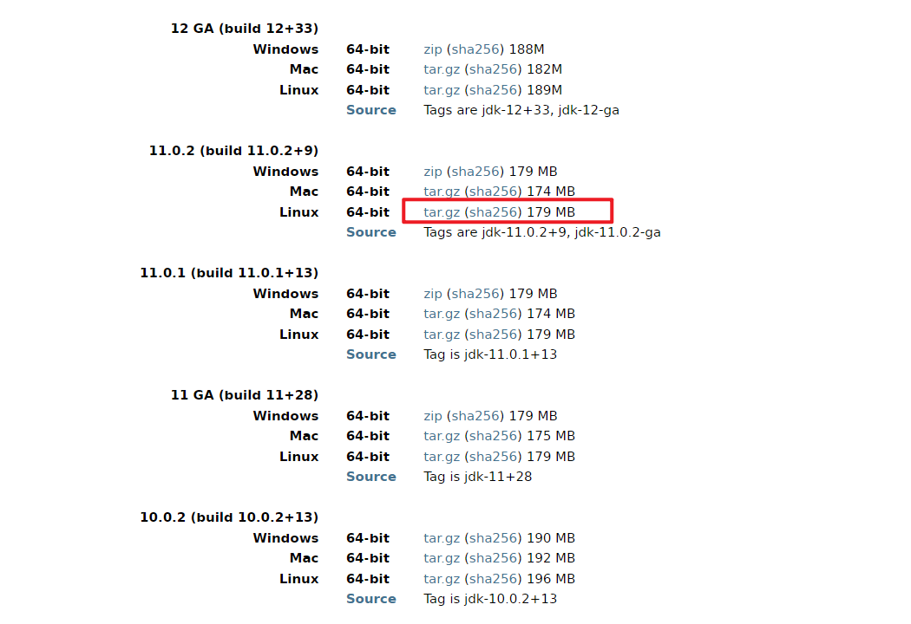
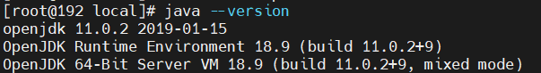

## OpenJDK安装

### 下载软件包

下载链接：http://jdk.java.net/archive/

找到自己要下载的OpenJDK版本

### 下载完成之后上传服务器并解压

~~~sh
#将下载的包上传到服务器上
#将包放到/usr/local/目录
mv openjdk-11.0.2_linux-x64_bin.tar.gz /usr/local/

#进入/usr/local并解压删除压缩包
cd /usr/local/ && tar xf openjdk-11.0.2_linux-x64_bin.tar.gz && rm -rf openjdk-11.0.2_linux-x64_bin.tar.gz
~~~

### 添加环境变量

~~~sh
#添加环境变量（使用追加方式添加）
echo "export PATH=/usr/local/jdk-11.0.2/bin:$PATH" >> /etc/profile

#不放心可以查看一下环境变量
tail -1 /etc/profile

#生效环境变量
source /etc/profile
~~~

### 验证JDK是否安装成功

~~~sh
#查看jdk版本
java --version
~~~

显示JDK11，安装成功。

## 参考资料

https://blog.csdn.net/liu_chen_yang/article/details/129318513

https://blog.csdn.net/qq_35112567/article/details/131832497