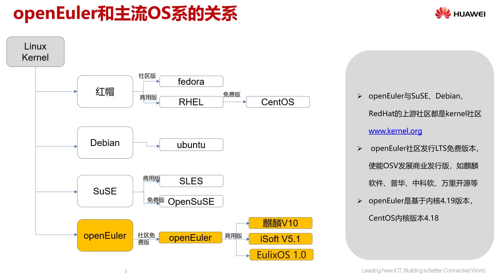

## 一、OpenEuler简介

> 欧拉系统官网：https://www.openeuler.openatom.cn/zh/

### 1、什么是欧拉

~~~
欧拉是数字基础设施的开源操作系统，可广泛部署于服务器、云计算、边缘计算、嵌入式等各种形态设备，应用场景覆盖IT（Information Technology）、CT（Communication Technology）和OT（Operational Technology），实现统一操作系统支持多设备，应用一次开发覆盖全场景。

openEuler操作系统开源以来，获得了产业界的积极响应，已经有三百家企业、近万名社区开发者加入，成为中国极具活力的开源社区，目前欧拉商用已经突破60万套。2021年9月，华为全新升级欧拉，从服务器操作系统，升级为数字基础设施的操作系统，支持IT、CT、OT等数字基础设施全场景，覆盖服务器、云计算、边缘计算、嵌入式等各种形态的设备。

目前，欧拉和鸿蒙实现了内核技术共享，未来将进一步在分布式软总线、安全OS、设备驱动框架、以及新编程语言等方面实现共享。通过能力共享，实现生态互通及云边端协同，更好地服务数字化全场景。

欧拉的定位是瞄准国家数字基础设施的操作系统和生态底座。捐赠给开放原子开源基金会，汇聚更多产业力量，对于打造数字中国坚实底座具有重要价值，欧拉也将成为全产业共同拥有的开源生态。为了更好的推动数字区域数字经济发展，华为联合北京、广州、深圳、成都、武汉、南京全国6大城市、协同8家操作系统伙伴共同启动首批“欧拉生态创新中心”，进一步深化欧拉生态的全国布局。

                                                            ​ ——华为云开发者社区
~~~

### 2、欧拉的优势

https://bbs.huaweicloud.com/blogs/327740

## 二、OpenEuler安装

vmware安装openEuler：https://blog.csdn.net/qq_45945548/article/details/120520237

安装openEuler可视化界面：https://blog.csdn.net/qq_50824019/article/details/124526889

