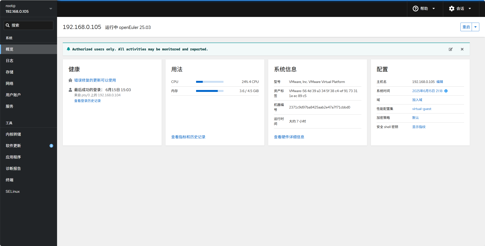

## 一、简介

一登录 centos8, 就提示信息

~~~
Authorized users only. All activities may be monitored and reported.
Activate the web console with: systemctl enable --now cockpit.socket
~~~

这个是什么意思呢? 其实这个就是想让你开启cockpit服务。这条命令就是要把cockpit设置为开机自启动并且立刻运行起来，Cockpit 是红帽开发的网页版图像化服务管理工具，官方是说“Cockpit 是一个交互式 Linux 服务器管理接口”，说白了就是给你提供个web页面来管理cneots8服务器，听说这个服务还是非常好用的，后面会更新看下这个服务的具体使用。

参考资料：https://zhuanlan.zhihu.com/p/113270502

界面如下：



## 二、Cockpit更换端口

修改 Cockpit 端口

**编辑配置文件**： 打开 Cockpit 的配置文件 *cockpit.socket*。 

~~~sh
sudo nano /etc/systemd/system/sockets.target.wants/cockpit.socket
~~~

**修改端口**： 找到 *[Socket]* 部分，并将 *ListenStream* 的值修改为所需的端口号，例如 9091。

~~~sh
 [Socket] ListenStream=9091
~~~

完整配置如下

~~~sh
[Unit]
Description=Cockpit Web Service Socket
Documentation=man:cockpit-ws(8)
Wants=cockpit-motd.service

[Socket]
ListenStream=9091
ExecStartPost=-/usr/share/cockpit/motd/update-motd '' localhost
ExecStartPost=-/bin/ln -snf active.motd /run/cockpit/motd
ExecStopPost=-/bin/ln -snf inactive.motd /run/cockpit/motd

[Install]
WantedBy=sockets.target
~~~

**重新加载 systemd 配置**： 保存并关闭文件后，重新加载 systemd 配置以应用更改。

~~~sh
sudo systemctl daemon-reload
~~~

**重启 Cockpit 服务**： 最后，重启 Cockpit 服务以使更改生效。 

~~~sh
sudo systemctl restart cockpit.socket
~~~

注意事项

**防火墙配置**：确保新的端口在防火墙中已开放，以便外部访问。

**SELinux 配置**：如果启用了 SELinux，可能需要更新 SELinux 策略以允许新的端口。


## 三、更换端口不生效

修改完端口后启动报错

查看日志

~~~sh
journalctl -u cockpit.socket --since "5 minutes ago"
~~~

内容如下

~~~sh
6月 15 17:11:27 192.168.0.105 systemd[1]: cockpit.socket: Failed to create listening socket ([::]:9091): Permission>
6月 15 17:11:27 192.168.0.105 systemd[1]: cockpit.socket: Failed to listen on sockets: Permission denied
6月 15 17:11:27 192.168.0.105 systemd[1]: Starting Cockpit Web Service Socket...
6月 15 17:11:27 192.168.0.105 systemd[1]: cockpit.socket: Failed with result 'resources'.
6月 15 17:11:27 192.168.0.105 systemd[1]: Failed to listen on Cockpit Web Service Socket.
~~~

关键信息如下：

- **`Permission denied`**：表示 systemd 无法绑定到你指定的端口（如 `9091`）。
- **通常是 SELinux、firewalld 或系统权限限制** 导致。

### 🔒 原因一：SELinux 阻止了绑定低编号端口（<1024）

虽然你使用的是 `9091`（>1024），但有时 SELinux 仍然会阻止非标准服务监听某些端口。

#### 🧪 检查 SELinux 状态：

bash深色版本

```
sestatus
```

如果输出是 `enabled`，说明 SELinux 是开启的。

#### 🛠 解决方法：

你可以临时禁用 SELinux 测试是否与此有关：

bash深色版本

```
setenforce 0
```

然后尝试重启服务：

bash深色版本

```
systemctl daemon-reload
systemctl restart cockpit.socket
```

✅ 如果成功了，说明确实是 SELinux 的问题。

#### 永久解决（推荐）：

创建一个 SELinux 策略允许 `cockpit` 监听新端口，比如 `9091`：

```
# 安装 semanage 工具（如果没有）
dnf install -y policycoreutils-python-utils

# 添加端口到允许列表
semanage port -a -t http_port_t -p tcp 9091

# 再次尝试启动
systemctl restart cockpit.socket
```

### 🧱 原因二：防火墙或 AppArmor（少见）

如果你修改了端口，但没有开放对应防火墙规则，也可能导致失败。

不过这个错误是 `Permission denied`，更可能是 SELinux 或内核权限问题。


### 🗃️ 原因三：系统限制（Capabilities）

Cockpit 使用 systemd socket 激活方式运行，默认不需要 root 权限，但如果绑定某些特殊端口或功能受限，也可能会失败。

检查 `/usr/lib/systemd/system/cockpit.socket` 中的 `[Socket]` 配置是否异常。

修复完整流程

~~~sh
# 查看 SELinux 状态
sestatus

# 安装 semanage（如未安装）
dnf install -y policycoreutils-python-utils

# 允许 9091 端口
semanage port -a -t http_port_t -p tcp 9091

# 修改 cockpit.socket 文件中的 ListenStream=9091
vim /usr/lib/systemd/system/cockpit.socket

# 重新加载并启动
systemctl daemon-reload
systemctl restart cockpit.socket

# 查看状态
systemctl status cockpit.socket

# 开放防火墙
firewall-cmd --permanent --add-port=9091/tcp
firewall-cmd --reload
~~~
