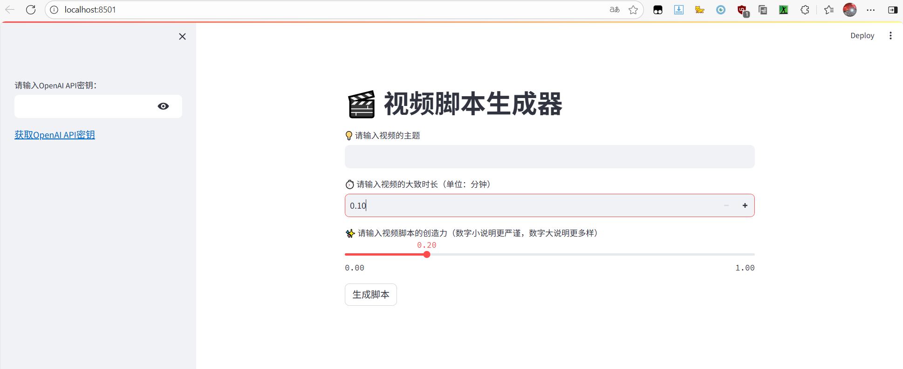

## 一、项目介绍

### 1、核心功能

- 实现视频脚本的一键生成，结合用户需求与外部信息，提升脚本的准确性和实时性。

### 2、界面与用户输入

1. **侧边栏**
   - 支持用户输入 API 密钥（如 OpenAI API 密钥），避免仅消耗开发者的 token。
   - 附官方网站链接，方便用户了解如何获取 API 密钥。
   - 可灵活适配其他大模型：若使用文心一言等，可替换输入提示语及后端模型；自用场景下，可移除输入框，直接在代码中嵌入密钥。
2. **主页面**
   - 用户需输入：视频主题（任意主题）、生成脚本的大致时长（任意数字）、创造力参数（范围 0-1，对应 AI 的 Temperature 参数：值越低，随机性和创造性越弱；值越高，随机性和创造性越强，可能出现意外回答）。

### 3、生成流程

1. **点击 “生成脚本” 后**
   - 先判断用户是否提供 API 密钥，若已提供，显示加载组件，提示用户 AI 正在生成。
   - 生成完成后，展示视频标题、脚本内容，以及维基百科搜索结果（用户可点击查看详情）。
2. **背后的增强机制**
   - 调用维基百科 API：在向 AI 模型发送请求前，先通过维基百科 API 获取相关内容，与用户需求结合后一并传给 AI。
   - 目的：弥补 AI 模型知识受训练日期限制的问题（例如 2024 年 2 月公开的 SORA 模型，此前训练的模型均不了解该内容），确保 AI 获得真实、实时的补充信息，避免胡编乱造。

## 二、创建项目及安装依赖项

### 1、创建项目文件夹

- 新建独立文件夹（如命名为`video-script-generator`），用于存放网站相关的所有代码、图片等资源，实现文件管理的规范化。

### 2、配置venv虚拟环境

1. **创建方式**：
   - PyCharm 创建项目时默认使用虚拟环境；其他编辑器可搜索对应方法（如`python -m venv 虚拟环境名`）。
2. **核心作用**：
   - **环境隔离**：为不同项目提供独立的开发环境，支持使用不同版本的 Python 解释器（如项目 1 用 3.8，项目 2 用 3.10）。
   - **依赖管理**：避免不同项目的依赖冲突（例如项目 1 需库 A 1.0 版本，项目 2 需库 A 1.1 版本时，不会相互影响）。
3. **注意事项**：
   - 缺点：每个虚拟环境会复制解释器和库，占用较多存储空间。
   - 例外：临时练习的小项目可省略虚拟环境。

### 3、处理依赖文件（requirements.txt）

1. **文件作用**：

   - 存储项目运行所需的所有依赖库及**精准版本号**，确保项目在不同环境中运行的一致性（避免因版本差异导致代码报错）。

2. **使用步骤**：

   - 从项目文件夹新建`requirements.txt`。

     ~~~txt
     aiofiles==23.2.1
     aiohttp==3.9.1
     aiosignal==1.3.1
     altair==5.2.0
     annotated-types==0.6.0
     anyio==3.7.1
     async-timeout==4.0.3
     attrs==23.1.0
     beautifulsoup4==4.12.2
     blinker==1.7.0
     Brotli==1.1.0
     cachetools==5.3.2
     certifi==2023.11.17
     charset-normalizer==3.3.2
     click==8.1.7
     dataclasses-json==0.6.3
     distro==1.8.0
     duckduckgo-search==3.9.9
     exceptiongroup==1.2.0
     frozenlist==1.4.0
     gitdb==4.0.11
     GitPython==3.1.40
     greenlet==3.0.1
     h11==0.14.0
     h2==4.1.0
     hpack==4.0.0
     httpcore==1.0.2
     httpx==0.25.2
     hyperframe==6.0.1
     idna==3.6
     importlib-metadata==6.8.0
     Jinja2==3.1.2
     jsonpatch==1.33
     jsonpointer==2.4
     jsonschema==4.20.0
     jsonschema-specifications==2023.11.2
     langchain==0.1.9
     langchain-community==0.0.24
     langchain-core==0.1.26
     langchain-openai==0.0.7
     langsmith==0.1.6
     lxml==4.9.3
     markdown-it-py==3.0.0
     MarkupSafe==2.1.3
     marshmallow==3.20.1
     mdurl==0.1.2
     multidict==6.0.4
     mypy-extensions==1.0.0
     numpy==1.26.2
     openai==1.12.0
     orjson==3.9.15
     packaging==23.2
     pandas==2.1.3
     Pillow==10.1.0
     protobuf==4.25.1
     pyarrow==14.0.1
     pydantic==2.5.2
     pydantic_core==2.14.5
     pydeck==0.8.1b0
     Pygments==2.17.2
     python-dateutil==2.8.2
     pytz==2023.3.post1
     PyYAML==6.0.1
     referencing==0.31.1
     regex==2023.12.25
     requests==2.31.0
     rich==13.7.0
     rpds-py==0.13.2
     six==1.16.0
     smmap==5.0.1
     sniffio==1.3.0
     socksio==1.0.0
     soupsieve==2.5
     SQLAlchemy==2.0.23
     streamlit==1.31.1
     tenacity==8.2.3
     tiktoken==0.6.0
     toml==0.10.2
     toolz==0.12.0
     tornado==6.4
     tqdm==4.66.1
     typing-inspect==0.9.0
     typing_extensions==4.8.0
     tzdata==2023.3
     tzlocal==5.2
     urllib3==2.1.0
     validators==0.22.0
     wikipedia==1.4.0
     yarl==1.9.3
     zipp==3.17.0
     ~~~

   - 在终端运行命令安装依赖：`pip install -r requirements.txt`，即可自动安装所有指定版本的库。

3. **文件生成方式**：

   - 若需自己生成，在虚拟环境中运行命令：`pip freeze > requirements.txt`，会将当前环境中所有安装包及版本号写入文件。

## 三、创建AI请求

### 1、文件与函数准备

1. 新建代码文件（如命名为`utils.py`），用于封装与 AI 大模型交互的代码。
2. 定义`generate_script`函数，接收参数：视频主题（`subject`）、时长（`duration`）、创造性（`creativity`）、API 密钥（`api_key`），用于生成视频标题和脚本。

### 2、提示模板定义

从`LangChain`导入`ChatPromptTemplate`，分别定义生成标题和脚本的提示模板：

- **标题模板（`title_template`）**：通过`from_messages`方法接收含变量（视频主题`subject`）的消息列表，用于生成视频标题。
- **脚本模板（`script_template`）**：同样用`from_messages`方法，消息列表包含多个变量（标题`title`、时长`duration`、维基百科搜索结果`wikipedia_search`），用于生成脚本内容。

### 3、模型配置

从`LangChain.OpenAI`导入聊天模型，配置`ChatOpenAI`：

- 传入用户提供的`api_key`。
- 将`creativity`参数值赋给模型的`temperature`（控制内容创造性，值越高创造性越强）。
- 若使用课程提供的 API 密钥，可补充`openai_api_base`参数。

### 4、链式调用与结果获取

1. **生成标题**：
   - 组装标题生成链（`TitleChain`），将`TitleTemplate`与模型结合。
   - 调用`TitleChain.invoke`，传入含`subject`（用户提供的视频主题）的字典，通过返回消息的`content`属性获取标题，存入`title`变量。
2. **获取维基百科搜索结果**：
   - 从`LangChain.Community.Utilities`导入`WikipediaAPIWrapper`，创建实例并设置`lang="zh"`（指定中文搜索，也可默认英文）。
   - 调用实例的`run`方法，传入视频主题作为搜索词，获取搜索结果摘要。
3. **生成脚本**：
   - 组装脚本生成链（`ScriptChain`），将`ScriptTemplate`与模型结合。
   - 调用`ScriptChain.invoke`，传入含`title`（生成的标题）、`duration`（用户提供的时长）、`wikipedia_search`（维基百科搜索结果）的字典，通过返回消息的`content`属性获取脚本内容。

### 5、结果返回与测试

- 函数最后返回视频标题、脚本内容、维基百科搜索结果。
- 测试时调用`GenerateScript`，传入测试用的视频主题、时长、创造性参数及 API 密钥，打印结果以验证逻辑（运行中若出现维基百科库的警告，一般可忽略，重点关注错误`error`）。

### 6、完整代码

~~~python
from langchain.prompts import ChatPromptTemplate
from langchain_openai import ChatOpenAI
from langchain_community.utilities import WikipediaAPIWrapper

# import os

def generate_script(subject, video_length, creativity, api_key):
    title_template = ChatPromptTemplate.from_messages(
        [
            ("human", "请为'{subject}'这个主题的视频想一个吸引人的标题")
        ]
    )
    script_template = ChatPromptTemplate.from_messages(
        [
            ("human",
             """你是一位短视频频道的博主。根据以下标题和相关信息，为短视频频道写一个视频脚本。
             视频标题：{title}，视频时长：{duration}分钟，生成的脚本的长度尽量遵循视频时长的要求。
             要求开头抓住限球，中间提供干货内容，结尾有惊喜，脚本格式也请按照【开头、中间，结尾】分隔。
             整体内容的表达方式要尽量轻松有趣，吸引年轻人。
             脚本内容可以结合以下维基百科搜索出的信息，但仅作为参考，只结合相关的即可，对不相关的进行忽略：
             ```{wikipedia_search}```""")
        ]
    )

    model = ChatOpenAI(openai_api_key=api_key, temperature=creativity)

    title_chain = title_template | model
    script_chain = script_template | model

    title = title_chain.invoke({"subject": subject}).content

    search = WikipediaAPIWrapper(lang="zh")
    search_result = search.run(subject)

    script = script_chain.invoke({"title": title, "duration": video_length,
                                  "wikipedia_search": search_result}).content

    return search_result, title, script

# print(generate_script("sora模型", 1, 0.7, os.getenv("OPENAI_API_KEY")))
~~~


## 四、创建网站页面

使用 Streamlit 开发视频脚本生成器前端

### 1、前期准备

1. **文件与依赖**
   - 删除 / 注释上一节中测试`generate_script`的代码。
   - 新建代码文件`main.py`（作为网站主页），导入`streamlit`库和上一节创建的`generate_script`函数（无需再导入 LangChain 相关库）。
2. **运行网页**
   - 给网页添加标题（如 “视频脚本生成器”），通过命令`streamlit run 文件名.py`运行网页，实时查看效果。

### 2、侧边栏设计（用户 API 密钥相关）

通过`with streamlit.sidebar:`创建侧边栏，缩进内容均显示在侧边栏中：

- **API 密钥输入框**：使用`st.text_input`，提示文字为 “请输入 OpenAI API 密钥”，设置`type="password"`隐藏输入内容，用变量保存输入的密钥（如`api_key`）。
- **API 密钥获取链接**：用`st.markdown`添加 Markdown 格式链接（语法：`[链接标签](链接地址)`），直达 OpenAI 官方密钥创建页面，方便用户获取密钥。

### 3、主页面组件（用户输入相关）

主页面组件无需缩进（避免归入侧边栏），包括：

1. **视频主题输入**：`st.text_input`，提示文字为 “请输入视频的主题”，结果保存到`subject`变量。
2. **视频时长输入**：`st.number_input`，提示文字为 “请输入视频的大致时长”，设置最小值`0.1`、步长`0.1`（每次增减 0.1），结果保存到`video_length`变量。
3. **创造力调节滑块**：`st.slider`，控制 AI 的`temperature`参数，设置最小值`0.0`、最大值`1.0`（避免过高导致内容混乱）、默认值`0.2`、步长`0.1`，结果保存到`creativity`变量。
4. **生成按钮**：`st.button`，文字为 “生成脚本”，返回布尔值（点击后为`True`），用于触发后续逻辑。

### 4、用户交互逻辑（点击按钮后处理）

1. **输入验证**：
   - 若用户点击按钮但未提供`api_key`：用`st.info`提示 “请输入 API 密钥”，调用`st.stop()`终止后续代码。
   - 若未提供`subject`：提示 “请输入视频的主题” 并终止。
   - 若`video_length`小于 0.1：提示 “视频时长需不小于 0.1” 并终止。
2. **调用后端函数与加载状态**：
   - 验证通过后，用`with st.spinner("AI正在生成脚本..."):`包裹`generate_script`调用，显示加载动画（动画持续至函数执行完毕）。
   - 调用`generate_script(subject, video_length, creativity, api_key)`，获取返回结果：维基百科搜索结果、视频标题、脚本内容。
3. **结果展示**：
   - 用`st.success("视频脚本生成成功！")`提示成功。
   - 展示标题：`st.subheader("视频标题")` + 生成的标题内容。
   - 展示脚本：`st.subheader("视频脚本")` + 生成的脚本内容。
   - 展示维基百科结果：用`st.expander("维基百科搜索结果")`创建折叠组件，内容放入其中（用户可自主展开查看）。

### 5、完整代码

~~~python
import streamlit as st
from utils import generate_script

st.title("🎬 视频脚本生成器")

with st.sidebar:
    openai_api_key = st.text_input("请输入OpenAI API密钥：", type="password")
    st.markdown("[获取OpenAI API密钥](https://platform.openai.com/account/api-keys)")

subject = st.text_input("💡 请输入视频的主题")
video_length = st.number_input("⏱️ 请输入视频的大致时长（单位：分钟）", min_value=0.1, step=0.1)
creativity = st.slider("✨ 请输入视频脚本的创造力（数字小说明更严谨，数字大说明更多样）", min_value=0.0,
                       max_value=1.0, value=0.2, step=0.1)
submit = st.button("生成脚本")

if submit and not openai_api_key:
    st.info("请输入你的OpenAI API密钥")
    st.stop()
if submit and not subject:
    st.info("请输入视频的主题")
    st.stop()
if submit and not video_length >= 0.1:
    st.info("视频长度需要大于或等于0.1")
    st.stop()
if submit:
    with st.spinner("AI正在思考中，请稍等..."):
        search_result, title, script = generate_script(subject, video_length, creativity, openai_api_key)
    st.success("视频脚本已生成！")
    st.subheader("🔥 标题：")
    st.write(title)
    st.subheader("📝 视频脚本：")
    st.write(script)
    with st.expander("维基百科搜索结果 👀"):
        st.info(search_result)
~~~

### 6、页面效果展示



