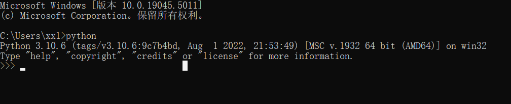
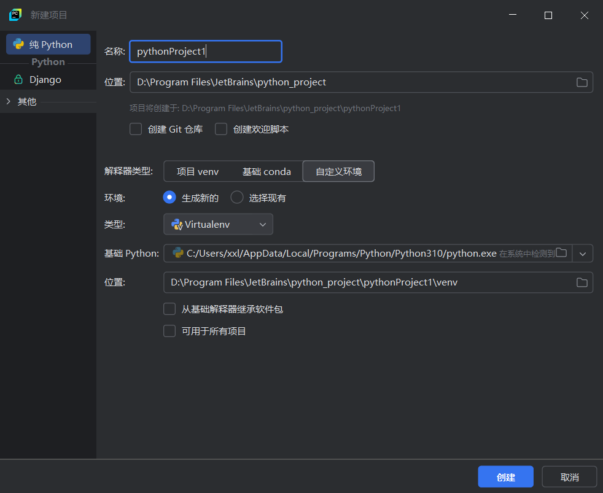
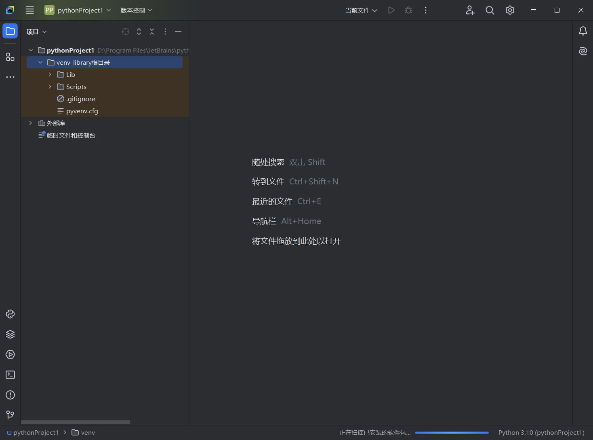

## 学习资料

视频资料：[https://www.bilibili.com/video/BV1944y1x7SW](https://www.bilibili.com/video/BV1944y1x7SW)


## 安装环境

安装Python解释器：[https://www.python.org](about:blank)

测试安装是否成功



安装PyCharm编辑器：[https://www.jetbrains.com/pycharm/download/](https://www.jetbrains.com/pycharm/download/)


## 创建第一个项目

新建项目


填写项目名称，选择一个项目位置，基础Python选择前面安装的版本，点击创建



项目会默认创建一个venv文件夹，标识这个项目独立的P原合同虚拟环境，它存在的目的是不同的项目使用不同的Python版本。




## 字符串操作

```python
# 字符串连接
print("hello" + "world！" + "!")
print('hello' + 'world！' + '!')

# 单双引号转义 \
print('He said "good"')
print("He said 'good'")
print("He said \"Let\'s go!\"")

# 换行 \n
print("Hello!\nHi!")

# 三引号跨行字符串
# 三组单引号或三组双引号，用三引号包裹住内容，Python会把新的一行当成内容的换行而不是代码语句的结束
print("""君不见高堂明镜悲白发，朝如青丝暮成雪。
人生得意须尽欢，莫使金樽空对月。
天生我材必有用，千金散尽还复来。
烹羊宰牛且为乐，会须一饮三百杯。
岑夫子，丹丘生，将进酒，杯莫停。
与君歌一曲，请君为我倾耳听。
钟鼓馔玉不足贵，但愿长醉不复醒。
古来圣贤皆寂寞，惟有饮者留其名。
陈王昔时宴平乐，斗酒十千恣欢谑。
主人何为言少钱，径须沽取对君酌。
五花马，千金裘，
呼儿将出换美酒，与尔同销万古愁。""")
```


## 变量

```python
greet = "你好！吃了吗，"
greet_chinese = greet
greet_english = "Yo what's up, "
greet = greet_english
print(greet + "张三")
print(greet_chinese + "张三")
```


## 变量命名规则

变量名命名规则

1. 只能由文字、数字、下划线组成
2. 不能有除下划线之外的符号
3. 不能有空格
4. 不能数字开头


Python3开始支持中文变量名，但控制台、日志不一定兼容，不推荐。

Python命名约定俗成是使用下划线命名法：

1. 字母全部小写
2. 不同单词用下划线分隔开

命名注意事项：

1. 变量名大小写敏感，大写跟小写会被看做两个不同的变量
2. 变量名不要占用Python的关键字


## 数学运算

Python中的符号说明：加（+）、减（-）、乘（*）、除（/）

运算顺序：括号()、乘方**、*/、+-


复杂运算需要导入math函数库

math函数官方文档：[https://docs.python.org/zh-cn/3/library/math.html](https://docs.python.org/zh-cn/3/library/math.html)


```python
import math

# 一元二次求根公式计算器
a = -1
b = -2
c = 3
print((-b + (b ** 2 - 4 * a * c) ** (1 / 2)) / (2 * a))
print((-b - (b ** 2 - 4 * a * c) ** (1 / 2)) / (2 * a))

print((-b + math.sqrt(b ** 2 - 4 * a * c)) / (2 * a))
print((-b - math.sqrt(b ** 2 - 4 * a * c)) / (2 * a))

delta = b ** 2 - 4 * a * c
print((-b + math.sqrt(delta)) / (2 * a))
print((-b - math.sqrt(delta)) / (2 * a))
```


## 注释

```python
# 单行注释 快捷键：control+/ 或 command+/

"""
多行注释
多行注释
多行注释
"""
```


## 数据类型

| 数据类型          | 示例           |
| ----------------- | -------------- |
| 字符串 str        | "hello" "呦！" |
| 整数 int          | 6 -32          |
| 浮点数 float      | 6.0 10.07      |
| 布尔类型 bool     | True False     |
| 空值类型 NoneType | None           |


```python
# 对字符串求长度
s = "hello world!"
print(len(s))

# 通过索引获取单个字符
print(s[0])
print(s[11])
print(s[len(s) - 1])

# 布尔类型
b1 = True
b2 = False

# 空值类型
n = None

# type函数
print(type(s))
print(type(b1))
print(type(n))
print(type(1.5))

# 错误测试：对布尔类型使用len函数
len(b1)
```


## 交互模式

不需要创建任何Python文件就可以运行

不需要用print就可以看到返回结果

所有输入的指令都不会被保存


## 获取输入

input函数可以获取输入，并把内容返回

```python
# 写法
input("这里是给用户的一些提示")
# 定义变量接收用户输入
user_age = input("请输入您的年龄")
print("知道了，你今年" + user_age + "岁了！")

# BMI = 体重 / (身高 ** 2)
user_weight = float(input("请输入您的体重（单位：kg）："))
user_height = float(input("请输入您的身高（单位：m）："))
user_BMI = user_weight / user_height ** 2
print("您的BMI值为：" + str(user_BMI))
```


## 条件语句

```python
mood_index = int(input("对象今天的心情指数是："))
if mood_index >= 60:
    print("恭喜，今晚应该可以打游戏！")
    print("去吧，皮卡丘！")
else:  # mood_index < 60
    print("为了自个儿小命，还是别打了。")
```


## 嵌套/多条件判断

```python
# BMI = 体重 / (身高 ** 2)
user_weight = float(input("请输入您的体重（单位：kg）："))
user_height = float(input("请输入您的身高（单位：m）："))
user_BMI = user_weight / user_height ** 2
print("您的BMI值为：" + str(user_BMI))

# 偏瘦：user_BMI <= 18.5
# 正常：18.5 < user_BMI <= 25
# 偏胖：25 < user_BMI <= 30
# 肥胖：user_BMI > 30
if user_BMI <= 18.5:
    print("此BMI值属于偏瘦范围。")
elif 18.5 < user_BMI <= 25:
    print("此BMI值属于正常范围。")
elif 18.5 < user_BMI <= 25:
    print("此BMI值属于偏胖范围。")
else:
    print("此BMI值属于肥胖范围。")
```


## 逻辑运算

Python中只有三个逻辑运算符号：与（and）、或（or）、非（not）

运算优先级：not > and > or


## 列表

```python
# 定义一个空列表
shopping_list = []
# 添加数据
shopping_list.append("键盘")
shopping_list.append("键帽")
print(shopping_list)
# 删除数据
shopping_list.remove("键帽")
print(shopping_list)

shopping_list.append("音箱")
shopping_list.append("电竞椅")
# 覆盖指定下标的数据
shopping_list[1] = "硬盘"
print(shopping_list)
print(len(shopping_list))
print(shopping_list[0])

price = [799, 1024, 200, 800]
# 列表中的最大值
max_price = max(price)
# 列表中的最小值
min_price = min(price)
# 列表排序
socket_price = sorted(price)
print(max_price)
print(min_price)
print(socket_price)

```


## 字典

字典中键的类型必须是**不可变**的。

可变数据类型：列表list；字典dict。

不可变数据类型：字符串str、整数int、浮点数float、布尔类型bool。


如果想在字典里使用列表，Python提供了**元组tuple**数据结构，元组的数据不可变，添加、删除元素等都不能操作。

元组为圆括号：`example_tuple = ("键盘", "键帽")`


字典跟列表一样也是可变的，可以添加、删除键值对

```python
# 字典创建方式
contacts = {"小明": "13700000000",
            "小花": "13700000001",
            "美女A": "18600000002"}
# 获取某个键的值
print(contacts["小明"])
# 某个键是否存在，【键 in 字典】会返回一个布尔值
print("小明" in contacts)
print("小明明" in contacts)
# 删除一个键值对，如果键不存在会报错
del contacts["小明"]
# 获取字典有多少键值对
print(len(contacts))
# 所有键
print(contacts.keys())
# 所有值
print(contacts.values())
# 所有键值对
print(contacts.items())

# 实践
# 结合input、字典、if判断，做一个查询流行语含义的电子词典程序
slang_dict = {
    "i人/e人": "2023年，一款名为MBTI的测试在年轻人中火了起来，取代星座成为最流行的社交标签。MBTI测试，即迈尔斯-布里格斯性格类型指标，是美国布莱格斯母女基于瑞士心理学家卡尔·荣格的人格分类理论研发的性格评估工具，现多被企业用来评估职员的性格特点和发展类型。“i人”和“e人”出自MBTI测试中代表“注意力方向”的两种倾向：内向内倾（Introversion）和外向外倾（Extroversion）。流行语中，“i人”泛指在社交中失去能量、一般来说性格内敛的人，而“e人”泛指在社交中获得能量、一般来说性格外向的人。这两种类型的人在社交行为上有显著差异：“i人”通常更喜欢独处，不太热衷于社交活动；而“e人”则喜欢与外部世界互动和交流。年轻人经常利用MBTI来探讨彼此的性格特点，彰显自我，接纳自我，求同存异。",
    "显眼包": "“显眼包”，原义是一个人过于张扬、爱出风头，甚至到了令人尴尬的地步。在互联网社交语境中，这个词却演变成褒义词，用来形容那些引人注目、个性鲜明的人或物。这个词的流行，部分得益于快手某网红主播。在直播中，该主播的一些出格行为和互动让粉丝们纷纷用“显眼包”来形容。“每个物种每个领域都有自己的显眼包。”这个词通过戏谑和夸张的方式，赞美那些敢于展示自我、不惧他人眼光的行为。"}
slang_dict[
    "特种兵旅游"] = "“特种兵旅游”，也作“特种兵式旅游”，指高强度的旅行方式，即在周末或节假日等有限的时间里，游览尽可能多的景点。其特点在于时间紧凑、游玩的景点多而花费低，因此广泛地受到大学生等年轻人群体的欢迎。“特种兵旅游”借用了“特种兵”这一军事领域的术语，暗示这种旅游方式的“极限挑战”特性：就像特种兵需要在严峻的环境下完成军事任务，“特种兵旅游”要快速、高效地完成旅游打卡的任务。"
slang_dict[
    "×门"] = "“×门”指一些人出于对某样东西超乎寻常的喜欢，遂聚集成一个虚拟阵营。此前多用于亚文化内部的圈子。真正让“×门（永存）”成为网络热词的，是某知名餐饮连锁品牌喜爱者自发形成的“麦门”。之后，“×门”就不再仅限于人物和饮食，诸如“猫门”“鼠门”等也在互联网上有一定数量的拥趸。值得注意的是，源自20世纪70年代的“水门事件”而产生的“名词+门”这一语法构式，此前有另外的语义——专门代指具有轰动效应的事件，大多是丑闻。"
slang_dict[
    "遥遥领先"] = "“遥遥领先”，本义是远远地走在最前面。2020年10月华为Mate40系列发布会上，余承东多次使用“遥遥领先”来形容华为手机在各项技术上与竞争对手的差距。2023年8月，华为宣布推出“HUAWEI Mate 60 Pro先锋计划”时，很多网友都用“遥遥领先”来调侃这一系列的产品。流行语中，这个词一方面被用来称赞技术创新和产品实力，另一方面也被用来微讽某种夸张的说话风格。"
slang_dict[
    "多巴胺××"] = "“多巴胺 ××”是在2023年夏天走红的网络流行语，起源于“多巴胺穿搭”，指运用高饱和色彩展现鲜艳明亮的服装风格。多巴胺原是一种神经传导物质，其特性是：当其分泌旺盛时，人会感到快乐和满足。“多巴胺穿搭”就是通过明亮的色彩搭配，刺激视觉感官，让人产生快乐和自信的感觉。后来出现了“多巴胺美甲”“多巴胺发型”“多巴胺文学”“多巴胺音乐”等多个说法。“多巴胺 ××”的趣味性在于，它将科学术语与时尚生活相结合，引导关注正向的情绪和积极的事物，以此对抗焦虑、阴暗的情绪。秋冬季还出现了借用化学反应名称描述棕色系服装的流行语——“美拉德穿搭”，也有着相似的趣味。"
slang_dict[
    "孔乙己文学"] = "“学历不但是敲门砖，也是我下不来的高台，更是孔乙己脱不下的长衫。”这是网友“失意书生”的独白，引来大量年轻人的共情，且登上了热搜。孔乙己是鲁迅小说中的一个角色，他在“四书”“五经”中耗尽年华，甚至沦落到乞讨度日却仍不肯脱下象征读书人身份的长衫。"
slang_dict[
    "公主/王子，请××"] = "“公主，请××”，源自抖音平台某博主的一个创作。视频里，一位父亲用粉色电瓶车接女儿，女儿要求父亲说一句“公主，请上车”才肯上车，结果父亲觉得是无理取闹，独自骑着电瓶车就走了。“公主，请上车”这句话最早来自电影《罗马假日》记者乔·布莱德利邀请安妮公主时的台词。短视频的这个梗在网络上迅速被网友接受，并进行了广泛的模仿和二次创作，比如 “公主请上班” “公主请下单”等。2023年11月，一款单车在用户扫码后会提示语音“尊贵的公主请上车”，让这个网络语流传得更广。“公主，请××”表达了女性寻求尊重和礼貌的心理。后来还衍生出男性的版本“王子，请××”。"
slang_dict[
    "你人还怪好的（嘞）"] = "“你人还怪好的（嘞）”，最早出自某视频博主。在视频中他模拟大学生心思单纯，轻易相信人贩子说的话，还不忘加上“您人还怪好的嘞”的称赞。之后，多个视频博主创作类似作品，场景大多是在火车站等公共场合，大学生要上洗手间或者有事走开的时候，无条件地信任陌生人，请他们帮忙看包，然后称赞对方一句：“你人还怪好嘞！”这句流行语背后反映的是涉世未深的大学生对于和谐人际关系与美好社会的想象与期待。在评论区走红之后，却常被用来吐槽一些明明伤害自己却又只能称赞对方的尴尬瞬间，比如一网友被蚊子咬了一手包的时候，会这么调侃：“蚊子，你人还怪好的嘞，请我吃自助大餐！”"
slang_dict[
    "挖呀挖呀挖"] = "“在小小的××里挖呀挖呀挖”，是由武汉幼师黄老师在抖音平台上传的童谣《花园种花》中的歌词句式。视频中，黄老师带领幼儿园的小朋友们用甜美的歌声和可爱的动作一起唱这首歌。原歌词“在小小的花园里面挖呀挖呀挖，种小小的种子，开小小的花”，通过重复的“小小”的用词和重复押韵的节奏，容易被人们记忆并模仿。随后各行各业的人开始以这首歌为模板，进行二次创意改编，多用来感叹工作的辛苦与疲惫。例如，打工人版：“在小小的公司里挖呀挖呀挖，挣得少少的工资，根本不够花。”调休版：“在短短的假期里面挖呀挖呀挖，在长长的调休日里乏呀乏呀乏。”此梗还与源于王宝钏故事的网络用语“挖野菜”结合，用以警醒年轻人不能盲目追求爱情，避免因为一些冲动行为而造成不好的结果。"

query = input("请输入您想要查询的流行语")
if query in slang_dict:
    print("您查询的" + query + "含义如下")
    print(slang_dict[query])
else:
    print("您查询的流行语暂未收录。")
    print("当前本词典收录词条数为：" + str(len(slang_dict)) + "条。")

```


## for循环

基本结构：

`for 变量名 in 可迭代对象`

```python
# for循环写法格式
# for 变量名 in 可迭代对象:
#     # 对每个变量做一些事情
#     # ...

# 列表循环
temperature_list = [36.4, 36.6, 36.2, 38.0]
for temperature in temperature_list:
    if temperature >= 38:
        print(temperature)
        print("完球了")

# 字典循环
temperature_dict = {"111": 36.4, "112": 36.6, "113": 36.2, "114": 38.0}
for staff_id, temperature in temperature_dict.items():
    if temperature >= 38:
        print(staff_id)

# 字典循环
temperature_dict = {"111": 36.4, "112": 36.6, "113": 36.2, "114": 38.0}
for temperature_tuple in temperature_dict.items():
    staff_id = temperature_tuple[0]
    temperature = temperature_tuple[1]
    if temperature >= 38:
        print(staff_id)

# for 结合 range
for i in range(5, 10):
    print(i)  # 打印5到9，不包括10

# for 结合 range(起始值, 结束值, 步长)
for i in range(5, 10, 2):
    print(i)  # 打印5、7、9

# 计算1到100，秒杀高斯
total = 0
for i in range(1, 100):
    total = total + i
print("1到100的和为：" + str(total))

```


## while循环

for与while区别

1. for：有明确循环对象或次数
2. while：循环次数未知

```python
# while 基本格式
# while 条件A:
#     行动B
from unittest import removeResult

from setuptools.package_index import user_agent


# measure_brightness 函数返回当前测量的天空亮度
def measure_brightness():
    return 0


# 拍照片
def take_photo():
    pass


# for 循环写法
for i in range(100):
    # measure_brightness 函数返回当前测量的天空亮度
    if measure_brightness() >= 500:
        # 拍照片
        take_photo()

# while 改造后写法
# measure_brightness 函数返回当前测量的天空亮度
while measure_brightness() >= 500:
    # 拍照片
    take_photo()

# 使用while编写求平均值的计算器
print("哈喽呀！我是一个求平均值的程序。")
total = 0
count = 0
user_input = input("请输入数字（完成所有数字输入后，请输入q终止程序）：")
while user_input != "q":
    num = float(user_input)
    total += num
    count += 1
    user_input = input("请输入数字（完成所有数字输入后，请输入q终止程序）：")
if count == 0:
    result = 0
else:
    result = total / count
print("您输入的数字平均值为" + str(result))

```


## format格式化

```python
year = "虎"
name = "小明"

# format 方法，指定替换位置
message_content = """
新岁甫至，福气东来。
金{0}贺岁，欢乐祥瑞。
金{0}敲门，五福临门。
给{1}及家人拜年啦!
新春快乐，{0}年大吉!
""".format(year, name)
print(message_content)

# format 方法，指定替换对象
message_content = """律回春渐，新元肇启。
新岁甫至，福气东来。
金{current_year}贺岁，欢乐祥瑞。
金{current_year}敲门，五福临门。
给{current_name}及家人拜年啦!
新春快乐，{current_year}年大吉!
""".format(current_year=year, current_name=name)
print(message_content)

# f 字符串
current_year = "虎"
current_name = "王"
message_content = f"""律回春渐，新元肇启。
新岁甫至，福气东来。
金{current_year}贺岁，欢乐祥瑞。
金{current_year}敲门，五福临门。
给{current_name}及家人拜年啦!
新春快乐，{current_year}年大吉!
"""
print(message_content)

# 数字对字符串进行格式化
gpa_dict = {"小明": 3.251, "小花": 3.869, "小李": 2.683, "小张": 3.685}
for name, gpa in gpa_dict.items():
    print("{0}你好，你的当前绩点为：{1:.2f}".format(name, gpa))
print("=====================")
for name, gpa in gpa_dict.items():
    print(f"{name}你好，你的当前绩点为：{gpa:.2f}")

```


## function函数

函数没有`return`语句，默认为`return None`


## 引入模块


## 面向对象


