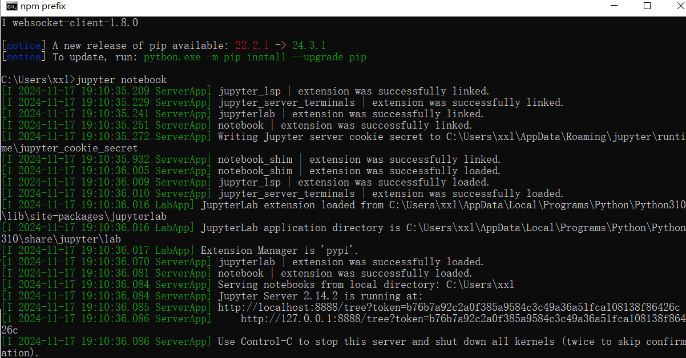
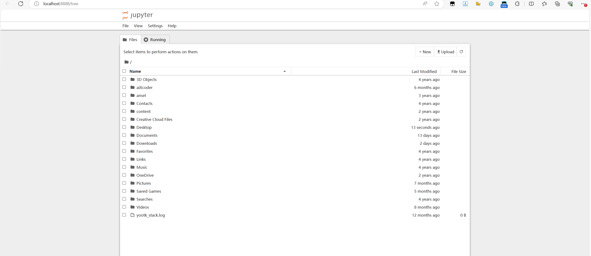

## Jupyter Notebook安装

命令行下使用命令安装`pip install notebook`

macos使用`pip3 install notebook`

安装完成后，运行启动命令`jupyter notebook`，会自动在浏览器打开一个窗口

jupyter notebook界面

## Jupyter Notebook使用

## Markdown语法

## LaTeX语法

## NumPy入门

全称Numerical Python，NumPy是很多数据或科学相关Python包的基础

安装命令：`pip install numpy`