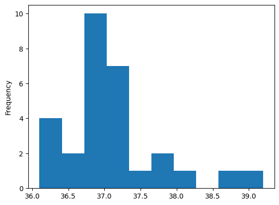

我们用Python做数据分析时，要用代码编写统计分析方法，运用在数据上。

数据分析和统计学是无法分隔的。

统计学的本质是对数据进行描述和推断，主要涉及描述统计学知识。

描述，指的是对数据提供特征的概述。

## 一、数据的分类

### (一)、分类数据

分类数据指的是包含有限数量的不同类别的数据。

#### 1、定序数据

表示数据是可以有顺序的，比如：金银铜可以按顺序排

#### 2、定类数据

表示数据没有顺序，比如：狗子的种类

### (二)、数值数据

数值数据，指的是测量出的观测值，是个具体的数值，对它进行求和或求平均值等数学运算是有意义的。

#### 1、连续数据

表示数据没有最小的表示单位，两个数值之间可以取无数不同的值

#### 2、离散数据

表示数据只能以整数或自然数为单位

## 二、分析维度

数值数据，通常是分析的重点，可以有三个分析维度。

1. 集中趋势，看的是数据集中在何处
2. 离散趋势，看的是数据偏离中心的散布情况
3. 分布形状，看的是分布的对称程度，峰值高低等等情况


### (一)、集中趋势指标

#### 1、平均数

表示数据相对集中较多的中心位置，平均数很容易受到极端值的影响

#### 2、中位数

表示数据的中间位置，中位数不容易受到极端值的影响，有时会和平均数一起纳入统计

#### 3、众数

表示数据最普遍的倾向

### (二)、离散趋势指标

#### 1、极差

表示数据波动的范围

#### 2、方差/标准差

方差和标准差可以互相转换

平均数是用来描述集中趋势的，所以数值和平均数的差距，就是在描述偏离中心值的离散趋势

之所以要对各个数据和平均数的差进行平方，是因为我们只在乎值和平均数的距离，并不在乎这个距离是正距离还是负距离

#### 3、四分位距

四分位距=第三四分位数-第一四分位数

表示中间一半数值的离散程度，越大说明数据越分散

### (三)、分布形状指标

#### 1、直方图

直方图常被用于发现数据的分布情况，包括偏态、峰度、异常值等信息

将数据按照一定的区间范围进行分组，计算每个区间内的数据数量，然后用矩形条表示每个区间内数据的数量

#### 2、正态分布

#### 3、偏态分布

+ 正偏态/右偏态

长尾巴在右边，说明大部分数值比平均值更低，比如：平均月薪，被高工资拉高了平均值。

+ 负偏态/左偏态

长尾巴在左边，说明大部分数值比平均值更高。

## 三、描述统计学分析

如何用Python，对数值数据进行描述统计学分析。

描述统计学的分析对象，很多时候是一维数据，像Python的列表，NumPy的一维数组，Pandas的Series，DataFrame的某列。

```python
import pandas as pd
import numpy as np
```


```python
# 全班某天测量的体温数据
df = pd.read_csv('temperature.csv')
df
```

|        | **姓名** | **体温** |
| ------ | :------- | :------- |
| **0**  | Tom      | 37.8     |
| **1**  | Jerry    | 36.8     |
| **2**  | Lucy     | 37.0     |
| **3**  | Emma     | 37.2     |
| **4**  | John     | 36.6     |
| **5**  | Alice    | 37.0     |
| **6**  | Bob      | 37.0     |
| **7**  | David    | 36.1     |
| **8**  | Sam      | 37.5     |
| **9**  | Alex     | 37.3     |
| **10** | Lisa     | 36.7     |
| **11** | Frank    | 36.9     |
| **12** | Grace    | 37.3     |
| **13** | Mary     | 36.9     |
| **14** | Ben      | 36.9     |
| **15** | Kate     | 36.3     |
| **16** | Oliver   | 37.3     |
| **17** | Sophie   | 37.1     |
| **18** | Ella     | 37.1     |
| **19** | Hannah   | 36.2     |
| **20** | James    | 37.8     |
| **21** | Leo      | 37.1     |
| **22** | Luke     | 36.8     |
| **23** | Max      | 38.0     |
| **24** | Mia      | 37.0     |
| **25** | Noah     | 36.3     |
| **26** | Peter    | 36.8     |
| **27** | Sarah    | 39.2     |
| **28** | Tim      | 38.6     |


### (一)、计算集中趋势指标

#### 1、计算平均数

调用Series类的`mean`方法

```python
df.体温.mean() 

37.12413793103448
```

说明这个班的体温大概集中在37.1度

#### 2、计算中位数

调用Series类的`median`方法

```python
df['体温'].median() 

37.0
```

数据中有两个人体温显著更高，拉高了平均值，中位数不太会收到异常值的影响

#### 3、计算众数

调用Series类的`mode`方法

**mode方法返回的不是一个数字，而是一个Series，因为众数可能有多个，所以用Series去囊括多个数字结果**

```python
df.体温.mode()

0    37.0
Name: 体温, dtype: float64
```

说明办理人的体温倾向于37度

### (二)、计算离散趋势指标

#### 1、极差

+ 可以用Series的max和min函数去做减法
+ 用NumPy数组的ptp方法，会返回极差结果，需要先用NumPy库的array方法将Pandas的Series转换成NumPy数组

```python
df.体温.max() - df.体温.min() 
3.1000000000000014 
np.array(df.体温).ptp() 
3.1000000000000014
```

**浮点数精度误差**

**以上计算结果多了0.0000000000000014，这个误差源自浮点数的精度问题，是二进制计算和转换造成的**

#### 2、方差/标准差

+ 方差：调用Series的var方法
+ 标准差：调用Series的std方法 

```python
df.体温.var() 
0.4518965517241383 
df.体温.std() 
0.6722325131412035
```

#### 3、四分位距

Series的quantile方法，可以用来计算任意百分位数，比如传入10%，就能得到刚好大于数据里10%数值的那个数字

计算四分位距，用75%分位数减去25%分位数

```python
df.体温.quantile(0.75) - df.体温.quantile(0.25) 

0.5
```

### (三)、分布形状

如果我们把各个数值出现的次数，绘制成直方图，就能看见数据的分布模式

调用Series的plot方法，可选参数`kind = 'hist'`，表示直方图

```python
df['体温'].plot(kind='hist') 

<Axes: ylabel='Frequency'>
```



现在只能很勉强的看出分布形状，当数据观察值很少的时候，分布形状不会特别明显，而且很容易受到异常值的影响；但数据观察值数量越大，越容易看出分布形状。

