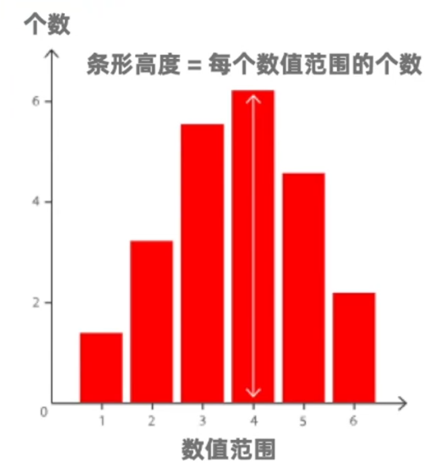
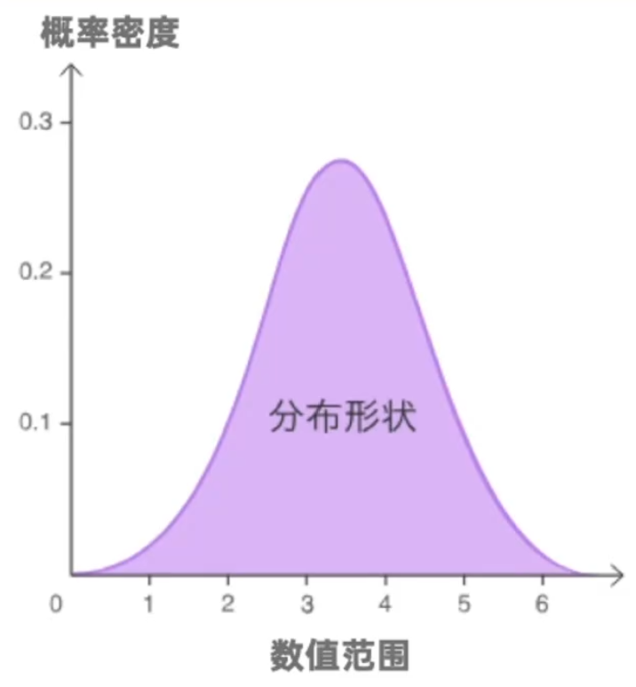
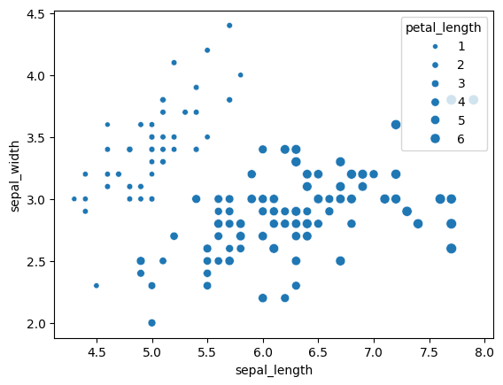
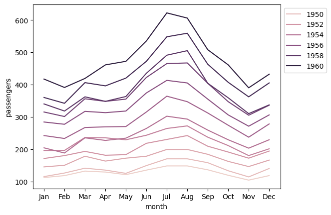
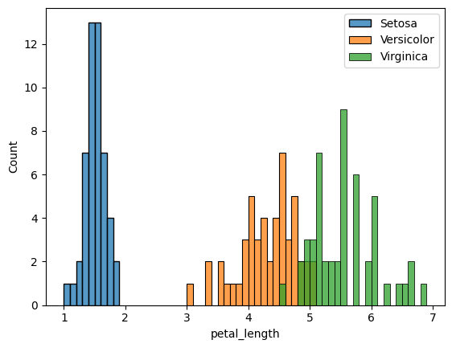

## 一、可视化图表—单变量

可视化的作用不仅在于最后步骤。在数据分析前，图表能在我们自行探索数据的时候，帮助发现隐藏的关系、趋势、影响，高效找到下一步的分析方向。甚至在数据评估与清理步骤，可视化也能帮助我们直观发现异常数据。因此，数据可视化是一个万金油，它不仅是数据分析全流程中的一个步骤，更是一种方式，可以任何步骤里使用。

如果我们的数据包含一个数值变量，可以绘制直方图、密度图、箱型图、小提琴图。

### (一)、直方图



1、特点

展示数据的频率分布

2、表示

横轴表示某数据范围，而纵轴表示个数

### (二)、密度图(Kernel Density)



1、特点

同样用来表示数据的分布，更容易看出分布形状

2、不同

不同于直方图用一个个条柱表示频率，密度图会用一条平滑的曲线

纵轴表示的是概率密度，纵轴的最大值不会超过1

### (三)、箱型图


1、特点

看出中位数、上下四分位数、四分位距大小、分布是否对称、是否紧密，以及有没有异常值

2、表示

纵轴表示数据值；箱子的边界分别是第一和第三四分位数，所以箱子的长度就是四分位距；而箱子中间那条线是中位数；箱子上下的横线分别是上界和下界；上界和下界外的点是异常值。

3、上界&下界

上界 = (数据最大值 or 第三四分位数 + 1.5倍四分位距)，其中的最小值

下界 = (数据最小值 or 第一四分位数 - 1.5倍四分位距)，其中的最大值

如果有数据的值，(大于第三四分位数 + 1.5倍四分位距 or 小于第一四分位数 - 1.5倍四分位距)，会被用单独的点表示出来，被算作异常值

### (四)、小提琴图


1、特点

能同时展现箱型图和密度图的信息

2、表示

中间的小圆点表示中位数；黑色条的边界和箱型图的箱子一样，分别是第一和第三四分位数；而小提琴的长度，表示95%置信区间；小提琴的体型，对应了密度图，越胖的地方那个值频率越高。


## 二、可视化图表—数据包含两个变量

如果我们的数据包含两个变量，比如两列DataFrame的话，可以绘制散点图、折线图、条形图、饼图。其中散点图和折线图，主要针对两个数值变量；条形图和饼图主要针对一个分类变量加一个数值变量。

### (一)、散点图

1. 特点

可以从散点图，看出变量之间的相关性，比如是否相关、呈正比还是呈反比、线性还是非线性等等，也可以帮我们发现异常值的存在

2. 表示

X轴表示一个变量的值，Y轴表示另一个变量的值

### (二)、折线图

1. 特点

用于展示连续间隔或时间跨度上数值的变化，从而展示趋势变化

### (三)、条形图

1. 特点

用来展示一个分类变量所对应的数值变量

2. 条形图与直方图的不同
   - 直方图只针对一个数值变量，而条形图则是针对一个分类变量和一个数值变量
   - 直方图的各个条柱分隔除了不同的数字区间，而条形图的各个条柱分隔这不同的分类变量

### (四)、饼图

1. 特点

用来展示各个分类对应的数值之间的比例，可以直观了解不同类别在整体中的占比

2. 表示

每个圆弧的长度/面积，代表每个分类所占的百分比，全圆则表示所有分类占比的总和，也就是100%

## 三、可视化图表—数据包含多个变量

通过添加颜色或尺寸，在图表上表示新的变量

### (一)、散点图

1. 2个数值变量，1个分类变量

如果要引入新的分类变量，可以把点绘制成不同的颜色，让颜色表示不同分类

2. 气泡图，3个数值变量

如果要引入新的数值变量，可以把点绘制成不同的大小，让面积去表示不同数值

3. 气泡图，3个数值变量，1个分类变量

把气泡绘制成不同的颜色

### (二)、折线图

1. 2个数值变量，1个分类变量

可以绘制多条折线，不同颜色的折线代表不同分类

### (三)、条形图

1. 复式条形图，2个分类变量，1个数值变量

绘制多个条柱，不同颜色的条柱代表不同分类

### (四)、热力图

2个分类变量，1个数值变量

1. 特点

通过颜色来展示不同变量之间的数值差异

2. 表示

横轴是分类变量，纵轴也是分类变量，每行或每列都表示一个分类种类，通过热力图里单元格的颜色或数值，表示数值变量数值的大小


通过把多个图放在一起，互相对比来挖掘信息

1. 通过把两个直方图叠在一张图上，可以直观的看出，它们集中位置的差异、分散程度的差异等等
2. 通过把多个小提琴图并排放，可以直观的比较它们的四分位距、密度概率等等


## 四、Seaborn和Matplotlib

用代码绘制包含一个变量的数据

绘制图表很多人会选择用Seaborn，并和Matplotlib配合使用

Seaborn

一个可视化库，操作简单，又广泛支持多种图表类型

Matplotlib

也是一个可视化库。Seaborn是基于Matplotlib实现的。Matplotlib虽然操作起来没有Seaborn简单，但是它更灵活和自由，所以让我们能对图表做各种自定义操作

### (一)、安装Seaborn

在CMD或终端，输入`pip install seaborn`

macOS有可能使用`pip3 install seaborn`

### (二)、安装Matplotlib

在CMD或终端，输入`pip install matplotlib`

macOS有可能使用`pip3 install matplotlib`

### (三)、导入Seaborn和Matplotlib

Matplotlib中大部分我们会用到的功能都在pyplot的子模块下

```python
import matplotlib.pyplot as plt
import seaborn as sns
import numpy as np
import pandas as pd
```

```python
# 导入实例数据
df = sns.load_dataset('penguins').query('species == "Adelie"')
bill = df.bill_length_mm
bill
```

```python
0      39.1
1      39.5
2      40.3
3       NaN
4      36.7
... 
147    36.6
148    36.0
149    37.8
150    36.0
151    41.5
Name: bill_length_mm, Length: 152, dtype: float64
```

## 五、绘制图表—对单个变量绘制图表

### (一)、对Series进行绘图

**如果用Jupyter Notebook运行绘图函数的话，可以在输出里看到直方图；**

**如果在编辑器里运行的，需要调用Matplotlib的show函数，才能展示图片**

#### 1、直方图

英文是Histogram，Seaborn绘制直方图的函数叫做histplot 

```python
sns.histplot(bill) 

<Axes: xlabel='bill_length_mm', ylabel='Count'>
```


```python
sns.histplot(bill)
plt.show()
```

  


#### 2、密度图

统计学里密度叫做Kernel Density，Seaborn绘制密度图的函数叫kdeplot

```python
sns.kdeplot(bill) 

<Axes: xlabel='bill_length_mm', ylabel='Density'>
```


#### 3、箱型图

英文是Box Plot，Seaborn绘制箱型图的函数叫`boxplot`

```python
sns.boxplot(bill)
plt.show()
```



#### 4、小提琴图

英文是violin plot，Seaborn绘制小提琴图的函数叫`violinplot`

```python
sns.violinplot(bill) 

<Axes: ylabel='bill_length_mm'>
```

  


### (二)、对DataFrame进行绘图

```python
df
```

|         | **species** | **island** | **bill_length_mm** | **bill_depth_mm** | **flipper_length_mm** | **body_mass_g** | **sex** |
| ------- | :---------- | :--------- | :----------------- | :---------------- | :-------------------- | :-------------- | :------ |
| **0**   | Adelie      | Torgersen  | 39.1               | 18.7              | 181.0                 | 3750.0          | Male    |
| **1**   | Adelie      | Torgersen  | 39.5               | 17.4              | 186.0                 | 3800.0          | Female  |
| **2**   | Adelie      | Torgersen  | 40.3               | 18.0              | 195.0                 | 3250.0          | Female  |
| **3**   | Adelie      | Torgersen  | NaN                | NaN               | NaN                   | NaN             | NaN     |
| **4**   | Adelie      | Torgersen  | 36.7               | 19.3              | 193.0                 | 3450.0          | Female  |
| **...** | ...         | ...        | ...                | ...               | ...                   | ...             | ...     |
| **147** | Adelie      | Dream      | 36.6               | 18.4              | 184.0                 | 3475.0          | Female  |
| **148** | Adelie      | Dream      | 36.0               | 17.8              | 195.0                 | 3450.0          | Female  |
| **149** | Adelie      | Dream      | 37.8               | 18.1              | 193.0                 | 3750.0          | Male    |
| **150** | Adelie      | Dream      | 36.0               | 17.1              | 187.0                 | 3700.0          | Female  |
| **151** | Adelie      | Dream      | 41.5               | 18.5              | 201.0                 | 4000.0          | Male    |


#### 1、直接传入DataFrame

`data=DataFrame`，参数名'data='可以省略；然后参数`x='X轴所对应列的列名'`，(`y='Y轴所对应列的列名'`)

```python
sns.histplot(df, x='bill_length_mm')
plt.show()
```


#### 2、传入DataFrame的列

特别适用于，两个变量不属于同一DataFrame时

参数`x=df1.列名a`，(`y=df2['列名b']`)

```python
sns.histplot(x=df['bill_length_mm'])
plt.show()
```


### (三)、给图表添加标题和轴标签

#### 1、给图表添加标题

可以调用`plt.title`，里面传入标题字符串

#### 2、给图表添加/更改轴标签

添加/更改X轴标签，可以调用plt.xlabel，里面传入标签字符串

添加/更改Y轴标签，可以调用plt.ylabel，里面传入标签字符串

**标题和轴标签的添加，都需要在show函数被调用之前运行**

**Matplotlib当前默认的字体并不支持中文展示，所以我们需要把字体换成其它支持中文的字体。****由于每台电脑上有的字体并不相同，你可以先查询当前系统所有字体，然后把字体替换成其中某个支持中文的字**体。

```python
# 查询当前系统所有字体
import matplotlib
from matplotlib.font_manager import FontManager

# FontManager是matplotlib.font_manager中的一个类，FontManager()创建一个类实例，FontManager().ttflist返回FontManager类实例的ttflist属性，ttflist包含Matplotlib的字体列表
# set()和f.name部分是生成式表达式
mpl_fonts = set(f.name for f in FontManager().ttflist)
for f in sorted(mpl_fonts):
    print(f)
```

```python
Agency FB
Algerian
Arial
Arial Rounded MT Bold
Bahnschrift
Baskerville Old Face
Bauhaus 93
Bell MT
Berlin Sans FB
Berlin Sans FB Demi
Bernard MT Condensed
Blackadder ITC
Bodoni MT
Book Antiqua
Bookman Old Style
Bookshelf Symbol 7
Bradley Hand ITC
Britannic Bold
Broadway
Brush Script MT
Calibri
Californian FB
Calisto MT
Cambria
Candara
Castellar
Centaur
Century
Century Gothic
Century Schoolbook
Chiller
Colonna MT
Comic Sans MS
Consolas
Constantia
Cooper Black
Copperplate Gothic Bold
Copperplate Gothic Light
Corbel
Courier New
Curlz MT
DejaVu Sans
DejaVu Sans Display
 DejaVu Sans Mono
 DejaVu Serif
 DejaVu Serif Display
 DengXian
 Dubai
 Ebrima
 Edwardian Script ITC
 Elephant
 Engravers MT
 Eras Bold ITC
 Eras Demi ITC
 Eras Light ITC
 Eras Medium ITC
 FZShuTi
 FZYaoTi
 FangSong
 Felix Titling
 Fences
 Footlight MT Light
 Forte
 Franklin Gothic Book
 Franklin Gothic Demi
 Franklin Gothic Demi Cond
 Franklin Gothic Heavy
 Franklin Gothic Medium
 Franklin Gothic Medium Cond
 Freestyle Script
 French Script MT
 Gabriola
 Gadugi
 Garamond
 Georgia
 Gigi
 Gill Sans MT
 Gill Sans MT Condensed
 Gill Sans MT Ext Condensed Bold
 Gill Sans Ultra Bold
 Gill Sans Ultra Bold Condensed
 Gloucester MT Extra Condensed
 Goudy Old Style
 Goudy Stout
 HGB1X_CNKI
 HGB1_CNKI
 HGB2X_CNKI
 HGB2_CNKI
 HGB3X_CNKI
 HGB3_CNKI
 HGB4X_CNKI
 HGB4_CNKI
 HGB5X_CNKI
 HGB5_CNKI
 HGB6X_CNKI
 HGB6_CNKI
 HGB7X_CNKI
 HGB7_CNKI
 HGB8X_CNKI
 HGB8_CNKI
 HGBD_CNKI
 HGBKBX_CNKI
 HGBKB_CNKI
 HGBKHX_CNKI
 HGBKH_CNKI
 HGBS1_CNKI
 HGBS2_CNKI
 HGBS_CNKI
 HGBTH_CNKI
 HGBTS_CNKI
 HGBX_CNKI
 HGBZ_CNKI
 HGCH_CNKI
 HGCUH_CNKI
 HGCY_CNKI
 HGDBS_CNKI
 HGDGY_CNKI
 HGDH2_CNKI
 HGDH_CNKI
 HGDYS_CNKI
 HGDY_CNKI
 HGF1X_CNKI
 HGF1_CNKI
 HGF2X_CNKI
 HGF2_CNKI
 HGF3_CNKI
 HGF4X_CNKI
 HGF4_CNKI
 HGF5X_CNKI
 HGF5_CNKI
 HGF6X_CNKI
 HGF6_CNKI
 HGF7X_CNKI
 HGF7_CNKI
 HGF8_CNKI
 HGF9X_CNKI
 HGF9_CNKI
 HGFS1_CNKI
 HGFS2_CNKI
 HGFSH_CNKI
 HGFS_CNKI
 HGFX_CNKI
 HGFZ_CNKI
 HGGG_CNKI
 HGH1X_CNKI
 HGH1_CNKI
 HGH2X_CNKI
 HGH2_CNKI
 HGH3X_CNKI
 HGH3_CNKI
 HGH4X_CNKI
 HGH4_CNKI
 HGH5X_CNKI
 HGH5_CNKI
 HGH6X_CNKI
 HGH6_CNKI
 HGH7X_CNKI
 HGH7_CNKI
 HGHB_CNKI
 HGHD_CNKI
 HGHP_CNKI
 HGHT1_CNKI
 HGHT2_CNKI
 HGHT_CNKI
 HGHUATI_CNKI
 HGHX_CNKI
 HGHZ_CNKI
 HGKT1_CNKI
 HGKT2_CNKI
 HGKT_CNKI
 HGKY_CNKI
 HGLB_CNKI
 HGLS_CNKI
 HGMH_CNKI
 HGNBS_CNKI
 HGOCR_CNKI
 HGPH_CNKI
 HGPTY_CNKI
 HGSS1_CNKI
 HGSS2_CNKI
 HGSS_CNKI
 HGSXT_CNKI
 HGTT_CNKI
 HGTX_CNKI
 HGWT_CNKI
 HGWYS_CNKI
 HGX1X_CNKI
 HGX1_CNKI
 HGXBS_CNKI
 HGXC_CNKI
 HGXF1_CNKI
 HGXFX_CNKI
 HGXFZ_CNKI
 HGXH1_CNKI
 HGXH_CNKI
 HGXK_CNKI
 HGXL_CNKI
 HGXS_CNKI
 HGXT_CNKI
 HGXY_CNKI
 HGY1_CNKI
 HGY2_CNKI
 HGY3_CNKI
 HGY4_CNKI
 HGYB_CNKI
 HGYT1_CNKI
 HGYT2_CNKI
 HGYT_CNKI
 HGYX_CNKI
 HGZCS_CNKI
 HGZDX_CNKI
 HGZK_CNKI
 HGZYT_CNKI
 HGZY_CNKI
 Haettenschweiler
 Harlow Solid Italic
 Harrington
 High Tower Text
 HoloLens MDL2 Assets
 Impact
 Imprint MT Shadow
 Informal Roman
 Ink Free
 Javanese Text
 Jokerman
 Juice ITC
 KaiTi
 Kristen ITC
 Kunstler Script
 Leelawadee UI
 LiSu
 Lucida Bright
 Lucida Calligraphy
 Lucida Console
 Lucida Fax
 Lucida Handwriting
 Lucida Sans
 Lucida Sans Typewriter
 Lucida Sans Unicode
 MS Gothic
 MS Outlook
 MS Reference Sans Serif
 MS Reference Specialty
 MT Extra
 MV Boli
 Magneto
 Maiandra GD
 Malgun Gothic
 Matura MT Script Capitals
 Microsoft Himalaya
 Microsoft JhengHei
 Microsoft New Tai Lue
 Microsoft PhagsPa
 Microsoft Sans Serif
 Microsoft Tai Le
 Microsoft YaHei
 Microsoft Yi Baiti
 MingLiU-ExtB
 Mistral
 Modern No. 20
 Mongolian Baiti
 Monotype Corsiva
 Myanmar Text
 Niagara Engraved
 Niagara Solid
 Nirmala UI
 OCR A Extended
 Old English Text MT
 Onyx
 Origin
 Palace Script MT
 Palatino Linotype
 Papyrus
 Parchment
 Perpetua
 Perpetua Titling MT
 Playbill
 Poor Richard
 Pristina
 Rage Italic
 Ravie
 Rockwell
 Rockwell Condensed
 Rockwell Extra Bold
 STCaiyun
 STFangsong
 STHupo
 STIXGeneral
 STIXNonUnicode
 STIXSizeFiveSym
 STIXSizeFourSym
 STIXSizeOneSym
 STIXSizeThreeSym
 STIXSizeTwoSym
 STKaiti
 STLiti
 STSong
 STXihei
 STXingkai
 STXinwei
 STZhongsong
 Sans Serif Collection
 Script MT Bold
 Segoe Fluent Icons
 Segoe MDL2 Assets
 Segoe Print
 Segoe Script
 Segoe UI
 Segoe UI Emoji
 Segoe UI Historic
 Segoe UI Symbol
 Segoe UI Variable
 Showcard Gothic
 SimHei
 SimSun
 SimSun-ExtB
 Sitka
 Snap ITC
 Stencil
 Sylfaen
 Symbol
 Tahoma
 Tempus Sans ITC
 Times New Roman
 Trebuchet MS
 Tw Cen MT
 Tw Cen MT Condensed
 Tw Cen MT Condensed Extra Bold
 Verdana
 Viner Hand ITC
 Vivaldi
 Vladimir Script
 Webdings
 Wide Latin
 Wingdings
 Wingdings 2
 Wingdings 3
 YouYuan
 Yu Gothic
 ZWAdobeF
 cmb10
 cmex10
 cmmi10
 cmr10
 cmss10
 cmsy10
 cmtt10
```

```python
# 替换成Microsoft YaHei字体
# 调用的Matplotlib的rc函数，rc意思是'runtime configuration',rc函数可以配置各种Matplotlib的设置
matplotlib.rc("font",family='Microsoft YaHei')
```

```python
sns.histplot(df, x='bill_length_mm')
plt.title('Adelie企鹅样本的嘴长度分布')
plt.xlabel('嘴长度(单位：mm)')
plt.ylabel('样本数量')
plt.show()
```


## 六、绘制图表—对两个变量绘制图表

通过Matplotlib和Seaborn，对两个变量绘制图表

```python
import numpy as np
import pandas as pd
import matplotlib.pyplot as plt
import seaborn as sns
```

### (一)、散点图 

英文是Scatter Plot，Seaborn绘制散点图的函数叫做scatterplot

```python
# 当本地没有此数据集，会自动从线上Seaborn数据库加载，Seaborn数据库数据集https://github.com/mwaskom/seaborn-data
df1 = sns.load_dataset('tips')
df1
```

|         | **total_bill** | **tip** | **sex** | **smoker** | **day** | **time** | **size** |
| ------- | :------------- | :------ | :------ | :--------- | :------ | :------- | :------- |
| **0**   | 16.99          | 1.01    | Female  | No         | Sun     | Dinner   | 2        |
| **1**   | 10.34          | 1.66    | Male    | No         | Sun     | Dinner   | 3        |
| **2**   | 21.01          | 3.50    | Male    | No         | Sun     | Dinner   | 3        |
| **3**   | 23.68          | 3.31    | Male    | No         | Sun     | Dinner   | 2        |
| **4**   | 24.59          | 3.61    | Female  | No         | Sun     | Dinner   | 4        |
| **...** | ...            | ...     | ...     | ...        | ...     | ...      | ...      |
| **239** | 29.03          | 5.92    | Male    | No         | Sat     | Dinner   | 3        |
| **240** | 27.18          | 2.00    | Female  | Yes        | Sat     | Dinner   | 2        |
| **241** | 22.67          | 2.00    | Male    | Yes        | Sat     | Dinner   | 2        |
| **242** | 17.82          | 1.75    | Male    | No         | Sat     | Dinner   | 2        |
| **243** | 18.78          | 3.00    | Female  | No         | Thur    | Dinner   | 2        |


```python
sns.scatterplot(df1, x='total_bill', y='tip')
plt.show()
```

  


```python
sns.scatterplot(x=df1.total_bill, y=df1['tip'])

<Axes: xlabel='total_bill', ylabel='tip'>
```


### (二)、折线图

英文是`Line Plot`，`Seaborn`绘制折线图的函数叫做`lineplot`

```python
df2 = sns.load_dataset('flights').query('month == "Jan"')
df2
```

|         | **year** | **month** | **passengers** |
| ------- | :------- | :-------- | :------------- |
| **0**   | 1949     | Jan       | 112            |
| **12**  | 1950     | Jan       | 115            |
| **24**  | 1951     | Jan       | 145            |
| **36**  | 1952     | Jan       | 171            |
| **48**  | 1953     | Jan       | 196            |
| **60**  | 1954     | Jan       | 204            |
| **72**  | 1955     | Jan       | 242            |
| **84**  | 1956     | Jan       | 284            |
| **96**  | 1957     | Jan       | 315            |
| **108** | 1958     | Jan       | 340            |
| **120** | 1959     | Jan       | 360            |
| **132** | 1960     | Jan       | 417            |


```python
sns.lineplot(x=df2.year, y=df2.passengers) 
<Axes: xlabel='year', ylabel='passengers'>
```


### (三)、条形图

英文是`Bar Plot`，`Seaborn`绘制条形图的函数叫做`barplot`

**默认情况下，条柱的高度对应所属分类下的所有值的平均值。如果希望展示其他聚合值，可选参数**`**estimator=聚合函数**`

```python
df3 = sns.load_dataset('penguins')
df3
```

|         | **species** | **island** | **bill_length_mm** | **bill_depth_mm** | **flipper_length_mm** | **body_mass_g** | **sex** |
| ------- | :---------- | :--------- | :----------------- | :---------------- | :-------------------- | :-------------- | :------ |
| **0**   | Adelie      | Torgersen  | 39.1               | 18.7              | 181.0                 | 3750.0          | Male    |
| **1**   | Adelie      | Torgersen  | 39.5               | 17.4              | 186.0                 | 3800.0          | Female  |
| **2**   | Adelie      | Torgersen  | 40.3               | 18.0              | 195.0                 | 3250.0          | Female  |
| **3**   | Adelie      | Torgersen  | NaN                | NaN               | NaN                   | NaN             | NaN     |
| **4**   | Adelie      | Torgersen  | 36.7               | 19.3              | 193.0                 | 3450.0          | Female  |
| **...** | ...         | ...        | ...                | ...               | ...                   | ...             | ...     |
| **339** | Gentoo      | Biscoe     | NaN                | NaN               | NaN                   | NaN             | NaN     |
| **340** | Gentoo      | Biscoe     | 46.8               | 14.3              | 215.0                 | 4850.0          | Female  |
| **341** | Gentoo      | Biscoe     | 50.4               | 15.7              | 222.0                 | 5750.0          | Male    |
| **342** | Gentoo      | Biscoe     | 45.2               | 14.8              | 212.0                 | 5200.0          | Female  |
| **343** | Gentoo      | Biscoe     | 49.9               | 16.1              | 213.0                 | 5400.0          | Male    |


```python
sns.barplot(data=df3, x='species', y='body_mass_g') 
<Axes: xlabel='species', ylabel='body_mass_g'> 
```


```python
sns.barplot(data=df3, x='species', y='body_mass_g', estimator=np.max) 
<Axes: xlabel='species', ylabel='body_mass_g'>
```


### (四)、计数图

如果希望条柱的高度对应个数，需要使用计数图。

英文是`Count Plot`，`Seaborn`绘制计数图的函数叫做`countplot`

与条形图区别：只需要用一个分类变量绘制图表

```python
sns.countplot(df3, x='species')
plt.show()
```


### (五)、饼图

**Seaborn没有绘制饼图的函数，需要调用Matplotlib的pie函数**

1. 参数

+ **直接传入需要计算比例的Series,**`**DataFrame.列名1**`**，Matplotlib中的函数不支持传入整个DataFrame再指定变量**
+ 指定标签，可选参数`labels=DataFrame.列名2`

**标签与数据的个数和顺序都要对应**

+ 显示比例数字标签, 可选参数`autopct='文字格式'`，例：`autppct='%.1f%%'`

```python
- autopct是用来设置每个扇形里文字标签格式的参数

- 文字格式要以`%`开头；`.1f`表示小数点后保留1位小数；`%%`表示数字标签要以'%'结尾，之所以用两个百分比符号，表示文字标签里的一个百分比，是因为程序需要区分于表示文字格式起始的一个百分比

- 以此类推，如果纸箱保留整数比例数字，可以改成`.0f`;如果想移除百分比符号，可以把格式字符串中，最后两个百分比符号去掉
```

2. **大多数情况，数据集里没有各个类别数量的数据，需要自己获得**

+ 对分类变量的Series，调用`value_counts`方法，会获得一个Series。这个Series可以直接传入`pie`函数中，`labels=Series.index`
+ `df.groupby('分类变量')['无缺失值的列'].count()`，会返回一个Series。这个Series可以直接传入`pie`函数中，`labels=Series.index`

```python
# 设置示例数据
df4 = pd.DataFrame({'fruit': ['apple', 'orange', 'banana', 'pear'],
                    'vote': [32, 22, 19, 7]})
df4
```

|       | **fruit** | **vote** |
| ----- | :-------- | :------- |
| **0** | apple     | 32       |
| **1** | orange    | 22       |
| **2** | banana    | 19       |
| **3** | pear      | 7        |


```python
plt.pie(df4.vote)
plt.show()
```


```python
plt.pie(df4.vote, labels=df4.fruit, autopct='%.1f%%')
plt.show()
```


### (六)、更改图表颜色

许多绘图函数都支持color这个可选参数，`color='颜色的英文'`或者`color='表示颜色的16进制值'`

```python
sns.scatterplot(x=df1.total_bill, y=df1['tip'], color='violet') 

<Axes: xlabel='total_bill', ylabel='tip'>
```


```python
sns.histplot(data=df3, x="body_mass_g",
             color="#c287c7")
plt.show()
```


### (七)、更改图表色盘

适用于包含分类数据的图表，意思是更改一整套颜色主题

调用`Seaborn`的`set_palette`函数

```python
sns.set_palette('crest')
sns.barplot(data=df3, x='species', y='body_mass_g')
```


```python
sns.set_palette('pastel')
sns.barplot(data=df3, x='species', y='body_mass_g')
plt.show()
```


## 七、绘制图表—对多个变量绘制图表

```python
import numpy as np
import pandas as pd
import seaborn as sns
import matplotlib.pyplot as plt
```

通过Matplotlib和Seaborn，对多个变量绘制图表

### (一)、更改图例的位置

有时图例太长，会挡住图表里的元素，那我们可以把图例的位置进行更改。

调用`Matplotlib`的`legend`函数，传入参数`bbox_to_anchor=(横向位置, 纵向位置)`

`bbox_to_anchor`会把图例放在图表的边框外面去。

元组第一个元素：放入`0`表示图例会在图表左边，`1`表示图表右边

元组第二个元素：放入`0`表示图例顶部和接近图表下边框的位置对齐，`1`表示图例顶部和接近图表上边框的位置对齐

```python
sns.scatterplot(iris, x='sepal_length', y='sepal_width', hue='species', size='petal_length')
plt.legend(bbox_to_anchor=(1, 1))
plt.show()
```


### (二)、增加变量

#### 1、给散点图增加变量

```python
iris = sns.load_dataset('iris')
iris
```

|         | **sepal_length** | **sepal_width** | **petal_length** | **petal_width** | **species** |
| ------- | :--------------- | :-------------- | :--------------- | :-------------- | :---------- |
| **0**   | 5.1              | 3.5             | 1.4              | 0.2             | setosa      |
| **1**   | 4.9              | 3.0             | 1.4              | 0.2             | setosa      |
| **2**   | 4.7              | 3.2             | 1.3              | 0.2             | setosa      |
| **3**   | 4.6              | 3.1             | 1.5              | 0.2             | setosa      |
| **4**   | 5.0              | 3.6             | 1.4              | 0.2             | setosa      |
| **...** | ...              | ...             | ...              | ...             | ...         |
| **145** | 6.7              | 3.0             | 5.2              | 2.3             | virginica   |
| **146** | 6.3              | 2.5             | 5.0              | 1.9             | virginica   |
| **147** | 6.5              | 3.0             | 5.2              | 2.0             | virginica   |
| **148** | 6.2              | 3.4             | 5.4              | 2.3             | virginica   |
| **149** | 5.9              | 3.0             | 5.1              | 1.8             | virginica   |


```python
sns.scatterplot(iris, x='sepal_length', y='sepal_width')
plt.show()
```


##### 1）增加1个分类变量

可以传入可选参数`hue='分类变量'`，散点图会根据不同变量把点画成不同的颜色

```python
sns.scatterplot(iris, x='sepal_length', y='sepal_width', hue='species')
plt.show()
```


##### 2）增加1个数值变量

通过添加颜色，表示不同数值

+  可以传入可选参数`hue='数值变量'`，深色和浅色分别表示大的数值和小的数值。 

```python
sns.scatterplot(iris, x='sepal_length', y='sepal_width', hue='petal_length')
plt.show()
```


通过添加尺寸，表示不同数值

+ 可以传入可选参数`size='数值变量'`，通过点的大小表示数值，也即绘制了一个气泡图

```python
sns.scatterplot(iris, x='sepal_length', y='sepal_width', size='petal_length')
plt.show()
```


##### 3）增加1个分类变量，1个数值变量

可选参数`hue='分类变量', size='数值变量'`

用颜色表示种类，用点的大小表示数值，也即绘制了一个彩色气泡图

```python
sns.scatterplot(iris, x='sepal_length', y='sepal_width', hue='species', size='petal_length')
plt.show()
```


#### 2、给折线图增加变量

增加1个分类变量

可以传入可选参数`hue='分类变量'`，让不同颜色的先分别代表不同变量

```python
flights = sns.load_dataset('flights')
flights
```

|         | **year** | **month** | **passengers** |
| ------- | :------- | :-------- | :------------- |
| **0**   | 1949     | Jan       | 112            |
| **1**   | 1949     | Feb       | 118            |
| **2**   | 1949     | Mar       | 132            |
| **3**   | 1949     | Apr       | 129            |
| **4**   | 1949     | May       | 121            |
| **...** | ...      | ...       | ...            |
| **139** | 1960     | Aug       | 606            |
| **140** | 1960     | Sep       | 508            |
| **141** | 1960     | Oct       | 461            |
| **142** | 1960     | Nov       | 390            |
| **143** | 1960     | Dec       | 432            |


```python
sns.lineplot(x=flights.month, y=flights.passengers, hue=flights.year)
plt.legend(bbox_to_anchor=(1, 1))
plt.show()
```



#### 3、给条形图增加变量

增加1个分类变量，变成复式条形图

可以传入可选参数`hue='分类变量'`，让不同颜色的先分别代表不同变量

```python
penguins = sns.load_dataset('penguins')
penguins
```

|         | **species** | **island** | **bill_length_mm** | **bill_depth_mm** | **flipper_length_mm** | **body_mass_g** | **sex** |
| ------- | :---------- | :--------- | :----------------- | :---------------- | :-------------------- | :-------------- | :------ |
| **0**   | Adelie      | Torgersen  | 39.1               | 18.7              | 181.0                 | 3750.0          | Male    |
| **1**   | Adelie      | Torgersen  | 39.5               | 17.4              | 186.0                 | 3800.0          | Female  |
| **2**   | Adelie      | Torgersen  | 40.3               | 18.0              | 195.0                 | 3250.0          | Female  |
| **3**   | Adelie      | Torgersen  | NaN                | NaN               | NaN                   | NaN             | NaN     |
| **4**   | Adelie      | Torgersen  | 36.7               | 19.3              | 193.0                 | 3450.0          | Female  |
| **...** | ...         | ...        | ...                | ...               | ...                   | ...             | ...     |
| **339** | Gentoo      | Biscoe     | NaN                | NaN               | NaN                   | NaN             | NaN     |
| **340** | Gentoo      | Biscoe     | 46.8               | 14.3              | 215.0                 | 4850.0          | Female  |
| **341** | Gentoo      | Biscoe     | 50.4               | 15.7              | 222.0                 | 5750.0          | Male    |
| **342** | Gentoo      | Biscoe     | 45.2               | 14.8              | 212.0                 | 5200.0          | Female  |
| **343** | Gentoo      | Biscoe     | 49.9               | 16.1              | 213.0                 | 5400.0          | Male    |


```python
sns.barplot(penguins, x='species', y='body_mass_g', hue='sex')
plt.legend(bbox_to_anchor=(1, 1))
plt.show()
```


#### 4、热力图

英文叫Heat Map，Seaborn绘制热力图的函数叫做heatmap

```python
# 通过透视表导入示例数据
glue = sns.load_dataset('glue').pivot(index='Model', columns='Task', values='Score')
glue
```

| **Task**        | **CoLA** | **MNLI** | **MRPC** | **QNLI** | **QQP** | **RTE** | **SST-2** | **STS-B** |
| :-------------- | -------- | -------- | -------- | -------- | ------- | ------- | --------- | --------- |
| **Model**       |          |          |          |          |         |         |           |           |
| **BERT**        | 60.5     | 86.7     | 89.3     | 92.7     | 72.1    | 70.1    | 94.9      | 87.6      |
| **BiLSTM**      | 11.6     | 65.6     | 81.8     | 74.6     | 62.5    | 57.4    | 82.8      | 70.3      |
| **BiLSTM+Attn** | 18.6     | 67.6     | 83.9     | 74.3     | 60.1    | 58.4    | 83.0      | 72.8      |
| **BiLSTM+CoVe** | 18.5     | 65.4     | 78.7     | 70.8     | 60.6    | 52.7    | 81.9      | 64.4      |
| **BiLSTM+ELMo** | 32.1     | 67.2     | 84.7     | 75.5     | 61.1    | 57.4    | 89.3      | 70.3      |
| **ERNIE**       | 75.5     | 92.3     | 93.9     | 97.3     | 75.2    | 92.6    | 97.8      | 93.0      |
| **RoBERTa**     | 67.8     | 90.8     | 92.3     | 95.4     | 74.3    | 88.2    | 96.7      | 92.2      |
| **T5**          | 71.6     | 92.2     | 92.8     | 96.9     | 75.1    | 92.8    | 97.5      | 93.1      |


```python
sns.heatmap(glue) 

<Axes: xlabel='Task', ylabel='Model'>
```


如果要在格子上把对应数值作为标签进行展示的话，传入可选参数`annot=True`，annot是annotation的简写

```python
sns.heatmap(glue, annot=True) 
<Axes: xlabel='Task', ylabel='Model'>
```


### (三)、图上绘制多个图表

#### 1、图上绘制多个直方图

```python
setosa = iris.query('species == "setosa"')
versicolor = iris.query('species == "versicolor"')
virginica = iris.query('species == "virginica"')
```

##### 1）图上绘制多个直方图

调用多次`histplot`函数，最后`plt.show`展示出来的图片里，多个直方图就都在里面了

```python
sns.histplot(setosa.petal_length)
sns.histplot(versicolor.petal_length)
sns.histplot(virginica.petal_length)
plt.show()
```


##### 2）统一条柱宽度

由于调用多次`histplot`函数进行绘制的时候，条柱是按照各自适合的粗细画的，我们只是把它们放到了同一张图上，所以会导致条柱的粗细不统一。

所以我们需要在调用`histplot`函数进行绘制的时候，指定条柱宽度。传入可选参数`binwidth=数值间距`

```python
sns.histplot(setosa.petal_length, binwidth=0.1)
sns.histplot(versicolor.petal_length, binwidth=0.1)
sns.histplot(virginica.petal_length, binwidth=0.1)
plt.show()
```


##### 3）设置图例

另外一个问题是，这个图片没有图例，无法分清哪个颜色对应哪个种类。

为了解决这个问题，我们可以在调用`histplot`函数进行绘制时，传入可选参数`label="标签"`；然后需要调用下`plt.legend()`，手动让图例展示出来

```python
sns.histplot(setosa.petal_length, binwidth=0.1, label='Setosa')
sns.histplot(versicolor.petal_length, binwidth=0.1, label='Versicolor')
sns.histplot(virginica.petal_length, binwidth=0.1, label='Virginica')
plt.legend()
plt.show()
```



#### 2、图上绘制多个密度图

图上绘制多个密度图与直方图是一样的步骤，唯一的区别是因为密度图是一条平滑的曲线，所以我们不需要可选参数`binwidth`去指定条柱的宽度了

```python
sns.kdeplot(setosa.petal_length, label='Setosa')
sns.kdeplot(versicolor.petal_length, label='Versicolor')
sns.kdeplot(virginica.petal_length, label='Virginica')
plt.legend()
plt.show()
```


#### 3、图上绘制多个箱型图/小提琴图

如果和直方图及密度图一样，在图上绘制多个箱型图/小提琴图，这样它们会都挤在同一条纵线上，因为和前面不同的是，这次横轴并不表示数值

```python
sns.boxplot(setosa.petal_length)
sns.boxplot(versicolor.petal_length)
sns.boxplot(virginica.petal_length)
plt.show()
```


```python
sns.violinplot(setosa.petal_length)
sns.violinplot(versicolor.petal_length)
sns.violinplot(virginica.petal_length)
plt.show()
```


这种情况下，更好的选择是，通过添加坐标轴，在图表上表示分类变量。传入可选参数`x='分类变量'`

```python
sns.boxplot(iris, y='petal_length', x='species')
plt.show()
```


```python
sns.violinplot(iris, y='petal_length', x='species')
plt.show()
```


总之，当我们想在图上表示多个变量的时候，要根据图表的具体种类选择合适的操作方法。

### (四)、图上绘制多个子图

除了把不同图形放到同一个图里，还有的时候我们是想把单独的图，并排放在一起，这样的话可以让图表排版得更加紧密，因为默认的情况下，Seaborn一行只会放一张图

#### 1、图上绘制多个子图

需要用`Matplotlib`的`subplots`函数，`plt.subplot(行数, 列数)`

```python
plt.subplots(1, 3)
plt.show()
```


#### 2、指定子图的宽和高

传入可选参数`figsize=(宽, 高)`

```python
plt.subplots(1, 3, figsize=(15, 5))
plt.show()
```


#### 3、把图表画进空白的子图

+ 把`subplots`返回的结果，赋值为`fig`和`axes`两个变量，`fig`对应整个大图，而`axes`对应一系列子图，所以我们主要用到的是`axes`
+ 正常调用绘图函数，调用绘图函数时，传入可选参数`ax=axes[n]`

```python
fig, axes = plt.subplots(1, 3, figsize=(15, 5))
sns.boxplot(iris, y='sepal_length', x='species', ax=axes[0])
sns.boxplot(iris, y='sepal_width', x='species', ax=axes[1])
sns.boxplot(iris, y='petal_length', x='species', ax=axes[2])
plt.show()
```


### (五)、配对图

`Seaborn`的`pairplot`函数，传入`DataFrame`后，它会把数据里面数值变量之间的，所有两两关系都绘制出来，一共得到`N*N`个图，N表示传入`DataFrame`里数值变量的个数。

具体来说，它会把各变量的分布用直方图绘制出来，然后把不同变量两两之间的关系绘制成散点图，所以非常适合一次性探索变量分布，以及不同变量之间的关系

```python
sns.pairplot(iris)
plt.show()
```


也可以传入可选参数`hue='分类变量'`，因此可以一次性对比不同分类变量的数值关系

```python
sns.pairplot(iris, hue='species')
plt.show()
```


****

**数据可视化环节，可以用在数据分析流程的方方面面**

1. 清洗环节

可以通过绘制箱型图来寻找异常值的存在，然后根据具体情况考虑是否删除异常值，

2. 假设检验之前

可以先通过直方图或密度图查看它们之间的关系，对比差异从图上来看是否显著，然后再进行科学化的数值检验

3. 绘制图表本身也是一种探索数据、分析数据的方式

