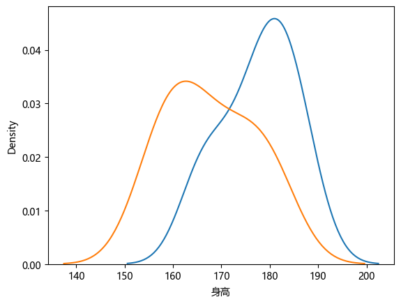
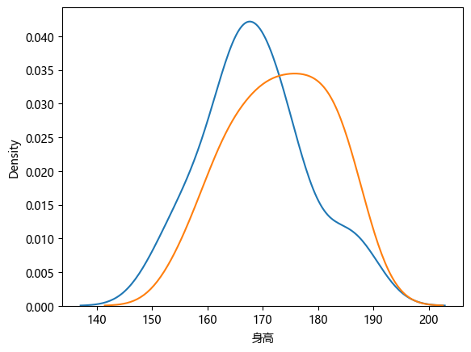

### 一、有关假设检验的一些概念

1、描述统计学与推断统计学

+ 描述统计学：对数据进行描述和总结
+ 推断统计学：通过样本做出关于总体的推断和预测

2、对象和整体

+ 对象：我们想要观测的**具体事物**叫做对象
+ 整体：我们想观测的**整个对象**的集合

3、样本和整体

+ 样本是我们收集数据的**对象**
+ 总体是我们想要得到结论的**群体**

4、统计量和参数

+ 统计量：描述样本特征的数值
+ 参数：描述总体特征的数值
+ 在统计推断中，我们会基于样本的统计量，对总体的参数进行推断，从而得到对总体的结论

### 二、独立双样本t检验步骤

1、概念

+ 独立：说明样本来自不同的总体，彼此没有关联
+ 双样本：比较两个不同样本的数据
+ t检验：一种统计方法，用于确定样本的平均值之间是否存在统计显著的差异

2、前提条件

+ 随机抽样
+ 总体大致呈正态分布 

#### (一)、建立假设

1、原假设(H0)

2、备择假设(H1)

一般我们进行假设检验的时候，是想反驳原假设，以及支持备择假设

#### (二)、选择单尾或双尾

1、双尾只推断总体之间是否有差异，不在意是正差还是负差

2、单尾推断只看是否存在正差异，或者只看是否存在负差异

#### (三)、确定显著水平

显著水平反应了检验的严格程度。

样本抽样存在随机性，检验结果没有可能保证100%符合现实，只能通过显著水平来调整严格程度

常见的双尾检验显著水平是0.05，也就是说如果检验结果是拒绝原假设，原假设实际为真的概率是5%；再换句话说，如果检验结果是拒绝原假设，结论95%概率是对的。

常见的单尾检验显著水平是0.025。

**之所以单尾检验显著水平定为双尾检验显著水平的一半，可以想象两样本数据的正态分布图，一样本的平均值落在另一样本的一边区间中，说明差异显著性，说明观察正差异或负差异，说明是单尾假设检验；一样本的平均值落在另一样本的两边区间中，说明差异显著性，说明观察正差异和负差异，说明是双尾假设检验**

#### (四)、计算t值

1、t值：表示两个样本之间均值差异的大小，越大说明差异约显著

#### (五)、计算自由度

自由度 = 样本1的数量 + 样本2的数量 -2

#### (六)、查看t值临界值表

根据单双尾、自由度和显著水平，去查t值临界值表

#### (七)、比较临界值和t值

t值 >= 临界值，拒绝原假设，说明存在显著差异

t值 < 临界值，接受原假设，说明不存在显著差异

### 三、Z检验

#### 1、前提条件的区别

+ 增加了要求：总体方差已知/样本容量大于30

#### 2、步骤的区别

+ 不需要计算自由度
+ z值计算公式，相比于t值计算公式，把样本方差换成了总体方差
+ 查看z值临界值表

#### 3、应用场景

+ Z检验适用于已知总体方差，或者样本的数量大于30的情况
+ t检验适用于总体方差未知，且样本的数量小于等于30的情况。
+ 在实际应用中，t检验比Z检验更加常见

#### 4、检验结果差异

+ Z检验可以提供更高的准确性和敏感性


### 四、用代码实现t检验

```python
import numpy as np
import pandas as pd

# 引入绘图相关库
import seaborn as sns
import matplotlib.pyplot as plt
import matplotlib

# 引入t检验相关函数
from scipy.stats import ttest_ind

# 引入Z检验相关函数
from statsmodels.stats.weightstats import ztest
```


#### (一)、Knowledge

1、SciPy

+ 做t检验，可以用SciPy这个库。SciPy和Pandas一样，都是建立在NumPy之上的
+ `SciPy.stats`模块，有很多和统计分析有关的函数和类
+ `SciPy.stats`模块中的`ttest_ind`函数，就是一个专门用来做独立双样本t检验的函数，'ind'是independent的简写

2、p值：如果总体之间不存在显著差异，那样本之间存在当前这种差异或更极端的差异，有多大概率。

+ p值小，假设总体之间没有显著差异的话，样本有这样的差异是小概率事件，应该拒绝原假设
+ p值大，假设总体之间没有显著差异的话，样本有这样的差异是大概率事件，应该接受原假设

#### (二)、步骤

```python
height_df = pd.read_csv('height.csv')
height_df
```

|        | **身高** | **地区** |
| ------ | :------- | :------- |
| **0**  | 165      | A        |
| **1**  | 167      | A        |
| **2**  | 172      | A        |
| **3**  | 176      | A        |
| **4**  | 178      | A        |
| **5**  | 180      | A        |
| **6**  | 182      | A        |
| **7**  | 183      | A        |
| **8**  | 185      | A        |
| **9**  | 188      | A        |
| **10** | 155      | B        |
| **11** | 158      | B        |
| **12** | 160      | B        |
| **13** | 162      | B        |
| **14** | 165      | B        |
| **15** | 168      | B        |
| **16** | 172      | B        |
| **17** | 176      | B        |
| **18** | 179      | B        |
| **19** | 182      | B        |


##### 1、引入t检验相关函数

##### 2、筛选两独立样本的Series

```python
region_a_height = height_df.query('地区 == "A"')['身高']
region_b_height = height_df.query('地区 == "B"')['身高']
```


```python
region_a_height

0    165
1    167
2    172
3    176
4    178
5    180
6    182
7    183
8    185
9    188
Name: 身高, dtype: int64
```


```python
region_b_height

10    155
11    158
12    160
13    162
14    165
15    168
16    172
17    176
18    179
19    182
Name: 身高, dtype: int64
```

```python
# 替换成Microsoft YaHei字体
matplotlib.rc("font",family='Microsoft YaHei')
```

```python
sns.kdeplot(region_a_height)
sns.kdeplot(region_b_height)
plt.show()
```



##### 3、建立假设

原假设(H0)：地区A和地区B的人平均身高没有差异

备择假设(H1)：地区A和地区B 的人平均身高有差异

##### 4、选择单尾/双尾

选择双尾检验

##### 5、确定显著水平

 alpha = 0.05

##### 6、计算t值和p值

+ 调用`ttest_ind`函数，分别传入两样本的Series，`ttest_ind`函数会返回t检验的结果，里面包含两个数字，第一个表示t值，第二个表示p值
+ `**ttest_ind**`**函数默认计算的是双尾的p值，如果是单尾检验，单尾的p值等于返回的p值除以二**
+ **之所以双尾检验p值是单尾检验p值的2倍，是人为x2的结果。可以想象单尾检验的p值为，一样本平均值，落在另一样本正态分布图中的面积；而由于双尾检验显著水平为，一样本平均值落入另一样本两边的面积，所以人为将p值x2，用两倍的面积和两边的面积去比较**

```python
t_stat, p_value = ttest_ind(region_a_height, region_b_height)
print(t_stat, p_value)

2.608375959216796 0.017783305969556976
```

##### 7、比较p值和显著水平

```python
# (把p值和显著水平进行比较，这里计算出的p值是0.018左右，小于0,05。
# 说明当原假设为真时，当前样本出现这种差异的概率很小，而且比我们选择的显著水平更小，因此应该拒绝原假设，换句话说，我们推断总体的平均值确实存在差异。)
if p_value < alpha:
    print('两组数据有显著差异')
else:
    print('两组数据无显著差异')
```

两组数据有显著差异

**用代码做t检验的步骤，比上一节学的更加简洁和高效。我们不需要去看t值具体是多少，不需要去查t值临界值表，也不需要对比t值和临界值。只需要直接对比p值和显著水平，就能得到结论，到底是拒绝还是接受原假设**

### 五、用代码实现Z检验 

#### (一)、Knowledge

1、statsmodels

计算Z值和p值，可以用`statsmodels.stats.weightstats`模块的`ztest`函数 

#### (二)、步骤

用Python做Z检验，整个步骤和t检验很相似

```python
height_df2 = pd.read_csv('height2.csv')
height_df2
```

|         | **身高** | **地区** |
| ------- | :------- | :------- |
| **0**   | 175      | A        |
| **1**   | 169      | A        |
| **2**   | 176      | A        |
| **3**   | 185      | A        |
| **4**   | 168      | A        |
| **...** | ...      | ...      |
| **61**  | 173      | B        |
| **62**  | 164      | B        |
| **63**  | 163      | B        |
| **64**  | 183      | B        |
| **65**  | 189      | B        |


##### 1、引入Z检验相关函数

##### 2、筛选两独立样本的Series

```python
region_a_height2 = height_df2.query('地区 == "A"')['身高']
region_b_height2 = height_df2.query('地区 == "B"')['身高']
```

```python
sns.kdeplot(region_a_height2)
sns.kdeplot(region_b_height2)
plt.show()
```



##### 3、建立假设

##### 4、选择单尾/双尾

##### 5、确定显著水平

alpha = 0.05

##### 6、计算Z值和p值

+ 调用ztest函数，分别传入两样本，ztest函数返回两个数字，第一个表示Z值，第二个表示p值
  - 传入可选参数`alternative='two-sided'`，表示双尾
  - 如果是单尾的话，传入可选参数`alternative='larger'`，表示想推断第一个的均值，是否显著大于第二个
  - 传入可选参数`alternative='smaller'`，表示想推断第一个的均值，是否显著小于第二个

```python
z_stat, p_value = ztest(region_a_height2, region_b_height2, alternative='two-sided')
print(z_stat, p_value)

-1.9906963757270788 0.04651427741343414
```

##### 7、比较p值和显著水平

```python
if p_value < alpha:
    print('两组数据有显著差异')
else:
    print('两组数据无显著差异')
```

两组数据有显著差异

```python
# 建立假设
# 原假设：
# 备择假设：地区A的人平均身高小于地区B 的人的平均身高

alpha = 0.025

# 计算z值和p值（单尾负差异）
z_stat, p_value = ztest(region_a_height2, region_b_height2, 
                        alternative='smaller')
print(z_stat, p_value)

if p_value < alpha:
    print('两组数据有显著差异')
else:
    print('两组数据无显著差异')
```

```python
-1.9906963757270788 0.02325713870671707
两组数据有显著差异
```

   

