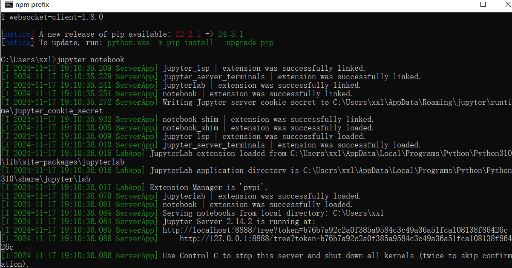
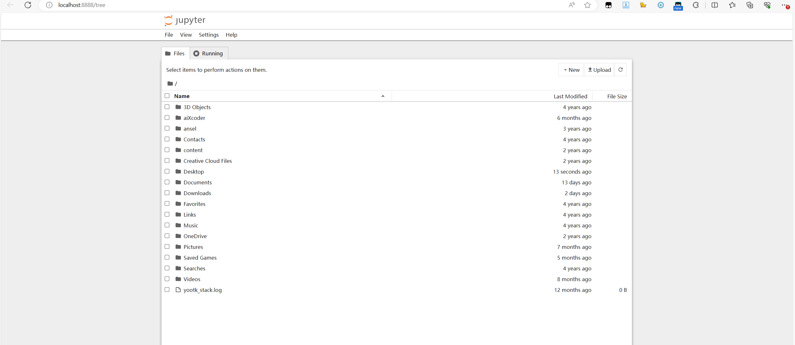
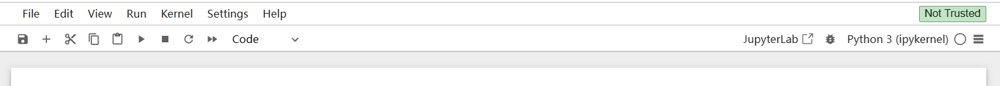

## Jupyter Notebook介绍

### 一、定义

Jupyter Notebook是一个基于网页的交互式计算环境，是数据分析、数据科学，甚至机器学习领域里非常流行的一款工具。

可以用来编写代码、运行代码、查看输出、可视化数据，并分享输出的报告文档。

### 二、优点

#### 1、Jupyter Notebook可以按单元格运行代码

对于搞数据的人来说，不是所有时候都想从头运行到结尾，比如数据量特别大的时候，假如读取数据要等几秒，清洗数据要等几秒，那在我们每次修改分析公式，想反复运行看效果的时候，不希望前面没有改动的步骤，比如说读取数据，还要反复被运行，因为这会浪费很多等待时间。

用Jupyter Notebook就很简单了，我们可以把不同步骤放在不同单元格里，每次运行一个单元格的代码，这样我们可以只读取一遍数据，当反复修改和运行分析代码时，读数据的代码就不会再被运行了。

#### 2、可展示的信息格式更丰富

我们用常规编辑器时，注释和代码一样都是纯文本，但分析数据时，有时需要记录和解释更多东西，比如数据的北京、使用的公式、分析思路等等。

用Jupyter Notebook可以用Markdown标记语言，让注释更加清晰、有层次，还可以用LaTex插入公式。

当你把Jupyter Notebook上的内容，以HTML等格式分享给其他人的时候，这些效果丰富的文字，也会原封不动地展示给对方，帮助对方更好地理解你思考和分析的过程，也节约了你解答疑问的时间。

#### 3、交互式运行环境

交互模式相比命令行模式的好处是，当我们想查看输出的时候，不需要加上打印语句就能看到。

那我们就可以很方便地查看变量的值,输出中间结果，有利于快速探索数据，试验不同分析方法。


## Jupyter Notebook安装

命令行下使用命令安装`pip install notebook`

macos使用`pip3 install notebook`

安装完成后，运行启动命令`jupyter notebook`，会自动在浏览器打开一个窗口



jupyter notebook界面




## Jupyter Notebook使用

### 一、启动Jupyter Notebook

1. 启动
   1. Windows系统，在菜单栏搜索CMD，点击命令提示符。
   2. macOS系统，点击顶部菜单栏的放大镜，输入"终端"或"terminal"，回车进入。
   3. 出现大黑窗口后，输入Jupyter Notebook的启动命令："Jupyter-Notebook"。
   4. 默认浏览器会自动打开一个网页，展示Notebook的主面板。
2. 如果不小心关闭了JN的网页，地址可以再CMD或终端里找到，其中某一行："The Jupyter Notebook is running at..."，后面跟着的就是页面地址，复制到浏览器即可。
3. 接下来的时间里，记得不要关闭这个输入了启动命令的CMD或终端，否则JN会被终止。


### 二、创建Jupyter Notebook文件

#### 1、创建文件

希望文件在什么位置，就点进那个文件夹，然后点击New，Notebook，一个新的编辑界面就会被打开，而且在桌面上也能看到一个全新的文件出现了。

#### 2、重命名文件

在编辑界面，点下标题，输入想要的名字。


### 三、Jupyter Notebook编辑界面

标题下面分别是菜单栏、工具条以及单元格。

工具条就是把菜单栏里一些最常用的操作摆出来，所以大部分时候我们只需要通过工具条和单元格打交道，单元格主要用来写Python代码和文字。


#### (一)、编辑模式和命令模式

##### 1、编辑模式

在我们点击单元格里面后，外框会变成绿色，表示当前是编辑模式，

##### 2、命令模式

完成输入后，点Esc键，或者鼠标点下其它地方，外框会变成蓝色，表示当前是命令模式


#### (二)、工具栏



1. 第一个按钮，表示保存文件内容。
2. 第二个加号按钮，表示在当前选中的单元格下面，新建一个单元格。
3. 接下来三个按钮，分别表示剪切选中的单元格、复制选中的单元格，以及粘贴选中的单元格，还可以按住Shift键选中多个单元格，然后同一进行操作。
4. 上箭头表示把选中的单元格往上移动一格，下箭头表示往下移动一格，来更改单元格顺序。
5. 运行按钮
   1. 会执行这个单元格里面所有Python代码。
   2. 执行时，左边方括号会展示星号，表示正在运行。
   3. 执行完毕后，方括号里面会变成数字。
   4. 数字表示的是执行顺序，比如运行完第一个单元格后，旁边数字显示1；继续运行下一个单元格，旁边数字就会显示2。
   5. JN很灵活的一点是，你可以用任意顺序运行单元格
      1. 比如可以运行第三格后，回到第一格再执行一遍；也可以多次反复运行同一个单元格。旁边的数字，会帮忙记录和告知执行过的顺序。
   6. 顺序是很关键的
      1. 比如你分别在第二和第三个单元格里，写了读取和查看数据的代码，想要修改读取的文件，需要修改和再次运行读取数据的代码。
      2. 这时，第二个单元格的数字大于第三个单元格，就能侧面提醒我们，第二个单元格里，查看数据来输出的代码还没有被更新，查看的还是之前的数据文件。
      3. 所以应该把第三个单元格也运行一次。
      4. 另：代码单元格里的代码是通过交互模式运行的，也就是说可以不需要print语句，就能直接看到执行输出的结果。
      5. 但是如果单元格里有多条输出语句，只有最后一项的输出会被展示，我们还是要借助print，才能同时展示多项输出结果。
6. 终止执行按钮
   1. 执行单元格里代码的过程中，想要中断的话，就可以点击它。
7. 重启按钮
   1. 这会帮我们清空所有定义过的变量，而且单元格旁边的数字也会重新从1开始，表明重启过。
   2. 举个例子，假如第一格定义了一个变量，第二格输出这个变量的值，那运行第一格后变量的值就已经被储存到内存里了，每次输出第二格就会输出对应的值。
   3. 但重启后，再运行第二格，就会提醒我们变量不存在了。
8. 重启并重新运行所有单元格的按钮
   1. 非常使用，如果你想看自己写的所有代码，从上往下完整执行一遍的输出，就用这个操作。
   2. 它可以帮我们检查单元格顺序是否有问题。
9. 下拉框，可以让我们切换单元格里的内容。最常用的就是代码和Markdown，单元格并不限于写代码，也可以写文字。
   1. Markdown
      1. 是一种帮助我们为内容增加样式的标记语言，语法简单。
      2. 通过在前面添加1~6个#和1个空格，可以把文字设置成一至六级标题。
   2. 公式
      1. 在行内插入公式，就用1个美元符号，包裹住那个公式。
      2. 要插入一个独占一行的公式，就用2个美元符号，包裹住那个公式。
      3. 复杂的公式，可以用LaTex语法来表示。
10. 键盘按钮，是快捷键配置
    1. 掌握快捷键的使用，可以大大提升我们使用JN的效率，*在命令模式下使用。
    2. A键，可以在当前单元格上方插入一个新的单元格。
    3. B键，可以在当前单元格下方插入。
    4. 连按两次D，可以删除当前选中的单元格。
    5. Shift+Enter，运行当前单元格，并跳到下一个单元格。


### 三、分享Jupyter Notebook

#### 1、可以自行编辑和运行

如果对方使用JN，可以把这个以.ipynb为后缀的文件，直接发给对方。

#### 2、只读

点击File，选择Save and Export Notebook as，有很多选项。

比如HTML，这是针对网页的标记语言，所以对方可以直接用浏览器打开，所有代码以及Markdown文字都会原封不动得展示出来。


### 四、打开之前创建过的Jupyter Notebook

启动JN，进入存放notebook的目录，点击.ipynb的文件。


## Markdown语法

### 一、优势

#### 1、格式比纯文本更丰富

代码中的注释没法添加任何格式，或添加丰富的信息。

Markdown支持标题、粗体、引用、列表、代码块等常用格式。

#### 2、体积比富文本更轻量

Word或者一些网站支持的富文本编辑器，可以让我们更改内容样式或排版。但它的功能过于强大多样，让产出文件更加臃肿。

不支持自定义字体、颜色等操作，所有样式都是通过简单的符号来添加的。因此Markdown文件非常轻量，和纯文本差不了多少。


代码包的README，文件后缀一般都是.md，说明是一个Markdown文件。


### 二、语法

#### 1、标题

通过在前面添加1~6个#和1个空格，可以把文字设置成一至六级标题。

#### 2、加粗、斜体、删除样式

用两个*把文字包住，把文字变成粗体。

用一个*把文字包住，把文字变成斜体。

用两个~把文字包住，把文字用删除线划掉。*注意是英文输入法下的小波浪。

#### 3、普通文字

不把文字用任何符号包围的话，那就默认是普通的段落文字。

特点：加的换行，只会在文字之间出现一个空格。

如果想让文字分隔在不同行，一个方法是多打一次换行，另一个方法是在第一行后面额外加两个空格。

#### 4、列表

无序列表：在每个列表元素前面，加上短横杠、空格"- "。

有序列表：在每个列表元素前面，加上数字、英文句号、空格"1. "。

#### 5、链接

完整的链接是要带协议名的，比如前面的`https://`

1）展示链接

把链接直接像普通文字那样放进去，如果Markdown识别出来这是个链接，就会把它变成可跳转的。

2）展示链接标题 更直观地告知读者链接指向的内容

方括号把链接包围起来，在后面紧跟着的括号里面，放上链接。。

~~~markdown
[必应]([https://cn.bing.com/)](https://cn.bing.com/))
~~~

#### 6、图片

方括号里放文字，圆括号里面放图片链接，同时在方括号前面加上一个英文感叹号。

](https://img0.baidu.com/it/u=25183460,870873689&fm=253))

插入图片，方括号里放文字的意义是，如果图片加载不出来的话，就会显示那个文字内容作为替代。

#### 7、引用

插入一个引用段落，用右书名号、空格，后面紧跟着引用内容。

引用段落里的文字，和普通段落里的文字一样，不会因为你在内容里加了换行，展示效果里就有换行。

```markdown
>蒹葭苍苍
白露为霜
```

#### 8、代码

要在文字里插入代码，就用反引号包裹住代码，``import math``

如果我们要插入独占一段的代码段落，就用三个反引号包裹住代码段落。

在开头的三个反引号后面，还可以跟上代码语言的名字，这样Markdown就会展示针对那个语言的语法高亮。

```markdown
​```python
import math
print("Hello World!")
print(math.pi)
```

#### 9、公式

1. 在行内插入公式，就用1个$，包裹住那个公式。
2. 要插入一个独占一行的公式，就用2个$，包裹住那个公式。
3. 复杂的公式，可以用LaTex语法来表示。

## LaTeX语法

LaTex是一个排版系统，可以负责定义书籍、简历、论文等格式和布局，不局限于数学公式。

在JN的使用场景里，用LaTex就是为了在Markdown里插入公式，所以只需学会公式相关语法即可

### 一、加减乘除

表示加减的符号，就是键盘上的加减。

乘号和除号是没有的，用`\times`表示乘号，`\div`表示除号。

```markdown
"""
$$x + y$$
$$x - y$$
$$x \times y$$
$$x \div y$$
"""
```

### 二、上标下标

要加上标，用插入符`^`，跟上作为上标的内容；要加下标，用下划线`_`，后面跟上作为下标的内容。

LaTex默认上标或下标只包含1位字符，如果想把多个字符作为上标或下标，用花括号把它们组合起来，就可以了

```markdown
"""
$$x^3$$
$$H_2O$$ 
$$S_{input}$$
"""
```


### 三、求和求根

求根符号，`\sqrt`，后面可以跟上方括号，里面的数字表示求几次方根。

LaTex默认求根符号的横线只拉到第1个字符，如果对一个长公式求根，可以在方括号后面跟上花括号，把要求根的内容全部包围起来。

```markdown
"""
$$\sum(x^2 + y^2)$$
$$\sqrt[3]x$$
$$\sqrt[3]{a^2m^2}$$
"""
```

$$\sum(x^2 + y^2)$$
$$\sqrt[3]x$$
$$\sqrt[3]{a^2m^2}$$

### 四、分数线

用`\frac`表示，后面跟着两个花括号，在第一个花括号里面，放分数线上面的内容；在第二个花括号里，放分数线下面的内容。

```markdown
"""
$$\frac{x+y}{x-y}$$
"""
```

$$\frac{x+y}{x-y}$$


### 五、其他

除上面之外，LaTex还能搞定其它无数的公式符号，参考官方文档

其他公式符号语法：[https://oeis.org/wiki/List_of_LaTeX_mathematical_symbols](https://oeis.org/wiki/List_of_LaTeX_mathematical_symbols)


## 参考资料

原资料：[https://www.bilibili.com/cheese/play/ss2298](https://www.bilibili.com/cheese/play/ss2298)

下载资料：[https://www.hezuclub.com/1775.html](https://www.hezuclub.com/1775.html)

下载链接：[下载链接](https://since1982-my.sharepoint.com/personal/hezuclub2024_since1982_org/_layouts/15/onedrive.aspx?ga=1&id=%2Fpersonal%2Fhezuclub2024%5Fsince1982%5Forg%2FDocuments%2FP1775%20%E5%B0%8F%E7%99%BD%E7%8E%A9%E8%BD%ACPython%E6%95%B0%E6%8D%AE%E5%88%86%E6%9E%90%E8%AE%AD%E7%BB%83%E8%90%A5&sortField=LinkFilename&isAscending=true)

代码：[https://github.com/NaturalCutie/Python-Data-Analysis-Notes/tree/main](https://github.com/NaturalCutie/Python-Data-Analysis-Notes/tree/main)


