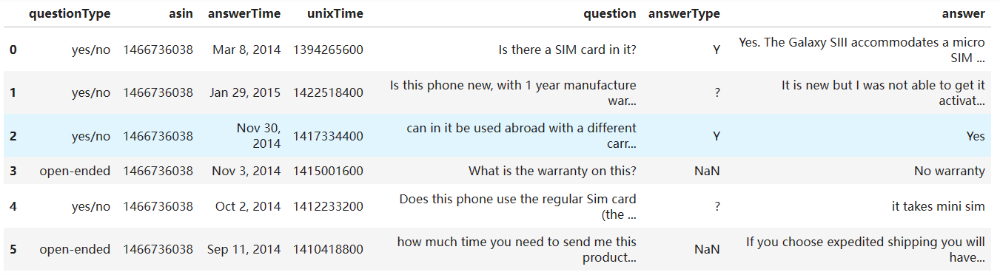
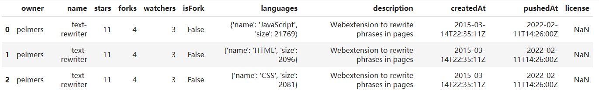

## 一、数据格式

JSON是程序员非常喜欢的数据格式。

不同文件格式有不同的读取方法，一般通过文件后缀来分辨文件格式。

**文件名后缀只是文件名的一部分，更改后缀并不改变文件里面的内容，因此更改后缀不影响实际的文件格式，文件名后缀会影响电脑选择用什么软件去打开它。**

当我们聊数据格式时，不仅聊的是这个文件以什么后缀结尾，更重要的是它里面的内容遵循怎样的格式规则。

## 二、JSON

### 1、概念

JSON，全称为**JaveScript Object Notation**，意思是JavaScript的对象表示法，可见这种数据格式和JavaScript的语法是有些关联的。

JSON，与Python的字典或列表，有非常类似之处；并且被无数主流变成语言支持。

### 2、优点

1）用API获得的数据，很多时候数据都是一JSON格式进行返回的

2）占用体积小

3）非常容易被转换成程序语言自己的结构

### 3、数据结构

JSON对象和JSON数组，可以分别被转换成Python字典和列表

#### 1）JSON对象

JSON对象，以大括号开头和结尾，然后里面都是键值对，每个键值对之间用逗号进行分隔。

```json
{
  "id": "1", 
  "type": "article", 
  "title": "working with JSON data", 
  "created": "2099-12-18T14:56:29.000Z"
}
```

#### 2）JSON数组

JSON数组，以中括号开头和结尾，然后里面是一个个值，每个值之间用逗号进行分隔。

```json
[
  {
    "title": "A Light in the Attic"
    "price": "£51.77"
  },
  {
    "title": "Tipping the Velvet"
    "price": "£53.74"
  }
]
```

### 4、JSON值的类型

需要属于以下几种：

1. 字符串 "star"
2. 数字 31
3. 布尔值 true
4. 数组 ["hi", 7] 
5. 对象 {"age": 25}
6. 空值 null
7. 支持嵌套， 数组里面的值可以是对象，对象里的值可以是数组

### 5、与Python语法的区别

1. Python字典，可以用整数等不可变数据类型作为键；但在JSON对象里，只能是字符串作为键，不能是其他类型。
2. JSON对象的键，不能存在重复，因为值要靠键提取；Python字典里，键重复不会报错，但在有两个键相同的情况下，后来赋给键的值将成为键的真实值。
3. JSON里，字符串必须被双引号包围，不能用单引号。
4. Python的布尔值，都是以大写开头；因为本质是JavaScript对象，而JavaScript的布尔值是以小写开头，JSON里布尔值也是以小写开头。
5. JSON里空值是null。

### 6、数据转换

因为JSON和Python的字典或列表还是存在差别的，因此获取JSON数据后，要进行解析+转换，才能去分析数据。  


## 三、读取JSON

用Python的Pandas库，可以丝滑读取JSON

1. 导入Pandas

`import pandas as pd`

2. read_json函数

顾名思义是用来读JSON文件的

把文件的路径作为参数

函数会完成文件读取、JSON解析、转成DataFrame的全流程，会直接把JSON文件转成DataFrame。

如果不用Pandas，每一个步骤都可能需要一段单独的代码。


## 四、JSON与DataFrame的对应

### 1、普通JSON数据

```json
[
  {
    "questionType": "yes/no",
    "asin": "1466736038",
    "answerTime": "Mar 8, 2014",
    "unixTime": 1394265600,
    "question": "Is there a SIM card in it?",
    "answerType": "Y",
    "answer": "Yes. The Galaxy SIII accommodates a micro SIM card."
  },
  {
    "questionType": "yes/no",
    "asin": "1466736038",
    "answerTime": "Jan 29, 2015",
    "unixTime": 1422518400,
    "question": "Is this phone new, with 1 year manufacture warranty?",
    "answerType": "?",
    "answer": "It is new but I was not able to get it activated with AT&T."
  },
  {
    "questionType": "yes/no",
    "asin": "1466736038",
    "answerTime": "Nov 30, 2014",
    "unixTime": 1417334400,
    "question": "can in it be used abroad with a different carrier?",
    "answerType": "Y",
    "answer": "Yes"
  },
  {
    "questionType": "open-ended",
    "asin": "1466736038",
    "answerTime": "Nov 3, 2014",
    "unixTime": 1415001600,
    "question": "What is the warranty on this?",
    "answer": "No warranty"
  },
  {
    "questionType": "yes/no",
    "asin": "1466736038",
    "answerTime": "Oct 2, 2014",
    "unixTime": 1412233200,
    "question": "Does this phone use the regular Sim card (the bigger Sim card)?",
    "answerType": "?",
    "answer": "it takes mini sim"
  },
  {
    "questionType": "open-ended",
    "asin": "1466736038",
    "answerTime": "Sep 11, 2014",
    "unixTime": 1410418800,
    "question": "how much time you need to send me this product to miami?",
    "answer": "If you choose expedited shipping you will have the phone in 2-3 days"
  },
  {
    "questionType": "yes/no",
    "asin": "1621911888",
    "answerTime": "Dec 13, 2013",
    "unixTime": 1386921600,
    "question": "Is it unlocked?",
    "answerType": "Y",
    "answer": "yes"
  }
]
```

读取数据

```python
import pandas as pd
survey_df = pd.read_json("./data_cell_phones_survey.json")
survey_df
```

结果



解析

1. 原始文件是一个JSON数组，数组里的元素都是JSON对象，每一个JSON对象与DataFrame中的一行相对应。JSON里数据实例一般会用对象表示，而DataFrame里一般**每一行代表一个实例**，正好相互对应。
2. JSON对象的键值对，与DataFrame的列名和下面的数据相对应，DataFrame的**列名表示数据实例的各个属性**，而JSON对象里的键值对也是这个作用，正好相互对应。
3. JSON中有些对象没有answerType这个键，与DataFrame里answerType列下部分值是NaN相对应，由于JSON并不要求所有对象的键都相同，Pandas也很好地在DataFrame里对应了这种情况，**用NaN来表示数据空缺**。

### 2、带子集的JSON数据

```json
{
  "owner": "pelmers",
  "name": "text-rewriter",
  "stars": 11,
  "forks": 4,
  "watchers": 3,
  "isFork": false,
  "languages": [
    {
      "name": "JavaScript",
      "size": 21769
    },
    {
      "name": "HTML",
      "size": 2096
    },
    {
      "name": "CSS",
      "size": 2081
    }
  ],
  "description": "Webextension to rewrite phrases in pages",
  "createdAt": "2015-03-14T22:35:11Z",
  "pushedAt": "2022-02-11T14:26:00Z",
  "license": null
}
```

读取数据

```python
github_df = pd.read_json("./3.21_data_github.json")
github_df
```

结果



解析

JSON文件里JSON对象中，languages的值是一个长度为3的数组，与DataFrame的三行相对应。当键值对里的值是数组时，Pandas会把数组元素视为属于不同数据实例，拆分成单独的一行，因此languages属性下面就应该有3行。但因为表格里每列下面的行数都得是一样的，所以DataFrame其它属性值就被复制成了三个，从而得到一个结构规整的表格。


