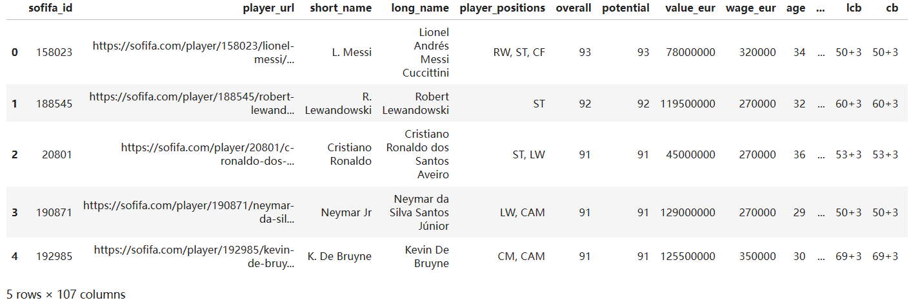
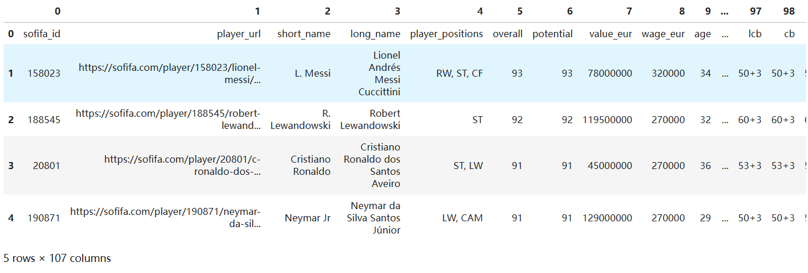
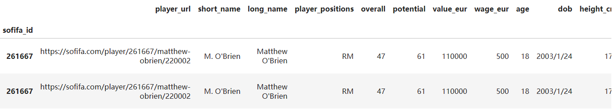
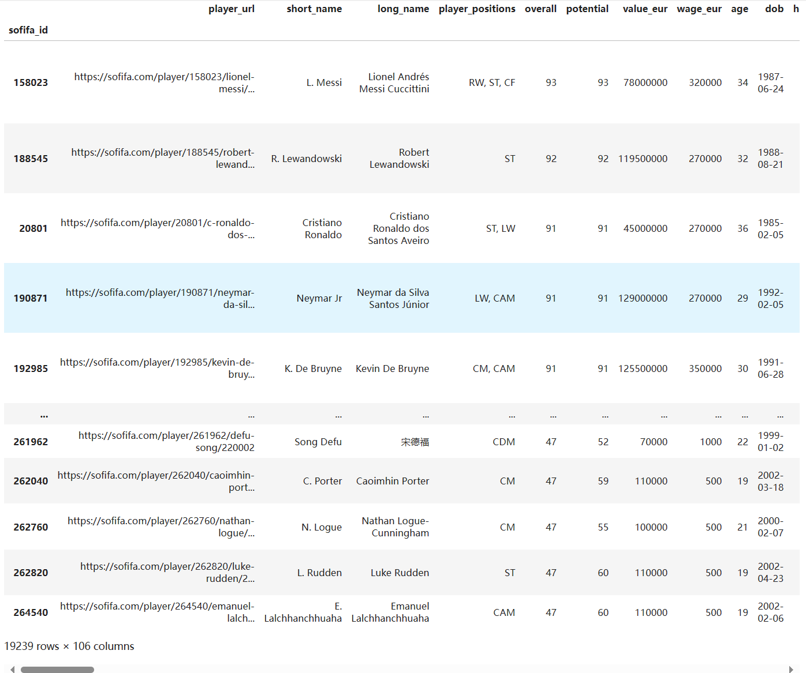
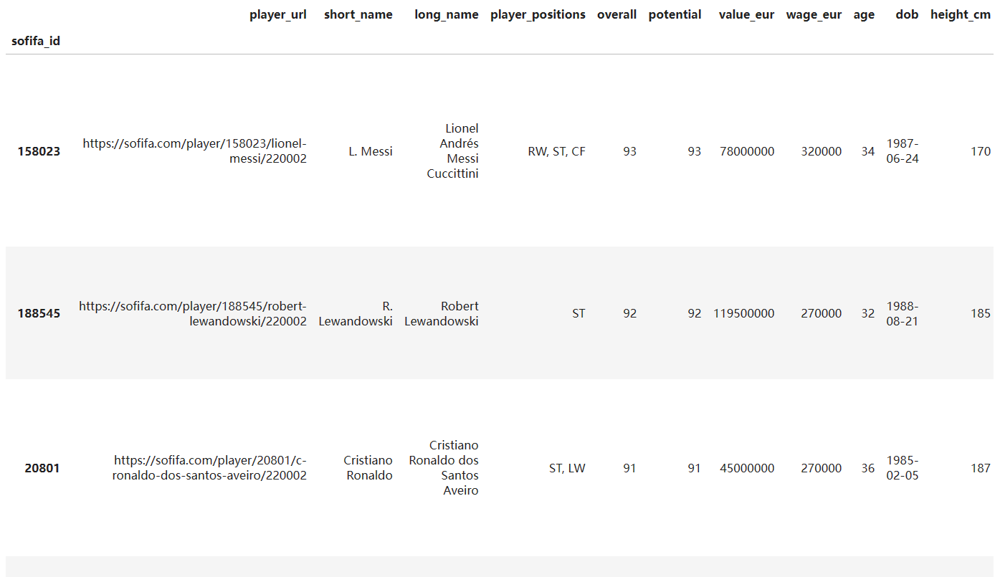
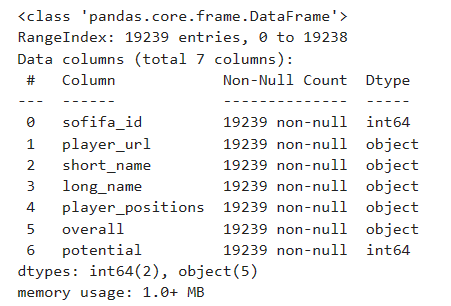
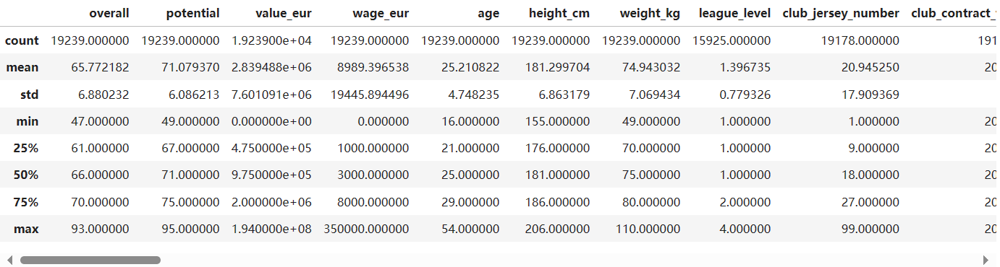

CSV是数据分析师最喜欢的数据格式。

与JSON一样，CSV也是纯文本文件，也就是说文字内容不存在粗体、下划线、字号、颜色等特征

如果把逗号对齐，CSV的结构基本上就是一个表格。

## 一、CSV

### 1、概念

CSV，全称是Comma-Separated Values，表示逗号分隔值。

### 2、结构

1）表头

a、有表头：CSV文件第一行，也就是展示列名那行，大部分情况下是表格头，包含了许多属性名

b、无表头：也可以无表头，以数据直接开始

2）数据

a、在表头下面，每一条数据都是独占一行的，因此当我们把CSV文件转换成DataFrame后，CSV的行与DataFrame的行之间能够直接对应上

b、每行数据里所包含的值的数量应该是相同的，逗号分隔符的数量也必须相同，但凡哪行多了或少了，说明那就不是一个合格有效的CSV

### 3、特殊情况

1）当数据值里面包含英文逗号，可以用引号围完整的值。里面的逗号，就不会被当成分隔符的逗号了

2）当某个值为空缺，可以让两个分隔逗号相邻，表示中间那个值不存在

### 4、CSV与JSON对比

CSV本身是一个非常规整的二维结构，能一眼就知道它所对应的表格长什么样子

JSON则不同，它的结构能非常灵活，也可以层层嵌套，很难直观看出对应表格长什么样

因此，JSON是通用编程时受欢迎的数据结构，而CSV是数据分析时受欢迎的数据结构

### 5、编写CSV

打开代码编辑器或文本编辑器，按照CSV格式的规则写好后，把文件保存为以.csv结尾的文件即可

### 6、默认规范

用代码分析数据时，尽量让源数据文件，以CSV、JSON等纯文本格式，或者sqlite等数据库文件格式

### 7、优点

体积小，结构工整，容易让人理解，能非常直接地转换成表格。

可以用Excel软件去读取、修改或导出CSV。

### 8、读取

在实际的数据分析中，由于一般数据量比较大，动辄1G以上的CSV数据集是很常见的，

1）Excel

可能会卡住。因为Excel不止要展示数据，还要试图展示格式(虽然文件里可能就没有额外格式)，还得加载一系列功能等

2）代码编辑器或者纯文本编辑器

3）更好的方法

用代码读取，转换成DataFrame，然后用Pandas库里的方法，想看几行看几行，而不用等海量的数据全部加载出来


## 二、读取CSV

### 1、导入Pandas

`import pandas as pd`

### 2、read_csv函数

顾名思义是用来读CSV文件的

把文件的路径作为参数

**以下用代码而不是软件去处理数据，能更快处理完成**

```python
import pandas as pd
df1 = pd.read_csv('fifa_players_22.csv')
# fifa_players_22.csv文件，里面记录了2万条国际足联球员的信息，文件体积是12MB左右
df1.head()
```



#### 1）可选参数header

a、csv文件有表头，省略可选参数header，默认会把第一行内容作为列名

b、csv文件无表头，设置'header=None'，表示不要把第一行当做列名。那解析出来的DataFrame就会把第一行视为第一条数据，列名用从0开始的数据代替

```python
df = pd.read_csv('fifa_players_22.csv', header=None)
df.head()
```




#### 2）可选参数index_col

a、只用位置索引，省略可选参数index_col，默认用位置索引

b、把某一列作为标签索引，设置'index_col=列名/列的位置索引'，返回的DataFrame就会把列名的值作为标签索引。如下例子，可以通过标签索引'球员ID'，而不是仅通过位置索引，来提取数据了

```python
df1 = pd.read_csv('fifa_players_22.csv', index_col='sofifa_id')
df1.head()
df1.loc[261667]
```




## 三、展示CSV的方法

### (一)、set_option函数

1、更改展示列数上限

默认只展示20列。

当我们遇到的数据包含非常多列的时候，输入的DataFrame里，中间有些列就会被自动忽略，被用'...'表示。

假如想查看所有列，可以通过set_option函数，提升展示的列数的上限。

第一个参数传入'display.max_columns'，表示展示列数的上限。

第二个参数传入，你希望最多看到的列数

```python
pd.set_option('display.max_columns', 150)
df1
```

  


2、更改展示值的字符上限

默认的字符上限是50

当我们遇到值很长的时候，文字不会展示全，如上例子里，'player_tags'和'player_traits'两列

假如想让值展示的长度更大一些，可以通过set_option函数，提升值展示的字符上限。

第一个参数传入'display.max_colwidths'，每列里的值最多包含几个字符限。 

第二个字符上限到的列数

```python
pd.set_option('display.max_colwidth', 500)
df1
```

  


### (二)、head/tail/sample方法

可以得到开头/结尾/随机的N行

```python
df1.head()
df1.tail()
# 默认随机返回一行的数据
df1.sample()
```


### (三)、info方法

快速了解一个DataFrame，除了看它实际的数据之外，还可以通过info，获得DataFrame的概况信息

1、当列数太多时，只会展示部分信息

```python
df1.info()
```

结果

```python
<class 'pandas.core.frame.DataFrame'>
Index: 19239 entries, 158023 to 264540
Columns: 106 entries, player_url to nation_flag_url
dtypes: float64(12), int64(44), object(50)
memory usage: 16.2+ MB
```

从上到下分别是：类型、索引的范围、列的数量、列的数据类型、占用memory


2、当列的数量较少时，还会返回每列具体的列名，排除掉空值后实际值的数量，和每一列的数据类型

```python
df3 = pd.read_csv('fifa_players_22_simple.csv')
df3.head(2)
df3.info()
```




### (四)、descirbe方法

针对数字类型的列，一次性展示多种统计信息

```python
df1.describe()
```

  

