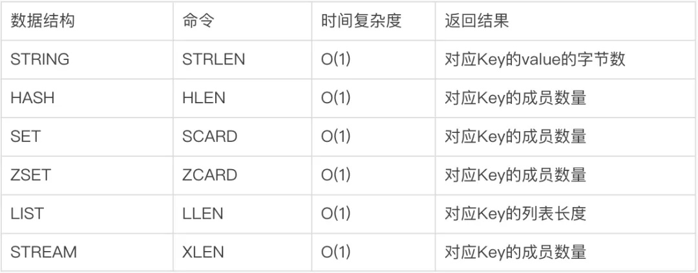
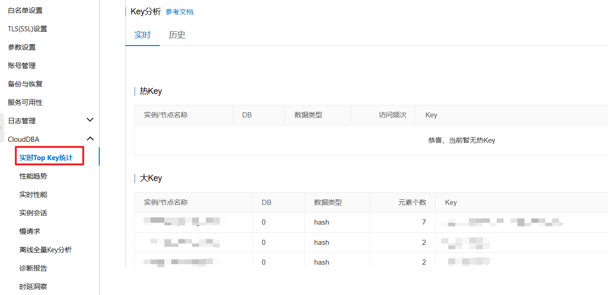
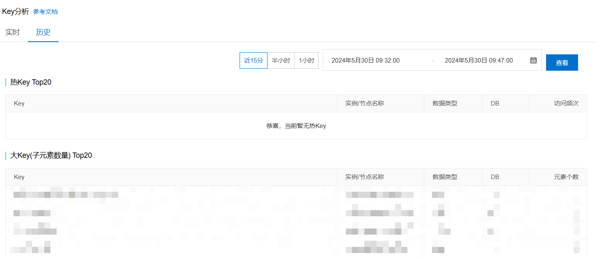

在Redis的使用过程中，我们经常会遇到BigKey（下文将其称为“大key”）及HotKey（下文将其称为“热key”）。大Key与热Key如果未能及时发现并进行处理，很可能会使服务性能下降、用户体验变差，甚至引发大面积故障。

## 一、大Key与热Key的定义

我们经常能够在公司内部的Redis开发使用规范手册，或网络中大量的Redis最佳实践文章里看到有关大Key、热Key的定义，然而这些资料中的大Key热Key判定标准却不尽相同，但可以明确的是，它们的判定维度是一致的：大Key通常都会以数据大小与成员数量来判定，而热Key则以其接收到的请求频率、数量来判定。

### （一）什么是大Key

通常我们会将含有较大数据或含有大量成员、列表数的Key称之为大Key，下面我们将用几个实际的例子对大Key的特征进行描述：

- 一个STRING类型的Key，它的值为5MB（数据过大）
- 一个LIST类型的Key，它的列表数量为20000个（列表数量过多）
- 一个ZSET类型的Key，它的成员数量为10000个（成员数量过多）
- 一个HASH格式的Key，它的成员数量虽然只有1000个但这些成员的value总大小为100MB（成员体积过大）

需要注意的是，在以上的例子中，为了方便理解，我们对大Key的数据、成员、列表数给出了具体的数字。为了避免误导，在实际业务中，大Key的判定仍然需要根据Redis的实际使用场景、业务场景来进行综合判断。

### （二）什么是热Key

在某个Key接收到的访问次数、显著高于其它Key时，我们可以将其称之为热Key，常见的热Key如：

- 某Redis实例的每秒总访问量为10000，而其中一个Key的每秒访问量达到了7000（访问次数显著高于其它Key）
- 对一个拥有上千个成员且总大小为1MB的HASH Key每秒发送大量的HGETALL（带宽占用显著高于其它Key）
- 对一个拥有数万个成员的ZSET Key每秒发送大量的ZRANGE（CPU时间占用显著高于其它Key）

## 二、大Key与热Key带来的问题

在Redis的使用中，大Key及热Key会给Redis带来各种各样的问题，而最常见的问题为性能下降、访问超时、数据不均衡等。

### （一）大Key带来的常见问题

- Client发现Redis变慢
- Redis内存不断变大引发OOM，或达到maxmemory设置值引发写阻塞或重要Key被逐出
- Redis Cluset中的某个node内存远超其余node，但因Redis Cluset的数据迁移最小粒度为Key而无法将node上的内存均衡化
- 大Key上的读请求使Redis占用服务器全部带宽，自身变慢的同时影响到该服务器上的其它服务
- 删除一个大Key造成主库较长时间的阻塞并引发同步中断或主从切换

### （二）热Key带来的常见问题

- 热Key占用大量的Redis CPU时间使其性能变差并影响其它请求
- Redis Cluset中各node流量不均衡造成Redis Cluster的分布式优势无法被Client利用，一个分片负载很高而其它分片十分空闲从而产生读/写热点问题
- 在抢购、秒杀活动中，由于商品对应库存Key的请求量过大超出Redis处理能力造成超卖
- 热Key的请求压力数量超出Redis的承受能力造成缓存击穿，此时大量请求将直接指向后端存储将其打挂并影响到其它业务

## 三、大Key与热Key的常见产生原因

业务规划不足、Redis不正确的使用、无效数据的堆积、访问突增等都会产生大Key与热Key，如：

1. 将Redis用在并不适合其能力的场景，造成Key的value过大，如使用String类型的Key存放大体积二进制文件型数据（大Key）
2. 业务上线前规划设计考虑不足没有对Key中的成员进行合理的拆分，造成个别Key中的成员数量过多（大Key）
3. 没有对无效数据进行定期清理，造成如HASH类型Key中的成员持续不断的增加（大Key）
4. 预期外的访问量陡增，如突然出现的爆款商品、访问量暴涨的热点新闻、直播间某大主播搞活动带来的大量刷屏点赞、游戏中某区域发生多个工会间的战斗涉及大量玩家等（热Key）
5. 使用LIST类型Key的业务消费侧代码故障，造成对应Key的成员只增不减（大Key）

## 四、找出Redis中的大Key与热Key

大Key与热Key的分析并不困难，我们有多种途径和手段来对Redis中的Key进行分析并找出其中的“问题”Key，如Redis的内置功能、开源工具、阿里云Redis控制台中的Key分析功能等。

### （一）使用Redis内置功能发现大Key及热Key

Redis内置的一些命令、工具都可以帮助我们来发现这些问题Key。当对Redis的大Key热Key已有明确的分析目标时，可以通过如下命令对对应Key进行分析。

#### （1）通过Redis内置命令对目标Key进行分析

可能你会选择使用debug object命令对Key进行分析。该命令能够根据传入的对象（Key的名称）来对Key进行分析并返回大量数据，其中serializedlength的值为该Key的序列化长度，你可能会选择通过该数据来判断对应Key是否符合你的大Key判定标准。

需要注意的是，Key的序列化长度并不等同于它在内存空间中的真实长度，此外，debug object属于调试命令，运行代价较大，并且在其运行时，进入Redis的其余请求将会被阻塞直到其执行完毕。而该命令的运行的时间长短取决于传入对象（Key名）序列化长度的大小，因此，在线上环境中并不推荐使用该命令来分析大Key，这可能引发故障。

Redis自4.0起提供了MEMORY USAGE命令来帮助分析Key的内存占用，相对debug object它的执行代价更低，但由于其时间复杂度为O(N)因此在分析大Key时仍有阻塞风险。

我们建议通过风险更低方式来对Key进行分析，Redis对于不同的数据结构提供了不同的命令来返回其长度或成员数量，如下表：

通过以上Redis内置命令我们可以方便且安全的对Key进行分析而不会影响线上服务，但由于它们返回的结果非Key的真实内存占用数据，因此不够精确，仅可作为参考。

#### （2）通过Redis官方客户端redis-cli的bigkeys参数发现大Key

如果你并无明确的目标Key用于分析，而是希望通过工具找出整个Redis实例中的大Key，此时redis-cli的bigkeys参数能够方便的帮你实现这个目标。

Redis提供了bigkeys参数能够使redis-cli以遍历的方式分析整个Redis实例中的所有Key并汇总以报告的方式返回结果。该方案的优势在于方便及安全，而缺点也非常明显：分析结果不可定制化。

bigkeys仅能分别输出Redis六种数据结构中的最大Key，如果你想只分析STRING类型或是找出全部成员数量超过10的HASH Key，那么bigkeys在此类需求场景下将无能为力。

GitHub上有大量的开源项目能够实现bigkeys的加强版使结果能够按照配置定制化输出，另外你可也以动手使用SCAN + TYPE并配合上文表格中的命令自己实现一个Redis实例级的大Key分析工具。

同样，该方案的实现方式及返回结果使其不具备精确性与实时性，建议仅作为参考。

#### （3）通过Redis官方客户端redis-cli的hotkeys参数发现热Key

Redis自4.0起提供了hotkeys参数来方便用户进行实例级的热Key分析功，该参数能够返回所有Key的被访问次数，它的缺点同样为不可定制化输出报告，大量的信息会使你在分析结果时复杂度较大，另外，使用该方案的前提条件是将redis-server的maxmemory-policy参数设置为LFU。

#### （4）通过业务层定位热Key

指向Redis的每一次访问都来自业务层，因此我们可以通过在业务层增加相应的代码对Redis的访问进行记录并异步汇总分析。该方案的优势为能够准确并及时的分析出热Key的存在，缺点为业务代码复杂度的增加，同时可能会降低一些性能。

#### （5）使用monitor命令在紧急情况时找出热Key

Redis的monitor命令能够忠实的打印Redis中的所有请求，包括时间信息、Client信息、命令以及Key信息。在发生紧急情况时，我们可以通过短暂执行monitor命令并将输出重定向至文件，在关闭monitor命令后通过对文件中请求进行归类分析即可找出这段时间中的热Key。

由于monitor命令对Redis的CPU、内存、网络资源均有一定的占用。因此，对于一个已处于高压状态的Redis，monitor可能会起到雪上加霜的作用。同时，这种异步收集并分析的方案的时效性较差，并且由于分析的精确度取决于monitor的执行时间，因此在多数无法长时间执行该命令的线上场景中本方案的精确度也不够好。

### （二）使用开源工具发现大Key

Redis的高度流行使我们能够方便的找到大量开源方案来解决我们当前遇到的难题：在不影响线上服务的同时得到精确的分析报告。

使用redis-rdb-tools工具以定制化方式找出大Key。

如果希望按照自己的标准精确的分析一个Redis实例中所有Key的真实内存占用并避免影响线上服务，在分析结束后得到一份简洁易懂的报告，redis-rdb-tools是非常好的选择。

该工具能够对Redis的RDB文件进行定制化的分析，但由于分析RDB文件为离线工作，因此对线上服务不会有任何影响，这是它的最大优点但同时也是它的最大缺点：离线分析代表着分析结果的较差时效性。对于一个较大的RDB文件，它的分析可能会持续很久很久。

redis-rdb-tools的项目地址为：

https://github.com/sripathikrishnan/redis-rdb-tools

### （三）通过阿里云数据库Redis控制台的CloudDBA功能发现大Key及热Key

如果你期望能够实时的对Redis实例中的所有Key进行分析并发现当前存在的大Key及热Key、了解Redis在运行时间线中曾出现过哪些大Key热Key，使自己对整个Redis实例的运行状态有一个全面而又准确的判断，那么阿里云的Redis控制台将能很好的满足你的这个需求。

- **阿里云Redis控制台中的CloudDBA**

CloudDBA是阿里云的数据库智能服务系统，它集合Redis的Key分析、性能趋势分析、实时性能数据、实例会话信息、慢请求分析、缓存分析与诊断报告为一体。而中的Key分析功能即可满足大Key与热Key的发现需要。

CloudDBA中的大Key及热Key分析底层为阿里云Redis内核的Key分析功能，阿里云特有的Redis内核能够直接发现并输出大Key热Key的相关信息，因此，CloudDBA的分析结果准确高效且对性能几乎无任何影响，你可以通过点击“Key分析”进入该功能，如下图：

Key分析功能共有两个页面，它们允许在不同的时间维度对对应Redis实例中的Key进行分析：

实时：对当前实例立即开始分析当前实例，展示当前存在的所有大Key及热Key。

历史：展示该实例近期曾出现过的大Key及热Key，在历史页面中，所有出现过的大Key及热Key都会被记录，哪怕这些Key当前已经不存在，该功能能够很好的反映Redis的历史Key状态，帮助追溯过去或现场已遭破坏的问题。

更详细的阿里云数据库Redis控制台中的大Key热Key分析功能可查看该文档：[https://help.aliyun.com/document_detail/279446.html](https://help.aliyun.com/document_detail/279446.html?spm=a2c6h.12873639.article-detail.8.16125a65MSINRE)

## 五、大Key与热Key的处理

现在，我们已经通过多种手段找到了Redis中的问题Key，那么我们应当立即着手对他们进行处理，避免它们在之后的时间中引发问题。

### （一）大Key的常见处理办法

#### （1）对大Key进行拆分

如将一个含有数万成员的HASH Key拆分为多个HASH Key，并确保每个Key的成员数量在合理范围，在Redis Cluster结构中，大Key的拆分对node间的内存平衡能够起到显著作用。

#### （2）对大Key进行清理

将不适合Redis能力的数据存放至其它存储，并在Redis中删除此类数据。需要注意的是，我们已在上文提到一个过大的Key可能引发Redis集群同步的中断，Redis自4.0起提供了UNLINK命令，该命令能够以非阻塞的方式缓慢逐步的清理传入的Key，通过UNLINK，你可以安全的删除大Key甚至特大Key。

#### （3）时刻监控Redis的内存水位

突然出现的大Key问题会让我们措手不及，因此，在大Key产生问题前发现它并进行处理是保持服务稳定的重要手段。我们可以通过监控系统并设置合理的Redis内存报警阈值来提醒我们此时可能有大Key正在产生，如：Redis内存使用率超过70%，Redis内存1小时内增长率超过20%等。

通过此类监控手段我们可以在问题发生前解决问题，如：LIST的消费程序故障造成对应Key的列表数量持续增长，将告警转变为预警从而避免故障的发生。

#### （4）对失效数据进行定期清理

例如我们会在HASH结构中以增量的形式不断写入大量数据而忽略了这些数据的时效性，这些大量堆积的失效数据会造成大Key的产生，可以通过定时任务的方式对失效数据进行清理。在此类场景中，建议使用HSCAN并配合HDEL对失效数据进行清理，这种方式能够在不阻塞的前提下清理无效数据。

#### （5）使用阿里云的Tair(Redis企业版)服务避开失效数据的清理工作

如果你的HASH Key过多，同时存在大量的成员失效需要被清理的问题。由于大量Key与大量失效数据的叠加，在此类场景中定时任务已无法做到对无效数据进行及时的清理，阿里云的Tair服务能够很好的解决此类问题。

Tair是阿里云的Redis企业版，它在具备Redis所有特性（包括Redis的高性能特点）的同时提供了大量额外的高级功能。

TairHash是一种可为field设置过期时间和版本的hash类型数据结构，它不但和Redis Hash一样支持丰富的数据接口和高处理性能，还改变了hash只能为key设置过期时间的限制：TairHash允许为field设置过期时间和版本。这极大地提高了hash数据结构的灵活性，简化了很多场景下的业务开发工作。

TairHash使用高效的Active Expire算法，实现了在对响应时间几乎无影响的前提下，高效完成对field过期判断和删除的功能。此类高级功能的合理使用能够解放大量Redis的运维、故障处理工作并降低业务的代码复杂度，让运维将精力投入到其它更有价值的工作中，让研发有更多的时间来写更有价值的代码。

如果你对TairHash有兴趣，可查看对应文档：

https://help.aliyun.com/document_detail/145970.html

### （二）热Key的常见处理办法

（1）在Redis Cluster结构中对热Key进行复制

在Redis Cluster中，热Key由于迁移粒度问题造成请求无法打散使单一node的压力无法下降。此时可以将对应热Key进行复制并迁移至其他node，例如为热Key foo复制出3个内容完全一样的Key并名为foo2，foo3，foo4，然后将这三个Key迁移到其他node来解决单一node的热Key压力。

该方案的缺点在于代码需要联动修改，同时，Key一变多带来了数据一致性挑战：由更新一个Key演变为需要同时更新多个Key，在很多时候，该方案仅建议用来临时解决当前的棘手问题。

#### （2）使用读写分离架构

如果热Key的产生来自于读请求，那么读写分离是一个很好的解决方案。在使用读写分离架构时可以通过不断的增加从节点来降低每个Redis实例中的读请求压力。

然而，读写分离架构在业务代码复杂度增加的同时，同样带来了Redis集群架构复杂度的增加：我们不仅要为多个从节点提供转发层（如Proxy，LVS等）来实现负载均衡，还要考虑从节点数量显著增加后带来的故障率增加的问题，Redis集群架构变更的同时为监控、运维、故障处理带来了更大的挑战。

但是，这一切在阿里云Redis服务中显得极为简单，阿里云Redis服务以开箱即用的方式提供服务。同时，在业务的发展发生变化时，阿里云的Redis服务允许用户通过变配的方式调整集群架构来轻松应对，如：主从转变为读写分离，读写分构转变为集群，主从转变为支持读写分离的集群，以及由社区版直接转变为支持大量高级特性的企业版Redis（Tair）。

如果你对阿里云Redis的在线变配功能感兴趣，可查看对应文档：[https://help.aliyun.com/document_detail/26353.html](https://help.aliyun.com/document_detail/26353.html?spm=a2c6h.12873639.article-detail.10.16125a65MSINRE)

读写分离架构同样存在缺点，在请求量极大的场景下，读写分离架构会产生不可避免的延迟，此时会有读取到脏数据的问题，因此，在读写压力都较大写对数据一致性要求很高的场景下，读写分离架构并不合适。

#### （3）使用阿里云Tair的QueryCache特性

QueryCache是阿里云Tair（Redis企业版）服务的企业级特性之一，它的原理如下图：

阿里云数据库Redis会根据高效的排序和统计算法识别出实例中存在的热点Key，开启该功能后，Proxy点会根据设定的规则缓存热点Key的请求和查询结果（仅缓存热点Key的查询结果，无需缓存整个Key），当在缓存有效时间内收到相同的请求时Proxy会直接返回结果至客户端，无需和后端的Redis分片执行交互。在提升读取速度的同时，降低了热点Key对数据分片的性能影响，避免发生请求倾斜。

至此，来自客户端的同样的请求无需再与Proxy后端的Redis进行交互而由Proxy直接返回数据，指向热Key的请求由一个Redis节点承担转为多个Proxy共同承担，能够大幅度降低Redis节点的热Key压力，同时Tair的QueryCache功能还提供了大量的命令来方便用户查看、管理，如通过querycache keys命令查看所有被缓存热Key，通过querycache listall获取所有已缓存的所有命令等。

Tair QueryCache智能化的热Key判定与缓存联动功同样能够降低运维及研发的工作负担，如果你对Tair的QueryCache感兴趣，可查看对应文档：[https://help.aliyun.com/document_detail/216309.html](https://help.aliyun.com/document_detail/216309.html?spm=a2c6h.12873639.article-detail.11.16125a65MSINRE)

## 参考资料

https://developer.aliyun.com/article/788845

[大Key、热Key的发现与处理-分布式缓存服务Redis版-最佳实践 - 天翼云 (ctyun.cn)](https://www.ctyun.cn/document/10029420/10150059)