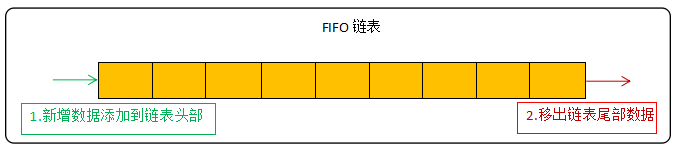
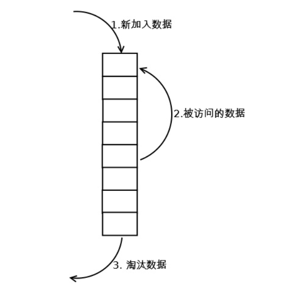
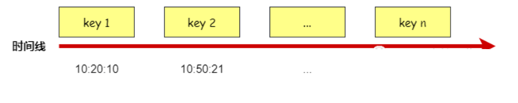
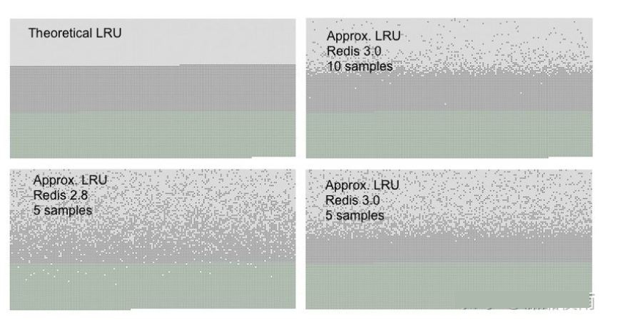
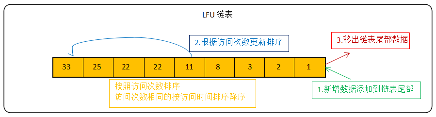

## 一、Redis过期删除策略

Redis对于过期的key，有两种删除策略：

1. 定时删除
2. 定期删除
3. 惰性删除

### 定时删除

在设置键的过期时间的同时，设置一个定时器，当键过期了，定时器马上把该键删除。

定时删除对内存来说是友好的，因为它可以及时清理过期键；但对CPU是不友好的，如果过期键太多，删除操作会消耗过多的资源。

### 定期删除

redis 会将每个设置了过期时间的 key 放入到一个独立的字典中，以后会定期遍历这个字典来删除到期key。

Redis 默认会每秒进行十次过期扫描（100ms一次），过期扫描不会遍历过期字典中所有的 key，而是采用了一种简单的**贪心策略**。

1. 从过期字典中随机 20 个 key；
2. 删除这 20 个 key 中已经过期的 key；
3. 如果过期的 key 比率超过 1/4，那就重复步骤 1；

redis默认是每隔 100ms就随机抽取一些设置了过期时间的key，检查其是否过期，如果过期就删除。

注意这里是随机抽取的。为什么要随机呢？你想一想假如 redis 存了几十万个 key ，每隔100ms就遍历所有的设置过期时间的 key 的话，就会给 CPU 带来很大的负载。

定期删除是定时删除和惰性删除的一个折中方案。每隔一段时间来删除过期键，可以根据实际场景自定义这个间隔时间，在CPU资源和内存资源上作出权衡。

### 惰性删除

所谓惰性策略就是在客户端访问这个key的时候，redis对key的过期时间进行检查，如果过期了就立即删除，不会给你返回任何东西。

为啥需要两种删除策略呢？

定期删除可能会导致很多过期key到了时间并没有被删除掉。所以就有了惰性删除。假如你的过期 key，靠定期删除没有被删除掉，还停留在内存里，除非你的系统去查一下那个 key，才会被redis给删除掉。这就是所谓的惰性删除，即当你主动去查过期的key时，如果发现key过期了，就立即进行删除，不返回任何东西。

总结：定期删除是集中处理，惰性删除是零散处理。


## 二、配置Redis内存

Redis是基于内存key-value键值对的内存数据库，我们安装完数据库之后，内存往往会受到系统内存大小的限制，我们也可以配置redis能使用的最大的内存大小。

两种方式配置redis的内存：

- 通过配置文件修改
- 通过客户端修改

### 通过配置文件修改

我们可以通过配置文件修改，安装完redis之后我们可以在redis根目录中找到redis.conf文件,在配置文件中添加一下参数就可以设置redis的内存大小了

~~~sh
# 设置 Redis 最大使用内存大小为100M
maxmemory 100mb    //指定最大内存为100mb
~~~

上面的配置设置了，当 Redis 使用的内存超过 100Mb 时,就开始对数据进行淘汰。

下面是更加详细的例子：

~~~sh
#配置文件
maxmemory <bytes>
下面的写法均合法：
maxmemory 1024000
maxmemory 1GB
maxmemory 1G
maxmemory 1024KB
maxmemory 1024K
maxmemory 1024MB
...
~~~


### 通过客户端修改

在服务器上输入redis-cli之后进入redis客户端，通过命令动态修改redis内存大小

~~~sh
//设置Redis最大占用内存大小为100M
127.0.0.1:6379> config set maxmemory 100mb
//获取设置的Redis能使用的最大内存大小
127.0.0.1:6379> config get maxmemory
~~~

如果不设置，或者设置最大内存大小为0，在64位操作系统下，Redis不限制内存大小，在32位操作系统，Redis最多使用3GB内存。

下面是更加详细的例子：

~~~sh
#命令行
127.0.0.1:6379> config get maxmemory
1) "maxmemory"
2) "0"
127.0.0.1:6379> config set maxmemory 1GB
OK
127.0.0.1:6379> config get maxmemory
1) "maxmemory"
2) "1073741824"
~~~


## 三、Redis内存淘汰策略

我们设置完redis内存之后，我们就像里面放数据，但是内存总有满的时候，满的时候redis又是怎么处理的呢？

每进行一次redis操作的时候，redis都会检测可用内存，判断是否要进行内存淘汰，当超过可用内存的时候，redids 就会使用对应淘汰策略。

### 八种内存淘汰策略

redis内存淘汰策略，具体如下：

1. **no-envicition**
   该策略对于写请求不再提供服务，会直接返回错误，当然排除del等特殊操作，redis默认是no-envicition策略。
2. **allkeys-random**
   从redis中随机选取key进行淘汰。
3. **allkeys-lru**
   使用LRU（Least Recently Used，最近最少使用）算法，从redis中选取使用最少的key进行淘汰。
4. **volatile-random**
   从redis中设置过过期时间的key，进行随机淘汰。
5. **volatile-ttl**
   从redis中选取即将过期的key，进行淘汰。
6. **volatile-lru**
   使用LRU（Least Recently Used，最近最少使用）算法，从redis中设置过过期时间的key中，选取最少使用的进行淘汰。
7. **volatile-lfu**
   使用LFU（Least Frequently Used，最不经常使用），从设置了过期时间的键中选择某段时间之内使用频次最小的键值对清除掉。
8. **allkeys-lfu**
   使用LFU（Least Frequently Used，最不经常使用），从所有的键中选择某段时间之内使用频次最少的键值对清除。


主要是4种算法，针对不同的key，形成的策略。

算法：

1. random：随机淘汰。
2. ttl：快要过期的先淘汰。
3. lru（Least Recently Used）：最近很少的使用的key（根据时间，最不常用的淘汰）。
4. lfu（Least Frequently Used）：最近很少的使用的key (根据计数器，用的次数最少的key淘汰)。

key ：

1. volatile：有过期的时间的那些key。
2. allkeys：所有的key。
   

### 内存淘汰算法的具体工作原理

- 客户端执行一条新命令，导致数据库需要增加数据（比如set key value）
- Redis会检查内存使用，如果内存使用超过 maxmemory，就会按照置换策略删除一些 key
- 新的命令执行成功


### 如何设置淘汰策略

可以命令查看当前redis使用的淘汰策略

```
config get maxmemory-policy    //获取当前内存淘汰策略
config set maxmemory-policy valatile-lru  //通过命令修改淘汰策略
```


## 四、Redis 内存淘汰算法

Redis 的淘汰算法有多种，如下：

1. random
2. TTL
3. LRU（Least Recently Used，最近最少使用）
4. LFU（Least Frequently Used，最不经常使用）

random随机算法很好理解，就是从数据库中随机淘汰一些 Keys。

TTL 算法就是从设置了过期时间的 Keys 中获取最早过期的 一批 Keys，然后淘汰这些 Keys。

而 LRU 和 LFU 这两种算法在名字上比较容易混淆，所以这里介绍一下这两种算法的区别。

在缓存的内存淘汰策略中有FIFO、LRU、LFU三种，其中LRU和LFU是Redis在使用的。FIFO是最简单的淘汰策略，遵循着先进先出的原则，这里简单提一下：



### LRU算法

LRU（Least Recently Used，最近最少使用），主要是通过 Key 的最后访问时间来判定哪些 Key 更适合被淘汰，如下图所示：



如上图所示，所有的 Keys 都根据最后被访问的时间来进行排序的，所以在淘汰时只需要按照所有 Keys 的最后被访问时间，由小到大来进行即可。



**LRU算法的特点：**

1. 新增key value的时候首先在链表结尾添加Node节点，如果超过LRU设置的阈值就淘汰队头的节点并删除掉HashMap中对应的节点。
2. 修改key对应的值的时候先修改对应的Node中的值，然后把Node节点移动队尾。

3. 访问key对应的值的时候把访问的Node节点移动到队尾即可。


**Redis的LRU实现：**

Redis维护了一个24位时钟，可以简单理解为当前系统的时间戳，每隔一定时间会更新这个时钟。每个key对象内部同样维护了一个24位的时钟，当新增key对象的时候会把系统的时钟赋值到这个内部对象时钟。比如我现在要进行LRU，那么首先拿到当前的全局时钟，然后再找到内部时钟与全局时钟距离时间最久的（差最大）进行淘汰，这里值得注意的是全局时钟只有24位，按秒为单位来表示才能存储194天，所以可能会出现key的时钟大于全局时钟的情况，如果这种情况出现那么就两个相加而不是相减来求最久的key。

~~~c
struct redisServer {
       pid_t pid; 
       char *configfile; 
       //全局时钟
       unsigned lruclock:LRU_BITS; 
       ...
};
typedef struct redisObject {
    unsigned type:4;
    unsigned encoding:4;
    /* key对象内部时钟 */
    unsigned lru:LRU_BITS;
    int refcount;
    void *ptr;
} robj;
~~~

Redis中的LRU与常规的LRU实现并不相同，常规LRU会准确的淘汰掉队头的元素，但是Redis的LRU并不维护队列，只是根据配置的策略要么从所有的key中随机选择N个（N可以配置）要么从所有的设置了过期时间的key中选出N个键，然后再从这N个键中选出最久没有使用的一个key进行淘汰。

下图是常规LRU淘汰策略与Redis随机样本取一键淘汰策略的对比，浅灰色表示已经删除的键，深灰色表示没有被删除的键，绿色表示新加入的键，越往上表示键加入的时间越久。从图中可以看出，在redis 3中，设置样本数为10的时候能够很准确的淘汰掉最久没有使用的键，与常规LRU基本持平。



**为什么要使用近似LRU？**

1、性能问题，由于近似LRU算法只是最多随机采样N个key并对其进行排序，如果精准需要对所有key进行排序，这样近似LRU性能更高

2、内存占用问题，redis对内存要求很高，会尽量降低内存使用率，如果是抽样排序可以有效降低内存的占用

3、实际效果基本相等，如果请求符合长尾法则，那么真实LRU与Redis LRU之间表现基本无差异

4、在近似情况下提供可自配置的取样率来提升精准度，例如通过 CONFIG SET maxmemory-samples 指令可以设置取样数，取样数越高越精准，如果你的CPU和内存有足够，可以提高取样数看命中率来探测最佳的采样比例。

### LFU算法

LFU（Least Frequently Used）表示最不经常使用，它是根据数据的历史访问频率来淘汰数据，其核心思想是“如果数据过去被访问多次，那么将来被访问的频率也更高”。

LFU算法反映了一个key的热度情况，不会因LRU算法的偶尔一次被访问被误认为是热点数据。

LFU算法的常见实现方式为链表：

新数据放在链表尾部 ，链表中的数据按照被访问次数降序排列，访问次数相同的按最近访问时间降序排列，链表满的时候从链表尾部移出数据。




## 参考资料

https://blog.csdn.net/crazymakercircle/article/details/115360829

https://blog.csdn.net/weixin_40980639/article/details/125446002