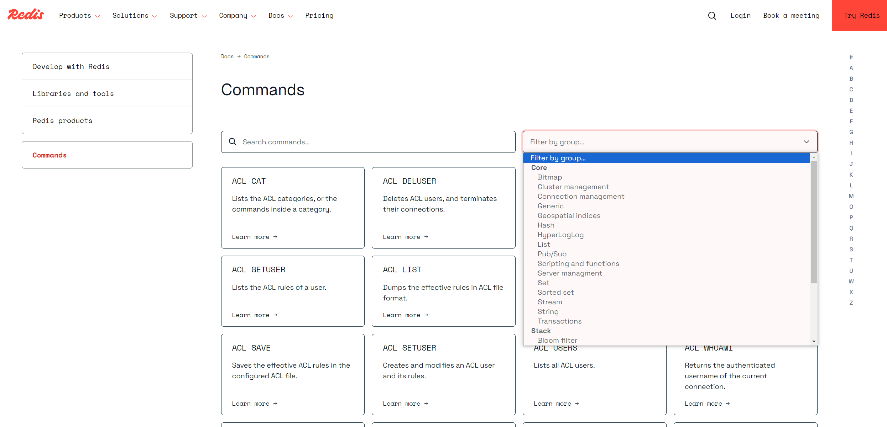

## 一、Redis[数据结构](https://so.csdn.net/so/search?spm=a2c6h.13046898.publish-article.41.3eaf6ffaRQROo8&q=数据结构)介绍

Redis是一个key-value的数据库，key一般是String类型，value的类型可以是多种。

可以在Redis的官方网站上查看一些命令，[https://redis.io/commands](https://redis.io/commands)

也可以在控制台上通过help命令查看

~~~sh
# 登录redis后台
redis-cli
# 查看帮助
127.0.0.1:6379> help @generic
~~~

Redis 主要支持以下几种数据类型：

- **string（字符串）:** 基本的数据存储单元，可以存储字符串、整数或者浮点数。
- **hash（哈希）:** 一个键值对集合，可以存储多个字段。
- **list（列表）:** 一个简单的列表，可以存储一系列的字符串元素。
- **set（集合）:** 一个无序集合，可以存储不重复的字符串元素。
- **zset（sorted set：有序集合）：**  类似于集合，但是每个元素都有一个分数（score）与之关联。
- **位图（Bitmaps）：** 基于字符串类型，可以对每个位进行操作。
- **超日志（HyperLogLogs）：** 用于基数统计，可以估算集合中的唯一元素数量。
- **地理空间（Geospatial）：** 用于存储地理位置信息。
- **发布/订阅（Pub/Sub）：** 一种消息通信模式，允许客户端订阅消息通道，并接收发布到该通道的消息。
- **流（Streams）：** 用于消息队列和日志存储，支持消息的持久化和时间排序。
- **模块（Modules）：** Redis 支持动态加载模块，可以扩展 Redis 的功能。

## 二、Redis通用命令

通用命令是部分数据类型的，都可以使用的类型，常见的有：

### KEYS

`KEYS`：查看符合模板的所以key ,**不建议在生产环境设备上使用**

~~~sh
127.0.0.1:6379> help keys

  KEYS pattern
  summary: Find all keys matching the given pattern
  since: 1.0.0
  group: generic

127.0.0.1:6379> keys *
 1) "item:stock:id:10003"
 2) "item:id:10004"
 3) "item:id:10003"
 4) "item:stock:id:10005"
 5) "item:stock:id:10001"
 6) "item:stock:id:10002"
 7) "item:id:10005"
 8) "item:id:10002"
 9) "item:stock:id:10004"
10) "item:id:10001"
11) "login:3"
127.0.0.1:6379>
~~~

### DEL

`DEL`：删除一个指定的key

~~~sh
127.0.0.1:6379> help del

  DEL key [key ...]
  summary: Delete a key
  since: 1.0.0
  group: generic

127.0.0.1:6379> MSET k1 v1 k2 v3 k3 v3
OK
127.0.0.1:6379> DEL k1 k2
(integer) 2
127.0.0.1:6379> KEYS *
 1) "k3"
127.0.0.1:6379>
~~~

### EXISTS

`EXISTS`:判断一个key是否存在

~~~sh
127.0.0.1:6379> help exists

  EXISTS key [key ...]
  summary: Determine if a key exists
  since: 1.0.0
  group: generic

127.0.0.1:6379> exists k3
(integer) 1
127.0.0.1:6379>
~~~

### EXPIRE

`EXPIRE`:给一个key设置一个有效期，有效期到期时key自动被删除

### TTL

`TTL`：查看一个key的剩余有效期

~~~sh
127.0.0.1:6379> help expire

  EXPIRE key seconds
  summary: Set a key's time to live in seconds
  since: 1.0.0
  group: generic

127.0.0.1:6379> expire k3 20
(integer) 1

127.0.0.1:6379> help ttl

  TTL key
  summary: Get the time to live for a key
  since: 1.0.0
  group: generic

127.0.0.1:6379> ttl k3
(integer) 16
127.0.0.1:6379>
127.0.0.1:6379> ttl k3
(integer) 9
127.0.0.1:6379> ttl k3
(integer) 3
127.0.0.1:6379> ttl k3
(integer) -2 # 有效期结束
~~~

## 三、String类型

### 特点

- String类型，也就是字符串类型，是Redis中最简单的存储类型
- 其value是字符串，不过根据字符串的格式不同，又可以分为3类：

- - String：普通字符串
  - int：整数类型，可以做自增、自减操作
  - float：浮点类型，可以做自增、自减操作

- 不管是哪种格式，底层都是字节数组形式存储，只不过是编码方式不同，字符串类型的最大空间不能超过512M
- 可以存储字符串或整数值，支持原子性的增减操作（incr/decr）。

| KEY   | VALUE       |
| ----- | ----------- |
| msg   | hello world |
| num   | 10          |
| score | 99.5        |

### 适用场景

单个值的缓存，计数器（如网页访问次数），简单的KV存储。

### String常见的命令

- - `SET`：添加或者修改已经存在的一个String类型的键值对
  - `GET`：根据key获得String类型的value
  - `MSET`：批量添加多个String类型的键值对
  - `MGET`：根据多个key获取多个String类型的value
  - `INCR`：让一个整型的key自增1
  - `INCRBY`：让一个整型的key自增并指定步长，例如：`incrby num 2` 表示让num值自增2
  - `INCRBYFLOAT`：让一个浮点类型的数字自增并指定步长
  - `SETNX`：添加一个String类型的键值对，前提是这个key不存在，否则不执行
  - `SETEX`：添加一个String类型的键值对，并且指定有效期

## 四、Hash类型

### 特点

- Hash类型，也叫散列，其value是一个无序字典，类似于Java中的HashMap结构
- String结构是将对象序列化为JSON字符串后存储，当需要修改对象某个字段时很不方便，Hash结构可以将对象中的**每个字段独立存储**，可以针对单个字段做CRUD

### 适用场景

当一个实体拥有多个属性且这些属性都需要存储时，如用户信息、商品详情等。

### Hash类型的常见命令

- `HSET key field value`：添加或者修改hash类型key的field的值
- `HGET key field`：获取一个hash类型key的field的值
- `HMSET`：批量添加多个hash类型key的field的值
- `HMGET`：批量获取多个hash类型key的field的值
- `HMGETALL`：获取一个hash类型的key中的所有field和value
- `HKEYS`：获取一个hash类型的key中的所有field
- `HVALS`：获取一个hash类型的key中的所有value
- `HINCRBY`：染一个hash类型key的字段值自增并指定步长
- `HSETNX`：添加一个hash类型的key的field值，前提是这个field不存在，否则不执行

## 五、List类型

### 特点

- Redis中的List类型与Java中的LinkedList类似，可以看成是一个**双向链表**结构，既可以支持正向检索也可以支持反向检索，支持在头部或尾部进行快速插入和删除操作。
- 特征也与LinkedList类似：

- - 有序
  - 元素可以重复
  - 插入和删除快
  - 查询速度一般

- 常用来存储一些有序数据

### 适用场景

实现简单的队列或栈，如消息队列、最新评论列表。

### List类型的常见命令

- `LPUSH key element...`：向列表左侧插入一个或多个元素
- `LPOP key`：移除并返回列表左侧第一个元素，没有则返回nil
- `RPUSH key element...`：向列表右侧插入一个或多个元素
- `RPOP key`：移除并返回列表右侧的第一个元素
- `LRANGE key star end`：返回一段角标范围内的所有元素
- `BLPOP`和`BRPOP`：与`LPOP`和`RPOP`类似，只不过在没有元素时等待指定时间，而不是直接返回nil

## 六、Set类型

### 特点

- Redis的Set结构与Java中的HashSet类似，可以看做是一个value为null的HashMap，因为也是一个hash表，因此具备与HashSet类似的特征：

- - 无序
  - 元素不可重复
  - 查找快
  - 支持交集、并集、差集等功能

### 适用场景

去重操作，如关注列表、标签系统。

### Set类型的常见命令

- `SADD key member...`：向set中添加一个或多个元素
- `SREM key member...`：移除set中的指定元素
- `SCARD key`：返回set中元素的个数
- `SISMEMBER key member`：判断衣一个元素是否存在于set中
- `SMEMBERS`：获取set中的所有元素
- `SINTER key1 key2...`：求key1与key2的交集
- `SDIFF key1 key2..`.：求key1与key2的差集
- `SUNION key1 key2...`：求key1与key2的并集

## 七、SortedSet类型

### 特点

- Redis的SortedSet是一个可排序的set集合，与Java中的TreeSet有些类似，但是底层数据结构却差别很大，SortedSet中的每个元素都带有一个score属性，可以基于score属性对元素排序，底层的实现是一个跳表（SkipList）加hash表
- SortedSet有以下特性：

- - 可排序
  - 元素不重复
  - 查询速度快

### 适用场景

因为SortedSet的可排序性，经常用来实现排行榜这样的功能。

### SortedSet类型的常见命令

- `ZADD key member`：添加一个或多个元素到sorted set ，如果已经存在则更新其score值
- `ZREM key member`：删除sorted set中的一个指定元素
- `ZSCORE key member`：获取sorted set中的指定元素的score值
- `ZRANK key member`：获取sorted set中的指定元素排名
- `ZCARD key`：获取sorted set中的元素个数
- `ZCOUNT key min max`：统计score值在给定的范围内所有元素的个数
- `ZINCRBY key increment member` ：让sorted set中的指定元素自增，步长为指定的increment值
- `ZRANGE key min max` ：按照score排序后，获取指定排名范围内的元素
- `ZRANGEBYSCORE key min max`：按照score排序后，获取指定score范围内的元素
- `ZDIFF`、`ZINTER`、`ZUNION`：求差集、交集、并集

## 参考资料

https://www.runoob.com/redis/redis-data-types.html

https://developer.aliyun.com/article/1518145

https://developer.aliyun.com/article/1505666