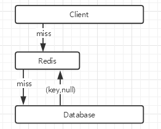

Redis是我们日常在工作中使用非常多的缓存解决手段，使用缓存，能够提升我们应用程序的性能，同时极大程度的降低数据库的压力。但如果使用不当，同样会造成许多问题，其中三大经典问题就包括了缓存穿透、缓存击穿和缓存雪崩。

### 缓存穿透

缓存穿透是指用户在查找一个数据时查找了一个根本不存在的数据。按照缓存设计流程，首先查询redis缓存，发现并没有这条数据，于是直接查询数据库，发现也没有，于是本次查询结果以失败告终。

当存在大量的这种请求或恶意使用不存在的数据进行访问攻击时，大量的请求将直接访问数据库，造成数据库压力甚至可能直接瘫痪。以电商商城为例，以商品id进行商品查询，这时如果使用一个不存在的id进行攻击，每次的攻击都将访问在数据库上。

来看一下应对方案：

#### 1、缓存空对象

修改数据库写回缓存逻辑，对于缓存中不存在，数据库中也不存在的数据，我们仍然将其缓存起来，并且设置一个缓存过期时间。



如上图所示，查询数据库失败时，仍以查询的key值缓存一个空对象（key，null）。

但是这么做仍然存在不少问题：

a、这时在缓存中查找这个key值时，会返回一个null的空对象。需要注意的是这个空对象可能并不是客户端需要的，所以需要对结果为空进行处理后，再返回给客户端。

b、占用redis中大量内存。因为空对象能够被缓存，redis会使用大量的内存来存储这些值为空的key。

c、如果在写缓存后数据库中存入的这个key的数据，由于缓存没有过期，取到的仍为空值，所以可能出现短暂的数据不一致问题。

#### 2、布隆过滤器

布隆过滤器是一个二进制向量，或者说二进制的数组，或者说是位（bit）数组。


因为是二进制的向量，它的每一位只能存放0或者1。当需要向布隆过滤器中添加一个数据映射时，添加的并不是原始的数据，而是使用多个不同的哈希函数生成多个哈希值，并将每个生成哈希值指向的下标位置置为1。所以，别再说从布隆过滤器中取数据啦，我们根本就没有存原始数据。


例如"Hydra"的三个哈希函数生成的下标分别为1，3，6，那么将这三位置为1，其他数据以此类推。那么这样的数据结构能够起到什么效果呢？我们可以根据这个位向量，来判断数据是否存在。

具体流程：

a、计算数据的多个哈希值；

b、判断这些bit是否为1，全部为1，则数据可能存在；

c、若其中一个或多个bit不为1，则判断数据不存在。

需要注意，布隆过滤器是存在误判的，因为随着数据存储量的增加，被置为1的bit数量也会增加，因此，有可能在查询一个并不存在的数据时，碰巧所有bit都已经被其他数据置为了1，也就是发生了哈希碰撞。因此，布隆过滤器只能做到判断数据是否可能存在，不能做到百分百的确定。

Google的`guava`包为我们提供了单机版的布隆过滤器实现，来看一下具体使用

首先引入maven依赖：


```xml
<dependency>
    <groupId>com.google.guava</groupId>
    <artifactId>guava</artifactId>
    <version>27.1-jre</version>
</dependency>
```

向布隆过滤器中模拟传入1000000条数据，给定误判率，再使用不存在的数据进行判断：

```java
public class BloomTest {
    public static void test(int dataSize,double errorRate){
        BloomFilter<Integer> bloomFilter=
                BloomFilter.create(Funnels.integerFunnel(), dataSize, errorRate);

        for(int i = 0; i< dataSize; i++){
            bloomFilter.put(i);
        }

        int errorCount=0;
        for(int i = dataSize; i<2* dataSize; i++){
            if(bloomFilter.mightContain(i)){
                errorCount++;
            }
        }
        System.out.println("Total error count: "+errorCount);
    }

    public static void main(String[] args) {
        BloomTest.test(1000000,0.01);
        BloomTest.test(1000000,0.001);
    }
}
```

测试结果：


```text
Total error count: 10314
Total error count: 994
```

可以看出，在给定误判率为0.01时误判了10314次，在误判率为0.001时误判了994次，大体符合我们的期望。

但是因为guava的布隆过滤器是运行在的jvm内存中，所以仅支持单体应用，并不支持微服务分布式。那么有没有支持分布式的布隆过滤器呢，这时Redis站了出来，自己造成的问题自己来解决！

Redis的BitMap（位图）支持了对位的操作，通过一个bit位来表示某个元素对应的值或者状态。

```bash
//对key所存储的字符串值，设置或清除指定偏移量上的位（bit）
setbit key offset value
//对key所存储的字符串值，获取指定偏移量上的位（bit）
getbit key offset
```

既然布隆过滤器是对位进行赋值，我们就可以使用BitMap提供的setbit和getbit命令非常简单的对其进行实现，并且setbit操作可以实现自动数组扩容，所以不用担心在使用过程中数组位数不够的情况。

```java
//源码参考https://www.cnblogs.com/CodeBear/p/10911177.html
public class RedisBloomTest {
    private static int dataSize = 1000;
    private static double errorRate = 0.01;

    //bit数组长度
    private static long numBits;
    //hash函数数量
    private static int numHashFunctions;

    public static void main(String[] args) {
        numBits = optimalNumOfBits(dataSize, errorRate);
        numHashFunctions = optimalNumOfHashFunctions(dataSize, numBits);

        System.out.println("Bits length: "+numBits);
        System.out.println("Hash nums: "+numHashFunctions);

        Jedis jedis = new Jedis("127.0.0.1", 6379);
        for (int i = 0; i <= 1000; i++) {
            long[] indexs = getIndexs(String.valueOf(i));
            for (long index : indexs) {
                jedis.setbit("bloom", index, true);
            }
        }

        num:
        for (int i = 1000; i < 1100; i++) {
            long[] indexs = getIndexs(String.valueOf(i));
            for (long index : indexs) {
                Boolean isContain = jedis.getbit("bloom", index);
                if (!isContain) {
                    System.out.println(i + "不存在");
                    continue  num;
                }
            }
            System.out.println(i + "可能存在");
        }
    }

    //根据key获取bitmap下标
    private static long[] getIndexs(String key) {
        long hash1 = hash(key);
        long hash2 = hash1 >>> 16;
        long[] result = new long[numHashFunctions];
        for (int i = 0; i < numHashFunctions; i++) {
            long combinedHash = hash1 + i * hash2;
            if (combinedHash < 0) {
                combinedHash = ~combinedHash;
            }
            result[i] = combinedHash % numBits;
        }
        return result;
    }

    private static long hash(String key) {
        Charset charset = Charset.forName("UTF-8");
        return Hashing.murmur3_128().hashObject(key, Funnels.stringFunnel(charset)).asLong();
    }

    //计算hash函数个数
    private static int optimalNumOfHashFunctions(long n, long m) {
        return Math.max(1, (int) Math.round((double) m / n * Math.log(2)));
    }

    //计算bit数组长度
    private static long optimalNumOfBits(long n, double p) {
        if (p == 0) {
            p = Double.MIN_VALUE;
        }
        return (long) (-n * Math.log(p) / (Math.log(2) * Math.log(2)));
    }
}
```

基于BitMap实现分布式布隆过滤器的过程中，哈希函数的数量以及位数组的长度都是动态计算的。可以说，给定的容错率越低，哈希函数的个数则越多，数组长度越长，使用的redis内存开销越大。

guava中布隆过滤器的数组最大长度是由int值的上限决定的，大概为21亿，而redis的位数组为512MB，也就是2^32位，所以最大长度能够达到42亿，容量为guava的两倍。

### 缓存击穿

缓存击穿是指缓存中没有但数据库中有的数据，由于出现大量的并发请求，同时读缓存没读到数据，又同时去数据库去取数据，引起数据库压力瞬间增大，造成过大压力。

造成这种情况大致有两种情况：

- 第一次查询数据时，没有进行缓存预热，数据并没有加入缓存当中。
- 缓存由于到达过期时间导致失效。

解决思路：

- 当缓存不命中时，在查询数据库前使用redis分布式锁，使用查询的key值作为锁条件；
- 获取锁的线程在查询数据库前，再查询一次缓存。这样做是因为高并发请求获取锁的时候造成排队，但第一次进来的线程在查询完数据库后会写入缓存，之后再获得锁的线程直接查询缓存就可以获得数据；
- 读取完数据后释放分布式锁。

代码思路：


```text
public String queryData(String key) throws Exception {
    String data;
    data = queryDataFromRedis(key);// 查询缓存数据
    if (data == null) {
        if(redisLock.tryLock()){//获取分布式锁
            data = queryDataFromRedis(key); // 再次查询缓存
            if (data == null) {
                data = queryDataFromDB(key); // 查询数据库
                writeDataToRedis(data); // 将查询到的数据写入缓存
            }
            redisLock.unlock();//释放分布式锁
        }
    }
    return data;
}
```

具体分布式锁的实现可以使用redis中强大的setnx命令：

```text
/*
* 加锁
* key-键;value-值
* nxxx-nx(只在key不存在时才可以set)|xx(只在key存在的时候set)
* expx--ex代表秒，px代表毫秒;time-过期时间，单位是expx所代表的单位。
* */
jedis.set(key, value, nxxx, expx, time);

//解锁
jedis.del(key);
```

通过在加锁的同时设置过期时间，还可以防止线程挂掉仍然占用锁的情况。

### 缓存雪崩

缓存雪崩是指缓存中数据大批量到过期时间，引发的大部分缓存突然同时不可用，而查询数据量巨大，引起数据库压力过大甚至宕机的情况。 需要注意缓存击穿和缓存雪崩的不同之处缓存击穿指的是大量的并发请求去查询同一条数据；而缓存雪崩是大量缓存同时过期，导致很多查询请求都查不到缓存数据从而查数据库。

解决方案：

- 错开缓存的过期时间，可通过设置缓存数据的过期时间为默认值基础上加上一个随机值，防止同一时间大量数据过期现象发生。
- 搭建高可用的redis集群，避免出现缓存服务器宕机引起的雪崩问题。
- 参照hystrix，进行熔断降级。

### 总结：

随着Redis的使用日渐普及，越来越多的系统开始使用缓存技术，但伴随着便利的同时也因为使用不当造成了很多问题。只有在系统设计时期考虑到这些问题并加以克服，系统才能够更加健壮。