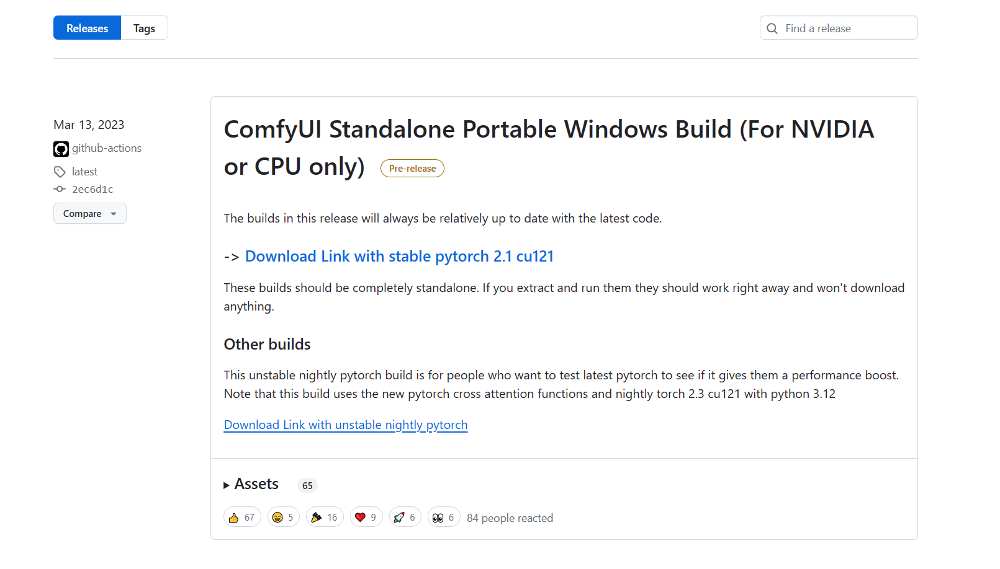

## Windows（N卡）安装流程

如果使用的是Windows平台且为N卡用户，只需要在项目主页的Release页面下载作者提供的“官方整合包”，即可一键开启ComfyUI探索之路：

> 下载地址：https://github.com/comfyanonymous/ComfyUI/releases

进入后，点击“**[Download Link with stable pytorch 2.1 cu121](https://github.com/comfyanonymous/ComfyUI/releases/download/latest/ComfyUI_windows_portable_nvidia_cu121_or_cpu.7z)**”即可下载。

下载完毕后，解压文件夹至任意空白路径。双击“run_nvdidia_gpu.bat”，即可开启ComfyUI。