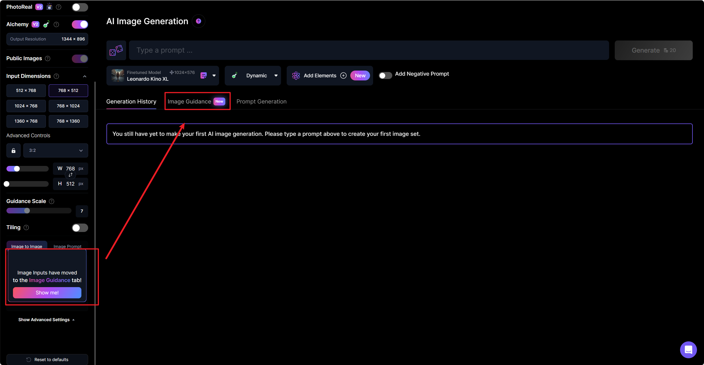

## LOFI音乐频道

### 一、制作素材

#### 图生图

使用 leonardo 进行图生图

进入image guidance图生图页面

上传图片，调整参数，分辨率、提示词、模型、权重，权重值越高越像原图，

将生成的图像下载保存。

#### 提示词生图

图片转提示词：https://imagetoprompt.com/

上传图片点击`Generate prompt`，等待几秒即可看到生成的提示词。

~~~
anime scene of a small island with a castle and a tower, anime scenery concept art, anime scenery, anime landscape, studio ghibli landscape, island background, greg rutkowski studio ghibli,
~~~

可以到翻译软件中优化提示词

将提示词粘贴到提示框中，调整其他参数

继续使用 https://www.krea.ai 进行图片增强放大

上传图片，调整参数

等待图片生成。

### 二、生成动画

使用runwayml网站生成视频

点击首页的`start generating`

上传图片，Motion值保持5不变，Camera Motion相机运动不变，

点击Motion Brush运动笔刷，涂抹环境，多生成几次选择自己满意的

ambient 调整为1.2，点击确认，生成

### 三、下载音乐

音频库里筛选不需注明出处的音乐，筛选合适的曲调，下载。

### 四、合成视频

## 涉及的网站

AI生图

Midjourney：https://www.midjourney.com/

Leonardo：https://app.leonardo.ai

Aitubo：https://aitubo.ai/

Dreamlike.art：https://dreamlike.art/

图片动画、运动笔刷

runwayml：https://app.runwayml.com 

实时绘画，图片放大

https://www.krea.ai

图片转提示词

https://imagetoprompt.com/

参考资料

https://www.bilibili.com/video/BV18K411v7vr