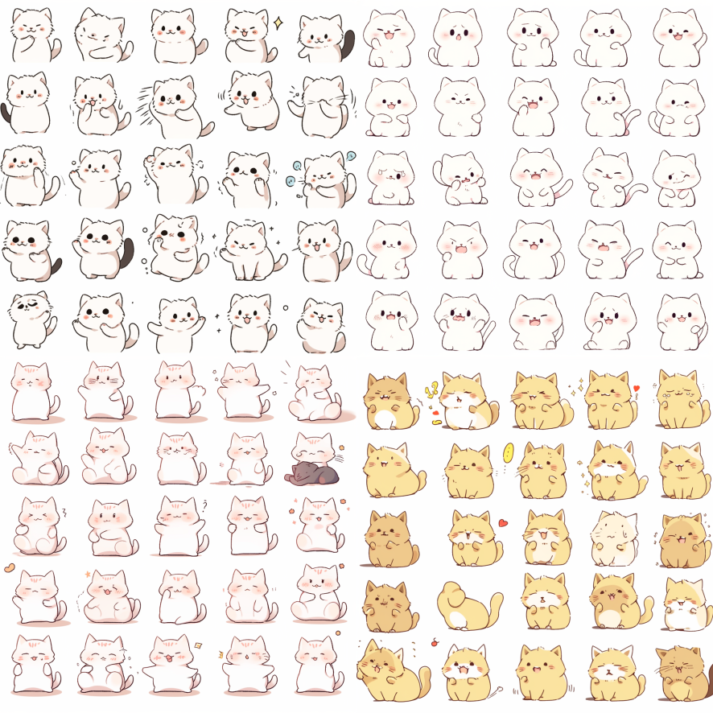

> 微信开放平台地址：[微信表情 (qq.com)](https://sticker.weixin.qq.com/cgi-bin/mmemoticonwebnode-bin/pages/home)

## 一、制作流程

1. Midjourney根据提示词生成表情包（一整张图）
2. 扣去背景图
3. 制作单个表情，240*240
4. 添加文字
5. 导出表情包图片

## 二、制作规则

制作规范：[微信表情开放平台 (qq.com)](https://sticker.weixin.qq.com/cgi-bin/mmemoticon-bin/readtemplate?t=guide/index.html#/makingSpecifications#specifications_stickers)

## 三、生成表情包

### 3.1 设置niji版本

输入框输入 `/setting` 调出面板，选择 `Niji Model V5`。

### 3.2 生成表情包

官方规则

两种方式

方法1：根据提示词生成表情包

提示词1

~~~
一只熊猫表情表，16个表情，多个动态姿势，不同的表情，白色背景，8k， -s 250 -niji 5
emoji sheet of a panda, 16 emoticons, mutiple dynamic pose, different expressions, white background, 8k, -s 250 --niji 5
~~~

提示词2

~~~
可爱的女孩，表情包，16个表情，表情表，多种姿势和表情，拟人风格，迪士尼风格，黑色笔画，不同的情绪，8k -niji 5可爱
cute girl, emoji pack, 16 emoticons, emoji sheet, mutiple poses and expressions, anthropomorphic style, Disney style, black strokes, different emotions, 8k --niji 5
~~~

提示词详解

1. emoji sheet of a XXX，这里的XXX可以替换为想要的主题，比如cat、dog等。
2. 16 emoticons，一套微信表情包是8/16/24个。
3. mutiple dynamic pose，different expressions，多动作，不同表情。
4. white background，白色背景图，方便抠图。
5. 8k，高清图。

| 提示词                                                       | 图片                                                         |
| ------------------------------------------------------------ | ------------------------------------------------------------ |
| emoji sheet of a panda, 16 emoticons, mutiple dynamic pose, different expressions, white background, 8k,  --niji 5 |  |
| emoji sheet of a cat, 16 emoticons, mutiple dynamic pose, different expressions, white background, 8k,  --niji 5 |  |

### 3.3 无损放大

https://clipdrop.co/image-upscaler

上传照片，放大2倍即可。

### 3.4 一键去背景

网址一：https://remove.bg，下载时选择高清版本

网址二：https://pixian.ai

### 3.5 抠图

可以使用Photoshop，Sketch，Figma等设计工具。

或者使用在线处理工具：https://mastergo.com

新建容器240*240，然后多复制几个。根据微信表情包的命名规则，重新命名。01,02,03,04...

然后导入表情包图片，双击进行裁剪。

回车，确认后。将裁剪的图片拖进容器中，调整大小，按住shift使图片不变形。

### 3.6 添加文字

### 3.7 去背景导出

### 3.8 准备其他素材

## 参考资料

https://www.bilibili.com/video/BV1kK42187wb

https://zhuanlan.zhihu.com/p/626044821