## 生成图片

`/Describe` 上传图片，生成4组提示词

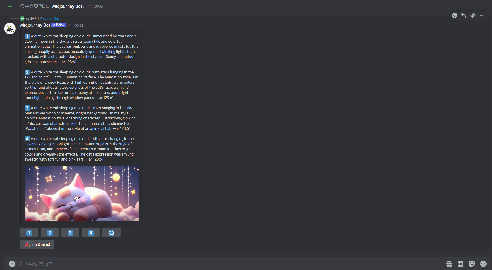

~~~
1️⃣ A cute white cat sleeping on clouds, surrounded by stars and a glowing moon in the sky, with a cartoon style and colorful animation stills. The cat has pink ears and is covered in soft fur. It is smiling happily as it sleeps peacefully under twinkling lights, focus stacked, with a character design in the style of Disney, animated gifs, cartoon scene. --ar 128:61

2️⃣ A cute white cat sleeping on clouds, with stars hanging in the sky and colorful lights illuminating its face. The animation style is in the style of Disney Pixar, with high definition details, warm colors, soft lighting effects, close up shots of the cat's face, a smiling expression, soft fur texture, a dreamy atmosphere, and bright moonlight shining through window panes. --ar 128:61

3️⃣ A cute white cat sleeping on clouds, stars hanging in the sky, pink and yellow color scheme, bright background, anime style, colorful animation stills, charming character illustrations, glowing lights, cartoon characters, colorful animated stills, shining text "Walahimall" above it in the style of an anime artist. --ar 128:61

4️⃣ A cute white cat sleeping on clouds, with stars hanging in the sky and glowing moonlight. The animation style is in the style of Disney Pixar, and "minecraft" elements surround it. It has bright colors and dreamy light effects. The cat's expression was smiling sweetly, with soft fur and pink ears. --ar 128:61
~~~

选择一组提示词，比例改成16:9，点击提交。

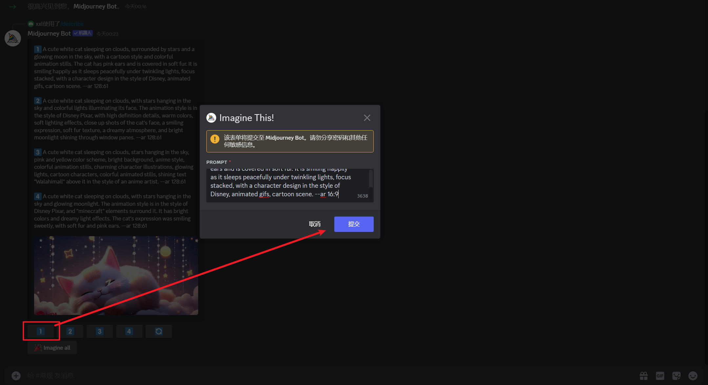

为了保证风格统一，添加seed参数。

右键图片，添加反应，显示更多，输入envelope，点击第一个信封icon

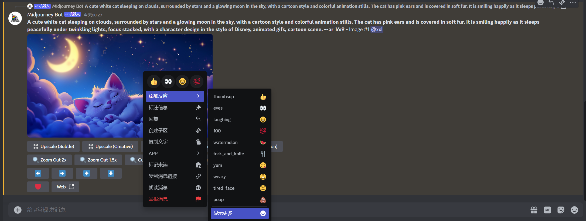

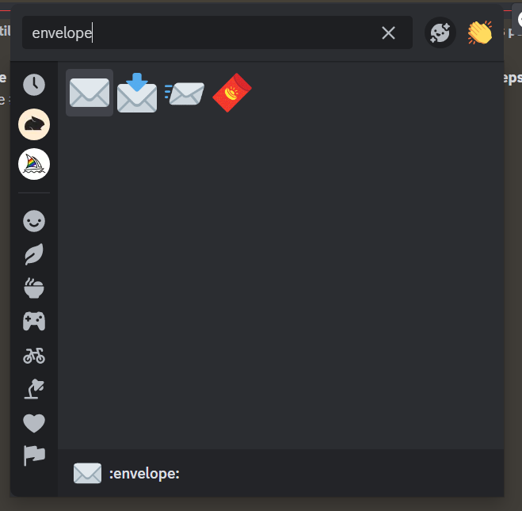

系统会在左侧菜单发送SEED值

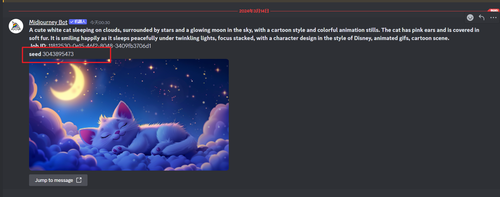

根据seed值重新编写prompt

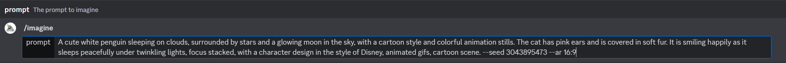

~~~
/imagine
A cute white penguin sleeping on clouds, surrounded by stars and a glowing moon in the sky, with a cartoon style and colorful animation stills. The penguin has pink ears and is covered in soft fur. It is smiling happily as it sleeps peacefully under twinkling lights, focus stacked, with a character design in the style of Disney, animated gifs, cartoon scene. --seed 3043895473 --ar 16:9
~~~

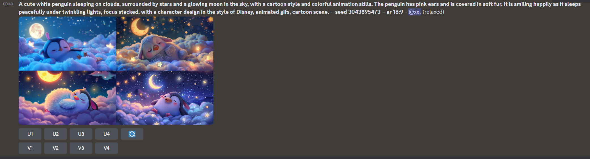

## 制作动画

2D转3D

[LeiaPix - Convert 2D to 3D Depth Animation AI Technology](https://www.leiapix.com/)

注册账号后直接上传图片，几秒钟就能生成一个简单的动画。

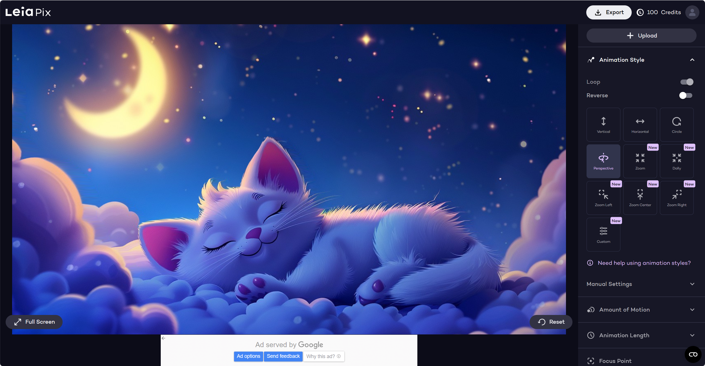

在线去水印

https://tools.kalvinbg.cn/

## 无版权音乐

1、YouTube音频库

2、Soundcloud、Jamendo等平台

3、AI生成：Soundful、AIVA、Mubert

以[Mubert](https://mubert.com/render)为例

选择音乐类型及生成的时间

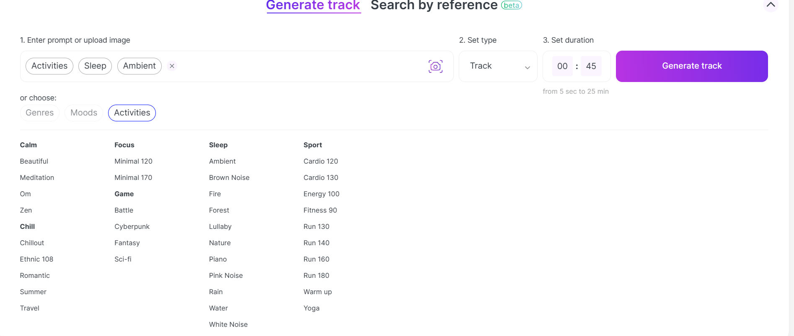

生成完毕后会展示在下方，可以点击试听

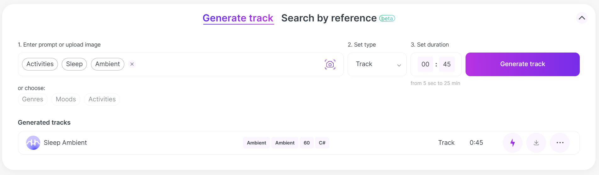

点击下载，进入我的下载页面后再点击下载按钮，输入自己的频道链接，拥有音乐的试用权

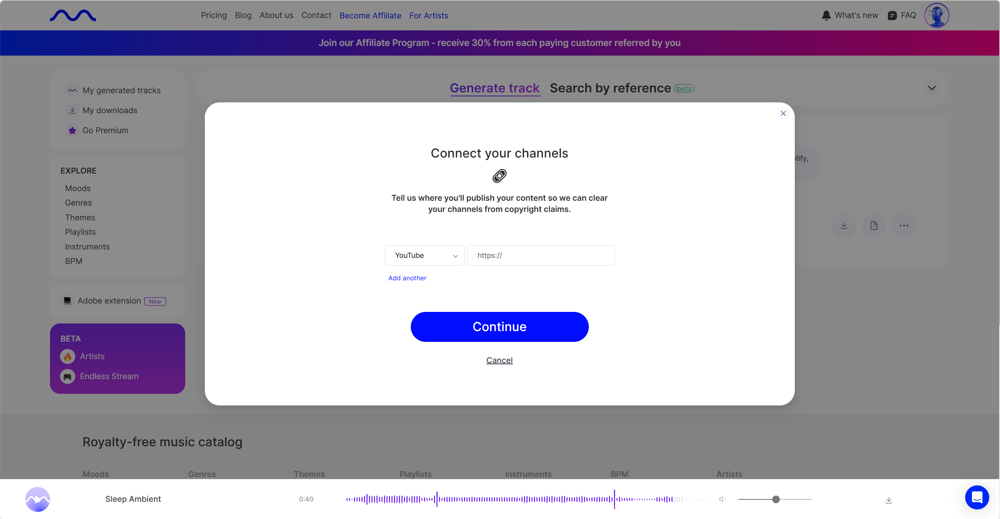

Music generated by Mubert https://mubert.com/render

## 制作视频

添加腮红、睡觉、星星条贴纸

Bling特效

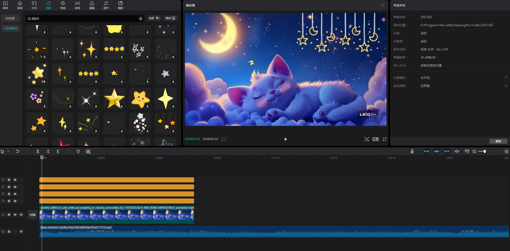

