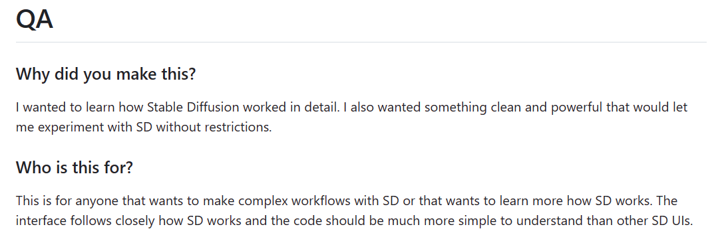

# ComfyUI简介

ComfyUI是一种新型的Stable Diffusion用户界面，因其独树一帜的“节点式”界面，逐渐成为了AI绘画领域进阶玩家的得力武器。搭配各式各样的自定义节点与功能强大的工作流，它得以用更低的配置实现许多在WebUI等常规界面里无法做到的复杂生成任务，并为基于Stable Diffusion搭建各类AIGC应用提供了便利。

> 项目主页：https://github.com/comfyanonymous/ComfyUI

其开发者[@ComfyAnonymous](https://github.com/comfyanonymous/) 在主页提到了制作这个项目的初衷：

> 我想更详细地了解 Stable Diffusion 是如何工作的，并且想要一些干净而强大的东西，让我可以不受限制地尝试Stable Diffusion。

## 参考资料

[1]. Comfy UI入门教程-Nenly同学：https://www.bilibili.com/video/BV1D7421N7xN