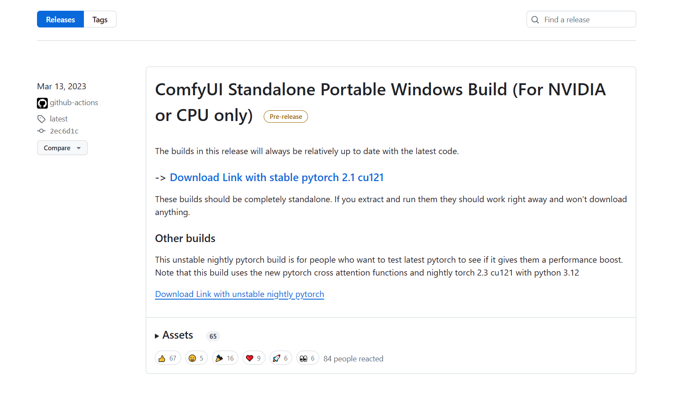
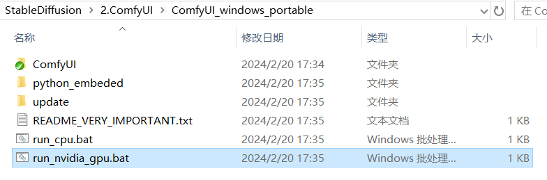
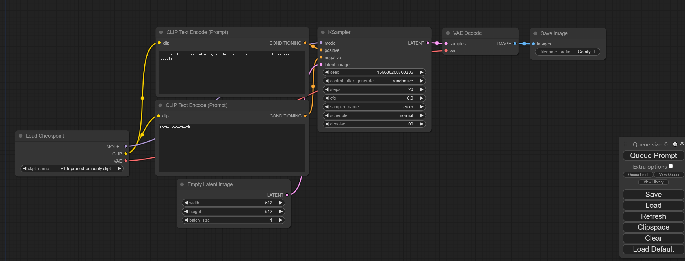

## Windows（N卡）安装流程

如果使用的是Windows平台且为N卡用户，只需要在项目主页的Release页面下载作者提供的“官方整合包”，即可一键开启ComfyUI探索之路：

> 下载地址：https://github.com/comfyanonymous/ComfyUI/releases



进入后，点击“**[Download Link with stable pytorch 2.1 cu121](https://github.com/comfyanonymous/ComfyUI/releases/download/latest/ComfyUI_windows_portable_nvidia_cu121_or_cpu.7z)**”即可下载。

下载完毕后，解压文件夹至任意空白路径。双击“run_nvdidia_gpu.bat”，即可开启ComfyUI。



启动后的页面



## 其他平台安装流程

**摘录自官方项目页面，待测试**

更详细的安装指引，请参考项目主页的安装部分说明：https://github.com/comfyanonymous/ComfyUI?tab=readme-ov-file#installing

### **手动安装**

1. Git clone 此存储库。

```JSON
git clone https://github.com/comfyanonymous/ComfyUI.git
```

1. 把您的 SD 大模型（Checkpoint，ckpt/safetensors 文件）放在 models/checkpoints 文件夹中；
2. 将您的 VAE 放入 models/vae 文件夹中；

然后按照下面的指引，安装不同平台所需的依赖项：

####  **AMD GPU（Linux）**

 AMD users can install rocm and pytorch with pip if you don't have it already installed, this is the command to install the stable version:

 如果您还没有安装 rocm 和 pytorch，AMD 用户可以使用 pip 安装 rocm 和 pytorch，这是安装稳定版本的命令：

 `pip install torch torchvision torchaudio --index-url ``https://download.pytorch.org/whl/rocm5.7`

 Install the dependencies by opening your terminal inside the ComfyUI folder and:

 然后，在 ComfyUI 文件夹中打开终端，然后通过下面的命令来安装依赖项：

 `pip install -r requirements.txt`

 After this you should have everything installed and can proceed to running ComfyUI.

 在此之后，您应该已经安装了所有内容，并可以继续运行 ComfyUI。

####  **NVIDIA GPU**

 Nvidia users should install stable pytorch using this command:

 Nvidia 用户应使用以下命令安装稳定版本的 pytorch：

 `pip install torch torchvision torchaudio --extra-index-url ``https://download.pytorch.org/whl/cu121`

If you get the "Torch not compiled with CUDA enabled" error, uninstall torch with:

如果您收到“Torch 未在启用 CUDA 的情况下编译”错误，请使用以下命令卸载 torch：

```
pip uninstall torch
```

And install it again with the command above.

然后使用上面的命令重新安装它。

 Install the dependencies by opening your terminal inside the ComfyUI folder and:

 然后，在 ComfyUI 文件夹中打开终端，然后通过下面的命令来安装依赖项：

 `pip install -r requirements.txt`

 After this you should have everything installed and can proceed to running ComfyUI.

 在此之后，您应该已经安装了所有内容，并可以继续运行 ComfyUI。

####  Intel GPU

 请参考如下链接：**[Intel Arc 英特尔锐炫](https://github.com/comfyanonymous/ComfyUI/discussions/476)**

####  **Apple Mac 芯片**

 You can install ComfyUI in Apple Mac silicon (M1 or M2) with any recent macOS version.

 您可以在 Apple Mac 芯片（M1 或 M2）中安装任何最新 macOS 版本的 ComfyUI。

1. Install pytorch nightly. For instructions, read the [Accelerated PyTorch training on Mac](https://developer.apple.com/metal/pytorch/) Apple Developer guide (make sure to install the latest pytorch nightly). 安装 pytorch nightly。有关说明，请阅读 Mac 上的加速 PyTorch 培训 Apple 开发人员指南（确保安装最新的 pytorch nightly）。
2. Follow the [ComfyUI manual installation](https://github.com/comfyanonymous/ComfyUI#manual-install-windows-linux) instructions for Windows and Linux. 按照适用于 Windows 和 Linux 的 ComfyUI 手动安装说明进行操作。
3. Install the ComfyUI [dependencies](https://github.com/comfyanonymous/ComfyUI#dependencies). If you have another Stable Diffusion UI [you might be able to reuse the dependencies](https://github.com/comfyanonymous/ComfyUI#i-already-have-another-ui-for-stable-diffusion-installed-do-i-really-have-to-install-all-of-these-dependencies). 安装 ComfyUI 依赖项。如果您有其他 Stable Diffusion UI，则可以重用依赖项。
4. Launch ComfyUI by running `python main.py --force-fp16`. Note that --force-fp16 will only work if you installed the latest pytorch nightly. 通过运行 `python main.py --force-fp16` 启动 ComfyUI。请注意，--force-fp16 只有在安装最新的 pytorch nightly时才有效。

> **Note**: Remember to add your models, VAE, LoRAs etc. to the corresponding Comfy folders, as discussed in [ComfyUI manual installation](https://github.com/comfyanonymous/ComfyUI#manual-install-windows-linux). 注意：请记住将您的模型、VAE、LoRA 等添加到相应的 Comfy 文件夹中，如 ComfyUI 手动安装中所述。

####  **DirectML（Windows 上的 AMD 卡）**

 `pip install torch-directml` 

 Then you can launch ComfyUI with: `python main.py --directml` `pip install torch-directml` 

 然后，您可以使用以下命令启动ComfyUI： `python main.py --directml`