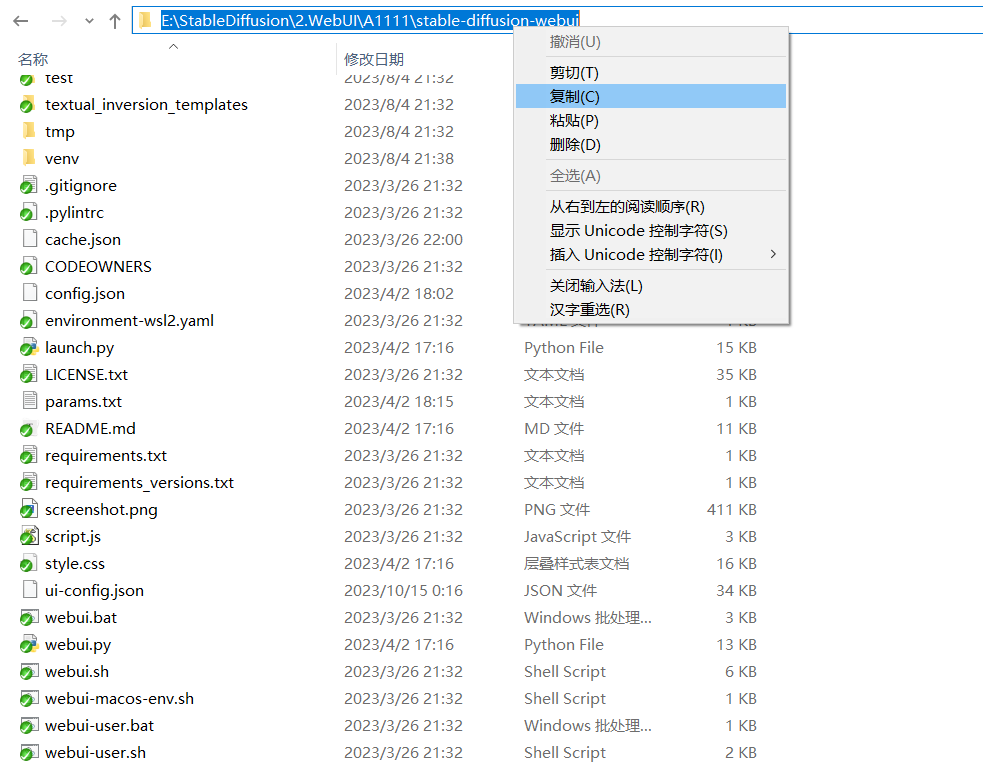
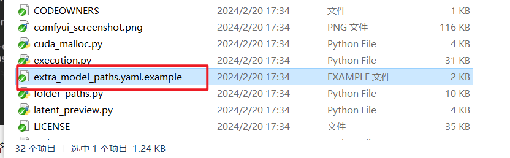
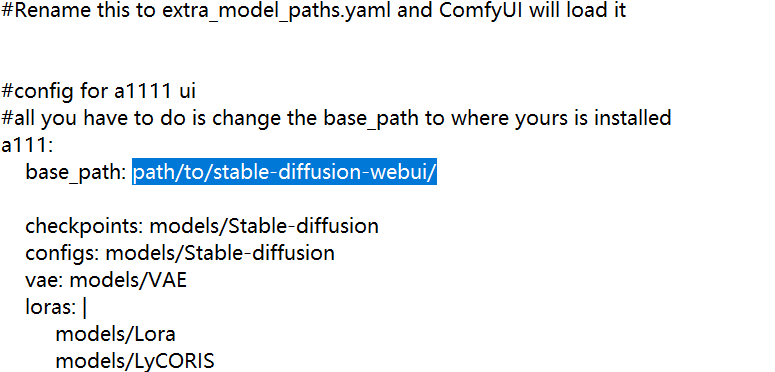
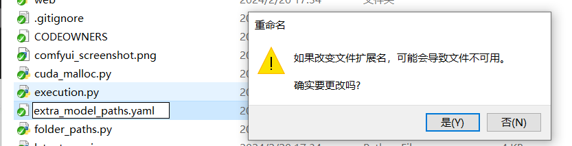

## 模型路径互通配置

在启动ComfyUI前，如果你有存储于Automatic1111 WebUI项目中的模型文件，则无需额外搬运至ComfyUI的文件夹内，只需通过如下步骤简单配置即可实现模型文件的“互通”：

1. 拷贝WebUI根目录的路径（即包含webui_user.bat文件的路径）：

   

2. 用记事本打开ComfyUI根目录下的extra_model_path.yaml.example文件，将路径粘贴至如下位置：

   

   

   

3. 保存文件，并将文件重命名，去除.example的后缀，使文件名变为如下图所示：

4. 正常启动ComfyUI。


## 提高生成速度

Make sure you use the regular loaders/Load Checkpoint node to load checkpoints. It will auto pick the right settings depending on your GPU.

请确保使用常规加载程序/加载检查点节点来加载检查点。它会根据您的 GPU 自动选择正确的设置。

You can set this command line setting to disable the upcasting to fp32 in some cross attention operations which will increase your speed. Note that this will very likely give you black images on SD2.x models. If you use xformers or pytorch attention this option does not do anything.

您可以设置此命令行设置，以在某些交叉注意力操作中禁用向上转换到 fp32，这将提高您的速度。请注意，这很可能会在 SD2.x 型号上为您提供黑色图像。如果使用 xformers 或 pytorch attention，则此选项不会执行任何操作。

```
--dont-upcast-attention
```


## 显示高质量的预览

Use to enable previews.`--preview-method auto`

用于启用预览。`--preview-method auto`

The default installation includes a fast latent preview method that's low-resolution. To enable higher-quality previews with [TAESD](https://github.com/madebyollin/taesd), download the [taesd_decoder.pth](https://github.com/madebyollin/taesd/raw/main/taesd_decoder.pth) (for SD1.x and SD2.x) and [taesdxl_decoder.pth](https://github.com/madebyollin/taesd/raw/main/taesdxl_decoder.pth) (for SDXL) models and place them in the `models/vae_approx` folder. Once they're installed, restart ComfyUI to enable high-quality previews.

默认安装包括低分辨率的快速潜伏预览方法。要使用 [TAESD](https://github.com/madebyollin/taesd) 启用更高质量的预览，请下载 taesd_decoder.pth（适用于 SD1.x 和 SD2.x）和 [taesdxl_decoder.pth](https://github.com/madebyollin/taesd/raw/main/taesd_decoder.pth)（适用于 SDXL）模型，并将其放在文件夹中。安装完成后，重新启动 ComfyUI 以启用高质量的预览。`models/vae_approx`


## 整合包下载

### 铁锅炖

由@[只剩一瓶辣椒酱](https://space.bilibili.com/35723238) 老师制作的 ComfyUI**铁锅炖启动器及整合包**

视频地址：[国内首个COMFYUI启动器铁锅炖来辣！支持COMFYUI更新/配置/一键优化/中英切换等](https://www.bilibili.com/video/BV1mz4y1K7Jw/)

启动器手册：https://shimo.im/docs/B1AwdxZewWhjwe3m

无限圣杯手册(含满血整合包)：https://shimo.im/docs/Ee32m0w80rfLp4A2

AIGODLIKE社区(支持COMFYUI图像解析)：https://www.aigodlike.com